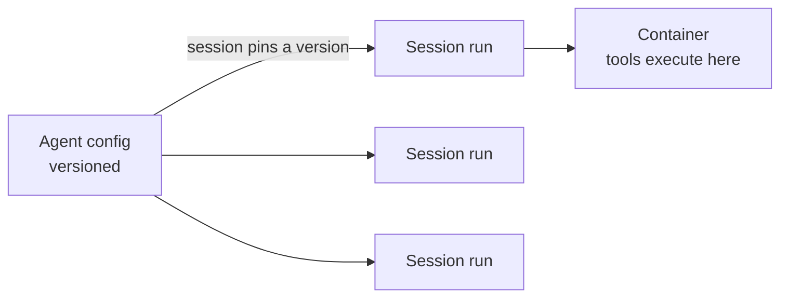

<LevelBadge level="advanced" />

<VerifyNote lastVerified="2026-07-21" source="https://platform.claude.com/docs/en/managed-agents/overview">
Managed agent の機能と利用可能性は変化します — API はベータ版です。構築前にエンドポイント、フィールド名、アクセスを公式ドキュメントで確認してください。
</VerifyNote>

<Callout type="objectives" items={["managed（Anthropic ホスト型）エージェントループが何を代行するかを理解する", "2つのコアオブジェクトを区別する：バージョニングされた Agent vs 実行単位の Session", "Vault で秘密情報を安全に注入する — モデルがそれを目にすることなく", "Scheduled Deployments で cron スケジュールにエージェントを乗せる — 自分でホストするスケジューラは不要", "managed がカスタムループに勝る場面、そして依然として適用されるガードレールを知る"]} />

[自分でエージェントループを構築する](/docs/api/building-agents) のが所有したいインフラを超えるなら、**managed**（Anthropic ホスト型）エージェントがループを代行してくれます — そうすればあなたはエージェントの *仕事* に集中でき、セッション配管、リトライ、状態、スケジューリングに悩まされません。

## 2つのオブジェクト：Agent vs Session

これがすべての基礎となるメンタルモデルです。両者は意図的に分離されています。

- **Agent** は *永続化された、バージョニングされた構成* — モデル、システムプロンプト、ツール、MCP サーバー、スキル。一度作成します。すべての更新は新しいイミュータブルなバージョンを作成します。
- **Session** は *実行時インスタンス* — エージェントを ID で指す1回の実行。構成はエージェントに存在し、セッションには存在しません。

```mermaid
flowchart LR
  A[Agent config<br/>versioned] -->|"session pins a version"| S1[Session run]
  A --> S2[Session run]
  A --> S3[Session run]
  S1 --> C[Container<br/>tools execute here]
```

<Callout type="tip">
Session は作成時のエージェントバージョンに**ピン留め**されます：実行中のセッションはそのバージョンを保ち、新しいセッションは最新版を得ます。これが in-flight の作業を壊さずに構成変更を出荷する方法です。
</Callout>

## 「managed」で得られるもの

ループを自作してホストする代わりに、ホスト型のビルディングブロックが得られます：

- **Sessions** — 実行ごとに作成して再開する永続的な実行。SSE でイベントをストリーム。
- **Environments** — コンテナインフラ。`cloud`（Anthropic ホスト）または `self_hosted`（ツールは自身の VPC で実行）。セッションごとに1つのコンテナがエージェントのワークスペースになります。
- **[Memory stores](/docs/api/managed-agents-memory-stores)** — セッションを越えて永続する状態。サンドボックス内にディレクトリとしてマウントされ、イミュータブルなバージョニングと redact エンドポイントを備えます。あなた側にデータベースは不要です。
- **Vaults** — MCP 認証や他のサービス用のシークレット。
- **Scheduled deployments** — cron スケジュールで無人実行されるエージェント。

<PromptCard title="エージェント（バージョニングされた構成）を作成し、それに対してセッションを実行する">{`# 1. Create the agent once
POST /v1/agents        -> returns $AGENT_ID
# 2. Each execution is a session pinned to that agent
POST /v1/sessions      { "agent": "$AGENT_ID" }`}</PromptCard>

## Vault：モデルが見ないシークレット

自律的なエージェントはしばしば API キーを必要とします — しかし *モデル* がそれを読むべきではありません。Vault の資格情報（`mcp_oauth`、`static_bearer`、`environment_variable`）は egress で置換されます：`environment_variable` の資格情報は実行時にサンドボックスに注入され、*モデルからは決して見えません*。

<Callout type="warning">
これがエージェントに強力なアクセスを与える安全なパターンです。システムプロンプトやメッセージにキーを貼り付けないでください — モデル（およびログ）が見られるコンテキストの一部になります。Vault に入れましょう。
</Callout>

## Scheduled deployments：cron で動くエージェント

**デプロイメント**は cron スケジュールをエージェントにアタッチします。スケジュールが発火すると、真新しいセッションを開始してタスクを完了します — 自分で構築したりホストしたりするスケジューラは不要です。夜間のデータ同期、週次のコンプライアンススキャン、日次のダイジェストなどに最適です。

<Steps items={[
  {title: "スケジュールを定義する", body: "POST /v1/deployments に agent、environment_id、initial_events（user.message を含む必要あり）、および schedule：POSIX cron 式と IANA タイムゾーンを渡す。"},
  {title: "各発火 = 1回の実行", body: "各トリガー試行は run レコード（drun_ プレフィックス）を作成する。成功は session_id を運び、失敗は error.type（例：environment_archived、session_rate_limited）を運ぶ。実行の一覧は GET /v1/deployment_runs?deployment_id=... で。"},
  {title: "ライフサイクルを制御する", body: "Pause は将来のトリガーを抑制する（手動実行は依然として動作）。Unpause は次の発生時刻から再開し、逃したトリガーはバックフィルされない。Archive は終端。"},
  {title: "オンデマンドでトリガーする", body: "POST /v1/deployments/{id}/run はセッションを即座に開始する — 一時停止中でも — trigger_context.type: manual で。"}
]} />

<PromptCard title="週次コンプライアンススキャン、金曜20:00 ニューヨーク時間">{`POST /v1/deployments
{
  "name": "Weekly compliance scan",
  "agent": "$AGENT_ID",
  "environment_id": "$ENVIRONMENT_ID",
  "initial_events": [
    {"type": "user.message", "content": [{"type": "text", "text": "Run the compliance scan and summarize findings."}]}
  ],
  "schedule": {"type": "cron", "expression": "0 20 * * 5", "timezone": "America/New_York"}
}`}</PromptCard>

<Callout type="tip">
Cron は `minute hour day-of-month month day-of-week` で、分単位の粒度です。DST は壁時計セマンティクスを使います：春の前進で存在しない時刻はスキップされ、秋の後退で2回発生する時刻は2回発火します。センシティブなものについては、これらのエッジを避けるタイムゾーンと時刻を選んでください。
</Callout>

## managed vs custom の選択

| **managed** を選ぶのは… | **カスタムループ / SDK** を選ぶのは… |
|---|---|
| ホスティング、状態、スケジューリング、シークレットを代行してほしい | ループとツールを完全に制御したい |
| 素早くプロトタイピングしている | 厳格なカスタムインフラ / コンプライアンス要件がある |
| 制御より運用のシンプルさが重要 | 独自スタックに深く組み込んでいる |

これはスペクトルです — 単一呼び出し → ワークフロー → カスタムエージェント（SDK） → managed。タスクが許す限りシンプルに始め、必要になったときだけ上に移動してください。

## 同じガードレールが適用される

ホスト型かどうかにかかわらず、自律的なエージェントは依然としてアクションを取ります。**最小権限**、**コスト / イテレーションの上限**、**リスクのあるステップでの人間の承認**を維持してください — [Securing Agents](/docs/security/securing-agents) と [Hardening Autonomous Runs](/docs/security/hardening-autonomous-runs) を参照してください。

<Callout type="takeaways" items={["Managed agents はループ、セッション、環境、メモリ、Vault、スケジューリングを代行してくれるので、あなたは仕事に集中できる", "Agent はバージョニングされた構成、Session はバージョンにピン留めされる1つの実行 — 構成はエージェントに存在し、セッションには存在しない", "Vault の environment_variable 資格情報は実行時に注入され、モデルからは決して見えない — エージェントにシークレットを与える安全な方法", "スケジュールされたデプロイメントは cron 式 + IANA タイムゾーン。各発火は run を作成し、unpause は逃したトリガーをバックフィルしない", "Managed は 単一呼び出し → ワークフロー → カスタム → managed のホスト型の端にある。自律性のガードレールは依然として適用される"]} />

## 自分でチェック

<Quiz title="Check yourself" questions={[
  {
    q: "Agent と Session の違いは何ですか？",
    options: [
      "同じオブジェクトの2つの名前",
      "Agent はバージョニングされた構成、Session はエージェントバージョンにピン留めされる1つの実行時実行",
      "Session がモデルとシステムプロンプトを持ち、Agent は単なる ID",
      "Agent がツールを実行し、Session がシークレットを保管する"
    ],
    answer: 1,
    explain: "Agent は永続化された、バージョニングされた構成（モデル、プロンプト、ツール、MCP、スキル）。Session は実行ごとのインスタンスで、エージェントを参照し、作成時にそのバージョンにピン留めされる。"
  },
  {
    q: "managed エージェントに必要な API キーをどのように与えるべきですか？",
    options: [
      "エージェントが読めるようにシステムプロンプトに入れる",
      "セッションの最初のユーザーメッセージで渡す",
      "Vault 資格情報として保管し、実行時に注入され、モデルからは決して見えないようにする",
      "ツール定義にハードコードする"
    ],
    answer: 2,
    explain: "Vault 資格情報（例：environment_variable 型）は egress で置換され、モデルからは決して見えない — プロンプトやメッセージのキーは可視のコンテキストの一部になる。"
  },
  {
    q: "スケジュールされたデプロイメントが2日間一時停止された後、再開されました。一時停止中に発火するはずだったトリガーはどうなりますか？",
    options: [
      "バックフィルされる — 逃したすべての実行が再開時に実行される",
      "バックフィルされない。デプロイメントは次にスケジュールされた発生時刻から単に再開する",
      "デプロイメントは自動的にアーカイブされる",
      "逃したすべての実行がキューに入り、1分間隔で実行される"
    ],
    answer: 1,
    explain: "Unpause は次の発生時刻から再開し、逃したトリガーをバックフィルしない。（一時停止中でも、いつでも手動トリガーで実行を強制できる。）"
  }
]} />

## 次へ

- [Managed Agents Session Budgets](/docs/api/managed-agents-session-budgets) — セッションのハード USD 上限のための2026年8月ベータ（budget_reached 停止理由付き）
- [Managed Agents Memory Stores](/docs/api/managed-agents-memory-stores) — 永続的でバージョニングされたエージェントメモリのための2026年7月ベータ
- [Effort tuning on Managed Agents（2026年7月更新）](/docs/api/effort-tuning) — 作成時にエージェントの `model` オブジェクト内に `effort` を渡す。セッションはピン留めされたバージョン経由でそれを継承する
- [Building Agents on the API](/docs/api/building-agents)
- [Cowork & Agent Teams](/docs/api/cowork-and-agent-teams)
- [Headless Mode & the Agent SDK](/docs/claude-code/headless-and-agent-sdk)
- [Securing Agents](/docs/security/securing-agents)
