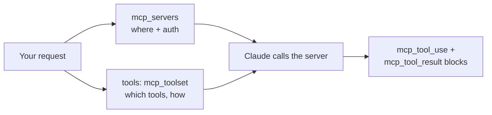

<LevelBadge level="advanced" />

**Model Context Protocol(MCP)** はAIを外部ツールやデータに接続するためのオープン標準です。APIでは、自分でMCPクライアントを動かす必要は一切ありません:**MCPコネクタ**を使えばリクエストの中にリモートサーバーの名前を書くだけで、Claudeが通常のエージェントループの中でそのツールを呼び出します。統合レイヤー全体を、2つのリクエストフィールドが置き換えます。

<Callout type="objectives" items={[
  "MCPコネクタが自作ツール定義に勝つとき — そして勝たないとき",
  "正確なリクエストの形:接続用のmcp_servers、ポリシー用のmcp_toolset",
  "許可リスト、拒否リスト、ツールごとの設定 — そして3つの設定レイヤーがどうマージされるか",
  "処理しなければならないレスポンスブロック:mcp_tool_useとmcp_tool_result",
  "現実の制限:HTTPS限定、ツール限定、プラットフォームのギャップ、ZDR非対応",
]} />

<VerifyNote lastVerified="2026-07-20" source="https://platform.claude.com/docs/en/agents-and-tools/mcp-connector">
コネクタはベータであり、ヘッダはすでに一度変わっています:現在のバージョンは`mcp-client-2025-11-20`、`mcp-client-2025-04-04`は**非推奨**です。フィールド名、プラットフォーム提供状況、ベータステータスは動きます — 出荷前に公式ページと[modelcontextprotocol.io](https://modelcontextprotocol.io)で確認してください。
</VerifyNote>

## MCP対自作ツール

| | [ツール使用](/docs/api/tool-use)(カスタム) | MCPコネクタ |
|---|---|---|
| あなたが定義するもの | 各ツールのスキーマ、そしてあなたが実行 | ツールを*公開する*サーバーへの接続 |
| ツールを実行するのは誰か | あなたのコード、あなたのループ内 | Anthropic側がリモートサーバーを呼ぶ |
| 最適な用途 | アプリ内のいくつかの独自関数 | 既存の統合の再利用(GitHub、DB、ブラウザ、SaaS) |
| 認証 | あなたのコード | サーバーごとに供給するOAuthベアラートークン |

両者は共存します。アプリ固有のツールは直接定義し、既製の能力はMCPで取り込んでください。



## リクエストの形

2つの部品があり、意図的に別々になっています:**`mcp_servers`**は*サーバーがどこにあり、どう認証するか*を述べ、`tools`配列内の**`mcp_toolset`**エントリは*どのツールを露出させ、どう扱うか*を述べます。

<Steps items={[
  {title: "ベータヘッダを送る", body: "anthropic-beta: mcp-client-2025-11-20 — これがないとmcp_serversフィールドは受け付けられません。SDKではbeta.messages.create呼び出しのbetasリストです。"},
  {title: "mcp_serversでサーバーを宣言する", body: "type urlと、https url、そして一意のnameを与えます。サーバーがOAuthを要求する場合はauthorization_tokenを追加 — OAuthフローは自分で走らせて得られたアクセストークンを渡します。"},
  {title: "対応するmcp_toolsetをtoolsに追加する", body: "mcp_server_nameを今使ったnameに設定します。追加の設定なしで、そのサーバー上のすべてのツールがデフォルトで有効になります。"},
  {title: "新しいレスポンスブロックを処理する", body: "Claudeの返信はmcp_tool_useとmcp_tool_resultコンテンツブロックを含みうる。ツールブロックのようにレンダリングまたはログしてください — レスポンスがプレーンテキストだと仮定しないこと。"},
]} />

<PromptCard title="最小限のMCPコネクタ呼び出し(cURL)">{`curl https://api.anthropic.com/v1/messages \\
  -H "Content-Type: application/json" \\
  -H "X-API-Key: $ANTHROPIC_API_KEY" \\
  -H "anthropic-version: 2023-06-01" \\
  -H "anthropic-beta: mcp-client-2025-11-20" \\
  -d '{
    "model": "MODEL_ID",
    "max_tokens": 1000,
    "messages": [{"role": "user", "content": "What tools do you have available?"}],
    "mcp_servers": [
      {"type": "url", "url": "https://example.com/sse", "name": "example-mcp", "authorization_token": "YOUR_TOKEN"}
    ],
    "tools": [
      {"type": "mcp_toolset", "mcp_server_name": "example-mcp"}
    ]
  }'`}</PromptCard>

:::tip モデルを決してハードコードしない
上の`MODEL_ID`は意図的にプレースホルダです。[現在のモデルと価格](/docs/whats-new/models-and-pricing)から現在のIDを読み、設定に保持してください、そうすればモデルのアップグレードが1行の変更になります。
:::

APIは厳格なペア規則を強制します:`mcp_servers`のすべてのサーバーは**ちょうど1つ**のtoolsetから参照されなければならず、すべてのtoolsetの`mcp_server_name`は宣言されたサーバーと一致しなければなりません。不一致は無音のノーオペではなくバリデーションエラーです。

## Claudeが実際にできることを選ぶ

これは多くの統合が誤る部分です。toolsetは、すべてのツールに適用される`default_config`と、ツールごとの上書きの`configs`を取ります。優先順位、高い順に:**ツールごとの`configs` → セットレベルの`default_config` → システムデフォルト**。

**拒否リスト** — すべて有効にしてから危険なものを切る。広さは欲しいが破壊的な書き込みは要らないときに合理的:

```json
{
  "type": "mcp_toolset",
  "mcp_server_name": "calendar-mcp",
  "configs": {
    "delete_all_events": { "enabled": false },
    "share_calendar_publicly": { "enabled": false }
  }
}
```

**許可リスト** — デフォルトで無効にし、生存者を名指す。これが最小権限の姿勢で、デフォルトで手を伸ばすべきもの:

```json
{
  "type": "mcp_toolset",
  "mcp_server_name": "calendar-mcp",
  "default_config": { "enabled": false },
  "configs": {
    "search_events": { "enabled": true },
    "create_event": { "enabled": true }
  }
}
```

:::warning 拒否リストはあなたが思いついたものしかブロックしない
サーバーはツールを追加できます。拒否リストは、あなたが書いた後に出荷されたすべてのツールを黙って許可します;許可リストはそれらを黙って*無視*します。顧客データや金銭に触れるものは、許可リストにしてください。また、サーバー上に存在しないツールを`configs`で指名するとバックエンド警告がログされますが、エラーには**なりません** — なので許可リストのタイポは、有効にしたかったツールを黙って無効化します。サーバーのライブなツールリストで検証してください。
:::

## スキーマをコンテキストから外す

有効なすべてのツールの説明はリクエストと共に送られるので、大きなカタログはすべてのターンに課税します。コネクタの答えは`defer_loading: true`:説明は初期コンテキストから外され、Tool Search Toolを通じてClaudeが必要に応じて引き込みます。

```json
{
  "type": "mcp_toolset",
  "mcp_server_name": "calendar-mcp",
  "default_config": { "defer_loading": true },
  "configs": {
    "search_events": { "defer_loading": false }
  }
}
```

これはこう読んでください:*このタスクが始めに使う1つを除いてすべて遅延させる*。toolsetは`cache_control`も受け付けるので、安定したカタログを毎ターン再課金される代わりに[プロンプトキャッシュ](/docs/api/prompt-caching)のブレークポイントの背後に置けます。この背後の数字 — そしてなぜツールを遅延させることが選択精度を下げるどころか*上げた*のか — は[MCPトークン税](/docs/claude-code/mcp-token-cost)を参照。コンテキストを溢れさせているのが定義ではなく*結果*のときは、代わりに[プログラマティックツール呼び出し](/docs/api/programmatic-tool-calling)に手を伸ばしてください。

## 返ってくるもの

処理しなければならない2つのコンテンツブロック型:

```json
{ "type": "mcp_tool_use", "id": "mcptoolu_...", "name": "echo",
  "server_name": "example-mcp", "input": { "param1": "value1" } }

{ "type": "mcp_tool_result", "tool_use_id": "mcptoolu_...", "is_error": false,
  "content": [ { "type": "text", "text": "Hello" } ] }
```

useブロックの`server_name`に注目:複数のサーバーが接続されているとき、それが呼び出しの帰属先です — ログと、どの統合が誤動作したかのデバッグに不可欠。そして`is_error`はフィールドであって例外ではありません:失敗するMCPツールは*結果*として返ってくるので、ループはそれを検査しなければならず、成功を仮定してはいけません。

## 効いてくる制限

<Callout type="warning" items={[
  "ツールのみ。MCP仕様のうち、コネクタは現在ツール呼び出しをサポート — プロンプトやリソースはサポートしません。それらが必要?自分のクライアントを走らせ、代わりにSDK MCPヘルパーを使ってください。",
  "リモートHTTPSのみ。サーバーはHTTP(Streamable HTTPまたはSSEトランスポート)で公にリーチ可能でなければなりません。ローカルstdioサーバーはこの方法では接続できません — それはClaude Codeとデスクトップアプリがすることです。",
  "プラットフォームのギャップ。Claude API、AWS上のClaude Platform、Microsoft Foundry(Hosted-on-Anthropicデプロイメント)で利用可能。現在Amazon BedrockまたはGoogle Cloudではありません。",
  "ゼロデータ保持なし。MCPサーバーと交換されるデータ — ツール定義と実行結果 — は標準保持に該当し、ZDRではありません。",
  "OAuthはあなたが所有する。APIはauthorization_tokenを取ります;取得と期限前のリフレッシュはあなたの仕事です。",
]} />

## 同じ標準、3つのサーフェス

- **API**(このページ) — URLでリモートサーバーに、コネクタ経由。
- **[Claude Code](/docs/claude-code/mcp)** — 開発セッションでのローカルとリモートのサーバー。
- **[アプリ](/docs/claude-app/connectors)** — MCPがConnectorsを駆動。

プロトコルを一度学べば、それは転用できます。配線だけが異なります。

## 信頼

:::warning MCPサーバーはコードとアクセスの組み合わせ
信頼できるサーバーだけ接続し、許可リストで最小権限にスコープし、サーバーが返す内容は[プロンプトインジェクション](/docs/security/prompt-injection)を運びうる信頼できない入力であることを覚えておいてください。第三者のサーバーは配線前にレビュー — [第三者コードのレビュー](/docs/security/reviewing-third-party-code)と[MCPサーバーのセキュリティ確保](/docs/security/securing-mcp-servers)。
:::

<Flashcards title="MCPコネクタ用語" cards={[
  {front: "MCPコネクタ", back: "自分のMCPクライアントなしで、Messages APIから直接リモートMCPサーバーを呼び出すこと。"},
  {front: "mcp_servers", back: "接続を保持するリクエストフィールド:type、https url、一意のname、任意のauthorization_token。"},
  {front: "mcp_toolset", back: "tools配列内のエントリで、サーバーのどのツールが有効かとどう扱うかを述べる。mcp_server_name経由でサーバーを指す。"},
  {front: "default_config対configs", back: "セット全体のデフォルト対ツールごとの上書き。configsがdefault_configに勝ち、それがシステムデフォルトに勝つ。"},
  {front: "defer_loading", back: "Claudeが検索するまでツールの説明を初期コンテキストから外す — 肥大したツールカタログへの解決策。"},
  {front: "ツール結果のis_error", back: "失敗するMCPツールは、例外ではなくis_error trueの結果ブロックを返す。ループでそれを検査すること。"},
]} />

<Quiz title="理解度チェック" questions={[
  {q: "Claudeにカレンダーサーバーからsearch_eventsとcreate_eventだけを使わせたい。正しいtoolsetの形は?", options: ["サーバー定義のallowed_tools配列に列挙する", "default_config.enabledをfalseに設定し、その2つをconfigsで有効化", "他のすべてのツールにdefer_loading trueを設定"], answer: 1, explain: "allowed_toolsは非推奨のmcp-client-2025-04-04ヘッダのもの。現在のバージョンでは、default_configでデフォルト無効化し、特定のツールをconfigsで有効化することで許可リストにします。defer_loadingはコンテキストコストに影響し、権限ではありません。"},
  {q: "MCPツール呼び出しが失敗しました。どこに現れますか?", options: ["Messagesリクエストに対するHTTPエラーとして", "is_errorがtrueに設定されたmcp_tool_resultコンテンツブロックとして", "レスポンスがツール呼び出しを黙って省く"], answer: 1, explain: "失敗はレスポンスの中の、is_error trueの結果ブロックとして返ってきます。成功を仮定するコードは、失敗した呼び出しを事実として喜んでレンダリングします。"},
  {q: "ローカルstdioサーバーからMCPリソースをClaudeに読ませる必要があります。コネクタでできますか?", options: ["はい — mcp_serversでtypeをstdioに設定", "いいえ — コネクタはリモートHTTPSでツール呼び出しのみ;SDKのMCPヘルパーで自分のクライアントを走らせてください", "はい、しかしBedrockでのみ"], answer: 1, explain: "コネクタは公にリーチ可能なHTTPSサーバーに対するツール呼び出しをサポートします。ローカルstdioサーバー、MCPプロンプト、MCPリソースには自分のクライアントが必要で、SDKはそのためのヘルパーを提供しています。"},
  {q: "ツールカタログが4つのサーバーにまたがり、毎ターンコンテキストウィンドウを支配しています。最も安い最初の一手は?", options: ["より大きなコンテキストモデルに切り替える", "default_config.defer_loading trueを設定し、タスクが始めに使うツールだけ非遅延化する", "作業を4つの別々のリクエストに分割する"], answer: 1, explain: "遅延読み込みは、Claudeが検索するまで説明をコンテキストから外します。能力を落とさずにターンごとのスキーマ税を削減 — そしてツール選択も改善する傾向があり、より少ないツールがコンテキストを混雑させるからです。"},
]} />

<Callout type="takeaways" items={[
  "コネクタはMCPクライアントを2つのリクエストフィールドに置き換える — ただしリモートHTTPSサーバーに対し、ツール呼び出しのみ。",
  "mcp_serversが接続、toolsのmcp_toolsetがポリシー。各サーバーはちょうど1つのtoolsetとペアにならなければならない。",
  "許可リスト(default_config.enabled false、加えて明示的なconfigs)は拒否リストに勝つ:後からサーバーに追加されたツールは、許可されるのではなく無視される。",
  "defer_loadingとcache_controlはツールスキーマがコンテキストウィンドウを食い始めたときのレバー。",
  "mcp_tool_useとmcp_tool_resultブロックを処理する — 例外ではなくフィールドであるis_errorを含めて。",
  "出荷前にベータヘッダを確認:mcp-client-2025-11-20が現在、mcp-client-2025-04-04は非推奨。",
]} />

## 出典と参考文献

- [MCPコネクタ — Anthropicドキュメント](https://platform.claude.com/docs/en/agents-and-tools/mcp-connector) — 権威あるフィールドリファレンスと移行ガイド。
- [Model Context Protocol仕様](https://modelcontextprotocol.io) — オープン標準そのもの、認可を含む。

## 次のステップ

- [ツール使用/関数呼び出し](/docs/api/tool-use)
- [APIでのエージェント構築](/docs/api/building-agents)
- [MCPトークン税](/docs/claude-code/mcp-token-cost)
- [最初のMCPサーバーを構築して配線する](/docs/walkthroughs/first-mcp-server)
- [MCP設定ビルダー](/docs/tools/mcp-config-builder)
