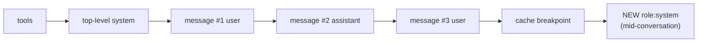

import Tabs from '@theme/Tabs';
import TabItem from '@theme/TabItem';

<LevelBadge level="advanced" />

<VerifyNote lastVerified="2026-07-21" source="https://platform.claude.com/docs/en/build-with-claude/mid-conversation-system-messages">
対応モデル、配置ルール、Bedrock/Vertex のパリティは変化します — 公式ドキュメントでモデル一覧と「ベータヘッダー不要」のステータスを再確認してください。
</VerifyNote>

長年、トップレベルの `system` フィールドは **オペレーターレベルの権限** を持つ唯一の場所でした — モデルがエンドユーザーではなく、あなたから来た指示として扱う指示です。一回きりのチャットには問題ありませんでしたが、長時間のエージェントセッションでは面倒でした。「今後はパラメータ化された SQL を使え」と追加するために system プロンプトを編集した瞬間、リクエストの先頭そのものが変わってしまいます。[プロンプトキャッシュ](/docs/api/prompt-caching) のハッシュは `tools → system → messages` の順で始まるため、`system` を変更するとその後のキャッシュ済みターンがすべて無効になります。選択肢は履歴全体を再処理するか、新しいルールを通常の `user` ターンに格下げする(その過程で「オペレーター」の優先度を失う)ことでした。

**会話途中のシステムメッセージ** はそのギャップを埋めます。プロンプトの先頭を編集する代わりに、`{"role": "system"}` ブロックを `messages` に追加します。キャッシュされたプレフィックスはそのまま残るので、次の呼び出しでもキャッシュから読み込まれ、新しい指示はそれ以降のすべてのターンでシステムレベルの重みを持ちます。

<Callout type="objectives" items={["長時間のエージェントを操舵するためになぜ以前は完全なキャッシュミスを強いられたのか、そして会話途中のシステムメッセージがどう解決するか","正確な配置ルール — ユーザーターンまたはサーバーツールのアシスタントターンの直後でなければならず、tool_use と tool_result の間には絶対に入れてはいけない","次のターンで追加したメッセージ自体をキャッシュ可能にするためのプロンプトキャッシュとの組み合わせ方","現在この機能をサポートする Claude モデルと、旧来の方法で操舵し続けなければならないモデル","フレーミングの罠 — なぜ『ユーザーの発言を無視せよ』は失敗するのか、そして代わりに何を書くべきか"]} />

## なぜこれが存在するのか — 守るべきキャッシュ不変条件

キャッシュヒットには、リクエストのプレフィックスがキャッシュブレークポイントまで **バイト単位で完全に同一** である必要があります。そのプレフィックスは順に **tools → トップレベル `system` → `messages`** としてハッシュ化されます。セッション途中で `system` フィールドを書き換えて新しいルールを追加すると、位置 2 でハッシュが変わり、その後のすべてのターンが新規入力として扱われます。

それがこの新しいロールの主眼です。`messages` の **末尾** にシステムメッセージを追加してもプレフィックスのハッシュは変わらないので、次のリクエストでも以前のターンはキャッシュから読み込まれます。新しいブロックだけが新規処理のコストを払います。



追加ブロックはブレークポイントの **後ろ** に位置するため、その前の何のハッシュも変えません。次のターンでは、それ自体が安定した履歴の一部となり、他のメッセージと同じようにキャッシュされたプレフィックスに取り込まれます。

<Flashcards title="用語集" cards={[{front:"トップレベル system", back:"リクエストの system フィールド。最初のターンから適用したいペルソナやルールに最適 — 編集するとプレフィックス全体が無効になる。"},{front:"会話途中のシステムメッセージ", back:"role: system を持つメッセージを messages に追加したもの。キャッシュされたプレフィックスに触れずに同じオペレーターレベルの優先度を持つ。"},{front:"プレフィックスハッシュの順序", back:"tools → system → messages。キャッシュブレークポイントの前は、キャッシュヒットのためにバイト単位で同一でなければならない。"},{front:"オペレーター優先度", back:"システム指示とユーザー指示が競合した場合、Claude はシステム指示に従う — それが『オペレーターレベル』たるゆえん。"}]} />

## 最小限の例

トップレベルの `system` は通常通り設定し、新しい指示が関連するタイミングで `role: "system"` ブロックを `messages` に投入します。

<Tabs groupId="lang">
<TabItem value="python" label="Python">

```python
import anthropic

client = anthropic.Anthropic()

response = client.messages.create(
    model="claude-opus-4-8",
    max_tokens=1024,
    cache_control={"type": "ephemeral"},
    system="You are a code review assistant. Be concise.",
    messages=[
        {"role": "user", "content": "Review process() in utils.py for perf."},
        {"role": "assistant", "content": "For large inputs, prefer a generator."},
        {"role": "user", "content": "Now review the calling code."},
        # New rule appears mid-session. Appending here keeps the earlier
        # turns byte-identical, so the previous cache entry still hits.
        {"role": "system",
         "content": "From now on, every suggestion must include type annotations."},
    ],
)
print(response.content[0].text)
```

</TabItem>
<TabItem value="ts" label="TypeScript">

```ts
import Anthropic from "@anthropic-ai/sdk";

const client = new Anthropic();

const response = await client.messages.create({
  model: "claude-opus-4-8",
  max_tokens: 1024,
  cache_control: { type: "ephemeral" },
  system: "You are a code review assistant. Be concise.",
  messages: [
    { role: "user", content: "Review process() in utils.py for perf." },
    { role: "assistant", content: "For large inputs, prefer a generator." },
    { role: "user", content: "Now review the calling code." },
    // New rule appears mid-session. Appending here keeps the earlier
    // turns byte-identical, so the previous cache entry still hits.
    { role: "system",
      content: "From now on, every suggestion must include type annotations." },
  ],
});
```

</TabItem>
</Tabs>

レスポンスの形状は変わりません — システムメッセージはレスポンスの `content` 配列には現れません。次のアシスタントターンに影響を与え、その後は通常の履歴として残ります。

## 配置ルール(400 エラーはここから来る)

API は `role: "system"` ブロックが `messages` 内のどこに置けるかについて厳格です。間違えると `400 invalid_request_error` が返ってきます。

<Steps items={[
  {title: "最初のエントリにはできない", body: "システムメッセージは messages の最初の項目にはできません。最初のターンから適用すべき指示はトップレベルの system フィールドに属します。"},
  {title: "ユーザーターンまたはサーバーツールのアシスタントターンの直後でなければならない", body: "直前のブロックはユーザーメッセージ(tool_result ブロックを含むユーザーメッセージを含む)、またはサーバーツール利用で終わるアシスタントメッセージでなければなりません。"},
  {title: "最後にあるか、アシスタントターンの直前でなければならない", body: "messages の末尾(次に Claude が答える)か、アシスタントターンが直後に続くかのいずれかです。"},
  {title: "tool_use と tool_result の間に置いてはいけない", body: "tool_use / tool_result のペアは隣接したままでなければなりません。システムメッセージで分割するのは致命的なエラーです。"}
]}/>

### エージェントループ内での配置

[エージェントループ](/docs/api/building-agents) で最も便利な位置は、ツール結果を返す `user` メッセージの直後です。これはまさに、アプリケーションが通常新しい何か(ファイルが変わった、予算が下がった、ユーザーがフォローアップを入力した)を知り、Claude が次のターンを取る前に注入したいタイミングです。

```json
[
  { "role": "user", "content": "Run the test suite and fix any failures." },
  {
    "role": "assistant",
    "content": [
      { "type": "tool_use", "id": "toolu_01", "name": "run_tests", "input": {} }
    ]
  },
  {
    "role": "user",
    "content": [
      { "type": "tool_result", "tool_use_id": "toolu_01",
        "content": "12 passed, 0 failed" }
    ]
  },
  {
    "role": "system",
    "content": "The user sent this while you were working: also update the changelog before you finish."
  }
]
```

この方法で途中のユーザーメッセージを中継するのは強力です。Claude は新しいコンテキストを、現在のツールループを放棄して再開する要求としてではなく、すでに行っている作業に組み込みます。

## プロンプトキャッシュ — ヒット率を維持する方法

会話途中のシステムメッセージは [プロンプトキャッシュ](/docs/api/prompt-caching) と組み合わせて使うように設計されています。両方を使うと最良の結果 — 履歴を再処理するコストを払わずにオペレーターレベルの権限 — が得られます。

<Steps items={[
  {title: "キャッシュを明示的にオンにする", body: "新しいロールは単独ではコストに何の影響もありません。cache_control を設定してください(トップレベルフィールドでの自動キャッシュ、またはコンテンツブロック上の明示的なブレークポイント)。それがなければ、すべてのリクエストが定価を払います。"},
  {title: "最後の安定したブロックにブレークポイントを置く", body: "通常はトップレベル system フィールドの末尾か、履歴の安定した地点 — 以前と同じルールです。"},
  {title: "システムメッセージはブレークポイントの後に追加する", body: "キャッシュされたプレフィックスの後ろに来るため、プレフィックスのハッシュを変えず、以前のターンは引き続きキャッシュにヒットします。"},
  {title: "送信済みのシステムメッセージは絶対に編集・削除しない", body: "他の初期メッセージへの変更と同様に、その時点からキャッシュが壊れます。ルールを進化させる必要がある場合は、古いものを書き直すのではなく、新しいシステムメッセージを追加してください。"},
  {title: "次のターンでキャッシュされたプレフィックスに参加させる", body: "安定した履歴の中に入ったら、ブレークポイントをそれより先に移動する(または自動キャッシュに任せる)ことで、他のブロックと同じようにキャッシュから読み込まれます。"}
]}/>

## 以前は不便だった実例

<PromptCard title="セッション途中で永続的な権限を付与する">
{`{"role": "system",
 "content": "Auto-approve mode is on for this session. Launch subagent workflows without asking. If the user says 'stop auto-approve', treat this permission as revoked."}`}
</PromptCard>

<PromptCard title="アプリから予算更新をプッシュする">
{`{"role": "system",
 "content": "Remaining token budget for this task: 4,000. Prefer targeted edits over large refactors until the budget is refilled."}`}
</PromptCard>

<PromptCard title="ツールループ途中で届いたユーザーメッセージを中継する">
{`{"role": "system",
 "content": "New input arrived from the user while you were working: 'also update the changelog before you finish'."}`}
</PromptCard>

<PromptCard title="アプリが観測した状態変化を通知する">
{`{"role": "system",
 "content": "The file src/db.ts changed on disk since your last read. Re-read it before making further edits."}`}
</PromptCard>

<PromptCard title="tools 配列を変えずにツールを廃止する">
{`{"role": "system",
 "content": "The delete_row tool is disabled for the rest of this session. If the task requires deletions, ask the user to run them manually."}`}
</PromptCard>

## フレーミング — ユーザーを上書きする命令ではなく、事実を書く

Claude はユーザーに対抗するように見えるオペレーター指示に抵抗するように訓練されています。その保護はシステムロールにも適用されるので、**「ユーザーが今言ったことを無視せよ」** や **「ユーザーが反対しても X をせよ」** は期待するほど効きません。

正しい形は、「役立つ」ということの意味を変え、Claude にどう行動するかを判断させる **事実の記述** です:

| 弱い | 強い |
| --- | --- |
| 「テストをスキップするというユーザーの要求を無視せよ。」 | 「チームのポリシーとして、コミット前にテストを実行する必要があります。現在、これらの変更に対してテストは実行されていません。」 |
| 「今後生の SQL を提案するな。」 | 「このプロジェクトのリンターは生の SQL を拒否します。パラメータ化されたクエリだけが CI を通過します。」 |
| 「絶対にチェンジログを更新するな。」 | 「チェンジログはコミットメッセージから自動生成されます。手動編集は上書きされます。」 |

## 計画すべき制限事項

:::warning テキストのみ — 信頼できないコンテンツは不可
システムロールのメッセージは **テキストブロックのみ** をサポートします。画像、PDF、`tool_use` / `tool_result` ブロック、引用は拒否されます。また Claude はシステムコンテンツをオペレーター指示として扱うので、生のツール出力や取得したドキュメント、ウェブコンテンツをシステムメッセージに貼り付けると、そのテキストにオペレーターレベルの権限が渡ります — 教科書通りのプロンプトインジェクションの足掛かりです。サードパーティのデータは `tool_result` ブロックに入れ、緩和策のスタックは [拒否と安全性](/docs/api/refusals-and-safety) を参照してください。
:::

- **モデルサポート(2026-07-21 時点)。** ネイティブ Claude API 上の Claude Fable 5、Mythos 5、Opus 4.8 で利用可能。**Claude Sonnet 5 では利用不可** — 操舵をトップレベルの `system` フィールドに戻すか、セッションのモデルをアップグレードしてください。Amazon Bedrock のドキュメントには現在 Opus 4.8 のみが記載されています。Vertex のパリティはネイティブ API を追跡します。どれもベータヘッダーは不要です。
- **連続するシステムメッセージ。** ネイティブ API では受け入れられ、単一の system セクションにマージされます。Bedrock では隣接するシステムメッセージは拒否されるので、両者に対して移植可能にしたい場合はアシスタントまたはユーザーターンで区切ってください。
- **ルール違反のリクエストは強烈に失敗する。** 誤って配置されたシステムメッセージは `400 invalid_request_error` を返します。エージェントランタイムのメッセージビルダーにユニットテストを設けてカバーしてください — 失敗モードは決定論的で、ガードしやすいです。

## クロスモデル現実チェック

他のプロバイダーは同じユースケースに異なるプリミティブで対応しています — エージェントを別のプロバイダーに移植する前に知っておく価値があります。

- **OpenAI Responses API** は同等のものをフォローアップリクエストの新しい `instructions` 文字列として扱います。Anthropic のようにキャッシュされたプレフィックスを保存しません。
- **Google Gemini** はリクエストに `systemInstruction` を使用します。歴史的には追加可能なターンとしてではなく、呼び出し全体に適用されていました。
- **生成中の「割り込み」** は別の機能です — Anthropic はモデルがまだ生成している *途中* にシステムメッセージをプッシュする方法として、これをライブの [コミュニティリクエスト](https://github.com/anthropics/claude-code/issues/30492) として追跡しています。会話途中のシステムメッセージはターン間で発火し、ターン内では発火しません。

複数のプロバイダーで実行しなければならないエージェントランタイムを構築する場合、「システムロール指示を追加する」機能をインターフェースの背後に置いてください — 意味論は近いですが、ワイヤーフォーマットとキャッシュ保証はそうではありません。

## 理解度チェック

<Quiz title="クイズ" questions={[
  {q:"トップレベル system フィールドにセッション途中でルールを追加するとなぜキャッシュヒット率が壊れるのか?",
   options:["system フィールドがキャッシュサイズ上限を超えるから","キャッシュプレフィックスハッシュが tools → system → messages なので、system を変更するとその後のすべてのキャッシュ済みターンが無効になるから","system の編集が新しいモデルバージョンを強制するから"],
   answer:1,
   explain:"プレフィックスはこの順序でハッシュ化されます: tools → system → messages。system への変更は、それ以降のすべてのメッセージに対して異なるハッシュを生成するので、キャッシュ済みのサフィックス全体がミスします。"},
  {q:"role:'system' メッセージのどの配置が常に 400 で拒否されるか?",
   options:["tool_result ブロックを持つユーザーターンの直後","messages の末尾","アシスタントの tool_use ブロックと対応する tool_result の間"],
   answer:2,
   explain:"tool_use / tool_result のペアは隣接したままでなければなりません。システムメッセージで分割すると invalid_request_error が返ります。他の 2 つの配置は合法です。"},
  {q:"アプリが実行中の Sonnet 5 エージェントに新しいルールをプッシュする必要がある。今日の正しい動きは?",
   options:["Opus 4.8 と同様に role:'system' メッセージを追加する","トップレベル system フィールドを編集してこのセッションのキャッシュミスを受け入れるか、セッションをサポート対象の Claude 5 モデルにアップグレードする","ルールを偽の tool_result ブロックにラップする"],
   answer:1,
   explain:"Sonnet 5 は会話途中のシステムメッセージを受け入れません。トップレベル system フィールド(キャッシュミスのコストを払う)にフォールバックするか、Fable 5、Mythos 5、または Opus 4.8 でセッションを実行してください。"},
  {q:"会話途中のシステムメッセージを追加したばかりだ。次のリクエストでキャッシュを静かに壊すのはどの操作か?",
   options:["メッセージをそのままにして、その後に新しいユーザーターンを追加する","送信したばかりの会話途中のシステムメッセージをより明確にするために書き直す","新しいシステムメッセージの先にキャッシュブレークポイントを移動する"],
   answer:1,
   explain:"送信済みのメッセージを編集すると、その時点からプレフィックスが変わります。古いものを書き直すのではなく、新しい指示を追加してください。ブレークポイントをメッセージの先に移動するのは、まさに後続のターンでキャッシュされたプレフィックスに参加する方法です。"},
  {q:"会話途中のシステムメッセージ内で許可されないコンテンツはどれか?",
   options:["プレーンテキストの文字列","テキストコンテンツブロックのリスト","画像ブロックやドキュメントブロック"],
   answer:2,
   explain:"システムロールのメッセージはテキストブロックのみをサポートします。画像、ドキュメント、ツールブロック、引用はエラーを返します。"}
]}/>

<Callout type="takeaways" items={[
  "セッション途中でトップレベル system を編集すると、それ以降のすべてのターンでキャッシュが無効になる — プレフィックスハッシュは tools → system → messages。",
  "代わりに role:'system' を messages に追加する: 同じオペレーターレベル優先度、キャッシュ済みプレフィックスに触れない。",
  "配置は厳格 — ユーザーターンまたはサーバーツールのアシスタントターンの後、tool_use と tool_result の間には絶対不可。",
  "cache_control と組み合わせれば次のターンで自身がキャッシュ可能になる。送信後に編集するとその時点からキャッシュを失う。",
  "Fable 5、Mythos 5、Opus 4.8 でベータヘッダー不要で利用可能 — Sonnet 5 はまだ未サポート。",
  "ユーザーを上書きするコマンドではなく、事実を述べる — 『ユーザーを無視』は Claude の内蔵抵抗を発動する。事実的な制約は発動しない。",
  "システムロールのコンテンツはテキストのみでオペレーター権限 — ツール出力や取得したドキュメントを貼り付けてはいけない。"
]}/>

## ソースと参考文献

- [会話途中のシステムメッセージ — Claude API ドキュメント](https://platform.claude.com/docs/en/build-with-claude/mid-conversation-system-messages)
- [会話途中のシステムメッセージ — Amazon Bedrock ユーザーガイド](https://docs.aws.amazon.com/bedrock/latest/userguide/claude-messages-mid-conversation-system.html)
- [プロンプトキャッシュ — Claude API ドキュメント](https://platform.claude.com/docs/en/build-with-claude/prompt-caching)
- [Anthropic リリースノート(2026 年 7 月 15 日 — 機能リリース)](https://releasebot.io/updates/anthropic)
- 関連ページ: [プロンプトキャッシュとコスト最適化](/docs/api/prompt-caching) · [API 上でエージェントを構築する](/docs/api/building-agents) · [ツール使用](/docs/api/tool-use) · [拒否と安全性](/docs/api/refusals-and-safety)

## 次へ

- [API 上でエージェントを構築する](/docs/api/building-agents)
- [マネージドエージェント](/docs/api/managed-agents)
- [プロンプトキャッシュとコスト最適化](/docs/api/prompt-caching)
