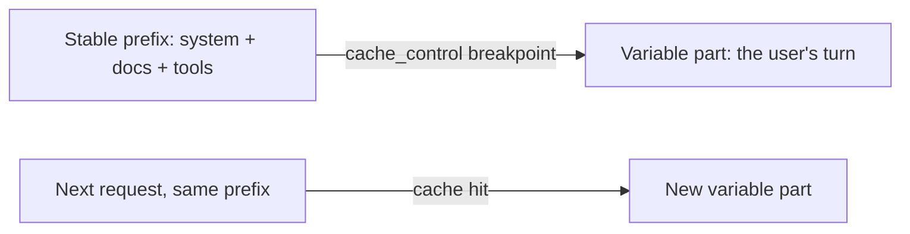

import Tabs from '@theme/Tabs';
import TabItem from '@theme/TabItem';

<LevelBadge level="advanced" />

<VerifyNote lastVerified="2026-06-21" source="https://docs.anthropic.com/en/docs/build-with-claude/prompt-caching">
キャッシュの仕組み、対象条件、キャッシュ済みトークンと新規トークンの料金は変更されます。公式のプロンプトキャッシュのドキュメントで確認してください。
</VerifyNote>

多くのリクエストが、変化しない大きなまとまり（長いシステムプロンプト、大きなドキュメント、ツールカタログなど）を共有している場合、**プロンプトキャッシュ**を使うと、API は処理済みの先頭部分を毎回読み直す代わりに再利用できます。これにより、キャッシュされた部分の**コスト**と**レイテンシ**の両方が削減されます。

## 仕組み（メンタルモデル）

安定した先頭部分の後に**キャッシュのブレークポイント**を設定します。最初の呼び出しでその部分が処理されてキャッシュされ、**まったく同じ先頭部分**を共有する以降の呼び出しはキャッシュにヒットし、その分の支払いがはるかに少なくなります。



## ブレークポイントを設定する（コピー＆ペースト）

**最後の安定したブロック**に `cache_control` を追加します。ここでは大きなシステムプロンプトがそれにあたります。ユーザーのターンはその後に続き、自由に変化します。マークされたブロックまで（それを含む）のすべてがキャッシュされます。

<Tabs groupId="lang">
<TabItem value="python" label="Python">

```python
import anthropic

client = anthropic.Anthropic()

message = client.messages.create(
    model="claude-sonnet-4-6",
    max_tokens=1024,
    system=[
        {
            "type": "text",
            "text": LARGE_STABLE_PROMPT,  # long, unchanging — the cached prefix
            "cache_control": {"type": "ephemeral"},
        }
    ],
    messages=[{"role": "user", "content": "Summarize the key points."}],  # varies per call
)

print(message.usage.cache_read_input_tokens)  # > 0 means you got a hit
```

</TabItem>
<TabItem value="ts" label="TypeScript">

```ts
import Anthropic from "@anthropic-ai/sdk";

const client = new Anthropic();

const message = await client.messages.create({
  model: "claude-sonnet-4-6",
  max_tokens: 1024,
  system: [
    {
      type: "text",
      text: LARGE_STABLE_PROMPT, // long, unchanging — the cached prefix
      cache_control: { type: "ephemeral" },
    },
  ],
  messages: [{ role: "user", content: "Summarize the key points." }], // varies per call
});

console.log(message.usage.cache_read_input_tokens); // > 0 means you got a hit
```

</TabItem>
</Tabs>

最初の呼び出しはキャッシュを作成するためにわずかな**書き込み**料金を支払いますが、同じ先頭部分を持つ以降のすべての呼び出しは、入力料金のごく一部でそれを読み戻します。先頭部分は対象となるのに十分な長さ（数千トークン程度、モデルに依存）が必要で、そうでなければ何のエラーもなくキャッシュされません。

## 成否を分ける不変条件

:::warning キャッシュは先頭部分が完全一致でなければならない
キャッシュヒットには、キャッシュされた先頭部分が**バイト単位で同一**である必要があります。最もよくあるバグは、プロンプトの先頭付近にある*無言の無効化要因*です。タイムスタンプ、変化するユーザー名、並び替えられたツールリストなどが先頭部分を変えてしまい、ヒット率をひっそりとゼロまで下げてしまいます。
:::

**安定したものはすべて先頭に、変化するものはすべて末尾に**置き、先頭部分を本当に一定に保ちましょう。

## 実際に機能しているか確認する

思い込みは禁物です。レスポンスの `usage` から読み戻して確認しましょう。

- **`cache_creation_input_tokens`** — この呼び出しでキャッシュに書き込まれたトークン（最初のリクエスト）。
- **`cache_read_input_tokens`** — キャッシュから提供されたトークン（節約分）。
- **`input_tokens`** — キャッシュされなかった残りの部分で、全額で課金されます。

先頭部分を共有しているはずの繰り返しリクエストで `cache_read_input_tokens` が**ゼロ**のままなら、無言の無効化要因が働いています。2 つの呼び出しでレンダリングされたプロンプトのバイトを差分比較して、それを見つけましょう。

## 最も効果が出る場面

- 複数のユーザーで再利用される長い**システムプロンプト**。
- 同じソーステキストが繰り返し問い合わされる **RAG / ドキュメント Q&A**。
- 多数のターンにわたり、固定のツールカタログと指示を持つ**エージェント**。

オフラインのワークロードでは**バッチ処理**と組み合わせ、さらにモデルの適正サイズ化（[モデルの選び方](/docs/api/choosing-a-model)）と組み合わせると、合計で最大の節約になります。[コストとレイテンシ](/docs/foundations/cost-and-latency)を参照してください。

## 次へ

- [トークン、コンテキストと料金](/docs/api/tokens-and-pricing)
- [ストリーミングとマルチターン](/docs/api/streaming)
- [API でエージェントを構築する](/docs/api/building-agents)
