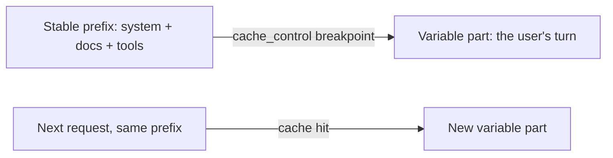

<LevelBadge level="advanced" />

<VerifyNote lastVerified="2026-06-20" source="https://docs.anthropic.com/en/docs/build-with-claude/prompt-caching">
キャッシュの仕組み、対象条件、そしてキャッシュ済みトークン vs 新規トークンの料金は変わります — 公式のプロンプトキャッシュドキュメントで確認してください。
</VerifyNote>

多くのリクエストが大きく変化しない塊 — 長いシステムプロンプト、大きなドキュメント、ツールカタログ — を共有している場合、**プロンプトキャッシュ**を使うと、処理済みの先頭部分を毎回読み直す代わりに API が再利用できます。これにより、キャッシュされた部分について**コスト**と**レイテンシー**の両方が削減されます。

## 仕組み（メンタルモデル）

安定した先頭部分の後に**キャッシュのブレークポイント**を置きます。最初の呼び出しでそれが処理されてキャッシュされ、**まったく同じ先頭部分**を共有する後続の呼び出しはキャッシュにヒットし、その分の支払いが大幅に少なくなります。

## 成否を分ける不変条件

:::warning キャッシュは先頭部分が完全一致でなければならない
キャッシュヒットには、キャッシュされた先頭部分が**バイト単位で同一**である必要があります。最もよくあるバグは、プロンプトの先頭付近にある*無言の無効化要因* — タイムスタンプ、変化するユーザー名、並び替えられたツールリスト — が先頭部分を変え、ヒット率を静かにゼロに落とすことです。
:::

**安定したものはすべて先頭に、変化するものはすべて末尾に**置き、先頭部分を本当に一定に保ちましょう。

## 最も効果が出る場面

- 複数のユーザーで再利用される長い**システムプロンプト**。
- 同じソーステキストが繰り返し問い合わされる **RAG / ドキュメント Q&A**。
- 多数のターンにわたり、固定のツールカタログと指示を持つ**エージェント**。

オフラインのワークロードでは**バッチ処理**と組み合わせ、さらにモデルの適正サイズ化（[モデルの選び方](/docs/api/choosing-a-model)）と組み合わせると、合計で最大の節約になります — [コストとレイテンシー](/docs/foundations/cost-and-latency)を参照。

## 次へ

- [トークン、コンテキスト & 料金](/docs/api/tokens-and-pricing)
- [ストリーミング & マルチターン](/docs/api/streaming)
- [API でエージェントを構築する](/docs/api/building-agents)
