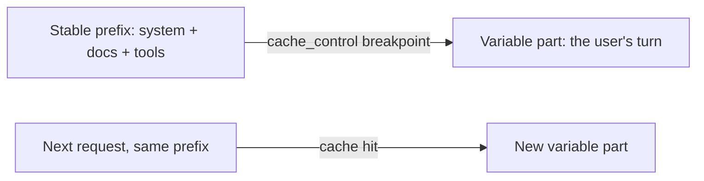

import Tabs from '@theme/Tabs';
import TabItem from '@theme/TabItem';

<LevelBadge level="advanced" />

<VerifyNote lastVerified="2026-06-21" source="https://platform.claude.com/docs/en/docs/build-with-claude/prompt-caching">
キャッシュの仕組み、対象条件、キャッシュ済みトークン対新規トークンの料金は変わります — 公式のプロンプトキャッシュドキュメントで確認してください。
</VerifyNote>

多くのリクエストが大きく変化しない塊——長いシステムプロンプト、大きなドキュメント、ツールカタログ——を共有しているなら、**プロンプトキャッシュ**によって、毎回読み直す代わりに処理済みのプレフィックスを API が再利用できます。これによりキャッシュ部分の**コスト**と**レイテンシ**の両方が削減されます。

<Callout type="objectives" items={["メンタルモデル：安定したプレフィックスの後にキャッシュのブレークポイントを置き、呼び出し間で再利用する","Python と TypeScript で cache_control を使ってブレークポイントを印付ける方法","成否を分ける唯一の不変条件——プレフィックスはバイト単位で一致していなければならない","usage フィールドを読み、実際にキャッシュヒットが起きているか確認する方法","キャッシュが最も効く場所と、バッチ処理および適切なモデル選択との組み合わせ方"]} />

## 仕組み（メンタルモデル）

安定したプレフィックスの後に**キャッシュのブレークポイント**を印付けます。最初の呼び出しでそれが処理されキャッシュされます。**まったく同じプレフィックス**を共有する以降の呼び出しはキャッシュにヒットし、その分の支払いがずっと少なくなります。



<Flashcards title="キャッシュの用語" cards={[{front:"キャッシュのブレークポイント","back":"安定したプレフィックスの後に置く cache_control マーカー。印付けたブロックまで（それを含む）がキャッシュされる。"},{front:"キャッシュ書き込み","back":"キャッシュを満たすために最初の呼び出しが払う小さなプレミアム。"},{front:"キャッシュ読み取り","back":"同じプレフィックスを持つ以降のすべての呼び出しが、入力料金のわずかな割合で読み戻す。"},{front:"サイレント無効化要因","back":"プロンプト上部付近の変化する値（タイムスタンプ、ユーザー名、並び替えたツール一覧）。プレフィックスを変え、ヒット率を静かにゼロに落とす。"}]} />

## ブレークポイントを印付ける（コピペ可）

**最後の安定したブロック**に `cache_control` を追加します——ここでは大きなシステムプロンプト。ユーザーのターンはその後に来て自由に変化します。印付けたブロックまで（それを含む）がキャッシュされます。

<Steps items={[{title: "安定したプレフィックスを特定する", body: "大きく変化しない塊——長いシステムプロンプト、大きなドキュメント、または多くのリクエストで再利用されるツールカタログ——を見つけます。"},{title: "最後のブロックに cache_control を付ける", body: "最後の安定したブロックに type ephemeral の cache_control を印付け、それを含むまでのプレフィックスがキャッシュされるようにします。"},{title: "可変部分を後に続ける", body: "ユーザーのターンを印付けたブロックの後に置きます——呼び出しごとに自由に変化し、全額で課金されます。"},{title: "ヒットを確認する", body: "レスポンスの usage から cache_read_input_tokens を読みます。ゼロより大きければキャッシュヒットです。"}]} />

<Tabs groupId="lang">
<TabItem value="python" label="Python">

```python
import anthropic

client = anthropic.Anthropic()

message = client.messages.create(
    model="claude-sonnet-5",
    max_tokens=1024,
    system=[
        {
            "type": "text",
            "text": LARGE_STABLE_PROMPT,  # long, unchanging — the cached prefix
            "cache_control": {"type": "ephemeral"},
        }
    ],
    messages=[{"role": "user", "content": "Summarize the key points."}],  # varies per call
)

print(message.usage.cache_read_input_tokens)  # > 0 means you got a hit
```

</TabItem>
<TabItem value="ts" label="TypeScript">

```ts
import Anthropic from "@anthropic-ai/sdk";

const client = new Anthropic();

const message = await client.messages.create({
  model: "claude-sonnet-5",
  max_tokens: 1024,
  system: [
    {
      type: "text",
      text: LARGE_STABLE_PROMPT, // long, unchanging — the cached prefix
      cache_control: { type: "ephemeral" },
    },
  ],
  messages: [{ role: "user", content: "Summarize the key points." }], // varies per call
});

console.log(message.usage.cache_read_input_tokens); // > 0 means you got a hit
```

</TabItem>
</Tabs>

最初の呼び出しは、キャッシュを満たすための小さな**書き込み**プレミアムを払います。同じプレフィックスを持つ以降のすべての呼び出しは、入力料金のわずかな割合でそれを読み戻します。プレフィックスは対象になるのに十分な長さ——数千トークン、モデル依存——でなければなりません。そうでないと静かにキャッシュされません。

## 成否を分ける不変条件

:::warning キャッシュはプレフィックス完全一致
キャッシュヒットには、キャッシュされたプレフィックスが**バイト単位で一致**している必要があります。最もよくあるバグ：プロンプト上部付近の*サイレント無効化要因*——タイムスタンプ、変化するユーザー名、並び替えたツール一覧——がプレフィックスを変え、ヒット率を静かにゼロへ落とします。
:::

**安定したものはすべて先に、可変のものはすべて後に置き、**プレフィックスを本当に一定に保ちましょう。

## 実際に効いているか確認する

思い込まず、レスポンスの `usage` から読み戻しましょう：

- **`cache_creation_input_tokens`** — この呼び出しでキャッシュに書き込まれたトークン（最初のリクエスト）。
- **`cache_read_input_tokens`** — キャッシュから提供されたトークン（節約分）。
- **`input_tokens`** — キャッシュされなかった残り。全額で課金される。

プレフィックスを共有しているはずの繰り返しリクエストで `cache_read_input_tokens` が**ゼロ**のままなら、サイレント無効化要因が働いています——2つの呼び出し間でレンダリングされたプロンプトのバイトを diff して見つけましょう。

## 最も効く場所

- ユーザー間で再利用される長い**システムプロンプト**。
- 同じソーステキストが繰り返し問い合わせられる **RAG / ドキュメント Q&A**。
- 固定のツールカタログと指示を多くのターンにわたって持つ**エージェント**。

オフラインワークロードでは**バッチ処理**と、最大の合計節約には適切なモデル選択（[モデルの選び方](/docs/api/choosing-a-model)）とキャッシュを組み合わせましょう——[コスト & レイテンシ](/docs/foundations/cost-and-latency)を参照。

<Quiz title="理解度チェック" questions={[{q:"キャッシュヒットはキャッシュされたプレフィックスに何を要求しますか？",options:["少なくとも1トークンの長さがあること","以前のプレフィックスとバイト単位で一致していること","ユーザーのターンの後に来ること"],answer:1,explain:"キャッシュヒットには、キャッシュされたプレフィックスがバイト単位で一致している必要があります。タイムスタンプや並び替えたツール一覧など、どんな変化でも無効化します。"},{q:"トークンがキャッシュから提供された（節約分）ことを示す usage フィールドはどれですか？",options:["input_tokens","cache_creation_input_tokens","cache_read_input_tokens"],answer:2,explain:"cache_read_input_tokens はキャッシュから提供されたトークンです。cache_creation_input_tokens は最初の呼び出しで書き込まれた分、input_tokens は全額で課金されるキャッシュされなかった残りです。"},{q:"可変な呼び出しごとのコンテンツは、キャッシュのブレークポイントに対してどこに置くべきですか？",options:["安定したプレフィックスの前","最後——印付けたブロックの後","システムプロンプト全体に散りばめる"],answer:1,explain:"安定したものはすべて先に、可変のものはすべて後に置きます。ユーザーのターンは印付けたブロックの後に来て、各呼び出しで自由に変化します。"}]} />

<Callout type="takeaways" items={["安定したプレフィックスの後にキャッシュのブレークポイントを印付ける。最初の呼び出しが書き込み、以降の呼び出しが安く読み戻す。","キャッシュヒットにはバイト単位で一致したプレフィックスが必要——安定したコンテンツを先に、可変コンテンツを後に保つ。","プロンプト上部付近のサイレント無効化要因（タイムスタンプ、名前、並び替えたツール）はヒット率を静かにゼロへ落とす。","usage で確認：cache_read_input_tokens > 0 ならヒット；繰り返しリクエストでゼロなら無効化要因が働いている。","キャッシュは再利用されるシステムプロンプト、RAG、エージェントで最も効く；バッチ処理と適切なモデル選択と組み合わせる。"]} />

## 次へ

- [トークン、コンテキスト & 料金](/docs/api/tokens-and-pricing)
- [ストリーミング & マルチターン](/docs/api/streaming)
- [API でエージェントを構築する](/docs/api/building-agents)
