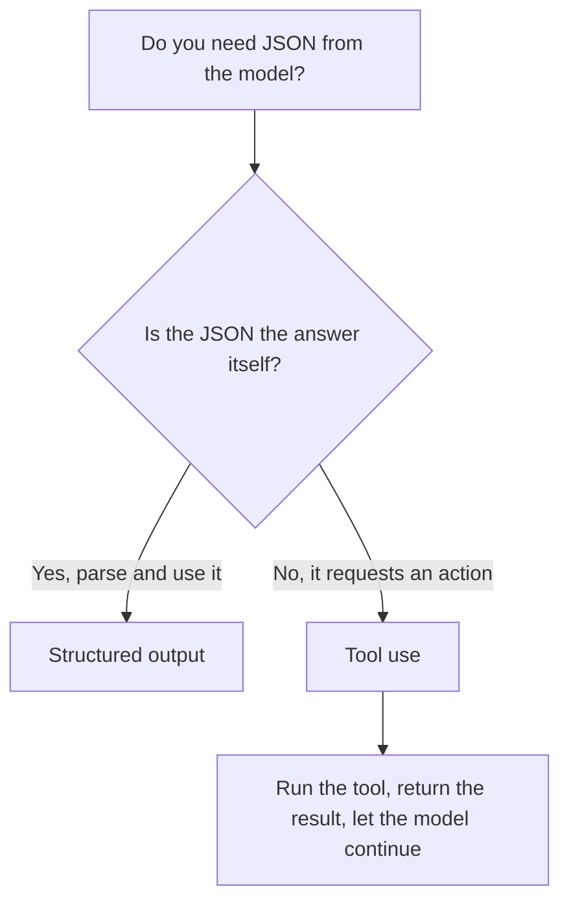

<LevelBadge level="intermediate" />

<VerifyNote lastVerified="2026-06-20" source="https://docs.anthropic.com/en/docs/build-with-claude/structured-outputs">
スキーマを強制する正確な仕組みは進化します — 現在のアプローチ（出力の設定 / パースヘルパー）を公式ドキュメントで確認してください。
</VerifyNote>

Claude の出力が他のソフトウェアに渡される場合、**信頼できる構造** — 既知の形に一致する有効な JSON を、毎回 — が必要です。「JSON で応答して」と頼んで運任せにしてはいけません。プラットフォームの構造化出力サポートを使いましょう。

## 信頼できる方法

出力用の **JSON スキーマ**を提供し、それを API/SDK に強制させます。そのうえで型付きオブジェクト（例: Python の Pydantic、TypeScript の Zod）にパースします。SDK のパースヘルパーは、自分で `JSON.parse` してバリデーションしなければならない文字列ではなく、型付きの結果を渡してくれます。

```python
# Conceptual shape — see the official docs for the current API surface.
from pydantic import BaseModel

class Ticket(BaseModel):
    title: str
    priority: str   # "low" | "medium" | "high"
    tags: list[str]

# Request the model to return data conforming to Ticket's JSON schema,
# then parse the response into a Ticket instance.
```

## なぜプロンプトで JSON を求めるだけではダメなのか?

プロンプトで JSON を求める*ことはできます*し、単純なケースなら機能します — ですがブレることがあります: 余計な文章、末尾のカンマ、欠けたフィールドなど。スキーマで強制された出力は、この種のバグを取り除きます。下流のシステムがそれに依存する瞬間から、これが重要になります。

## 構造化出力とツールの利用

どちらの機能もモデルに **JSON Schema** を渡すため、見た目が似ていて、間違ったほうを選んでしまいがちです。違いは*仕組み*ではなく*意図*にあります:

| | **構造化出力** | **[ツールの利用](/docs/api/tool-use)** |
|---|---|---|
| 何が欲しいか | 固定された形での**最終的な答え** | モデルに**機能を呼び出させる**こと（関数の呼び出し、データの取得、アクションの実行） |
| 誰がそれを使うか | あなたのコードが直接 | あなたのコードがツールを実行し、その結果をモデルに返す |
| ターンの形 | 1 回の応答で完了 | ループ: モデルが要求し、あなたが実行し、モデルが続行する |
| 典型的な用途 | 抽出、分類、パース | エージェント、リアルタイムの照会、副作用 |

ざっくりとした目安:



JSON *そのもの*が成果物であれば、構造化出力を使いましょう。JSON が、モデルがあなたのコードに何かを*させる*ための要求であれば、それはツールの利用です。エージェントはしばしば両方を使います: アクションするためにツールを、きれいな最終結果を返すために構造化出力を。

## ヒント

- **スキーマを厳格に保つ。** 固定の選択肢には列挙型（enum）を使い、必須フィールドを明示する。
- **フィールドを説明する。** フィールドの説明は、ミニプロンプトのようにモデルを導きます。
- それでも境界で**バリデーションする** — 防御的なパースは安価な保険です。
- **抽出**タスクでは、構造化出力 + 明確なスキーマが、自由形式に毎回勝ります。

## 次へ

- [ツールの利用 / 関数呼び出し](/docs/api/tool-use) — ツールも JSON スキーマを使います
- [初めての API 呼び出し](/docs/api/first-call)
- [再利用可能なプロンプトテンプレート](/docs/templates/prompts)
