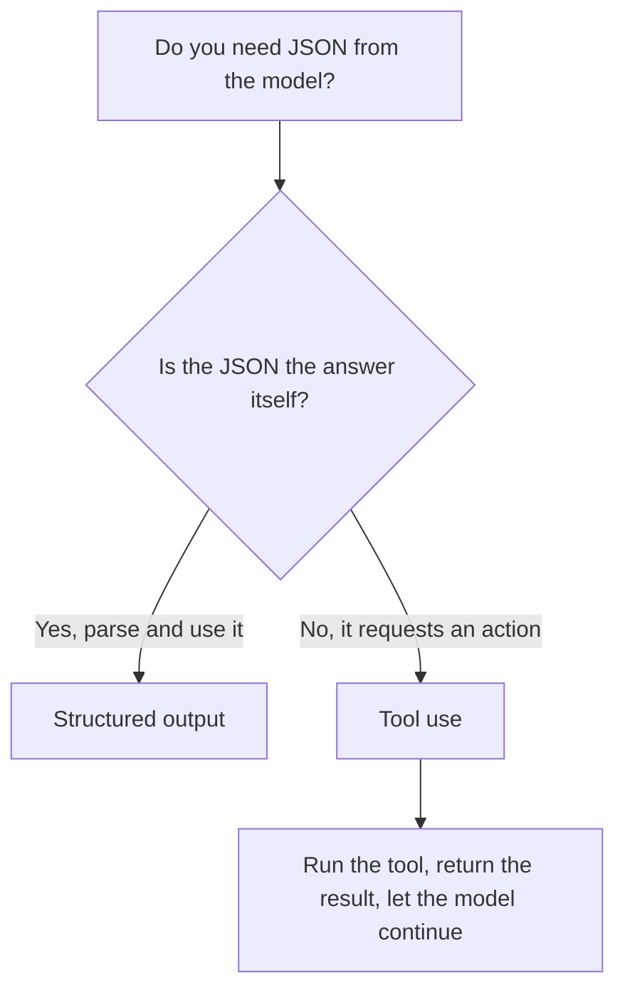

<LevelBadge level="intermediate" />

<VerifyNote lastVerified="2026-06-20" source="https://docs.anthropic.com/en/docs/build-with-claude/structured-outputs">
スキーマを強制する正確な仕組みは進化します——現在の方式（output config / parse ヘルパー）を公式ドキュメントで確認してください。
</VerifyNote>

<Callout type="objectives" items={["スキーマ強制された出力が、JSON を期待してプロンプトを書くより優れている理由を説明する", "JSON Schema を渡し、レスポンスを型付きオブジェクト（Pydantic / Zod）にパースする", "構造化出力とツール使用を、仕組みではなく意図で見分ける", "タイトで信頼できるスキーマのための4つのコツを適用する", "ひと言の判断ルールで正しいツールを選ぶ"]} />

Claude の出力が他のソフトウェアに渡るとき、**信頼できる構造**——既知の形に毎回一致する有効な JSON——が必要です。「JSON で答えて」と頼んで祈るのではなく、プラットフォームの構造化出力サポートを使いましょう。

このレッスンは、*プロンプトで祈る方式がなぜ失敗するのか*から、*スキーマを強制して型付きオブジェクトにパースする方法*まで導きます——そして、見た目がそっくりなときに構造化出力とツール使用をどう見分けるかも。上から下まで通して読み、終盤のクイズで自分を試してください。

## 信頼できる方法

出力の **JSON Schema** を渡し、API/SDK にそれを強制させてから、型付きオブジェクト（Python なら Pydantic、TypeScript なら Zod）にパースします。SDK の parse ヘルパーは、自分で `JSON.parse` して検証しなければならない文字列ではなく、型付きの結果を直接返してくれます。

<Steps items={[
  {title: "形を定義する", body: "必要な出力を JSON Schema としてモデル化します——Python なら Pydantic BaseModel で、TypeScript なら Zod スキーマで。"},
  {title: "スキーマ準拠の出力を要求する", body: "そのスキーマに準拠したデータを返すようモデルに求め、運任せにせず API/SDK が強制するようにします。"},
  {title: "型付きオブジェクトにパースする", body: "SDK の parse ヘルパーで型付き結果を直接得ます——手動の JSON.parse と自前の検証は不要です。"}
]} />

```python
# Conceptual shape — see the official docs for the current API surface.
from pydantic import BaseModel

class Ticket(BaseModel):
    title: str
    priority: str   # "low" | "medium" | "high"
    tags: list[str]

# Request the model to return data conforming to Ticket's JSON schema,
# then parse the response into a Ticket instance.
```

調整できる具体的なリクエストが欲しいですか？モデルに渡すものの形は次のとおりです——モデルを自分のスキーマに置き換えてください。

<PromptCard title="スキーマ準拠の出力を求める">{`Return the data conforming to this JSON Schema:

{
  "title": "string",
  "priority": "low | medium | high",
  "tags": ["string"]
}

Do not include any prose outside the JSON.`}</PromptCard>

## なぜ単にプロンプトで JSON を求めないのか？

プロンプトで JSON を頼むことは*できます*し、単純なケースでは機能します——しかしブレることがあります。余計な散文、末尾のカンマ、欠けたフィールド。スキーマ強制された出力はこの種のバグを取り除きます。これは、下流のシステムがそれに依存した瞬間に効いてきます。

<Callout type="warning" items={["プロンプトされた JSON はデモでは動き、本番で壊れます。障害は下流のシステムがパースしたときにだけ現れます。", "注意すべき典型的な3つのブレ：JSON の周りの余計な散文、末尾のカンマ、欠けた必須フィールド。"]} />

## 構造化出力 vs. ツール使用

どちらの機能もモデルに **JSON Schema** を渡すので、見た目は似ています——そして人々は間違ったほうを選びます。違いは*意図*であって、仕組みではありません。

| | **構造化出力** | **[ツール使用](/docs/api/tool-use)** |
|---|---|---|
| 欲しいもの | 固定された形での**最終的な答え** | モデルに**機能を呼び出させる**（関数を呼ぶ、データを取得する、アクションを取る） |
| 誰が使うか | あなたのコードが直接 | あなたのコードがツールを実行し、その結果をモデルに返す |
| ターンの形 | 1回のレスポンスで完了 | ループ：モデルが尋ね、あなたが実行し、モデルが続ける |
| 典型的な用途 | 抽出、分類、パース | エージェント、ライブ検索、副作用 |

ひと言の判断ルール：



JSON が*成果物そのもの*なら、構造化出力を使います。JSON がモデルからあなたのコードへ何かを*させる*依頼なら、それはツール使用です。エージェントはしばしば両方を使います——行動するためのツールと、きれいな最終結果を返すための構造化出力。

## コツ

<Callout type="tip" items={["スキーマをタイトに保つ——固定の選択肢には enum を使い、必須フィールドをマークする。", "フィールドを説明する——フィールドの説明はミニプロンプトのようにモデルを導く。", "境界で必ず検証する——防御的なパースは安価な保険。", "抽出タスクでは、構造化出力 + 明確なスキーマが自由形式に毎回勝つ。"]} />

<Callout type="takeaways" items={["API/SDK に JSON Schema を渡して型付きオブジェクトにパースする——プロンプトで祈らない。", "JSON をプロンプトで求めるとブレうる（余計な散文、末尾のカンマ、欠けたフィールド）。スキーマ強制はそのバグ群を取り除く。", "構造化出力 vs. ツール使用は意図で異なる：JSON が答えそのもの vs. JSON がアクションを要求する。", "タイトなスキーマ、説明されたフィールド、境界での検証が、抽出と分類を信頼できるものにする。"]} />

## 用語を定着させる

<Flashcards cards={[
  {front: "構造化出力", back: "最終的な答えのための JSON Schema を API/SDK に渡し、レスポンスを型付きオブジェクト（Pydantic / Zod）にパースする。JSON が成果物そのもの。"},
  {front: "ツール使用", back: "モデルが機能を呼び出せるように JSON Schema を渡す。あなたのコードがツールを実行し、その結果を返す——ワンショットの答えではなくループ。"},
  {front: "JSON Schema", back: "両機能が頼る形。Python では Pydantic BaseModel で、TypeScript では Zod スキーマでモデル化する。"},
  {front: "Parse ヘルパー", back: "型付き結果を直接返す SDK のヘルパー。手動の JSON.parse と自前の検証を省ける。"},
  {front: "ひと言の判断ルール", back: "JSON が答えそのものか？Yes → 構造化出力。No、アクションを要求している → ツール使用。"}
]} />

<Quiz title="理解度チェック" questions={[
  {
    q: "Claude から構造化された JSON を得る信頼できる方法は？",
    options: [
      "プロンプトで「JSON で答えて」と頼み、失敗したら再試行する",
      "JSON Schema を渡し、API/SDK にそれを強制させてから、型付きオブジェクトにパースする",
      "自由テキストを生成し、正規表現でフィールドを抽出する"
    ],
    answer: 1,
    explain: "JSON Schema を渡して API/SDK に強制させ、Pydantic（Python）や Zod（TypeScript）のような型付きオブジェクトにパースします。"
  },
  {
    q: "下流のシステムが依存した途端、JSON をプロンプトで求めるのがなぜ危険なのか？",
    options: [
      "スキーマ強制より遅いから",
      "ブレうるから——余計な散文、末尾のカンマ、欠けたフィールド",
      "ツール使用より多くのトークンを消費するから"
    ],
    answer: 1,
    explain: "プロンプトされた JSON は単純なケースでは機能しますがブレうる。スキーマ強制された出力はそのバグ群を取り除きます。"
  },
  {
    q: "構造化出力とツール使用を実際に区別するものは？",
    options: [
      "構造化出力は JSON Schema を使うが、ツール使用は使わない",
      "意図：構造化出力は固定された形での最終的な答え、ツール使用は機能を呼び出す",
      "ツール使用は Python 用で、構造化出力は TypeScript 用"
    ],
    answer: 1,
    explain: "どちらもモデルに JSON Schema を渡すので見た目は似ています。違いは仕組みではなく意図——最終的な答え vs. 機能の呼び出し。"
  },
  {
    q: "スキーマ設計の健全なアドバイスはどれ？",
    options: [
      "柔軟性のためフィールドは任意にし、enum は避ける",
      "固定の選択肢には enum を使い、必須フィールドをマークし、それでも境界で検証する",
      "スキーマを信頼し、パース後の出力は決して検証しない"
    ],
    answer: 1,
    explain: "スキーマをタイトに保ち（enum、必須フィールド）、フィールドをミニプロンプトのように説明し、それでも安価な保険として境界で検証します。"
  }
]} />

## 次へ

- [ツール使用 / 関数呼び出し](/docs/api/tool-use) — ツールも JSON スキーマを使う
- [初めての API 呼び出し](/docs/api/first-call)
- [再利用可能なプロンプトテンプレート](/docs/templates/prompts)
