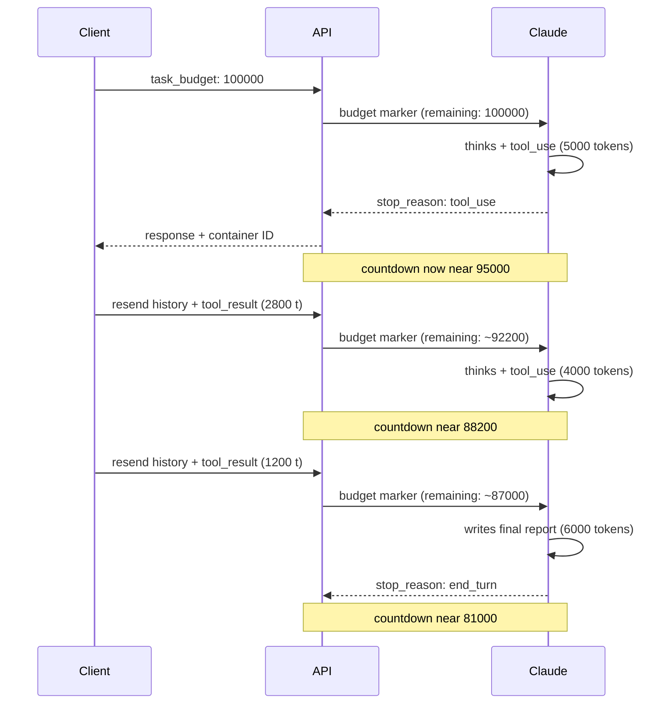

<LevelBadge level="advanced" />

<Callout type="objectives" items={[
  "タスク予算とは何かを理解する — エージェントループ全体にわたる、モデルに見える助言的なトークンのカウントダウン",
  "task_budget を正しく設定する — output_config 内に、task-budgets-2026-03-13 ベータヘッダーを付け、サポートされるモデルで",
  "実際に予算にカウントされるもの（このターンで Claude が見るトークン）と、されないもの（再送された履歴の繰り返しペイロード）を読み解く",
  "拒否のような挙動を引き起こすのではなく助けになる予算サイズを選ぶ — まず計測し、それから余裕を持って設定する",
  "remaining フィールドでコンパクション（圧縮）をまたいで予算を引き継ぎ、プロンプトキャッシュ無効化の罠を避ける",
  "タスク予算、セッション予算、effort、max_tokens を区別する — 4 つのレバー、4 つの異なる役割"
]} />

<VerifyNote lastVerified="2026-08-25" source="https://platform.claude.com/docs/en/build-with-claude/task-budgets">
タスク予算は**パブリックベータ**です — ベータヘッダー（`task-budgets-2026-03-13`）、サポートモデルのリスト、20,000 トークンの最小値、`output_config.task_budget` の正確なフィールド名は公式リファレンスから引用したもので、ベータ期間中に変わる可能性があります。リリース前に再確認してください。
</VerifyNote>

長期間動くエージェントは、外からは予測しにくい形でトークンを消費します。思考とツール呼び出しを十数ラウンド繰り返すことになった 1 つのリクエストが、通常のターンの 10 倍のコストを静かに生むことがあります。**タスク予算**は Anthropic の答えです：エージェントループ全体に対する助言的なトークン上限を Claude に渡し、モデルに*自己調整*させます — 思考のペースを配分し、アクションに優先順位を付け、予算が尽きるにつれて要約で締めくくる。`max_tokens` によってツール呼び出しの途中で切断されるのではなく。

タスク予算が、すでに知っている他のあらゆるコストレバーと異なる点は 2 つあります：

- **カウントダウンはモデルに見えます。** Claude はサーバー側で挿入される「残りトークン」のマーカーを見て、それに基づいて挙動を調整します。クライアントは usage フィールドでこのマーカーを見ることはありません。
- **強制ではなく助言的です。** タスク予算はソフトなヒントであり、ハードキャップは依然として `max_tokens` です。これは仕様です — 進行中のアクションを中断する方が完了させるより破壊的な場合、Claude は時折予算を超過することがあります。

## 予算カウントダウンの仕組み

カウントダウンは、リクエストペイロードのサイズではなく、**このループで Claude が処理した**トークン — 思考、ツール呼び出し、ツール結果、出力 — を反映します。クライアントが毎ターン会話全体を再送する場合、*ペイロード*は単調に増加しますが、*予算*はこのターンで Claude にとって新しい分だけ減少します。

<Callout type="warning" items={[
  "カウントダウンはモデルにのみ見えます。API レスポンスには残り予算のフィールドは含まれません — usage に task_budget のエントリはなく、SDK のアクセサもありません。クライアント側で消費を追跡するには、ループ内のリクエスト全体で output_tokens を合計してください。",
  "クライアントがすべてのフォローアップで全履歴を送信し、かつその際に remaining を減算すると、モデルは過少に報告された予算を見て、予算が実際に許す時点より早く締めくくってしまいます。余裕のある予算を設定し、サーバー側のカウントダウンに対してモデルに自己調整させてください。"
]} />

## 最初の予算付きリクエストを送る

<Steps items={[
  {title: "ベータヘッダーを含める", body: "リクエストに anthropic-beta: task-budgets-2026-03-13 を追加します。これがないと output_config.task_budget は無視されます。"},
  {title: "サポートされるモデルを選ぶ", body: "現在：Claude Opus 5、Fable 5、Mythos 5、Opus 4.8、Opus 4.7。Sonnet 5、Sonnet 4.6、Haiku 4.5、および旧世代の Opus 4.6 はサポートされていません。"},
  {title: "output_config 内に task_budget を設定する", body: "このオブジェクトには 3 つのフィールドがあります — type（常に tokens）、total（トークン単位の上限）、remaining（省略可能。コンパクションをまたいで予算を引き継ぐため）。total の最小値は 20,000 トークンで、それ未満は 400 エラーを返します。"},
  {title: "max_tokens は余裕を持たせる", body: "task_budget はエージェントループ全体にわたり、max_tokens はリクエスト単位のハードキャップです。high または xhigh の effort では、Claude がリクエストごとに思考し行動する余地を持てるよう、max_tokens を 64k 以上に保ってください。"}
]} />

<PromptCard title="最小のリクエスト — コードベースレビューエージェントを 64k トークンに予算設定">{`curl https://api.anthropic.com/v1/messages \\
  -H "x-api-key: $ANTHROPIC_API_KEY" \\
  -H "anthropic-version: 2023-06-01" \\
  -H "anthropic-beta: task-budgets-2026-03-13" \\
  -H "content-type: application/json" \\
  -d '{
    "model": "claude-opus-5",
    "max_tokens": 128000,
    "stream": true,
    "messages": [{
      "role": "user",
      "content": "Review the codebase and propose a refactor plan."
    }],
    "output_config": {
      "effort": "high",
      "task_budget": {"type": "tokens", "total": 64000}
    }
  }'`}</PromptCard>

## 実際にサポートしているモデル

| モデル             | サポート                                                    |
| ----------------- | ---------------------------------------------------------- |
| Claude Opus 5     | ベータ — `task-budgets-2026-03-13` を設定                       |
| Claude Fable 5    | ベータ — `task-budgets-2026-03-13` を設定                       |
| Claude Mythos 5   | ベータ — `task-budgets-2026-03-13` を設定                       |
| Claude Sonnet 5   | 非サポート                                              |
| Claude Opus 4.8   | ベータ — `task-budgets-2026-03-13` を設定                       |
| Claude Opus 4.7   | ベータ — `task-budgets-2026-03-13` を設定                       |
| Claude Opus 4.6   | 非サポート                                              |
| Claude Sonnet 4.6 | 非サポート                                              |
| Claude Haiku 4.5  | 非サポート                                              |

タスク予算は [Claude Code](/docs/claude-code/what-is-claude-code) や Cowork のサーフェスでは**サポートされていません** — サポートされるモデルの 1 つで、Messages API を通じて直接使用してください。代わりに Managed Agents セッションに対する金額のハードキャップが必要な場合、それは別の機能です：[Managed Agents セッション予算](/docs/api/managed-agents-session-budgets)。

## 予算を選ぶ — 推測せず、まず計測する

適切な予算は、ループが現在どれだけの作業を行っているかに依存します。Anthropic 自身の推奨：**まず計測し、それから調整する。**

<Steps items={[
  {title: "task_budget なしで代表的なサンプルを実行する", body: "サンプル内の各タスクについて、ループ内のすべてのリクエストにわたる usage.output_tokens の合計に、リクエスト間で追加したツール結果のトークンサイズを加えます。それがモデルが見た合計です。"},
  {title: "タスクごとの分布の p99 を取る", body: "そこから始めます。目標は、予算付きの実行が現在のベースラインを突然下回らないよう、Claude に十分な余裕を与えることです。"},
  {title: "p99 から上下に調整する", body: "Claude が日常的に早すぎる締めくくりをするなら、予算を上げます。タスクが一貫して予算を大きく下回るなら、規律を強めるために低めに設定します。20,000 トークンの最小値を下回ってはいけません — API は 400 エラーを返します。"}
]} />

<Callout type="warning" items={[
  "タスクに対して小さすぎる予算は、拒否のような挙動を引き起こすことがあります。Claude が明らかに作業に不十分な予算（たとえば、数時間かかるエージェント型コーディングタスクに 20,000 トークン）を見た場合、完了できない作業を始めるのではなく、タスクの試行を断る、大幅にスコープを縮小する、部分的な結果で早期に停止するといったことがあります。",
  "予算を追加した後に予期しない拒否や早すぎる停止を観察したら、他のパラメーターをデバッグする前に予算を上げてください。固定のデフォルトではなく、実際のタスク長の分布に対してサイズを決めてください。"
]} />

## コンパクションをまたいで予算を引き継ぐ

ループがリクエスト間でコンテキストをコンパクション（圧縮）または書き換える場合 — たとえばペイロードを小さくするために以前のターンを要約する場合 — サーバーは**コンパクション前に消費した予算を記憶していません**。次のリクエストで `remaining` を渡し、カウントダウンが中断した地点から続くようにします：

<PromptCard title="Python — コンパクションをまたいで remaining を引き継ぐ">{`# Tokens spent before compaction, tracked client-side
tokens_spent_so_far = 45000

output_config = {
    "effort": "high",
    "task_budget": {
        "type": "tokens",
        "total": 128000,
        "remaining": 128000 - tokens_spent_so_far,
    },
}`}</PromptCard>

**毎ターン、圧縮していない全履歴を再送するループでは `remaining` を省略し**、サーバーにカウントダウンを追跡させてください。必要がないのに手動で設定すると、クライアントが消費したと考える量と Claude が実際に見た量との間にずれが生じます。

## 他のパラメーターとの相互作用

| 相互作用の相手       | どう相互作用するか                                                                                                                                                                                                                                                                                                                              |
| -------------------- | ------------------------------------------------------------------------------------------------------------------------------------------------------------------------------------------------------------------------------------------------------------------------------------------------------------------------------------------ |
| `max_tokens`         | **直交。** `max_tokens` はリクエスト単位のハードキャップ、`task_budget` はループ全体にわたる助言的な上限です。どちらかが他方以下である必要はありません。組み合わせて使います：`task_budget` は Claude にペース配分の目標を与え、`max_tokens` は個々のリクエストでの暴走生成を防ぎます。                            |
| [Effort](/docs/api/effort-tuning) | **補完的。** effort はステップごとに Claude がどれだけ深く推論するか（思考の幅）を制御します。タスク予算はループ全体でどれだけの作業ができるか（反復の幅）を制御します。両方を一緒に調整してください。                                                                                                                             |
| [適応的思考](https://platform.claude.com/docs/en/build-with-claude/thinking) | タスク予算は思考トークンをカウントに**含む**ため、予算が減るにつれて適応的思考は自然にスケールダウンします。                                                                                                                                                                                                                     |
| [プロンプトキャッシュ](/docs/api/prompt-caching) | **キャッシュ無効化の罠。** 予算カウントダウンのマーカーはターンごとに挿入され、リクエスト間で一致しません。クライアントがフォローアップごとに `task_budget.remaining` を減算すると、変更された値がそれを含むキャッシュプレフィックスを無効化します。最初のリクエストで一度だけ予算を設定し、モデルに自己調整させてください。 |

## タスク予算と他の予算の比較

Ailmanac はすでに 3 つの「予算」型の機能を扱っています。これらは交換可能ではありません。

| 機能                                                                          | 単位    | スコープ                               | 強制                                | 必要なヘッダー                                  |
| -------------------------------------------------------------------------------- | --------------- | ----------------------------------- | ------------------------------------------ | ---------------------------------------------- |
| **タスク予算**（このページ）                                                     | トークン          | 1 つのエージェントループ（複数リクエストになることも） | **助言的** — モデルへのソフトなヒント | `anthropic-beta: task-budgets-2026-03-13`      |
| **`max_tokens`**                                                                 | トークン          | 1 つのリクエスト                         | **ハード** — `stop_reason: max_tokens` で切り詰める | なし                                           |
| **`output_config.effort`**                                                       | effort レベル    | ステップごとの深さ                      | 助言的（モデルが制御）                | なし                                           |
| [**Managed Agents セッション予算**](/docs/api/managed-agents-session-budgets)   | 米セント        | Managed Agents セッション全体      | **ハード** — `budget_reached` でサーバーが一時停止 | Managed Agents のベータヘッダー                    |

こう考えてください：`max_tokens` はヒューズ（決まった点で切れる）、タスク予算は Claude にスコアを囁くコーチ（プレーを調整する）、effort はプレースタイル、セッション予算は給与上限を執行する会計係です。境界があり、自己調整し、金額に上限のあるエージェントが必要なときは、4 つすべてを一緒に使ってください。

## 理解度テスト

<Quiz questions={[
  {
    q: "コードベース監査エージェントで task_budget.total を 100000 に設定しました。実行中、毎ターン全履歴を再送するため、クライアントの累積ペイロードはリクエスト全体で 250000 トークンに達しました。終了時に Claude が見るカウントダウンはどうなっていますか？",
    options: [
      "ゼロになり実行が切断された — 予算を超過した",
      "再送されたペイロードのサイズではなく、このターンで Claude が実際に処理した分だけ減少する — 全履歴は一度だけカウントされる",
      "ペイロードサイズと一致する — 250000 は 100000 を超えるので Claude は拒否した",
      "出力トークンでしか減少しないので、ほとんど動いていない"
    ],
    answer: 1,
    explain: "タスク予算は、リクエストペイロードのサイズではなく、各ターンで Claude が見るもの — 思考、ツール呼び出し、ツール結果、テキスト — をカウントします。フォローアップリクエストで繰り返される履歴は一度だけカウントされ、新しいコンテンツ（新しいツール結果など）は現れた時点で予算にカウントされます。"
  },
  {
    q: "リクエスト間でコンテキストをコンパクションしています。カウントダウンがリセットされないようにするには、何をしますか？",
    options: [
      "何もしない — サーバーがコンパクションをまたいで予算を自動的に追跡する",
      "フォローアップリクエストの max_tokens を増やす",
      "次のリクエストで task_budget.remaining を渡し、total からクライアント側で追跡済みの量を引いた値に設定する",
      "残りの量に等しい新しい task_budget.total を設定する"
    ],
    answer: 2,
    explain: "コンテキストをコンパクションまたは書き換えると、サーバーはコンパクション前の予算消費を記憶していません。次のリクエストで、クライアント側で追跡した (total - tokens_spent_so_far) に設定した remaining フィールドを渡してください。"
  },
  {
    q: "長いエージェント型コーディングタスクに task_budget.total を 20000 に設定したところ、Claude が突然拒否したり、部分的な結果で早期に停止したりします。修正方法は？",
    options: [
      "anthropic-beta: task-budgets-strict-2026-03-13 を追加して準拠を強制する",
      "予算を上げる — 20k は受け付けられる最小値であり、タスクに明らかに不十分な予算は拒否のような挙動を引き起こす",
      "予算に合わせて max_tokens を下げる",
      "小さな予算をより上手く扱う Sonnet 5 に切り替える"
    ],
    answer: 1,
    explain: "タスクに対して小さすぎる予算は拒否のような挙動を引き起こします — Claude は完了できない作業の試行を断ることがあります。まず予算を上げてください。実際のタスク長の分布を計測し、固定のデフォルトではなく p99 に対してサイズを決めます。（さらに：Sonnet 5 はタスク予算をまったくサポートしていません。）"
  }
]} />

## 用語集

<Flashcards title="タスク予算の用語集" cards={[
  {front: "task_budget", back: "output_config 内のオブジェクトで、フィールドは type（'tokens'）、total（上限）、省略可能な remaining（コンパクションをまたいで引き継ぐため）。total の最小値は 20,000。"},
  {front: "task-budgets-2026-03-13", back: "オプトインに必要な anthropic-beta ヘッダー。これがないと output_config.task_budget は無視される。"},
  {front: "カウントダウンマーカー", back: "サーバー側で挿入され、Claude が各ターンで見る、現在のエージェントループの残りトークンを示すマーカー。レスポンスの usage オブジェクトには一切表れない。"},
  {front: "強制ではなく助言的", back: "タスク予算はソフトなヒント — 進行中のアクションの中断を避けるため、Claude は時折超過することがある。ハードキャップは依然として max_tokens。"},
  {front: "remaining", back: "コンパクションをまたいで予算を引き継ぐための省略可能なフィールド。圧縮していない全履歴を再送するループでは省略し、サーバーに追跡させる。"},
  {front: "拒否のような挙動", back: "Claude がタスクに明らかに小さすぎる予算を見たとき、断る、スコープを縮小する、早期に停止することがある。他のパラメーターをデバッグする前に予算を上げて修正する。"}
]} />

## まとめ

<Callout type="takeaways" items={[
  "タスク予算は、エージェントループ全体にわたるモデルに見える助言的なトークンのカウントダウン — Claude はそれに対して自己調整する",
  "サポートされるモデル — Opus 5、Fable 5、Mythos 5、Opus 4.8、Opus 4.7 — で task-budgets-2026-03-13 ベータヘッダーを付けてオプトインする。Sonnet、Haiku、Claude Code はサポートしていない",
  "カウントダウンは再送されたペイロードのサイズではなく、このターンで Claude が見るトークンをカウントする — したがって繰り返しの履歴は二重に課金されない",
  "まず計測し（タスクごとのトークン分布の p99）、それから余裕を持って設定する。小さすぎる予算は拒否のような挙動を引き起こす",
  "コンパクションをまたいで予算を引き継ぐには remaining を使う。圧縮していない履歴を再送する場合は省略し、サーバーに追跡させる",
  "ハードなヒューズとして max_tokens と、ステップごとの深さを調整する effort と組み合わせる — 4 つのレバーが 4 つの異なる役割を担う"
]} />

## 次のステップ

- [Effort チューニング](/docs/api/effort-tuning) — 5 つの effort レベルと、それらがタスク予算とどう相互作用するか
- [Managed Agents セッション予算](/docs/api/managed-agents-session-budgets) — プラットフォームが強制するセッションに対する金額のハードキャップ
- [プロンプトキャッシュ](/docs/api/prompt-caching) — 変化する予算値でキャッシュ無効化の罠がどう現れるか
- [コード実行ツール](/docs/api/code-execution) — 長時間実行エージェントがよく頼るサンドボックス化されたランタイム
- [Claude でエージェントを構築する](/docs/api/building-agents) — これらの予算が形作るエージェントループの全ライフサイクル
