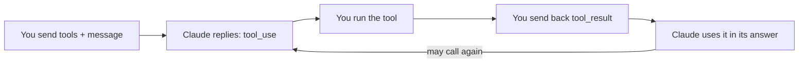

import Tabs from '@theme/Tabs';
import TabItem from '@theme/TabItem';

<LevelBadge level="intermediate" />

<VerifyNote lastVerified="2026-06-20" source="https://docs.anthropic.com/en/docs/build-with-claude/tool-use">
ツール利用のリクエスト/レスポンスの形は安定していますが進化します — フィールドは公式のツール利用ドキュメントで確認してください。
</VerifyNote>

**ツールの利用**は、*あなたが*定義した関数 — 検索、計算機、自分のデータベース、任意の API — を Claude に呼び出させ、その結果を使わせる機能です。これはすべての[エージェント](/docs/api/building-agents)の基礎です。

## ループ



1. **ツール定義**のリスト（名前、説明、JSON スキーマの入力）を含めます。
2. Claude がいずれかを使うと決めたら、`tool_use` ブロック（引数付き）を返して停止します。
3. **あなたが**そのツールを実行し、出力を `tool_result` として送り返します。
4. Claude は続行し、必要に応じてさらにツールを呼び出しながら、答えに至ります。

## ツールを定義する（Python）

```python
tools = [{
    "name": "get_weather",
    "description": "Get current weather for a city.",
    "input_schema": {
        "type": "object",
        "properties": {"city": {"type": "string"}},
        "required": ["city"],
    },
}]

msg = client.messages.create(
    model="claude-sonnet-4-6", max_tokens=1024,
    tools=tools,
    messages=[{"role": "user", "content": "What's the weather in Rome?"}],
)
# If msg.stop_reason == "tool_use": run the tool, then send a tool_result back.
```

## ヒント

- **説明はプロンプトである。** 明確なツールの `description` とパラメーターの説明は、Claude がいつ・どのように呼び出すかを大きく改善します。
- 実行する前に、受け取った**入力をバリデーションする** — 決してそのまま信用しない。
- **エラーを結果として返す。** ツールが失敗したら、Claude が回復できるよう、エラーを記述した `tool_result` を送ります。
- **サーバーサイドツール。** Anthropic は組み込みツール（例: Web 検索、コード実行、コンピュータ操作）も提供しています — 現在のメニューはドキュメントで確認してください。

:::warning ツール = アクション = リスク
実際のアクションを起こすツールは、セキュリティモデルを継承します。最小権限を適用し、リスクのある呼び出しには人間を関与させてください — [エージェントとツールのセキュリティ](/docs/security/securing-agents)を参照。
:::

## 次へ

- [API でエージェントを構築する](/docs/api/building-agents)
- [構造化出力](/docs/api/structured-output)
- [MCP & ツールへの接続](/docs/api/mcp)
