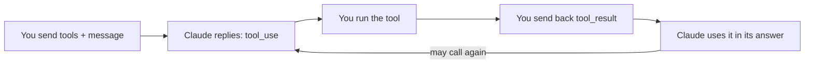

import Tabs from '@theme/Tabs';
import TabItem from '@theme/TabItem';

<LevelBadge level="intermediate" />

<VerifyNote lastVerified="2026-06-20" source="https://platform.claude.com/docs/en/docs/build-with-claude/tool-use">
ツール使用のリクエスト／レスポンスの形は安定していますが進化します——フィールドは公式のツール使用ドキュメントで確認してください。
</VerifyNote>

**ツールの利用**により、Claude は*あなたが*定義した関数——検索、計算機、あなたのデータベース、任意の API——を呼び出して、その結果を使えます。これはあらゆる[エージェント](/docs/api/building-agents)の基盤です。

<Callout type="objectives" items={["4ステップのエージェント型ループが、ツール定義から最終的な答えまでどう動くか","Python で名前・説明・JSON-Schema 入力を持つツールを定義する方法","ツールの説明が、Claude がいつどう呼ぶかを形づくるプロンプトとして働く理由","入力を検証し、エラーを結果として返し、サーバー側ツールを安全に使う方法"]} />

## ループ

ツールの利用は単一の呼び出しではなく会話です。あなたが Claude にツールのメニューを渡し、Claude が1つを選んで一時停止し、あなたが実行して報告し、Claude がその結果を答えに織り込む——必要に応じて繰り返します。

<Steps items={[{title: "メニューを送る", body: "ツール定義のリストを含めます——それぞれに名前、説明、JSON-Schema 入力があります。"}, {title: "Claude がツールを選ぶ", body: "Claude が1つを使うと決めると、引数付きの tool_use ブロックを返して停止します。"}, {title: "あなたが実行する", body: "あなた自身がツールを実行し、その出力を tool_result として返します。"}, {title: "Claude が続ける", body: "Claude は続行し、答えるまで、場合によってはさらにツールを呼び出します。"}]} />

## ツールを定義する（Python）

ツール定義は、名前、平易な言葉の説明、そして入力の JSON-Schema にすぎません。`tools` に渡してから、`stop_reason` を確認して Claude がいつ行動したいかを知ります。

<PromptCard title="get_weather tool + first call">{`tools = [{
    "name": "get_weather",
    "description": "Get current weather for a city.",
    "input_schema": {
        "type": "object",
        "properties": {"city": {"type": "string"}},
        "required": ["city"],
    },
}]

msg = client.messages.create(
    model="claude-sonnet-5", max_tokens=1024,
    tools=tools,
    messages=[{"role": "user", "content": "What's the weather in Rome?"}],
)
# If msg.stop_reason == "tool_use": run the tool, then send a tool_result back.`}</PromptCard>

## コツ

ツールを定義し処理する際の小さな選択が、信頼性に大きな差を生みます。

- **説明はプロンプト。** 明確なツールの `description` とパラメータのドキュメントは、Claude がいつどう呼ぶかを大きく改善します。
- 受け取った**入力を検証する**——実行前に。決して鵜呑みにしない。
- **エラーを結果として返す。** ツールが失敗したら、エラーを記述した `tool_result` を送って Claude が回復できるようにします。
- **サーバー側ツール。** Anthropic は組み込みツール（例：ウェブ検索、コード実行、コンピュータ使用）も提供しています——現在のメニューはドキュメントで確認してください。

:::warning ツール = アクション = リスク
実際のアクションを取るツールはセキュリティモデルを引き継ぎます。最小権限を適用し、リスクのある呼び出しには人を介在させてください——[エージェントとツールの保護](/docs/security/securing-agents)を参照。
:::

<Flashcards title="ツール使用の用語" cards={[{front: "tool_use ブロック", back: "Claude がツールを呼ぶと決めたときに返すもの——引数を含み、その後停止してあなたを待つ。"}, {front: "tool_result", back: "ツールの出力（または Claude が回復できるようエラーの記述）を運んで返すメッセージ。"}, {front: "input_schema", back: "ツールの入力を記述する JSON-Schema：型、プロパティ、どのフィールドが必須か。"}, {front: "サーバー側ツール", back: "Anthropic が提供する組み込みツール、例：ウェブ検索、コード実行、コンピュータ使用——現在のメニューはドキュメントで確認。"}]} />

<Quiz title="理解度チェック" questions={[{q: "Claude が tool_use ブロックを返した後、誰がツールを実行する？", options: ["Claude が Anthropic のサーバーで自動的に実行する", "あなたが実行し、その出力を tool_result として返す", "JSON-Schema が実行する"], answer: 1, explain: "Claude は tool_use ブロックを返して停止します；あなたがツールを実行し、その結果を tool_result として返します。"}, {q: "あなたが定義したツールが実行時に失敗した。推奨される対応は？", options: ["成功するまで黙って再試行する", "エラーを記述した tool_result を送って Claude が回復できるようにする", "会話を停止する"], answer: 1, explain: "エラーを結果として返す——失敗を記述した tool_result が、Claude が回復することを可能にします。"}, {q: "明確なツールの説明がなぜそれほど重要なのか？", options: ["ドキュメント用だけで Claude は無視する", "説明はプロンプト——Claude がいつどうツールを呼ぶかを形づくる", "JSON-Schema の検証ルールを変える"], answer: 1, explain: "説明はプロンプト：明確な説明とパラメータのドキュメントが、Claude がいつどうツールを呼ぶかを大きく改善します。"}]} />

<Callout type="takeaways" items={["ツールの利用はループ：ツール定義を送り、Claude が tool_use ブロックを返して停止し、あなたが実行して tool_result を返し、Claude が答えるまで続ける。","ツール定義は名前、説明、JSON-Schema 入力——tools に渡し、stop_reason == tool_use を確認する。","説明はプロンプト；実行前に入力を検証する；失敗は tool_result エラーとして返し、Claude が回復できるようにする。","Anthropic はサーバー側ツールも提供しており、実際のアクションを取るツールには最小権限と人の介在が必要。"]} />

## 次へ

- [API でエージェントを構築する](/docs/api/building-agents)
- [構造化出力](/docs/api/structured-output)
- [MCP & ツールへの接続](/docs/api/mcp)
