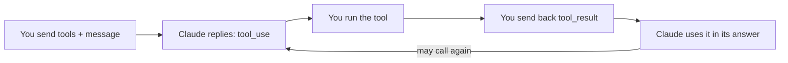

<LevelBadge level="intermediate" />

**ツールの利用**により、Claude は*あなたが*定義した関数——検索、計算機、あなたのデータベース、任意の API——を呼び出して、その結果を使えます。これはあらゆる[エージェント](/docs/api/building-agents)の基盤です。

ほとんどのツール利用チュートリアルは、4ステップのループで話を終えます。ループは簡単な部分です。本番の連携を実際に壊すのは、もっと狭くて語られにくいところです：`400` を返すメッセージの形、Claude が謝る代わりに回復できるようにするエラーフィールド、そして**最新の Claude モデルではツール呼び出しの強制がもう効かない**という事実。このページではそのすべてを扱います。

<Callout type="objectives" items={["4ステップのエージェント型ループが、ツール定義から最終的な答えまでどう動くか","ツール定義の書き方——そして Claude がいつ呼ぶかを実際に左右する説明の書き方","400 を返す3つのメッセージ形状ルールと、どれを破ったのか教えてくれるエラーテキスト","tool_choice の \"any\" と \"tool\" が最新モデルで失敗するようになった理由と、2つの代替手段","strict: true でスキーマ準拠のツール入力を保証する方法","ツール結果が、プロンプトインジェクションがあなたのエージェントに到達する最も可能性の高い場所である理由"]} />

<VerifyNote lastVerified="2026-09-29" source="https://platform.claude.com/docs/en/agents-and-tools/tool-use/define-tools">
ツール定義のフィールド、`tool_choice` のサポート表、`tool_result` のフォーマット規則、`is_error`
の挙動、`strict: true` のセマンティクスは、2026年9月29日に Anthropic の「Define tools」「Handle
tool calls」「Strict tool use」の各ページと照合して確認しました。ツール呼び出しの強制に対するモデルのサポートはリリースごとに変わります——依拠する前に
Define tools ページのサポート表を再確認し、現在のラインナップは[現在のモデルと価格](/docs/whats-new/models-and-pricing)を参照してください。
</VerifyNote>

## ループ

ツールの利用は単一の呼び出しではなく会話です。あなたが Claude にツールのメニューを渡し、Claude が1つを選んで一時停止し、あなたが実行して報告し、Claude がその結果を答えに織り込む——必要に応じて繰り返します。


```mermaid
flowchart LR
  A[You send tools + message] --> B[Claude replies: tool_use]
  B --> C[You run the tool]
  C --> D[You send back tool_result]
  D --> E[Claude uses it in its answer]
  E -->|may call again| B
```

<Steps items={[{title: "メニューを送る", body: "ツール定義のリストを含めます——それぞれに名前、説明、JSON-Schema 入力があります。"}, {title: "Claude がツールを選ぶ", body: "Claude が1つを使うと決めると、レスポンスは stop_reason \"tool_use\" と、1つ以上の tool_use ブロック（それぞれ id、name、input オブジェクトを持つ）とともに返ってきます。"}, {title: "あなたが実行する", body: "あなた自身がツールを実行し、その出力を tool_use の id を参照する tool_result として返します。"}, {title: "Claude が続ける", body: "Claude は、通常の stop_reason で答えるまで、場合によってはさらにツールを呼び出しながら続行します。"}]} />

ステップ2の複数形に注意してください：Claude は**1回のレスポンスで複数の `tool_use` ブロック**を返せます。`content[0]` を決め打ちせず、各ブロックの `type` フィールドで振り分けてください——レスポンスは通常 `text` ブロックで始まり、最新モデルでは代わりに `thinking` ブロックで始まることもあります。

## ツールを定義する

ツール定義は、名前、平易な言葉の説明、そして入力の JSON Schema です。

| フィールド | 必須 | 補足 |
| --- | --- | --- |
| `name` | はい | 正規表現 `^[a-zA-Z0-9_-]{1,128}$` に一致する必要があります |
| `description` | はい | 何をするか、いつ使うか、いつ使わ*ない*か。最低でも3〜4文を目指します |
| `input_schema` | はい | パラメータを記述する JSON Schema オブジェクト |
| `input_examples` | いいえ | 例となる入力オブジェクトの配列。それぞれがスキーマに対して有効であること |
| `strict` | いいえ | `true` にするとスキーマ準拠の入力を強制します——下記参照 |
| `cache_control` | いいえ | ターンをまたいで定義をキャッシュします（[プロンプトキャッシュ](/docs/api/prompt-caching)を参照） |

<PromptCard title="get_weather ツール + 最初の呼び出し（Python）">{`tools = [{
    "name": "get_weather",
    "description": (
        "Get the current weather for a city. Use this when the user asks about "
        "present conditions or temperature in a named place. Returns temperature "
        "in the requested unit plus a one-word sky condition. It does NOT return "
        "forecasts — use get_forecast for anything in the future."
    ),
    "input_schema": {
        "type": "object",
        "properties": {
            "city": {"type": "string", "description": "City and region, e.g. 'Rome, IT'"},
            "unit": {"type": "string", "enum": ["celsius", "fahrenheit"]},
        },
        "required": ["city"],
        "additionalProperties": False,
    },
}]

msg = client.messages.create(
    model="claude-opus-5-5", max_tokens=1024,
    tools=tools,
    messages=[{"role": "user", "content": "What's the weather in Rome?"}],
)

if msg.stop_reason == "tool_use":
    for block in msg.content:            # iterate — never index content[0]
        if block.type == "tool_use":
            result = run_tool(block.name, block.input)
            # send back a tool_result carrying block.id`}</PromptCard>

### 説明はプロンプト

`description` フィールドは、ツール利用の品質に対して圧倒的に最も強いレバーです——これを読むのはチームメイトではなくモデルです。何が良い説明を分けるのかについて、Anthropic 自身のガイダンスは明快です：

- **いつ使わ*ない*かを書く。** 選択ミスの多くは、隣接するツールが担う仕事のためにそのツールが呼ばれるケースです。
- **増やすのではなく統合する。** `create_pr`、`review_pr`、`merge_pr` の代わりに、`action` パラメータを持つ1つのツールを出荷しましょう。少なく広いツールのほうが選択の曖昧さを減らします。
- **サービスをまたいで名前空間を付ける。** ツールの面が広がれば、`github_list_prs` と `slack_send_message` のほうが `list_prs` と `send_message` に勝ります。
- **シグナルの高い結果を返す。** 安定した意味のある識別子（slug、UUID）と、Claude が次のステップを選ぶのに必要なフィールドだけ。膨れたツール出力はコンテキストを焼き、シグナルを埋もれさせます。
- **扱いが面倒な入力には `input_examples` を足す。** スキーマ検証される例は、単純なオブジェクトなら1つあたりおよそ 20〜50 トークン、複雑にネストしたものなら 100〜200 トークンかかり、無効な例は 400 を返します。

## レスポンスを処理する：400 を返す3つのルール

動いていたコードが壊れるのは、たいていここです。`tool_result` はごく普通の `user` メッセージですが、3つの配置ルールが API によって強制されます。

<Steps items={[{title: "結果は対応する tool_use の直後に来なければならない", body: "assistant の tool_use メッセージとあなたの tool_result メッセージの間には、どんなメッセージも入れられません。これを破ると API はこう報告します：tool_use ids were found without tool_result blocks immediately after。"}, {title: "tool_result ブロックは content 配列の中で最初に来る", body: "あなたが足すテキストは、すべての tool_result のあとに来なければなりません。tool_result より前の text ブロックは 400 です。"}, {title: "サーバーツールの呼び出しが未解決なら、tool_result ブロックだけを送る", body: "同じ assistant のターンが、まだ結果のないサーバーツールも呼んでいた場合、末尾にテキストを足すとターンが早く終わってしまい、リクエストは未解決のサーバーツール名を挙げた 400 で失敗します。"}]} />

```json
// ❌ 400 — text before tool_result
{"role": "user", "content": [
  {"type": "text", "text": "Here are the results:"},
  {"type": "tool_result", "tool_use_id": "toolu_01", "content": "15 degrees"}
]}

// ✅ correct — results first, text after (client tools only)
{"role": "user", "content": [
  {"type": "tool_result", "tool_use_id": "toolu_01", "content": "15 degrees"},
  {"type": "text", "text": "What should I do next?"}
]}
```

`tool_result` の `content` は、プレーンな文字列でも、`text`・`image`・`document`・`search_result` ブロックのリストでもかまいません。何も返さないツールなら、完全に省略することもできます。

### 失敗は例外ではなく結果として返す

ツールが例外を投げたとき、ループを中断しないでください——`is_error` で失敗を返しましょう：

```json
{"role": "user", "content": [{
  "type": "tool_result",
  "tool_use_id": "toolu_01A09q90qw90lq917835lq9",
  "content": "Rate limit exceeded. Retry after 60 seconds.",
  "is_error": true
}]}
```

メッセージは、次に何をするか決めなければならない読み手に向けて書いてください。`"failed"` は Claude に何も伝えませんが、`"Rate limit exceeded. Retry after 60 seconds."` は即座に再試行するのではなく待つように伝えます。ツール呼び出しが無効だったりパラメータが欠けていたりすると、Claude は通常2〜3回、修正しながら再試行してから諦めてユーザーに謝ります——つまり、指示的なエラーが回復と行き止まりの分かれ目になることがよくあります。

## スキーマ準拠の入力を保証する：`strict: true`

ツール定義に `strict: true` を設定すると、モデルのトークンサンプリングがスキーマ準拠の出力に制約されます（文法制約付きサンプリング）。これにより、すべての `tool_use` ブロックの `input` はあなたの `input_schema` に一致することが証明でき、`name` は常に実在するツールになります——`2` が必要なところに `"2"` が来ることも、必須フィールドの欠落も、検証して再試行する層も、もうありません。

<PromptCard title="strict なツール定義">{`{
  "name": "search_flights",
  "description": "Search bookable flights for a route and date.",
  "strict": true,
  "input_schema": {
    "type": "object",
    "properties": {
      "destination": {"type": "string"},
      "departure_date": {"type": "string", "format": "date"},
      "passengers": {"type": "integer", "enum": [1, 2, 3, 4, 5, 6]}
    },
    "required": ["destination", "departure_date"],
    "additionalProperties": false
  }
}`}</PromptCard>

どこでも有効にする前に、知っておく価値のある3つの注意点：

- スキーマは、サポートされている JSON Schema のサブセット内に収めなければなりません——[構造化出力](/docs/api/structured-output)が使うものと同じサブセットです。
- コンピュータ利用とブラウザ利用の**ツールセット**エントリは `strict: true` を受け付けません。どちらかに設定したリクエストは拒否されます。
- コンパイルされたスキーマは、メッセージ内容とは別に最大24時間キャッシュされます。Anthropic のガイダンスは明示的です：**保護対象保健情報をスキーマに入れないでください**——プロパティ名、`enum` の値、`const` の値、`pattern` の正規表現のいずれにも。PHI はメッセージ内容に置くべきであり、そこにはキャッシュされたスキーマにはない HIPAA の保護措置が効いています。

## `tool_choice` ——そしてツールの強制がいま失敗する理由

`tool_choice` は、Claude がツールを呼ぶことが*できる*のか、*しなければならない*のか、*できない*のかを制御します。4つの値を取ります：

| 値 | 意味 |
| --- | --- |
| `auto` | Claude が決めます。`tools` がある場合のデフォルト |
| `any` | Claude はあなたのツールのいずれかを必ず呼びますが、どれを呼ぶかは自分で選びます |
| `tool` | Claude は指定された名前のツールを必ず呼びます |
| `none` | Claude はどのツールも呼べません。`tools` がない場合のデフォルト |

ここが、他のどのツール利用ガイドも今のところ取り落としている部分です。**`any` と `tool` はどこでもサポートされているわけではなく、最新モデルでは 400 を返します。**

| モデルまたは設定 | 制限 | 代わりに使うもの |
| --- | --- | --- |
| 手動の拡張思考（`thinking` の type が `enabled`） | `any` と `tool` がエラーになります | `auto` または `none`。適応的思考はそれ単体ではツール呼び出しの強制を*妨げません* |
| Claude Opus 5.5、Sonnet 5.5、Fable 5.1、Mythos 5.1 | 思考の設定にかかわらず `any` と `tool` が 400 を返します | `auto` + `strict: true`、または[構造化出力](/docs/api/structured-output)。`none` は引き続き動きます |

エラーは明示的です：

```text
tool_choice: type "tool" and "any" are not supported for this model.
```

同じ検証はトークンカウントのエンドポイントにも適用されるので、トークンカウントを通ったリクエストがあとで驚かせることはありません。

### 代わりにどうするか

2つの動機を切り分ければ移行は明らかになります。というのも、ツール呼び出しの強制は無関係な2つの仕事をしていたからです：

- **「スキーマ準拠の JSON が必要だ」** これは実のところ、呼び出しを強制する話ではありませんでした。`tool_choice` を `auto` のままにして `strict: true` を設定するか、呼び出しではなくレスポンスが欲しいならスキーマを[構造化出力](/docs/api/structured-output)に移しましょう。
- **「おしゃべりではなく、ツールを呼んでほしい」** それをプロンプトで言ってください。そのツールがいつ当てはまるかを明記すること——「現在の状況に関する質問には `get_weather` を使うこと」——は、`auto` がどのツールを選ぶかを今も左右します。

ツール呼び出しの強制を手放すことには、おまけもあります：`any` と `tool` は assistant メッセージをプリフィルすることで動いていたため、`tool_use` ブロックの前の自然言語の前置きが抑制されていました。`auto` のもとでは、Claude はこれから何をしようとしているのかを説明できます——ユーザーに見えるエージェントでは、たいていそれが望ましい挙動です。

:::tip キャッシュの落とし穴
会話の途中で `tool_choice` を変更すると、**キャッシュされたメッセージブロックが無効化されます**。ツール定義とシステムプロンプトはキャッシュされたままですが、メッセージ内容は再処理が必要になります。ターンごとに `tool_choice` を切り替えていたなら、それは静かにコストを生んでいました——[プロンプトキャッシュ](/docs/api/prompt-caching)を参照。
:::

## クライアントツール vs. サーバーツール

すべてのツールに、あなたのコードベース内のハンドラが必要なわけではありません。

- **クライアントツール**——あなたのもの。あなたがスキーマを定義し、実行し、`tool_result` を返します。上のループです。
- **Anthropic スキーマのクライアントツール**——bash、テキストエディタ、メモリ。スキーマはあらかじめ定義されていますが、実行するのは依然として*あなたの*アプリです。
- **サーバーツール**——ウェブ検索、ウェブ取得、コード実行、ツール検索。あなた側にハンドラのコードなしで Anthropic のインフラ上で実行され、エラーは透過的に処理されます：サーバーツールに対して `is_error` を返すことは決してありません。
- **クライアントツールセット**——コンピュータ利用とブラウザ利用は、`name` を持たない単一のエントリで、固定のメンバーツール群を宣言します。それらの `tool_use` ブロックには追加の `toolset_name` フィールド（`"computer"` または `"browser"`）が付き、`name` は呼ばれているメンバー（`screenshot` や `navigate` など）になります。**両方のフィールドで振り分け**、結果には `toolset_name` を返し返してください——これを省いたメンバー結果は拒否されます。

## よくある間違い

- **`content[0]` をインデックス参照する**——反復処理して `type` で分岐する代わりに。レスポンスはよく `text` ブロックで始まり、最新モデルでは `thinking` ブロックで始まります。
- **1レスポンスにつき `tool_use` を1つしか処理しない。** Claude は1ターンで複数のツールを呼べます。最初の1つに答えて残りを捨てるループは、`tool_use` の id を結果なしで残し、それは次のリクエストで 400 になります。
- **あなたのコメントを結果より前に置く。** `tool_result` ブロックは常に先です。
- **ツールの例外を飲み込む。** ハンドラ内の例外はループを終わらせます。`is_error` の結果は Claude に適応させます。
- **習慣で `tool_choice: "any"` に手を伸ばす。** 現在のフラッグシップモデルではそれは 400 です——そしてどちらにせよ `strict: true` のほうが良い答えでした。
- **ツール出力を信頼できるものとして扱う。** 下記を参照。

:::warning ツール結果はあなたのエージェント最大のインジェクション面
ツール結果には、あなたが制御できないコンテンツが日常的に入ってきます：ウェブページ、受信メール、ユーザーのアップロード、サードパーティ API。そのいずれかに影響を与えられる攻撃者は、あなたのモデルを狙った命令を埋め込めます——間接プロンプトインジェクションです。信頼できないコンテンツは、**必ず `tool_result` ブロックの中**に留め、`system` プロンプトやプレーンなユーザーの `text` ブロックに継ぎ足すことは決してせず、[プロンプトインジェクション](/docs/security/prompt-injection)と[エージェントとツールのセキュリティ確保](/docs/security/securing-agents)を読んでください。実際のアクションを取るツールは、セキュリティモデルも引き継ぎます：最小権限、そして取り返しのつかないことには人の介在を。
:::

<Flashcards title="ツール使用の用語" cards={[{front: "tool_use ブロック", back: "Claude がツールを呼ぶと決めたときに返すもの——id、name、input を含み、そのあと停止してあなたを待つ。1つのレスポンスに複数含まれうる。"}, {front: "tool_result", back: "ツールの出力を運ぶ user メッセージのブロックで、tool_use の id に紐づく。content 配列の先頭に、assistant の tool_use メッセージの直後に来なければならない。"}, {front: "is_error", back: "tool_result 上の任意のブール値で、その呼び出しが失敗したことを示す。Claude はメッセージを読んで適応する——通常は謝る前に2〜3回再試行する。"}, {front: "strict: true", back: "ツール定義に対する文法制約付きサンプリング：ツールの入力があなたの input_schema に一致することが証明できる。additionalProperties false が必要；computer/browser のツールセットエントリでは拒否される；PHI はスキーマに入れない。"}, {front: "tool_choice", back: "auto | any | tool | none。tools があるときのデフォルトは auto、ないときは none。any と tool は Opus 5.5、Sonnet 5.5、Fable 5.1、Mythos 5.1 で 400 を返す。"}, {front: "toolset_name", back: "コンピュータ利用とブラウザ利用のメンバーブロックに付く追加フィールド（\"computer\" または \"browser\"）。name と併せてこれで振り分け、結果に返し返すこと——さもないと結果は拒否される。"}]} />

<Quiz title="理解度チェック" questions={[{q: "claude-opus-5-5 で tool_choice を {\"type\": \"tool\", \"name\": \"get_weather\"} に設定しました。何が起きますか？", options: ["Claude が get_weather を呼ぶよう強制される", "リクエストが 400 を返す——そのモデルではツール呼び出しの強制がサポートされていない", "Claude が tool_choice を無視してテキストで答える"], answer: 1, explain: "Opus 5.5、Sonnet 5.5、Fable 5.1、Mythos 5.1 では、思考の設定にかかわらず tool_choice の type \"any\" と \"tool\" が 400 を返します。auto と strict: true を併用するか、構造化出力を使ってください。"}, {q: "あなたの user メッセージが、結果を説明する text ブロックのあとに2つの tool_result ブロックを含んでいます。API はどうしますか？", options: ["受け付ける——順序は関係ない", "400 を返す：tool_result ブロックが先で、text はそのあと", "黙って text ブロックを捨てる"], answer: 1, explain: "tool_result ブロックは content 配列の中で必ず最初に来なければならず、text はそのすべてのあとに置きます。"}, {q: "あなたが定義したツールが、実行時に接続エラーを投げました。推奨される対応は？", options: ["例外をそのまま投げて会話を終わらせる", "成功するまで黙って再試行する", "is_error を true にした tool_result を、'Rate limit exceeded. Retry after 60 seconds.' のような指示的なメッセージとともに送る"], answer: 2, explain: "失敗は is_error を true にした tool_result として返します。指示的なメッセージは次に何をすべきかを Claude に伝えますが、ありふれた 'failed' は何も伝えません。"}, {q: "信頼できないウェブコンテンツを system プロンプトに貼り付けるのではなく、tool_result ブロックの中に置くべき理由は？", options: ["tool_result ブロックのほうがトークンが安いから", "間接プロンプトインジェクションを抑えられるから——tool_result の中のコンテンツは、命令ではなくデータとして位置づけられる", "system プロンプトには長さの上限があるから"], answer: 1, explain: "ツール結果には、あなたが制御できないコンテンツが入ってきます。それを system プロンプトやプレーンな user テキストではなく tool_result ブロックに留めることが、間接プロンプトインジェクションに対する Anthropic 推奨の封じ込め方です。"}]} />

<Callout type="takeaways" items={["ツールの利用はループ：ツール定義を送り、Claude が1つ以上の tool_use ブロックを返して停止し、あなたが実行して tool_result を返し、Claude が続ける。content ブロックは type で反復処理する——決して content[0] をインデックス参照しない。","400 の大半は3つの配置ルールが原因：結果は対応する tool_use の直後に来なければならない、tool_result ブロックは content 配列の先頭に来る、未解決のサーバーツール呼び出しがあるなら結果のみを送る。","最新モデルではツール呼び出しの強制がなくなった：tool_choice の \"any\" と \"tool\" は Opus 5.5、Sonnet 5.5、Fable 5.1、Mythos 5.1 で 400 を返す。auto と strict: true を使うか構造化出力を使い、ツールの選択はプロンプトから誘導する。","strict: true は文法制約付きサンプリングでスキーマ準拠の入力を保証する——ただし PHI はスキーマに入れず、computer/browser のツールセットエントリには設定しない。","失敗は is_error と指示的なメッセージを付けた tool_result として返し、Claude が謝る代わりに適応できるようにする。","ツール結果は、間接プロンプトインジェクションがあなたのエージェントに到達する最も可能性の高い経路——信頼できないコンテンツはその中に留め、最小権限を適用し、取り返しのつかないアクションには人のゲートを置く。"]} />

## 次へ

- [プログラマティックツール呼び出し](/docs/api/programmatic-tool-calling) — サンドボックス内の Python から Claude に同じツールを呼ばせ、往復回数を削り、中間結果をコンテキストの外に保つ
- [構造化出力](/docs/api/structured-output) — ツール呼び出しの強制の置き換えのもう半分。呼び出しではなく JSON のレスポンスが欲しいとき
- [API でエージェントを構築する](/docs/api/building-agents) — このループを本物のエージェントで包む
- [Claude Opus 5.5: フィールドガイド](/docs/models/opus-5-5-field-guide) — ツール呼び出しの強制が削除された背景にある移行の全体像
- [MCP & ツールへの接続](/docs/api/mcp) — 自分で定義する代わりにサーバーからツールを取得する
