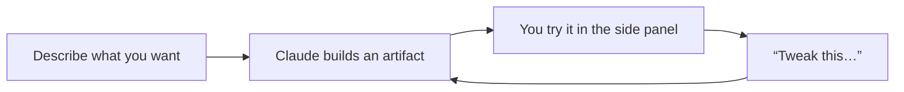

<LevelBadge level="beginner" />

<VerifyNote lastVerified="2026-06-20" source="https://www.anthropic.com">
Artifactの機能（インタラクティブ性、永続性、呼び出せる対象）は急速に進化しています。最新の挙動はアプリやヘルプセンターで確認してください。
</VerifyNote>

**Artifacts**は、Claudeがチャットの隣にある**サイドパネル**に描画する成果物です。ドキュメント、チャート、動くアプリ、図など、会話のテキストとは別に、見て、使って、繰り返し改善できるものです。

## 作れるもの

- **ミニWebアプリ＆ツール** — 電卓、クイズ、フォーム、小さなインタラクティブなデモ。
- **ドキュメント** — 推敲してエクスポートできる構造化された文章。
- **ビジュアル** — チャート、図、シンプルなデータダッシュボード。
- **コード** — 読んで実行できるコード。

## 非開発者にとって強力な理由

「グループの食事会用にチップ計算機を作って」「このCSVからダッシュボードを作って」のように、説明するだけで*使える*ものを作れます。そして会話形式で改善できます（「サービス料の欄を追加して」「ボタンを大きくして」）。これは**自分でコードを書かずにAIで作る**という考え方の最もわかりやすい例です。

## Artifactsの使い方

1. **作りたいものを依頼する** — 目的、入力、見た目などを具体的に。
2. **平易な言葉で改善する** — Claudeが同じartifactを更新します。
3. パネル内で**使い**、サポートされている場合は**エクスポート／共有**します。

## ヒント

- 入力／出力と対象読者について**具体的に**しましょう。良い[プロンプティング](/docs/prompting/basics)と同じです。
- **少しずつ改善しましょう。** 一度に1つの変更のほうが正しく仕上げやすいです。
- 重要な用途では、artifactが計算する**ロジックや数値を検証**してください（[ハルシネーション](/docs/foundations/hallucinations)）。

## 次に読むもの

- [実ファイルの生成（docx/pptx/xlsx/pdf）](/docs/claude-app/generating-files)
- [Claude.aiを始める](/docs/claude-app/getting-started)
- [データ分析プレイブック](/docs/playbooks/data-analysis)
