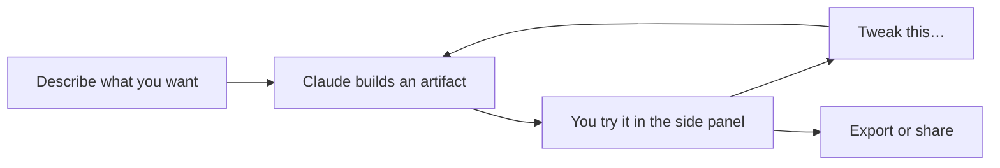

<LevelBadge level="beginner" />

<VerifyNote lastVerified="2026-09-25" source="https://support.claude.com/en/articles/17153992-what-are-artifacts-and-how-do-i-use-them">
Artifacts は **Free、Pro、Max、Team、Enterprise** で利用できます。3 つの*テンプレート* — **Claude Docs**、**Claude Slides**、**Claude Design** — は**有料プラン限定のベータ**です。Pro、Max、Team ではデフォルトで有効、Enterprise ではオーナーが個別に有効化するまでオフです。ここで扱う機能は速く変わります。現在の挙動はヘルプセンターで確認してください。
</VerifyNote>

**Artifacts** とは、Claude がチャットの隣の**サイドパネル**に描画する成果物です。ドキュメント、スライド、チャート、動くアプリなどを、会話のテキストとは別に、見て、使って、繰り返し改善できます。

[2026 年 9 月の統合](/docs/claude-app/one-claude-docs-and-slides)以降、このパネルは 3 つの**テンプレート**が置かれる場所でもあります。つまり「artifact」が入れ物であり、「テンプレート」が出発点となる形です。

<Callout type="objectives" items={[
  "artifact パネルで何が作れるのか、どの出力が通常の artifact で、どれがベータのテンプレートなのかを知る",
  "Doc、スライド、デザイン、実行可能アプリ、ダウンロード可能なファイルのどれを選ぶかを、試行錯誤せずに決める",
  "ゼロから聞き直すのではなく、平易な言葉で artifact を改善する",
  "どの artifact を、どの形式で、どのプランでエクスポートできるかを知る"
]} />

## 作れるもの

| 出力 | 何であるか | プラン |
| --- | --- | --- |
| **ミニ Web アプリ＆ツール** | 電卓、クイズ、フォーム、小さなインタラクティブデモ | 全プラン |
| **チャート＆図** | ビジュアルとシンプルなデータダッシュボード | 全プラン |
| **コード** | 読んで実行できるもの | 全プラン |
| **Claude Docs** | Claude やチームと共同編集する、生きたマルチタブ文書 | 有料、ベータ |
| **Claude Slides** | メモや会話から組み立て、その場で発表できるデッキ | 有料、ベータ |
| **Claude Design** | 自分のデザインシステムに沿ったビジュアル、モックアップ、プロトタイプ、ランディングページ | 有料、ベータ |

エクスポート形式は種類によって異なります。Docs は **Word、PDF、Markdown、Google Docs** へ、Slides は **PowerPoint と PDF** へ、Designs は **.zip、PDF、PowerPoint、単体の HTML** として出力できます。

## 非開発者にとって強力な理由

「グループの食事会用にチップ計算機を作って」「この CSV からダッシュボードを作って」のように説明するだけで*使える*ものを作り、そこから会話形式で磨き込めます（「サービス料の欄を追加して」「ボタンを大きくして」）。**自分でコードを書かずに AI で作る**という考え方の、最もわかりやすい例です。

## Artifacts との付き合い方

<Steps items={[
  {title: "作りたいものを具体的に依頼する", body: "目的、入力、対象読者、見た目を述べてください。最初の artifact が外す主な原因は曖昧さです。これは通常のプロンプティングと同じ原則です。"},
  {title: "あるいは自分で形を選ぶ", body: "メッセージボックスで Output を選んでテンプレートを選ぶか、Artifacts タブから始めてください。Claude が思っていたのと違う形ばかり作るときに有効です。"},
  {title: "平易な言葉で改善する", body: "Claude は新しく作り直すのではなく同じ artifact を更新します。5 つまとめて頼むより、一度に 1 つの変更のほうがはるかに正しく仕上がります。"},
  {title: "使ってから、エクスポートまたは共有する", body: "まずパネル内で試してください。Docs、Slides、Designs にはそれぞれ独自のエクスポート形式があり、共有のルールはプランによって異なります。"}
]} />

```mermaid
flowchart LR
  A[Describe what you want] --> B[Claude builds an artifact]
  B --> C[You try it in the side panel]
  C --> D["Tweak this…"] --> B
  C --> E[Export or share]
```

<PromptCard title="具体的な artifact のブリーフは、曖昧なものに勝る">{`Build me an interactive artifact: a tip calculator for a group dinner.

Inputs: bill total, number of people, tip percentage (slider, 0-30%,
default 18), and a toggle for "service charge already included".
Output: tip amount, total, and per-person share, updating live.

Audience: my friends on their phones — big tap targets, works at
375px wide, no explanation text.`}</PromptCard>

## ヒント

- 入力／出力と対象読者について**具体的に**しましょう。良い[プロンプティング](/docs/prompting/basics)と同じです。
- **少しずつ改善しましょう。** 一度に 1 つの変更のほうが正しく仕上げやすいです。
- 重要な用途では、artifact が計算する**ロジックや数値を必ず検証**してください（[ハルシネーション](/docs/foundations/hallucinations)）。
- **Doc 内のチャートは自動で更新されません。** データを変えても、Claude に作り直すよう頼むまでチャートは古い値のままです。

## クイズ

<Quiz questions={[
  {q: "あなたは Free プランで、会話を共有可能なマルチタブ文書に変えるよう Claude に頼みました。何が得られますか？", options: ["Claude Doc — artifacts はすべてのプランで使えるため", "Claude Doc。ただし閲覧専用", "Claude Doc は得られません。テンプレートは有料プラン限定のベータです。通常の artifact やダウンロード可能なファイルなら得られます", "何も得られません。artifacts には有料プランが必要です"], answer: 2, explain: "Artifacts 自体は Free、Pro、Max、Team、Enterprise で利用できます。3 つのテンプレート — Docs、Slides、Design — は有料プラン限定のベータです。Free でも通常の artifact や生成ファイルは得られます。"},
  {q: "Claude が作った artifact はほぼ良いのですが、ボタンが小さすぎます。効率的な動きはどれですか？", options: ["より詳しい仕様を添えて新しい会話を始める", "平易な言葉で変更を頼む — Claude が同じ artifact を更新する", "エクスポートして手作業で編集する", "ターン数を節約するために 5 つの修正を一度に頼む"], answer: 1, explain: "会話形式で改善すると同じ artifact が更新されます。それこそがこのパネルの要点です。そして一度に 1 つの変更のほうが、5 つまとめるより確実に着地します。"}
]} />

<Callout type="takeaways" items={[
  "artifact＝サイドパネルという入れ物、テンプレート＝出発点となる形（Docs、Slides、Design）。",
  "通常の artifact はすべてのプランで動きます。3 つのテンプレートは有料プランでベータ、Enterprise ではデフォルトでオフです。",
  "同じ artifact に対して平易な言葉で改善しましょう — 会話をやり直さないでください。",
  "計算された数値は必ず検証し、データが変わったらチャートを作り直しましょう。"
]} />

## 次に読むもの

- [One Claude:統合、Claude Docs と Claude Slides](/docs/claude-app/one-claude-docs-and-slides) — テンプレートの詳細と、その限界
- [実ファイルの生成（docx/pptx/xlsx/pdf）](/docs/claude-app/generating-files) — ダウンロードが欲しいとき
- [データ分析プレイブック](/docs/playbooks/data-analysis)
