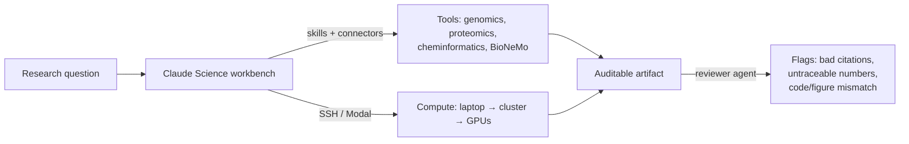

<LevelBadge level="advanced" />

<VerifyNote lastVerified="2026-07-13" source="https://www.anthropic.com/news/claude-science-ai-workbench">
Claude Scienceはベータ版です。同梱スキル、接続モデル、コンピュートオプション、プランの提供状況は急速に変化します — 依存する前に、アプリと公式発表で最新の詳細を確認してください。
</VerifyNote>

<Callout type="objectives" items={["Claude Scienceとは何か — そしてチャットウィンドウでは解決できない、それが解く具体的な問題を理解する", "3つの柱を学ぶ：統合ツール、監査可能なアーティファクト、マネージドコンピュート", "レビュアーエージェントが、追跡不能な数値や不一致な図を自動的にどう検出するかを見る", "Claude Scienceを、素のClaudeやClaude Codeと比べていつ使うべきかを知る", "モデルが検証できることを誇張せず、より広いAI・フォー・サイエンスの状況の中に位置づける"]} />

汎用チャットボットでの科学研究の大半は、同じ継ぎ目で破綻します。モデルは巧みに推論しますが、*ツール、データ、コンピュート*は別の場所 — クラスター、ノートブック、ゲノムブラウザ、フォールディングモデル — にあります。結果を手作業で行き来させてコピーし、ある図がどうやって作られたのかを後から誰も正確に再現できません。**Claude Science**（ベータ版、**2026年6月30日**リリース）は、Anthropicがこの継ぎ目を閉じようとする試みです。推論、ツール、コンピュート、来歴（プロヴェナンス）のすべてが一箇所にあるAI*ワークベンチ*です。

これはチャットに貼り付けるプロンプトではなく、独立したアプリです。ソフトウェアリポジトリの代わりに、ウェットラボや計算生物学のワークフローに向けられた[Claude Code](/docs/claude-code/what-is-claude-code)だと考えてください。

## それが狙う問題

たとえばシングルセルRNAパイプラインを回す研究者は、データソース、QCツール、プロットライブラリ、GPU上のフォールディングモデル、引用文献マネージャを同時に扱います — さらに、どのスクリプトのどのバージョンが3週間前のどの図を生成したかを覚えておく精神的負担も抱えます。汎用アシスタントは*1つ*のステップは助けてくれますが、残りの筋道は見失います。

<Callout type="tip">
科学における価値の単位は、良い答えではなく、**再現可能な**答えです。Claude Scienceはそれを軸に作られています。その出力は、レビュアー（人間でもエージェントでも）がすべての数値を、それを生成したコードと環境まで遡って追跡できるように設計されています。
</Callout>

## 3つの柱

### 1. 統合ツール — 環境が最初から配線済み

Claude Scienceには、ゲノミクス、シングルセル、プロテオミクス、構造生物学、ケモインフォマティクス向けに事前設定された**60以上の厳選されたスキルとコネクタ**が同梱されています。決定的なのは、**NVIDIA BioNeMo**モデル — **Evo 2**（ゲノム基盤モデル）、**Boltz-2**（構造/親和性予測）、**OpenFold3**（タンパク質フォールディング）を含む — にネイティブに接続することです。そのためフォールディングや親和性予測が、別ポータルではなくワークフローの一ステップになります。

これはClaude Codeでおなじみかもしれない、同じ[スキルとコネクタ](/docs/claude-code/skills)の仕組みを、ソフトウェアスタックの代わりに科学スタック向けに厳選したものです。

### 2. 監査可能なアーティファクト — 来歴は後付けではなくデフォルト

すべての出力が完全な系譜を伴います：

- それを生成した**正確なコードと環境**、
- それがどう作られたかの**平易な言葉による説明**、そして
- その背後にある**完全なメッセージ履歴**。

さらに、**レビュアーエージェント**が**不正確な引用、追跡不能な数値、そして裏付けとなるコードと一致しない図**を自動的にフラグ付けします。最後のものは、目立たない安全策です。それらしく見えるが、そのデータが実際にはアーティファクト内のコードから来ていないチャートが検出されます。

<Callout type="warning">
レビュアーエージェントはあるクラスのエラーを減らしますが、出力を*正しく*するわけではありません。検証できない引用や追跡できない数値をフラグ付けしますが、実験計画、生物学的妥当性、あるいは正しい問いが立てられたかどうかは保証できません。来歴 ≠ 真実です。科学の責任はあなたが負い続けます。
</Callout>

### 3. マネージドコンピュート — あなたのノートPCから数百台のGPUまで

Claude Scienceは、**あなたのノートPC、クラスター、またはオンデマンドのGPU上でコンピュートを管理**し、**1台のGPUから必要に応じて数百台まで**スケールします。既存のインフラと連携し — **SSH**経由のHPCクラスターや**Modal**アカウント — 重いジョブは、あなたのデータや割り当てが既にある場所で、オーケストレーションを手書きせずに実行されます。

## ネイティブな科学的可視化

結果は、ダウンロードして別の場所で開くファイルではなく、**インターフェース内に**描画されます。**3Dタンパク質構造、ゲノムブラウザトラック、化学構造**がネイティブに表示されます。フォールドや遺伝子座を、それについて推論したその場で確認できます — [アーティファクト](/docs/claude-app/artifacts)の考え方を、科学的オブジェクトへ拡張したものです。

## 典型的なワークフロー

<Steps items={[{title: "問いを立てる", body: "生物学的な問いを述べ、コネクタ経由でClaude Scienceをあなたのデータソースに向ける。"}, {title: "パイプラインを組み立てさせる", body: "スキル（QC、アラインメント、フォールディング）を選択し、ステップを提案する — 重いコンピュートが走る前にレビューする。"}, {title: "データがある場所で実行する", body: "高コストのステップをSSH経由のHPCクラスターやオンデマンドGPUにオフロードし、軽いステップはローカルに残す。"}, {title: "ネイティブに確認する", body: "先にエクスポートするのではなく、3D構造、ゲノムトラック、化学構造をインラインで表示する。"}, {title: "監査可能なアーティファクトを出荷する", body: "出力はコード、環境、平易な言葉の手法、メッセージ履歴をまとめ、レビュアーエージェントが追跡不能なものをフラグ付けする。"}]} />

<PromptCard title="Claude Science内での最初の具体的な依頼">{`Load the connected single-cell dataset, run standard QC (filter low-count cells and high-mito), and show a UMAP colored by cluster. Keep every step in an auditable artifact I can hand to a reviewer.`}</PromptCard>

<PromptCard title="重いステップを実コンピュートに送る">{`Predict the structure of this sequence with the connected folding model, run it on my HPC cluster over SSH, and render the 3D structure inline when it finishes.`}</PromptCard>

## いつ使うか（そしていつ使わないか）

| Claude Scienceを使うのは… | ほかを使うのは… |
|---|---|
| 再現可能でレビュー可能な科学的出力が必要なとき | 手早い一回限りの答えが欲しいとき → 素の[Claude](/docs/claude-app/getting-started) |
| 作業がゲノミクス/プロテオミクス/ケモインフォマティクスのツールにまたがるとき | ソフトウェアを構築しているとき → [Claude Code](/docs/claude-code/what-is-claude-code) |
| 重いコンピュートを自分のクラスターやオンデマンドGPUで走らせる必要があるとき | 配線すべきデータコネクタやコンピュートがないとき |
| 来歴（コード + 環境 + 履歴）がレビューに実際に重要なとき | Freeプラン、またはWindows上にいるとき（提供状況を参照） |

## 提供状況と制限

- **プラン：** **Claude Pro、Max、Team、Enterprise**ユーザー向けのベータ版。（Freeティアはなし。）
- **プラットフォーム：** **macOSとLinux** — ローンチ時点でWindowsクライアントはないことに注意。
- **ステータス：** ベータ版 — 同梱スキルリスト、接続モデル、コンピュートオプションは変化すると想定してください。

<Callout type="tip">
Claude ScienceはClaude固有のものですが、*パターン*は業界全体に共通します。アシスタントは、単に記述するだけでなく実際の仕事ができるように、ツール統合、来歴、コンピュートの各層を成長させています。ほかのAIラボからも同等の「ワークベンチ」的な動きが出てくるか注視してください — Claude Scienceが設定する再現性の基準は、それらを判断するよい物差しです。
</Callout>

<Flashcards title="Claude Scienceの語彙" cards={[{front: "Claude Science", back: "科学者のためのAnthropicのベータ版AIワークベンチ：統合された研究ツール、監査可能なアーティファクト、ネイティブな可視化、マネージドコンピュートを1つのアプリに。"}, {front: "監査可能なアーティファクト", back: "正確なコード、その環境、平易な言葉の手法、完全なメッセージ履歴とともにまとめられた出力 — どんな結果も、それがどう作られたかまで遡れる。"}, {front: "レビュアーエージェント", back: "不正確な引用、追跡不能な数値、裏付けコードと一致しない図を自動的にフラグ付けするチェック。エラーを減らすが、正しさは保証しない。"}, {front: "BioNeMo", back: "NVIDIAの生物学基盤モデル群。Claude ScienceはEvo 2、Boltz-2、OpenFold3にネイティブ接続する。"}, {front: "マネージドコンピュート", back: "Claude Scienceは、ノートPC、（SSH経由の）HPCクラスター、（Modalなどの）オンデマンドGPUでジョブを実行し、1台から数百台までスケールする。"}, {front: "ケモインフォマティクス", back: "化学構造と性質の計算解析 — Claude Scienceが、ゲノミクス、シングルセル、プロテオミクス、構造生物学と並んでスキルを事前配線する分野の1つ。"}]} />

<Quiz title="理解度チェック" questions={[{q: "汎用チャットボットと比べたとき、Claude Scienceの最も際立った設計目標は何ですか？", options: ["より速い応答", "再現性 — すべての結果が、それを生成したコードと環境まで遡れる", "より大きなコンテキストウィンドウ"], answer: 1, explain: "その出力は監査可能なアーティファクト（コード + 環境 + 平易な言葉の手法 + メッセージ履歴）であり、レビュアーがすべての数値を追跡できるように作られています。その来歴第一の設計が核心的な差別化要因です。"}, {q: "レビュアーエージェントが、数値がアーティファクト内のコードと一致しない図をフラグ付けしました。それは何を証明しましたか？", options: ["科学が間違っていること", "結果が正しいこと", "図が追跡不能であること — 生物学への判定ではなく、来歴の問題"], answer: 2, explain: "レビュアーは追跡不能な数値、不正な引用、コード/図の不一致を検出します。あるクラスのエラーは減らしますが、根底の科学が妥当かどうかは確認できません — 来歴は真実ではありません。"}, {q: "ワークベンチ内から、自分のラボのHPC割り当てでタンパク質をフォールディングする必要があります。Claude Scienceは…", options: ["Anthropicのクラウド上でしか実行できない", "SSH経由（またはオンデマンドGPU）であなたのクラスター上でジョブを実行でき、必要に応じてスケールする", "コンピュートをまったく行えない"], answer: 1, explain: "Claude Scienceは、ノートPC、（SSH経由の）クラスター、（Modalなどの）オンデマンドGPUでコンピュートを管理し、1台のGPUから数百台までスケールします。"}, {q: "ローンチ時にClaude Scienceを使えないのは誰ですか？", options: ["macOS上のMaxユーザー", "Linux上のEnterpriseユーザー", "Windows上のFreeプランユーザー"], answer: 2, explain: "Pro、Max、Team、Enterprise向けのベータ版（Freeティアなし）で、macOSとLinuxのみで提供されます — したがってFree/Windowsのユーザーは両方の点で除外されます。"}]} />

<Callout type="takeaways" items={["Claude Scienceは独立したベータ版アプリ — チャットに貼り付けるプロンプトではなく、科学者のためのAIワークベンチ。", "3つの柱：事前配線されたツール（60以上のスキル、ネイティブなBioNeMo — Evo 2、Boltz-2、OpenFold3）、監査可能なアーティファクト、マネージドコンピュート。", "監査可能なアーティファクトはコード + 環境 + 手法 + メッセージ履歴をまとめ、レビュアーエージェントが追跡不能な数値、不正な引用、コード/図の不一致をフラグ付けする。", "コンピュートはデータがある場所で実行される：ノートPC、SSH経由のHPC、オンデマンドGPU、1台から数百台までスケール。", "Pro/Max/Team/Enterprise向けにmacOSとLinuxのみのベータ版。来歴はエラーを減らすが、科学が正しいと認定することは決してない。"]} />

## 出典とさらに読む

- [Claude Science, an AI workbench for scientists — Anthropic](https://www.anthropic.com/news/claude-science-ai-workbench) — ローンチ発表（2026年6月30日）。60以上のスキル、BioNeMo接続、監査可能なアーティファクト構造、レビュアーエージェント、コンピュートオプション、提供状況の出典。
- [NVIDIA BioNeMo](https://www.nvidia.com/en-us/clara/bionemo/) — Evo 2、Boltz-2、OpenFold3を支える生物学基盤モデルプラットフォーム。
- [Modal](https://modal.com/) — Claude Scienceが利用できるオンデマンドコンピュートバックエンドの1つ。
- AILmanacの関連ページ：[Claude Code](/docs/claude-code/what-is-claude-code)、[Skills](/docs/claude-code/skills)、[Artifacts](/docs/claude-app/artifacts)、[Managed Agents](/docs/api/managed-agents)。
