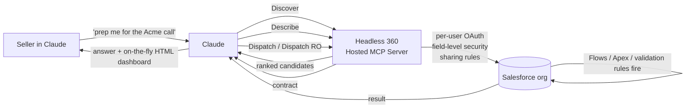

<LevelBadge level="intermediate" />

<VerifyNote lastVerified="2026-09-01" source="https://www.salesforce.com/news/press-releases/2026/08/26/salesforce-and-anthropic-announce-claudeforce/">
Claudeforce は **2026 年 8 月 26 日**に発表されました。**Salesforce in Claude** は現在**限定パイロット**中で、**2026 年 9 月にオープンベータ**が予定されています。4 ツールの Headless 360 MCP サーフェスは Salesforce が公開している API（Beta、2026 年 7 月）です。スキル数、価格、Slack/Agentforce 各ストランドの正確な範囲は毎週動いています — 組織をコミットする前に、リンク先の Salesforce Developers ドキュメントで確認してください。
</VerifyNote>

**2026 年 8 月 26 日**、Salesforce と Anthropic は 4 つのストランドからなるパートナーシップ **Claudeforce** を共同発表しました。最初に出荷される部分は **Salesforce in Claude** — Claude の会話がライブの CRM データについて推論し、ガバナンスされたアクションを実行できるようにするプラグインです。**37 の事前構築済みセールススキル**（ローンチ時に公に名前が挙がったのは約 8 つのみ）、2026 年 9 月に予定されたオープンベータ、そして — ここが報道が飛ばす部分ですが — その下にある**意外なほど小さな MCP サーフェス**が特徴です。

解説記事の多くはプレスリリースの切り貼りです。このページは実践的なフィールドガイドです：わずか **4 つの MCP ツール**から 37 のスキルを可能にするアーキテクチャ、プラグインに同梱される**まったく異なる 2 つの認証モデル**、そして Chrome 拡張機能のもう 1 つのように扱うと RevOps を噛む**ガバナンスの罠**です。

<Callout type="objectives" items={[
  "2026 年 9 月のオープンベータで実際に何が出荷されるかを理解する — Claudeforce の 4 つのストランドと、そのどれが 'Salesforce in Claude' なのか",
  "プラグインが Salesforce API サーフェス全体を公開するのに、なぜ 4 つの MCP ツール（Discover / Describe / Dispatch / Dispatch Read-Only）だけで足りるのかを理解する",
  "2 つの認証ルートを見分ける — ユーザーごとの OAuth（Claude）とクライアントクレデンシャルの統合ユーザー（Slack） — そして自組織に正しいものを選ぶ",
  "どれかを有効化する前に、37 のスキルを権限レベル（読み取り専用 / 推奨 / 書き込み）で分類する",
  "4 つの罠を回避する：過剰に権限付与されたプロファイル、忘れられた自動化の副作用、Winter '27 アップグレードとの衝突、シャドー IT の MCP サーバー"
]} />

## Claudeforce とは実際に何か（そして何でないか）

Claudeforce は 4 つのストランドからなるパートナーシップであり、製品ではありません。2026 年 9 月に開放されるのは 1 つのストランド — **Salesforce in Claude** — だけです。ストランドを混同することが、RevOps チームが誤ったパイロットのスコープを切ってしまう原因です。

<Steps items={[
  {title: "ストランド 1 — Salesforce in Claude（2026 年 9 月オープンベータ）", body: "Claude アプリの内側で動く Salesforce プラグイン。セラーは Claude に留まり、Claude が Salesforce の Hosted MCP を介して組織にアクセスします。このページが扱うのはこのストランドです。"},
  {title: "ストランド 2 — Salesforce 製品の中の Claude", body: "逆方向：Anthropic のモデルが Agentforce 全体（Atlas Reasoning Engine、Agentforce Vibes、Agentforce Coworker、Agent Builder）でファーストクラスの存在として利用可能になります。UX も管理サーフェスもロールアウト日程も異なります。"},
  {title: "ストランド 3 — Slack のデフォルトモデルとしての Claude", body: "Slack の AI 機能（ハドルの要約、チャンネルのまとめ、メッセージの下書き）が、デフォルトのバックエンドモデルとして Claude を使い始めます。ガバナンスは別 — 下記の Slack 認証ルートを参照してください。"},
  {title: "ストランド 4 — 商業的な相互採用", body: "Salesforce が Anthropic の大口顧客になり、Anthropic が Salesforce の大口顧客になります。調達には興味深いですが、技術的なセットアップには無関係です。"}
]} />

このページの残りはストランド 1、**Salesforce in Claude** についてです。

## 37 のスキルにスケールする 4 ツールのアーキテクチャ

Claudeforce について唯一自明でない点は、プラグインが機能ごとにツールを登録**しない**ことです。Salesforce の **[Headless 360 Hosted MCP Server](https://developer.salesforce.com/docs/platform/hosted-mcp-servers/guide/headless-360-mcp.html)**（Beta、2026 年 7 月）が公開するのはちょうど **4 つの MCP ツール**で、Claude はそれらを組み合わせてすべてのスキルに到達します。

<Steps items={[
  {title: "Discover", body: "接続された組織内のすべての API とスキルのベクターインデックスに対するセマンティック検索。Claude はあなたの依頼に対する解釈を渡し、Discover は候補となる操作のランク付きリストを返します。「このアカウントのディールヘルスのやつを探して」に、コンテキストを散らかす 200 個の事前登録ツールが要らないのはこのためです。"},
  {title: "Describe", body: "選んだ候補について、Describe は技術的な契約を返します：パラメータ、依存関係、順序付きステップ、副作用。Claude は何かを実行する前に、Discover が正しいものを出したかをこれで検証します。"},
  {title: "Dispatch", body: "選んだ操作を実行します。正しいエンドポイントにルーティングします。呼び出しが Salesforce に届く前にユーザーアクセスガードを適用します。これが書き込みパスです — 検証ルール、Flow、Apex トリガー、CPU ガバナ制限はすべて、Dispatch の下流で通常どおり発火します。"},
  {title: "Dispatch Read-Only", body: "GET のみのバリアント。同じ検出フロー、同じアクセスチェックですが、ツールは物理的に変更を加えられません。これがパイロットに安全なデフォルトであり、読み取り専用スキルがバインドされるツールです。"}
]} />

ローンチ記事の大半が見落としている 2 つの含意：

- **ツールサーフェスは小さく安定したまま**ですが、**スキルのカタログは Salesforce 側で独立して成長**します — Claude は新しいスキルに到達するために新しいツール登録を必要としません。
- **項目レベルセキュリティ、オブジェクト権限、共有ルールはすべてのツール呼び出しに適用されます** — 適用は Claude ではなく組織側で行われます。ユーザーが Salesforce UI で見えない項目は、Discover は表示せず、Dispatch はいずれにせよ拒否します。

## 2 つの認証ルート — そしてなぜその違いが重要か

Claudeforce は、同じように見えるプラグインに **2 つの OAuth モデル**を貼り付けて出荷されており、両者のセキュリティ姿勢は大きく異なります。ここを間違えることが、組織内のすべての営業担当に 1 人の統合ユーザーの実効権限をうっかり与えてしまう原因です。

<Steps items={[
  {title: "ルート A — Salesforce in Claude（ユーザーごとの OAuth）", body: "mcp_api スコープを持つ Salesforce External Client Apps を使います。1 人の管理者が組織レベルの接続を一度だけ行い、その後各セラーが自分自身として認可します。すべての Claude ツール呼び出しは、リクエストした個人として、その人のプロファイル、権限セット、共有ルール、項目レベルセキュリティのもとで実行されます。ユーザーに見えるものすべてに対して、これが正しい姿勢です。"},
  {title: "ルート B — Claude in Slack（クライアントクレデンシャル）", body: "専用の統合ユーザーによる OAuth 2.0 クライアントクレデンシャルフローを使います。アクセスバンドルは 1 つのエージェント資格情報をユーザー間で共有します。すべてのリクエストが同じ統合ユーザーとして実行されます — つまり、そのユーザーの権限が、それに触れるすべての人の実効上限になります。便利ですが、ユーザーごとのデータ分離要件があるものには間違った形です。"}
]} />

<Callout type="warning" items={[
  "「とにかく動くように」と Slack の統合ユーザーに広いセールスオプス向けプロファイルを付与すると、それを経由するすべての Slack ユーザーがその実効アクセスを継承します。統合ユーザーのプロファイルは Slack が実際に必要とする最小の範囲に制限し、権限セットで機能を足してください — 共有サービスアカウントと同じ原則です。"
]} />

## 権限レベルで分類した 37 のスキル

Salesforce がローンチ時に名前を挙げたスキルはほんの一握りで、残りは 2026 年後半を通じて順次登場します。今すぐ計画できるのは、すべてのスキルが **3 つの権限レベル**のいずれかに属し、しかもインターフェイス上は同じように見えるということです。分類するのはあなたの責任です。

| 名前の挙がったスキル（2026 年 8 月） | 権限レベル | おおよその Dispatch ルート |
| --- | --- | --- |
| デイリーブリーフィング | 読み取り専用 | Dispatch RO |
| パイプラインレビュー | 読み取り専用 | Dispatch RO |
| 予測ナラティブ | 読み取り専用 | Dispatch RO |
| ミーティング準備 | 読み取り専用 | Dispatch RO |
| ディールヘルスレビュー | 読み取り専用 | Dispatch RO |
| 勝敗分析 | 読み取り専用 | Dispatch RO |
| Salesforce ハイジーン | 推奨 | Dispatch RO → 下書き |
| 活動ログ記録 | 書き込み | Dispatch（POST/PATCH） |

残りの約 29 スキルはローンチ時点で未公開です。登場したら同じトリアージを適用します：

<Steps items={[
  {title: "読み取り専用（Dispatch RO のみ）", body: "分析、要約、取得を行います。変更はできません。パイロットのコホートには自由に有効化してよいものです。失敗モードは「誤った答え」であり、「誤った書き込み」ではありません。"},
  {title: "推奨（Dispatch RO + 下書き）", body: "分析し、かつ変更を提案しますが、実際の変更は人間のための下書きとして残します。読み取り専用ティアが安定して動いてから有効化します。失敗モードは、セラーが読まずに承認してしまうかもしれない悪い下書きです — 速度だけでなく修正率を測定してください。"},
  {title: "書き込み（Dispatch POST/PATCH/DELETE）", body: "CRM データを直接変更します。すべての書き込みは、人間が保存をクリックした場合とまったく同じように、組織の検証ルール、Flow、Apex トリガー、CPU ガバナ制限を通ります。最後に、スキルごとに、ユーザーごとのプロファイルスコープ付きで、そして推奨ティアの精度を少なくとも 4 週間測定してから有効化してください。"}
]} />

## パイロットのセットアップ — RevOps チェックリスト

<Steps items={[
  {title: "1. 公開しようとしているプロファイルを監査する", body: "遅い UI の裏では無害だった過剰権限のプロファイルは、速いエージェントの裏では本当に危険になります。パイロットの前に、招待するユーザーの権限監査を実行してください：どのオブジェクト、どの項目、どのレコードタイプの共有か。プラグインはそれらのプロファイルが示すものを忠実に適用します — 誰も気づかなかった過去の過剰権限も含めて。"},
  {title: "2. パイロットユーザーをロックダウンした権限セットにバインドする", body: "Claudeforce Pilot 権限セットを作成します：特定のオブジェクト、特定の項目、最初は読み取り専用。通常のプロファイルに追加する形で割り当てれば、パイロット終了時にベースラインのアクセスに触れずにきれいに取り外せます。"},
  {title: "3. どこでも Dispatch Read-Only から始める", body: "最初の 2 スプリントは読み取り専用スキルのみを有効化します。これによりロールバック面なしで精度を測定できます。幻覚した項目名や誤ったレコード検索に注意してください — それらは書き込みティアまで生き残る失敗モードです。"},
  {title: "4. 書き込みティアのパイロットには、3 つの権限レベルにまたがる 3 つのワークフローを選ぶ", body: "読み取り専用 1 つ、推奨 1 つ、書き込み 1 つ。異なるリスクプロファイルは異なるガバナンスのギャップを表面化させ、ティアごとに 1 パイロットのほうがスキルごとに 1 パイロットより安上がりです。"},
  {title: "5. API のベースラインをバージョン固定する", body: "Salesforce in Claude は API v67.0 以降を必要とし、Winter '27 では v68.0 が導入されます。ベータ期間（2026 年 9〜10 月）中に組織が Winter '27 に自動アップグレードされる場合は、プラグインの API バージョンを明示的に固定して、プラットフォームのアップグレードがパイロットの途中でセマンティクスを変えないようにしてください。"},
  {title: "6. ベータ期間中はチーム所有の MCP 接続を禁止する", body: "個々のチームが「速く動くために」自前の Hosted MCP Server を立てるなら、それはきれいなパッケージのシャドー IT の再発明です。MCP のガバナンスは、接続アプリとプロファイルを所有する同じ管理者の下に集約してください。"}
]} />

<PromptCard title="セラー向けプロンプトテンプレート：安全な月曜パイプラインブリーフィング（読み取り専用ティア）">{`You are preparing my Monday pipeline briefing from Salesforce.

Every Monday at 07:00 local:

1. Use the "Pipeline review" skill on my named accounts (owner = me,
   stage != Closed Lost, close date in current quarter).
2. Use the "Deal-health review" skill on the top 10 by amount.
3. Use the "Meeting preparation" skill for accounts I have a meeting
   with in the next 5 business days.

Constraints (do NOT violate):
- Read-only pass only. If any skill proposes a write (update stage,
  log activity, change amount) STOP and surface it as a draft in
  the output — do NOT dispatch it.
- Do not log activities on my behalf. Do not update fields.
- If a skill returns a field you cannot see under my profile, do
  not guess the value — flag it as "hidden by permissions".

Produce a single briefing:
- 3-bullet TL;DR
- "Pipeline movement since last Monday" (opportunity-level, cite
  the Salesforce record IDs)
- "Deals I should touch this week" (with why, from deal-health)
- "Meetings this week" (with prep pack from meeting-preparation)
- "Proposed writes (NOT DISPATCHED)" — every draft change the agent
  wanted to make, so I can review in one place.`}</PromptCard>

このプロンプトが、大半の「このテンプレートをコピーして」記事がやらない 2 つのこと：

- 「スキルが書き込みを提案したら STOP」という明示的な不変条件で、**パイロットを読み取り専用に固定**しています。スケジュール実行や長時間の Claude セッションでは「本当に？」というフォローアップに答えることができません — 不変条件はプロンプトの中に住まなければなりません。
- モデルに**実行したかったすべての書き込みを 1 か所に表示**させることで、スキルを書き込みティアに昇格させる前に推奨ティアの精度を測定できます。これが昇格を勝ち取る最も安い方法です。

## あなたを噛む 4 つの罠

<Steps items={[
  {title: "1. 過剰権限のプロファイルがライブの爆発半径になる", body: "UI の裏ではおおむね問題なかった同じ権限セットが、1 分間に 30 件の書き込みを Dispatch できるエージェントの裏では本当に危険です。対策：パイロットの後ではなく前にプロファイル監査を。"},
  {title: "2. 自動化の副作用がすべての Dispatch 書き込みで発火する", body: "Dispatch PATCH は通常の Salesforce 書き込みです。すべての検証ルール、Flow、Process Builder、Apex トリガー、CPU 時間ガバナ制限が、人間のクリックとまったく同じように発火します。ループで動く善意のスキルが CPU 制限に引っかかったり、望まない Flow 駆動のメールを大量送信したりし得ます。対策：書き込みティアのスキルを有効にする前に、パイロット組織の自動化を計測してください。"},
  {title: "3. Winter '27 がオープンベータ中に着地する", body: "Winter '27 の本番アップグレード（2026 年 9〜10 月）は Claudeforce のオープンベータと衝突します。期間の途中でスキルが壊れたら、同時に起きた 2 つのプラットフォーム変更をデバッグすることになります。対策：プラグインの API バージョンを固定し、可能ならパイロットコホートの Winter '27 アップグレードをベータ期間の外にスケジュールしてください。"},
  {title: "4. Slack ルート ≠ Claude ルート", body: "Slack は統合ユーザーによるクライアントクレデンシャルを使うため、「Slack に Claudeforce へのアクセスを与える」ことは、個々のユーザーに Claude 内のプラグインを与えることと同じガバナンスの形ではありません。2 つの別々のロールアウト、2 つの別々の監査証跡として扱ってください。"}
]} />

## Agentforce に対する Claudeforce の位置づけ

Salesforce は 2024 年から **Agentforce** を出荷しており、Claude は 2025 年後半からその基盤モデルの 1 つでした。Claudeforce は Agentforce を置き換えるものではなく、**新しいサーフェス**（Claude アプリ）を追加し、Agentforce の 4 つの層（Atlas Reasoning Engine、Agentforce Vibes、Agentforce Coworker、Agent Builder）にわたって Claude を**正式化**します。モデルの選択肢は残ります：Agent Builder は引き続き Claude と並んで Amazon Nova を提供します。

両方を見比べているチーム向けの大まかな判断表：

| やりたいこと | 選ぶもの |
| --- | --- |
| セラーにライブの CRM について推論するチャットインターフェイスを与える | Salesforce in Claude（プラグイン） |
| AI 機能を Salesforce UI の中に埋め込む（レコード、リストビュー、ボタン） | Agentforce |
| ツール、メモリ、エスカレーションポリシーを持つカスタムエージェントを構築する | Agent Builder（Salesforce 内） |
| 繰り返し可能なバックオフィス CRM 業務をエンドツーエンドで自動化する | Agentforce Coworker |
| Claude で Salesforce のコード（Apex、LWC）を書く | Agentforce Vibes |

複数の行が当てはまる場合、1 つを選んで無理に押し通すのは誤りです — Claudeforce は、プラグイン、Agentforce、Agent Builder が補完的になるよう設計されており、ユーザーは同じ組織内でそれらの間を移動できます。

## Salesforce in Claude を使うべきでないとき

- **マシン間の統合が必要な場合。** プラグインは人間がループに入るチャットサーフェスです。大規模な無人の CRM 書き込みには、Claude アプリを間に挟まず、[Headless 360 MCP Server](https://developer.salesforce.com/docs/platform/hosted-mcp-servers/guide/headless-360-mcp.html) を [Managed Agents](/docs/api/managed-agents) に直接接続してください。
- **セラーが慣れた Agentforce 体験をすでに提供している場合。** 2 つ目のサーフェスを追加するとトレーニングが分断され、ガバナンスの仕事が倍になります。チームが住んでいるほうを選んでください。
- **これをガバナンスする Salesforce 管理者がゼロの場合。** プラグインは組織をより強力に、より到達しやすくします — プロファイル、権限セット、MCP 接続を所有する人がいないと、それは悪い組み合わせです。
- **コンプライアンス姿勢が顧客データに対する推論を禁じている場合。** プラグインは Salesforce Trust Boundary 内の Amazon Bedrock を経由して推論をルーティングしますが、プロンプトの内容と返されたデータはそれでもストレージ層を離れます。パイロットの前に DPA を読んでください。

## クイズ

<Quiz questions={[
  {q: "カタログに何個の「スキル」があるかに関係なく、Headless 360 サーバーは Claude にいくつの MCP ツールを公開しますか？", options: ["37 — 事前構築済みスキルごとに 1 つ", "数百 — Salesforce API 操作ごとに 1 つ", "4 — Discover、Describe、Dispatch、Dispatch Read-Only", "1 — 汎用の 'salesforce' ツール"], answer: 2, explain: "Salesforce は意図的に MCP サーフェスを 4 つのツール（Discover / Describe / Dispatch / Dispatch RO）に小さく安定して保っています。新しいスキルはその 4 つのツールの背後のカタログに追加され、モデルはそれぞれに新しいツール登録を必要としません。これが、同じプラグインが Claude のコンテキストウィンドウを汚さずに、ローンチ時の 37 スキルから後に数百へとスケールできる理由です。"},
  {q: "セラーに Opportunity.Amount の編集権限を持つ権限セットを与え、書き込みティアのスキルを有効にしました。セラーが Claude に 3 件の商談を 10% 引き上げるよう頼みます。組織側で何が発火しますか？", options: ["生の UPDATE のみ — Claude は速度のために組織の自動化をバイパスする", "UPDATE に加えて、Opportunity 上のすべての検証ルール、Flow、Apex トリガーが、UI クリックとまったく同じように", "何も — 書き込みはキューに入り夜間バッチで適用される", "呼び出し元がエージェントの場合、自動化はデフォルトで無効化される"], answer: 1, explain: "Dispatch PATCH は通常の Salesforce 書き込みです。検証ルール、Flow、Process Builder、Apex トリガー、CPU ガバナ制限がすべて発火します。だからこそ「自動化を監査する」がパイロット前チェックリストにあるのです — 1 分間に 30 件の書き込みを行うエージェントは、静かにガバナ制限に引っかかったり、予想外の Flow 駆動メールを大量送信したりし得ます。"},
  {q: "CFO が「Slack の Claude 統合は Salesforce in Claude と同じ方法でガバナンスされているか？」と尋ねます。正しい答えは？", options: ["はい — 同じ OAuth、同じユーザーごとの適用", "いいえ — Slack は統合ユーザーによるクライアントクレデンシャルを使うため、すべてのリクエストがセラーごとではなくその 1 人のユーザーとして実行される", "はい — どちらも Salesforce Trust Boundary を経由するので関係ない", "いいえ — Slack には認証がなく、読み取り専用"], answer: 1, explain: "Salesforce in Claude は External Client Apps（mcp_api スコープ）によるユーザーごとの OAuth を使い、各呼び出しはリクエストした個人として実行されます。Slack ルートは専用の統合ユーザーによる OAuth 2.0 クライアントクレデンシャルを使うため、Slack 経由のすべてのリクエストはその統合ユーザーとして実行されます。これは異なるガバナンスの形であり、別のロールアウトと監査証跡が必要です。"},
  {q: "2026 年 10 月初旬に Claudeforce パイロットを計画しています。計画時に考慮すべき特有のプラットフォームタイミング上の危険は？", options: ["パイロットを終えなければならない厳格な期限", "Winter '27 の本番アップグレードが 2026 年 9〜10 月に着地し、パイロットの途中で API セマンティクスが変わる可能性がある", "Anthropic による Claude Opus 4.8 の提供終了", "9 月 1 日に発効する Sonnet 5 の価格変更"], answer: 1, explain: "Winter '27 アップグレード（2026 年 9〜10 月）はオープンベータ期間と衝突します。プラグインの API バージョンを明示的に固定し、可能であればパイロットコホートの Winter '27 アップグレードをベータ期間の外にスケジュールしてください — さもないと、壊れたスキルに切り分けるべき 2 つの根本原因候補が生じます。（Sonnet 5 の 9 月 1 日の価格変更は中止され、$2/$10 が恒久的になりました。）"}
]} />

## 出典と参考資料

- Salesforce — [Salesforce and Anthropic Announce Claudeforce](https://www.salesforce.com/news/press-releases/2026/08/26/salesforce-and-anthropic-announce-claudeforce/)（ローンチのプレスリリース、2026 年 8 月 26 日）
- Salesforce Developers — [Headless 360（Beta）— Hosted MCP Servers リファレンス](https://developer.salesforce.com/docs/platform/hosted-mcp-servers/guide/headless-360-mcp.html)（正典となる 4 ツールアーキテクチャ）
- Salesforce Developers — [Standard Servers リファレンス](https://developer.salesforce.com/docs/platform/hosted-mcp-servers/guide/servers-reference.html)（ユーザーごとの認証、項目レベルセキュリティの適用）
- Salesforce Developers Blog — [Headless 360 MCP Server Beta の発表](https://developer.salesforce.com/blogs/2026/07/announcing-the-headless-360-mcp-server-beta)（2026 年 7 月のアーキテクチャローンチ）
- Anthropic — [Claude Sonnet 5 の恒久価格](https://www.anthropic.com/news/claude-sonnet-5)（2026 年 8 月 10 日、$2/$10 が恒久と確認 — 9 月 1 日の値上げは中止）
- AILmanac の関連ページ：[アプリのコネクタ（MCP）](/docs/claude-app/connectors) · [Cowork スケジュールタスク](/docs/claude-app/cowork-scheduled-tasks) · [Skill.md オープン標準](/docs/models/skill-md-open-standard) · [Managed Agents](/docs/api/managed-agents) · [Managed Agents のドメイン制限](/docs/api/managed-agents-domain-restrictions) · [MCP サーバーのセキュリティ確保](/docs/security/securing-mcp-servers) · [MCP ツールポイズニングとラグプル](/docs/security/mcp-tool-poisoning-and-rug-pulls)

## 次へ

- [アプリのコネクタ（MCP）](/docs/claude-app/connectors) — このプラグインが特殊化している一般的な概念
- [MCP サーバーのセキュリティ確保](/docs/security/securing-mcp-servers) — パイロットを開く前に適用すべきセキュリティパターン
- [Managed Agents](/docs/api/managed-agents) — Claude アプリをループに入れずにこれが必要なときの API 側の代替手段
