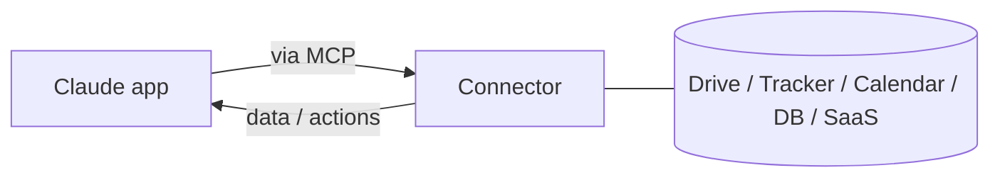

<LevelBadge level="intermediate" />

<VerifyNote lastVerified="2026-06-20" source="https://platform.claude.com/docs">
どのコネクターが存在するか、プランごとの提供状況は頻繁に変わります。最新の選択肢はアプリやヘルプセンターで確認してください。
</VerifyNote>

**コネクター**を使うと、Claudeアプリは**チャットの外側**、つまりあなたのツールやデータ（ドライブ、課題トラッカー、カレンダー、データベースなど）にアクセスできるようになり、Claudeが実際のシステムから回答したり、それらを操作したりできます。その裏側では、オープンな**[Model Context Protocol（MCP）](/docs/claude-code/mcp)**によって動いています。

## 何ができるか

コネクターがなければ、Claudeは会話の中にあることしか知りません。コネクターがあれば、（あなたの許可のもとで）接続されたサービスから関連情報を取得できます。例えば、ドキュメントを探す、最近の課題を読む、カレンダーを確認するといったことを行い、それを回答に活かせます。

## どこでも同じ標準

コネクターはMCPの**アプリ向け**の形態です。まったく同じプロトコルが、[Claude CodeのMCP](/docs/claude-code/mcp)や[APIのMCP](/docs/api/mcp)でも動いています。この概念を一度学べば、あらゆる場面に応用できます。

## セットアップと使い方

1. サービスを**接続**します（サポートされている場合はOAuthで認可）。
2. **最小権限を付与**します。タスクに必要なアクセスだけにします。
3. **自然に依頼**します。「Q3の計画ドキュメントを探してリスクを要約して」のように。

## 安全性

:::warning コネクターはアクセス権＋（場合によっては）操作の権限
- 信頼できるサービスとスコープだけを認可してください。
- 外部ソースから取得したコンテンツには[プロンプトインジェクション](/docs/security/prompt-injection)が含まれている可能性があります。コネクターが信頼できない素材を読み取るときは慎重に。
- サードパーティのコネクターを有効にする前に、それが何をできるかを確認してください（[サードパーティコードのレビュー](/docs/security/reviewing-third-party-code)）。
:::

## 次に読むもの

- [Claude CodeのMCPサーバー](/docs/claude-code/mcp)
- [MCPとツールへの接続（API）](/docs/api/mcp)
- [既存ツールの中のAI](/docs/claude-app/ai-in-your-tools)
