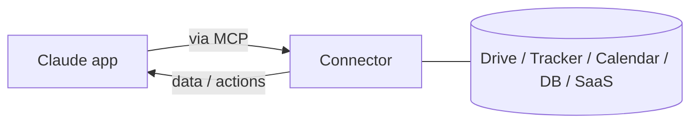

<LevelBadge level="intermediate" />

<Callout type="objectives" items={[
  "チャットだけではできないことを、コネクタがどう可能にするかを理解する",
  "コネクタ、Claude CodeのMCPサーバー、API MCPが、同じ標準規格の三つの姿であることを理解する",
  "最小権限の原則で、三つの手順でコネクタを設定する",
  "引き受けることになる二つのリスク、つまりアクセス権と、そこを通じて届く信頼できないコンテンツを把握する"
]} />

<VerifyNote lastVerified="2026-08-02" source="https://platform.claude.com/docs">
どのコネクタが存在するか、またプランごとの提供状況は頻繁に変わります。最新の選択肢はアプリ内またはヘルプセンターで確認してください。
</VerifyNote>

**コネクタ**を使うと、Claudeアプリは**チャットの外**、つまりあなたのツールやデータ(ドライブ、課題管理ツール、カレンダー、データベースなど)にアクセスできるようになり、Claudeは実際のシステムの情報をもとに回答したり、そのシステムに対して操作を行ったりできます。内部では、オープンな**[Model Context Protocol(MCP)](/docs/claude-code/mcp)**が動いています。

## できること

コネクタがなければ、Claudeが知っているのは会話の中にある内容だけです。コネクタがあれば、あなたの許可のもとで、接続したサービスから関連情報を取得し、回答に活用できます。たとえば、ドキュメントを探す、最近の課題を読む、カレンダーを確認する、といったことです。

```mermaid
flowchart LR
  C[Claude app] -->|via MCP| K[Connector]
  K --- S[(Drive / Tracker / Calendar / DB / SaaS)]
  K -->|data / actions| C
```

## どこでも同じ標準規格

コネクタは、MCPの**アプリ向け**の形です。まったく同じプロトコルが、[Claude CodeのMCP](/docs/claude-code/mcp)や[APIのMCP](/docs/api/mcp)も支えています。概念を一度学べば、すべての利用面に応用できます。

## 設定と使い方

<Steps items={[
  {
    title: "サービスを接続する",
    body: "対応している場合は、OAuthで認可します。この手順が信頼関係を作る部分であり、以降のすべてが、ここで付与した権限をそのまま引き継ぎます。"
  },
  {
    title: "最小権限を付与する",
    body: "タスクに必要なアクセス権だけを与えます。ドキュメントを探すだけのコネクタに書き込みスコープは不要で、読み取り専用の付与は、あなたが使える最も安価な安全対策です。"
  },
  {
    title: "自然に頼む",
    body: "コネクタを自分で呼び出す必要はありません。目的を伝えるだけです。「第3四半期の計画ドキュメントを見つけて、リスクを要約して」と頼めば、どのツールを使うかはClaudeが判断します。"
  }
]} />

<PromptCard title="接続したサービスを横断して頼む">
{`Find my Q3 planning doc and summarize the risks.`}
</PromptCard>

## 安全性

:::warning コネクタとは、アクセス権であり、(場合によっては)操作の権限でもある
- 信頼できるサービスとスコープだけを認可してください。
- 外部ソースから取得したコンテンツには、[プロンプトインジェクション](/docs/security/prompt-injection)が含まれている可能性があります。コネクタが信頼できない素材を読み込む場合は注意してください。
- サードパーティ製のコネクタを有効にする前に、そのコネクタに何ができるかを確認してください([サードパーティコードのレビュー](/docs/security/reviewing-third-party-code))。
:::

<Quiz questions={[
  {
    q: "コネクタが、チーム外の誰かが書いた共有ドキュメントを取り込みます。これによって生じる具体的なリスクは何ですか?",
    options: [
      "そのドキュメントがプランのストレージ上限に計上される",
      "プロンプトインジェクション。コネクタを通じて届く信頼できないコンテンツに、指示が含まれている可能性がある",
      "コネクタがそのドキュメントへの書き込み権限を自動的に獲得する",
      "Claudeは自分で作成していないドキュメントを読めない"
    ],
    answer: 1,
    explain: "外部ソースから取得したコンテンツには、プロンプトインジェクションが含まれている可能性があります。コネクタは、あなたが書いていない素材が入ってくる経路であり、だからこそ安全性の注意書きは信頼できない素材について警告しているのです。"
  },
  {
    q: "Claudeにドキュメントを探して読んでもらうだけでよい場合、どのスコープを付与すべきですか?",
    options: [
      "再認可の手間を省くため、フルアクセス",
      "タスクに必要なアクセス権だけ。つまり最小権限",
      "コネクタがデフォルトで要求するもの",
      "スコープなし。コネクタは認可なしで動作する"
    ],
    answer: 1,
    explain: "最小権限です。ドキュメントを探すだけのコネクタに書き込みスコープは不要で、設定時に行った付与は、その後コネクタが行うすべての操作に引き継がれます。"
  },
  {
    q: "アプリのコネクタ、Claude CodeのMCPサーバー、APIのMCPの関係は何ですか?",
    options: [
      "名前が同じだけの、無関係な三つの連携システム",
      "同じオープンなプロトコルの三つの利用面。概念は一度学べばよい",
      "コネクタはMCPに置き換えられた旧形式である",
      "本物のMCPはAPI版だけで、他は簡易版である"
    ],
    answer: 1,
    explain: "コネクタは、MCPのアプリ向けの形です。同じプロトコルがClaude CodeのMCPサーバーとAPIのMCPも支えているため、概念は三つの利用面すべてに通用します。"
  }
]} />

<Callout type="takeaways" items={[
  "コネクタがなければClaudeが知っているのは会話の中身だけ。コネクタがあれば、あなたの許可のもとで、実際のシステムから読み取り、操作もできる。",
  "コネクタは、アプリ向けの姿をしたMCPであり、Claude CodeのMCPサーバーやAPIのMCPと同じプロトコルである。",
  "設定は三つの手順。接続する、最小権限を付与する、あとは目的を伝えるだけ。",
  "引き受けるリスクは二つ。付与したアクセス権と、そこを通じて届く信頼できないコンテンツ。スコープは狭く絞り、外部の素材は信頼できないものとして扱う。"
]} />

## 次に読む

- [Claude CodeのMCPサーバー](/docs/claude-code/mcp)
- [MCPとツールへの接続(API)](/docs/api/mcp)
- [既存ツールの中のAI](/docs/claude-app/ai-in-your-tools)
- [Claudeforce:ClaudeのなかのSalesforce](/docs/claude-app/claudeforce-salesforce-in-claude) — 4ツールのMCPパターンを37個のセールススキルに変える、実在のプラグイン
