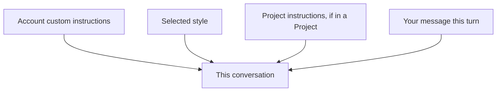

<LevelBadge level="beginner" />

<VerifyNote lastVerified="2026-06-20" source="https://www.anthropic.com">
Claudeアプリにおけるカスタム指示とスタイルの正確な名称や場所は変わります。アプリやヘルプセンターで確認してください。
</VerifyNote>

チャットのたびに「簡潔に」「私は看護師なので、それに合わせて説明して」と繰り返すのにうんざりしていませんか？ **カスタム指示**と**スタイル**を使えば、一度デフォルトを設定するだけで、それをどこでも適用できます。

## カスタム指示 ＝ あなた専用のシステムプロンプト

定常的な事実や好み（あなたが誰で、何をしていて、どんな回答を好むか）を設定すると、Claudeは会話をまたいでそれらを適用します。これは[システムプロンプト](/docs/foundations/roles)のコンシューマーアプリ版です（開発者向けの[CLAUDE.md](/docs/claude-code/claude-md)とは兄弟関係にあたります）。

含めると良いもの:
- **あなたに関する文脈**（「小さなパン屋を経営している」「Pythonでコードを書く」）。
- **出力の好み**（「デフォルトで短い箇条書きで答える」「常に推論を示す」）。
- **絶対的なルール**（「絵文字は使わない」「メートル法で」）。

## スタイル ＝ 提示のプリセット

**スタイル**はトーンや書式（簡潔、フォーマル、説明的など）を変えるもので、会話ごとに切り替えられます。定常的な指示を書き換えることなく、*このチャットだけ別の声色にしたい*ときにスタイルを使いましょう。

## それらの重なり方

矛盾があるときは、より具体的な／後から与えられた文脈が優先される傾向があります。そのため、[プロジェクト](/docs/claude-app/projects)の指示や、メッセージ内での明示的な依頼は、グローバルなデフォルトを上書きできます。意外な結果を避けるため、一貫性を保ちましょう。

## ヒント

- **指示は短く、真実に保つ。** CLAUDE.mdと同じく、肥大化や古くなったルールは害になります。
- カスタム指示に**機密情報を入れない**でください。
- ニーズの変化に応じて、ときどき**見直しましょう**。

## 次に読むもの

- [システム、ユーザー、アシスタントのロール](/docs/foundations/roles)
- [プロジェクト: 永続的なワークスペース](/docs/claude-app/projects)
- [CLAUDE.mdとメモリファイル](/docs/claude-code/claude-md)
