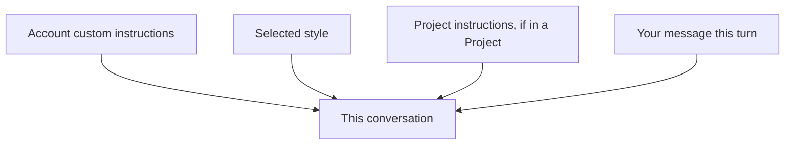

<LevelBadge level="beginner" />

<Callout type="objectives" items={[
  "カスタム指示とスタイルを見分ける — そしてどちらに手を伸ばすべきかを知る",
  "残しておく価値のある定常的な指示を、最初は3行で書く",
  "4つの指示レイヤーが矛盾したときの優先順位を理解する",
  "定常的な指示を「ない方がまし」にしてしまう2つの間違いを避ける",
]} />

<VerifyNote lastVerified="2026-08-02" source="https://www.anthropic.com">
Claudeアプリにおけるカスタム指示とスタイルの正確な名称や場所は変わります。アプリやヘルプセンターで確認してください。
</VerifyNote>

チャットのたびに「簡潔に」「私は看護師なので、それに合わせて説明して」と繰り返すのにうんざりしていませんか？ **カスタム指示**と**スタイル**を使えば、一度デフォルトを設定するだけで、それをどこでも適用できます。

## カスタム指示 ＝ あなた専用のシステムプロンプト

定常的な事実や好み（あなたが誰で、何をしていて、どんな回答を好むか）を設定すると、Claudeは会話をまたいでそれらを適用します。これは[システムプロンプト](/docs/foundations/roles)のコンシューマーアプリ版です（開発者向けの[CLAUDE.md](/docs/claude-code/claude-md)とは兄弟関係にあたります）。

含めると良いもの:
- **あなたに関する文脈**（「小さなパン屋を経営している」「Pythonでコードを書く」）。
- **出力の好み**（「デフォルトで短い箇条書きで答える」「常に推論を示す」）。
- **絶対的なルール**（「絵文字は使わない」「メートル法で」）。

<Steps items={[
  {title: "何度も打ち直している自分についての1文を書く", body: "役割、専門領域、そして正解を変えうるもの — 「私は英国の地域看護師です」や「私はPython 3.12のサービスを書いています」など。"},
  {title: "デフォルトの出力のかたちを加える", body: "1行で: 短い箇条書き、前置きなし、メートル法。これが毎ターン必ず効いてくる部分です。"},
  {title: "絶対的なルールは最大2つまで", body: "「絵文字は使わない」のように、毎回必ず守らせたいルールだけ。長いルールブックは、短いものよりClaudeが守りにくくなります。"},
  {title: "そこで止めて1週間使う", body: "同じ修正を2回打ち込んでいる自分に気づいたときだけルールを追加しましょう。自分が覚えていられない指示は、デバッグもできない指示です。"},
]} />

<PromptCard title="カスタム指示のスターターセット">{`I'm a district nurse in the UK. I read fast and act on summaries.

Default to short bullet answers with no preamble. Metric units. Flag anything
that is clinical guidance I should confirm against current NHS sources.

Never use emoji.`}</PromptCard>

## スタイル ＝ 提示のプリセット

**スタイル**はトーンや書式（簡潔、フォーマル、説明的など）を変えるもので、会話ごとに切り替えられます。定常的な指示を書き換えることなく、*このチャットだけ別の声色にしたい*ときにスタイルを使いましょう。

## それらの重なり方

```mermaid
flowchart TD
  A[Account custom instructions] --> C[This conversation]
  B[Selected style] --> C
  D[Project instructions, if in a Project] --> C
  E[Your message this turn] --> C
```

矛盾があるときは、より具体的な／後から与えられた文脈が優先される傾向があります。そのため、[プロジェクト](/docs/claude-app/projects)の指示や、メッセージ内での明示的な依頼は、グローバルなデフォルトを上書きできます。意外な結果を避けるため、一貫性を保ちましょう。

## ヒント

- **指示は短く、真実に保つ。** CLAUDE.mdと同じく、肥大化や古くなったルールは害になります。
- カスタム指示に**機密情報を入れない**でください。
- ニーズの変化に応じて、ときどき**見直しましょう**。

<Flashcards title="4つのレイヤー、4つの役割" cards={[
  {front: "カスタム指示", back: "アカウント全体に適用される定常的な事実と好み。すべての会話に適用されます。システムプロンプトのコンシューマーアプリ版。"},
  {front: "スタイル", back: "提示のプリセット — トーンと書式 — で、会話ごとに切り替え可能。このチャットだけ別の声色にしたいときに使います。"},
  {front: "プロジェクトの指示", back: "1つのプロジェクトのワークスペースに限定された指示で、そのファイル群と並んで置かれます。アカウントのデフォルトより具体的なので、優先される傾向があります。"},
  {front: "CLAUDE.md", back: "開発者向けの兄弟: Claude Codeが読む、定常的なプロジェクト指示のファイル。規律は同じ — 短く、真実に、手入れを続ける。"},
  {front: "重なりのルール", back: "より具体的な、または後から与えられた文脈が矛盾を制する傾向があります。どれが適用されたのか推測せずに済むよう、レイヤー間の一貫性を保ちましょう。"},
]} />

<Quiz title="理解度チェック" questions={[
  {q: "デフォルトには手を触れず、1つの会話だけフォーマルなトーンにしたい。何を使いますか？", options: ["カスタム指示", "スタイル", "プロジェクトの指示", "CLAUDE.md"], answer: 1, explain: "スタイルはトーンと書式を変えるもので、会話ごとに切り替えられます。まさに1つのチャットだけ別の声色にしたいケースです。"},
  {q: "アカウントの指示には「常に箇条書きで」とあるのに、あるプロジェクトの指示は散文を求めています。そのプロジェクト内では何が起こる傾向がありますか？", options: ["グローバルなのでアカウントの指示が優先される", "より具体的なのでプロジェクトの指示が優先される傾向がある", "Claudeが拒否して、どちらかを選ぶよう求める", "両方とも無視される"], answer: 1, explain: "より具体的な、または後から与えられた文脈が優先される傾向があるため、プロジェクトの指示はグローバルなデフォルトを上書きできます。だからこそレイヤーの一貫性が重要になります。"},
  {q: "次のうち、カスタム指示に入れるべきでないものはどれですか？", options: ["あなたの役割と専門領域", "デフォルトの出力のかたち", "よく使い回すAPIキー", "「メートル法で」のような絶対的なルール"], answer: 2, explain: "カスタム指示に機密情報を入れないでください — それはすべての会話に付いて回ります。"},
]} />

<Callout type="takeaways" items={[
  "カスタム指示は定常的なデフォルト、スタイルはチャットごとの声色。より狭い方に手を伸ばす。",
  "3行 — あなたが誰か、デフォルトの出力のかたち、絶対的なルール1〜2個 — が長いルールブックに勝る。",
  "各会話には4つのレイヤーが流れ込む: アカウントの指示、スタイル、プロジェクトの指示、このターンのメッセージ。",
  "より具体的な、または後から与えられた文脈が矛盾を制する傾向があるので、レイヤーの一貫性を保つ。",
  "定常的な指示に機密情報を絶対に入れない。ニーズの変化に応じて古いルールは刈り取る。",
]} />

## 次に読むもの

- [システム、ユーザー、アシスタントのロール](/docs/foundations/roles)
- [プロジェクト: 永続的なワークスペース](/docs/claude-app/projects)
- [CLAUDE.mdとメモリファイル](/docs/claude-code/claude-md)
