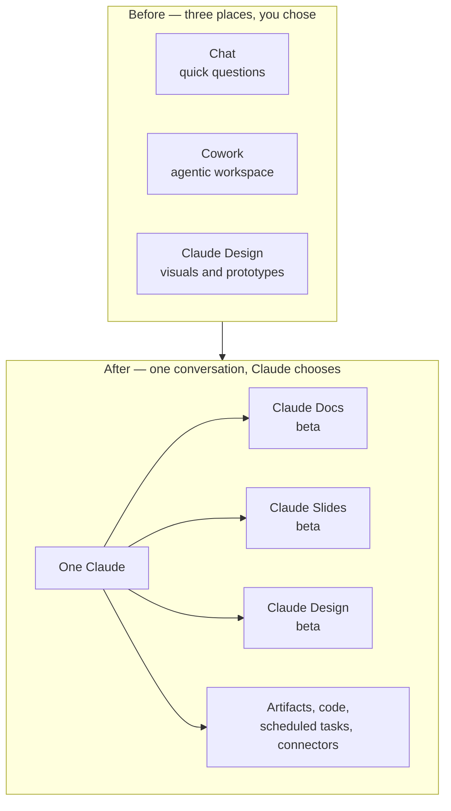

<LevelBadge level="beginner" />

<VerifyNote lastVerified="2026-09-25" source="https://claude.com/blog/cowork-is-now-claude">
発表は **2026年9月16日**。統合された体験は web、デスクトップ、モバイルで
**Pro と Max から段階的に**展開され、続いて Team と Free へ。Enterprise 組織には
**最低30日前の通知**があります。Claude Docs、Claude Slides、Claude Design は
**有料プランでベータ**です。展開が段階的なため、同じプランの2つのアカウントが同じ日に
別のものを見ることがあります — ここに書かれていることに依拠する前に、
[ヘルプセンターの記事](https://support.claude.com/en/articles/16761823-claude-cowork-and-chat-are-one-claude)
で現在の状況を確認してください。
</VerifyNote>

**2026年9月16日**、Anthropic は3つのプロダクトを1つに畳み込みました。チャット、
**Cowork**(エージェント型ワークスペース)、**Claude Design** は、選ばなければならない
別々の場所ではなくなりました。今や会話ボックスは1つで、タスクに何が必要かは Claude が
決めます。

公式の言い回しは短いものです:*「必要なことを Claude に頼めば、どのツールを使うかは
Claude が決められます」*。実務上の帰結はもっと長く、それがこのページの主題です —
この種の統合は設定を動かし、習慣を引退させ、そして限界がぶつかるまで見えない2つの
新しいドキュメントツールを出荷するからです。

<Callout type="objectives" items={[
  "2026年9月16日に実際に何が統合されたのか — そして「選ぶモードがない」ことがタスクの始め方をどう変えるのかを理解する",
  "移動したすべての設定を見つける:グローバル指示、ウェブ検索、リサーチ、ファイル保存先",
  "Claude Docs、Claude Slides、Claude Design、素のアーティファクト、ダウンロードした .docx/.pptx を正しく使い分ける",
  "Claude Docs を設計どおりに使う:タブ、インラインコメント、@Claude による編集、リアルタイム共同編集",
  "刺さってくる8つの制限を知る — バージョン履歴なし、コメント専用ロールなし、更新されないチャート、そして Docs がそもそも使えないコンプライアンス構成",
  "すべてが1つの会話で動くようになった今、エージェント的作業が利用上限に与えるコストを予測する"
]} />

## 統合されたもの、1枚の絵で

持っていたものが捨てられることはありません。Anthropic いわく:*「既存の Cowork の
タスク、プロジェクト、コネクター、スキル、アーティファクト、ファイルは引き継がれ、
Cowork のタスクは以前と同じように開くので、そのまま続けられます」*。

変わるのは**入口**です。以前は、作業を説明する前にその形を決めていました —
質問ならチャット、プロジェクトなら Cowork。今は作業を説明すれば Claude が仕掛けを
選び、同じコンテキスト、スキル、コネクターがどの会話からでも使えます。

## すべてがどこへ移ったか

ここが「私のボタンはどこへ行った」という混乱を最も生む部分であり、そしてサードパーティの
記事がどれも扱っていない部分です。4つのものが移動しました:

| これまで使っていたもの | 今どこにあるか |
| --- | --- |
| グローバル指示 | **設定 → 一般** |
| ウェブ検索トグル | **消滅 — 自動になりました。** いつ検索するかは Claude が決めます |
| リサーチ | **`/deep-research`** と入力するか、**`+`** ボタンを使う |
| 自分のファイル | **設定 → ストレージフォルダ** |

<Callout type="warning" items={[
  "ウェブ検索トグルは隠されたのではなく、削除されました。プライベートな用途やオフライン推論のタスクのために検索を強制的にオフにすることに依存していたワークフローがあるなら、そのレバーはもうUIに存在しません — 代わりにプロンプトで言ってください(「この会話の中だけから答えてください。ウェブを検索しないでください」)。"
]} />

## 3つのテンプレート:実際に欲しいのはどれか

統合により **Claude Docs** と **Claude Slides** が新しいツールとして出荷され、
**Claude Design** が会話の中へ移りました。3つとも*テンプレート* — 別のアプリでは
なく、アーティファクトの出発点となる形です。

<Steps items={[
  {title: "Claude Docs — 生きているドキュメント", body: "Claude アカウントに保存されるリッチテキストのドキュメント。見出し、表、その他の書式が使え、タブを複数持てます(ノートのセクションのように)。あなたと Claude と同僚が、同じドキュメントに同時に書き込みます。Word(.docx)、PDF、Markdown(.md)、Google Docs にエクスポートできます。ドキュメントそのものが成果物で、これからも変わり続けるときに手を伸ばしてください。"},
  {title: "Claude Slides — プレゼンテーション", body: "あなたのメモ、レポート、あるいは会話中ですでに行った作業から組み立てられるデッキ。どのスライドも直接編集でき、Claude を離れずにプレゼンでき、PowerPoint と PDF にエクスポートできます。すでに作った素材からデッキが必要なときに手を伸ばしてください。"},
  {title: "Claude Design — ビジュアルとプロトタイプ", body: "ビジュアル、モックアップ、プロトタイプ、1ページ資料、ランディングページを、あなたのデザインシステムに沿って作ります。.zip、PDF、PowerPoint、スタンドアロンのHTMLとしてエクスポートできます。出力がビジュアルであるか、ブランドに合わせる必要があるときに手を伸ばしてください。"},
  {title: "素のアーティファクト — コード、アプリ、チャート", body: "これまでどおり変わらず存在し、Free を含むすべてのプランで使えます。実行可能なミニアプリ、チャート、図、スクリプト。読まれるのではなく実行される必要があるときに手を伸ばしてください。Artifacts を参照。"},
  {title: "生成ファイル — .docx / .pptx / .xlsx / .pdf", body: "Claude が作ってあなたがダウンロードする一回限りのファイル。ライブ編集の面も、共有も、コメントもありません。渡して以後 Claude の中では触らないファイルが必要なときに手を伸ばしてください。Generating Real Files を参照。"}
]} />

最も重要な区別は最後の2つです:**Claude Doc は URL と共同編集者とコメントを持つ
生きているドキュメントであり、生成された `.docx` はダウンロードです。** 統合前に
「Word文書」と頼んでファイルを得ていたなら、今同じように頼むと Doc が返ってきて、
それをエクスポートすることになるかもしれません — たいていそれが欲しかったものですが、
共有ルールの異なる別のオブジェクトです。

### 作る方法は3つ

<Steps items={[
  {title: "どの会話でも頼む", body: "平易な言葉で十分です — 「いま詰めた計画を、チームに共有できるプロダクト仕様にして」。Claude は始める前にいくつか質問し、それから画面上でドキュメントを起草します。"},
  {title: "テンプレートを明示的に選ぶ", body: "メッセージボックスで Output を選択し、テンプレートを選びます。Claude があなたの望む形と違う形を選び続けるときに使ってください。"},
  {title: "Artifacts タブから始める", body: "ギャラリーからテンプレートを選び、それから Claude にブリーフします。会話ではなくドキュメントこそが目的で来たときに便利です。"}
]} />

<PromptCard title="最初のドラフトが的に近づくように Claude Doc をブリーフする">{`Create a Claude Doc: a one-page product spec for the export feature
we just designed.

Structure it in four tabs:
  1. Summary — problem, proposed solution, who it's for
  2. Requirements — numbered, testable, each with a rationale
  3. Open questions — things I still need to decide, with your
     recommendation and the tradeoff for each
  4. Rejected alternatives — what we considered and why not

Rules:
- Pull the decisions from this conversation. Do not invent
  requirements I did not state.
- Where I was vague, leave a comment asking me the question
  instead of guessing.
- Add a table comparing the three export formats we discussed.

Ask me anything you need before you start drafting.`}</PromptCard>

## Claude Docs を深掘りする

### 編集、コメント、そして @Claude

3つの編集経路が共存していて、それがこのツールの要点です:

- **自分で書く。** ドキュメントをクリックして入力します。変更は自動保存されます。
- **頼む。** 会話形式で変更を依頼すると、Claude が編集し、何をなぜやったかを説明します。
- **コメントする。** テキストを選択して共同編集者向けのコメントを残す — そして
  **コメント内で `@Claude` をメンションすると、Claude がその場で編集してくれます。**
  Claude はスレッドで返信し、変更を加え、それを説明します。

Claude は**起草中に自分でコメントを残す**こともあり、選択の理由を説明したり、あなたに
質問したりします。プロンプトをこの挙動に合わせて設計する価値があります:*推測せずに
コメントで質問して*と Claude に伝えれば(上のプロンプトカードのように)、静かな
ハルシネーションのリスクが、あなたが答えられる見える質問に変換されます。

Claude に**チャート、図、グラフ、タイムラインをドキュメントに追加**するよう頼むことも
できます。

### コラボレーションと共有

編集権限を持つ人は、あなたや Claude と同時に同じドキュメントで作業し、全員の編集が
リアルタイムに現れます。

| | 閲覧者 | 編集者 |
| --- | --- | --- |
| 読む | ✅ | ✅ |
| 編集 | ❌ | ✅ |
| コメント | ❌ | ✅ |
| エクスポート | ❌ | ✅ |

共有ルールはプランによって大きく異なります:

- **Pro / Max** — リンクを持つ誰とでも共有できます。
- **Team / Enterprise** — 特定の人やグループを招待するか、組織全員と共有します。
  **ドキュメントを組織外と共有することはできません** — リンクでもメール招待でも。
- **いずれの場合も** — 共有されたドキュメントを開くには Claude アカウントが必要で、
  **名前の変更と削除ができるのはオーナーだけです。**

### どこで使えるか

Docs は **web、デスクトップ、Claude Code、モバイル**で動作します — ただし
**iOS と Android のアプリは閲覧専用**です:スマートフォンからの編集もテンプレート選択も
できません。レビューのループがモバイル中心なら、それを前提に計画してください。

## 刺さってくる制限

どれも文書化されており、どれもが誰かを最初の1週間で驚かせます。

<Steps items={[
  {title: "まだバージョン履歴がない", body: "ドキュメントの以前の状態を見たり復元したりする方法はありません。編集権限を持つ人は誰でも何でも上書きでき、唯一の復旧手段は先に取っておいたエクスポートです。重要なドキュメントは、履歴機能が出るまでマイルストーンごとに Markdown へエクスポートしてください。"},
  {title: "コメント専用のアクセスレベルがない", body: "ロールは閲覧者と編集者だけで、その中間はありません。コメントはするが編集はしないレビュアーという権限は存在しません — 編集権限を与えて信頼に頼るか、閲覧権限を与えてフィードバックは別の場所で集めるかです。"},
  {title: "チャートと図は自動更新されない", body: "Claude が追加したチャートはスナップショットです。ドキュメント内の元の数字を変えても、Claude に再生成を頼むまでチャートは古い数字を表示し続けます。すべてのビジュアルは、再度頼むまで古いものとして扱ってください。"},
  {title: "Team と Enterprise は外部共有できない", body: "組織外へのリンク共有もメール招待もありません。クライアントにドキュメントを送る必要があるなら、エクスポート(Word、PDF、Markdown、Google Docs)して、そのエクスポートを送ってください。"},
  {title: "モバイルは閲覧専用", body: "iOS と Android はドキュメントを読めます。編集もテンプレート選択もできません。"},
  {title: "CMEK、ZDR、HIPAA では利用不可", body: "Claude Docs は、顧客管理暗号鍵、ゼロデータ保持、HIPAA で構成された組織では利用できません。規制下のチームにとってこれが最も重要な事実であり、これは展開の遅れではなく — 除外です。"},
  {title: "まだ Compliance API に含まれない", body: "ドキュメント内のアクティビティは Compliance API に記録されません。監査体制がそのエクスポートに依存しているなら、ドキュメントのアクティビティは現在ブラインドスポットです。"},
  {title: "Enterprise は初期状態でオフ", body: "Enterprise プランでは、オーナーが組織設定で1つずつオンにするまでテンプレートはオフです。Pro、Max、Team ではデフォルトでオンです。"}
]} />

### 統合された体験でまだサポートされていないもの

統一された体験は、**GitHub連携(「Add from GitHub」)**、**会話のブランチ**、
**古い Cowork タスクの横断検索**、**Dispatch**(既存ユーザーのみ)、
**ファイル・コード作成のためのシークレットチャット**をまだサポートしていません。
ワークフローがブランチや Cowork 履歴の検索に依存しているなら、その機能は一時的に
失われています — 移動したのではありません。

## これにかかるコスト

別料金はありません。関係するのは*利用上限*についての一文です:*「Claude で行うすべてが
プランの利用上限にカウントされます。ウェブを検索したり、コードを実行したり、ファイルを
作成したりする長いエージェント的タスクは、一般に簡単な質問より多く消費します」*。
Claude Docs も同じようにカウントされます。

統合はこれを言葉以上に鋭くします。以前は Cowork を開くことが意図的な行為でした —
高価な作業を始めようとしていると自覚していたのです。今は同じボックスに気軽に書いた依頼が、
検索し、コードを実行し、ファイルを書く長いエージェント実行を引き起こしえます。
**コストのシグナルは、入口からプロンプトへ移りました。** 上限が気になるプランにいるなら、
何が欲しいのかを明示してください:

<PromptCard title="答えだけが欲しいとき、依頼を安く保つ">{`Answer from this conversation only. Do not search the web, do not
run code, and do not create any files or artifacts. Two paragraphs.`}</PromptCard>

そしてその逆、フル装備が欲しいとき:

<PromptCard title="意図的に高価なほうを頼む">{`Take this as a full task, not a chat answer.

Research the three vendors below, check their current pricing pages,
build a comparison spreadsheet, and turn the recommendation into a
Claude Doc I can share with the team. Cite every figure with a link
and the date you read it.

Vendors: [A], [B], [C]`}</PromptCard>

## 自分の習慣を移行する

<Steps items={[
  {title: "グローバル指示を引っ越す", body: "設定 → 一般 に移りました。一度開いて読み直してください:チャット専用の Claude 向けに書かれた指示(「ウェブは閲覧できません」「長い作業の前に確認して」)は、統合後の挙動と積極的に衝突しかねません。"},
  {title: "ウェブ検索トグルに手を伸ばすのをやめる", body: "なくなりました。検索の意図はプロンプトに入れてください — 「最新のソースを確認して」か「検索しないで」のどちらかです。"},
  {title: "リサーチを学び直す", body: "/deep-research と入力するか + ボタンを使います。モードではなく、コマンドになりました。"},
  {title: "Cowork が別物である前提のものを棚卸しする", body: "スケジュールされたタスク、コネクター、スキルは引き継がれましたが、「これは Cowork のタスクです」ともっと頑張らせる合図として書いていたプロンプトは、もう何の合図にもなりません。その言い回しは、上のプロンプトカードのように明示的なスコープに置き換えてください。"},
  {title: "Docs のエクスポート頻度を決める", body: "バージョン履歴が出るまで、マイルストーンのリズムを決めてください — 失ったら困る状態にドキュメントが達したら Markdown にエクスポートする、というように。"}
]} />

## 知っておく価値のある用語

<Flashcards cards={[
  {front: "One Claude", back: "2026年9月16日に行われた、チャット、Cowork、Claude Design を1つの会話体験へ統合したもの。選ぶモードはありません。タスクにどのツールが必要かは Claude が決めます。"},
  {front: "テンプレート(Docs / Slides / Design)", back: "別のアプリではなく、アーティファクトの出発点となる形。有料プランでベータ。Pro、Max、Team ではデフォルトでオン。Enterprise ではオーナーが有効化するまでオフ。"},
  {front: "Claude Doc", back: "Claude アカウントに保存される、リッチテキストでマルチタブの生きているドキュメント。あなた、Claude、共同編集者がリアルタイムで共同編集します。Word、PDF、Markdown、Google Docs にエクスポートできます。"},
  {front: "タブ(Doc 内の)", back: "ノートのセクションのような、ドキュメントの一区画。1つのドキュメントが複数持てます — 仕様を要約、要件、未解決事項に分けるのに便利です。"},
  {front: "@Claude コメント", back: "ドキュメントのコメント内で Claude をメンションし、その場で編集させ、スレッドで返信させ、何を変えたかを説明させること。"},
  {front: "閲覧者 vs 編集者", back: "存在するアクセスレベルはこの2つだけ。閲覧者は読みます。編集者は読み、編集し、コメントし、エクスポートします。コメント専用のロールはありません。"},
  {front: "Output ボタン", back: "メッセージボックスにある、テンプレートを明示的に選ぶためのコントロール。形を Claude に選ばせたくないときに使います。"},
  {front: "Doc vs 生成ファイル", back: "Doc は URL、共同編集者、コメントを持つ生きているドキュメント。生成された .docx/.pptx/.xlsx はそのどれも持たない一回限りのダウンロードです。"}
]} />

## クイズ

<Quiz questions={[
  {q: "あなたの組織はゼロデータ保持(ZDR)付きの Enterprise で Claude を運用しています。チームは Claude Docs で仕様の起草を始めたいと考えています。何が起きますか?", options: ["オーナーが組織設定でテンプレートを有効化すれば使える", "使えるが、ドキュメントは30日後に削除される", "Claude Docs は利用不可 — ZDR、CMEK、HIPAA の構成は除外されている", "閲覧専用モードで使える"], answer: 2, explain: "Claude Docs は CMEK、ZDR、HIPAA 構成を使う組織では利用できません。これは展開の遅れではなく除外なので、管理者のトグルで解決することはありません。これらの構成下のチームは別の起草環境が必要です。"},
  {q: "Q3の数字の表から Claude Doc にチャートを追加しました。その後、同僚が表の2つの数字を修正します。チャートは何を表示しますか?", options: ["修正後の数字、ライブで更新される", "ドキュメントを再読み込みしたあとに修正後の数字", "古い数字。Claude にチャートの再生成を頼むまで", "不一致を示すエラー状態"], answer: 2, explain: "チャートと図は自動更新されません — それぞれが作成時点のスナップショットです。ドキュメント内のすべてのビジュアルは、現在のデータから作り直すよう明示的に Claude に頼むまで古いものとして扱ってください。"},
  {q: "あなたは Team プランで、完成した仕様を社外のクライアントに送る必要があります。サポートされている経路は?", options: ["ドキュメントのリンクを共有する — リンク共有はすべての有料プランで使える", "ドキュメントの共有ダイアログからクライアントをメールで招待する", "ドキュメントを Word、PDF、Markdown、Google Docs にエクスポートして、そのエクスポートを送る", "先にドキュメントを Pro アカウントへ移す"], answer: 2, explain: "Team と Enterprise プランでは、ドキュメントをリンクでもメール招待でも組織外と共有できません。リンクを持つ誰とでも共有できるのは Pro/Max の挙動です。社外の受け手に対してサポートされている経路はエクスポートです。"},
  {q: "統合以降、ウェブ検索について正しいのはどれですか?", options: ["トグルは 設定 → 一般 に移動した", "トグルは + ボタンの裏に移動した", "トグルは削除された — 検索は自動なので、プロンプトで舵を取る", "検索はすべてのプランでデフォルトオフになった"], answer: 2, explain: "ウェブ検索のトグルは移動したのではなく削除されました。いつ検索するかは Claude が決めます。グローバル指示は 設定 → 一般 へ、リサーチは /deep-research または + ボタンへ移りましたが、検索は今やプロンプトで舵を取ります(「最新のソースを確認して」または「検索しないで」)。"}
]} />

<Callout type="takeaways" items={[
  "1つの会話、選ぶモードなし:コストのシグナルは入口(Cowork を開くこと)からプロンプトへ移りました。安い答えが欲しいときと、フルのエージェント実行が欲しいときを明示してください。",
  "4つのものが移動しました:グローバル指示 → 設定 → 一般。ウェブ検索 → 自動、プロンプトで舵を取る。リサーチ → /deep-research または +。ファイル → 設定 → ストレージフォルダ。",
  "Claude Doc は共同編集者とコメントを持つ生きているドキュメント。生成された .docx はダウンロードです。意識して選んでください — 共有ルールがまったく異なります。",
  "Claude のコメントを前提にプロンプトを設計してください:推測せずコメントで質問するよう指示すれば、創作が見える質問に変わります。",
  "今日すぐ回避策が要る制限が2つあります:バージョン履歴がないこと(マイルストーンごとに Markdown へエクスポート)と、決して更新されないチャート(データ変更のたびに再生成)。",
  "規制下のチームへ:Claude Docs は CMEK、ZDR、HIPAA では利用できず、ドキュメントのアクティビティはまだ Compliance API に含まれていません。"
]} />

## 出典と参考文献

- Anthropic — [Claude Cowork and chat are now one Claude](https://claude.com/blog/cowork-is-now-claude)(発表、2026年9月16日)
- Anthropic ヘルプセンター — [Claude Cowork and chat are one Claude](https://support.claude.com/en/articles/16761823-claude-cowork-and-chat-are-one-claude)(展開、移動先、引き継がれたもの、現在の欠落)
- Anthropic ヘルプセンター — [Get started with Claude Docs](https://support.claude.com/en/articles/16923645-get-started-with-claude-docs)(作成、タブ、コメント、共有マトリクス、エクスポート、制限)
- Anthropic ヘルプセンター — [What are artifacts and how do I use them?](https://support.claude.com/en/articles/17153992-what-are-artifacts-and-how-do-i-use-them)(3つのテンプレートとそのプラン提供状況)
- AILmanac の関連ページ:[Artifacts](/docs/claude-app/artifacts) · [Cowork のスケジュールタスク](/docs/claude-app/cowork-scheduled-tasks) · [実ファイルの生成](/docs/claude-app/generating-files) · [プロジェクト](/docs/claude-app/projects) · [プラン、上限、請求](/docs/claude-app/plans-and-billing)

## 次へ

- [Artifacts:ライブで実行可能な出力](/docs/claude-app/artifacts) — 3つのテンプレートすべてが描画されるコンテナ
- [Cowork のスケジュールタスク](/docs/claude-app/cowork-scheduled-tasks) — そのまま引き継がれた繰り返しタスクの仕組み
- [実ファイル(docx/pptx/xlsx/pdf)の生成](/docs/claude-app/generating-files) — 生きているドキュメントではなくダウンロードが欲しいとき
