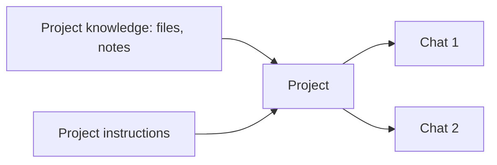

<LevelBadge level="beginner" />

<VerifyNote lastVerified="2026-06-20" source="https://www.anthropic.com">
プロジェクトの機能や制限はプランによって異なり、変更されます。最新の挙動はアプリやヘルプセンターで確認してください。
</VerifyNote>

**プロジェクト**はClaude.aiの専用ワークスペースで、**独自のファイル、知識、指示**をひとまとめにします。チャットのたびに同じドキュメントを再アップロードし、文脈を説明し直す代わりに、一度セットアップすれば、プロジェクト内のすべての会話が最初から情報を踏まえた状態で始まります。

## プロジェクトを使う理由

- **根拠のある回答。** あなたのドキュメント（ハンドブック、仕様書、メモ）を追加すると、Claudeは*それらから*回答します。組み込みの、ノーコード版の[RAG](/docs/foundations/rag)です。
- **永続的な文脈。** プロジェクトの指示は、その中のすべてに対する、限定された[システムプロンプト](/docs/foundations/roles)のように機能します。
- **整理される。** 1つのトピック／顧客／取り組みに関するすべてのチャットがまとまって存在します。

## セットアップする

1. **プロジェクトを作成し**、明確な目的を与えます。
2. **知識を追加** — 常に知っておくべきファイル／テキスト。
3. **プロジェクト指示を書く** — 役割、慣習、すべきこと／避けるべきこと。
4. **チャットを始める** — すべての会話が知識＋指示を引き継ぎます。

## 優れた使用例

- **顧客／アカウント**のワークスペース（先方のドキュメント＋あなたのメモ）。
- Q&A用の**コードベースや製品**のナレッジベース。
- あなたのスタイルガイドと過去の作品を入れた**ライティングプロジェクト**（下書きがあなたの声色に合うように）。
- シラバスや教材を読み込ませた、コースの**学習**用。

## ヒント

- **知識を厳選する** — 関連性が高く最新のファイルが、すべてを詰め込むより勝ります（ノイズは検索を妨げます）。
- **指示は引き締めて真実に保つ**（[カスタム指示](/docs/claude-app/custom-instructions)と同じルール）。
- 保存に抵抗のある**機密データは追加しない**でください。[プライバシー](/docs/foundations/privacy)を参照してください。

## 次に読むもの

- [カスタム指示とスタイル](/docs/claude-app/custom-instructions)
- [チャットをまたぐメモリ](/docs/claude-app/memory)
- [検索拡張生成（RAG）](/docs/foundations/rag)
