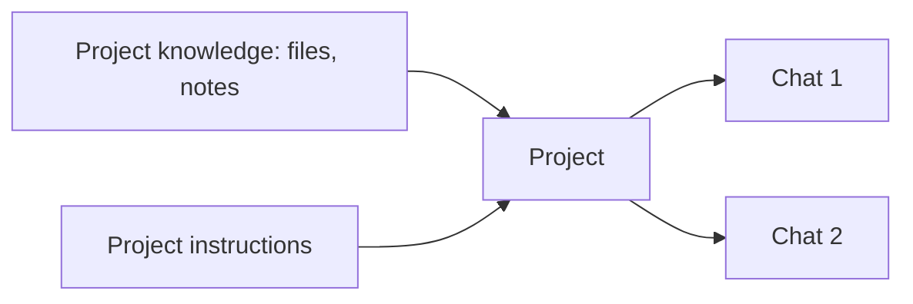

<LevelBadge level="beginner" />

<VerifyNote lastVerified="2026-09-23" source="https://claude.com/blog/projects-redesigned">
Project の機能と上限はプランによって異なり、変更されます。現在の挙動はアプリかヘルプセンターで確認してください。**刷新された Projects**（並列スレッドに委譲するコーディネーター）は 2026 年 9 月 17 日に Claude Code でベータに入り、その後 Claude の他の部分や Team/Enterprise プランにも展開される予定です。このページでは、ほとんどのアカウントが今も使っているナレッジベース型の Project を説明します。
</VerifyNote>

**Project** とは、Claude.ai 内の専用ワークスペースで、**それ自身のファイル、ナレッジ、指示**をひとまとめにしたものです。毎回同じ文書をアップロードし直し、前提を説明し直す代わりに、一度セットアップすれば、その Project 内のあらゆる会話がすでに事情を知った状態で始まります。

<Callout type="objectives" items={[
  "Project が何をひとまとめにするのか、そしてなぜそれが毎回コンテキストを貼り直すより優れているのか",
  "4 ステップのセットアップと、みんなが飛ばしてしまう 1 つのステップ",
  "検索の精度を保つために、プロジェクトナレッジをどう選り分けるか",
  "この Project が、Claude Code のコーディネーター＋スレッド型 Projects とどう違うか"
]} />

## Project を使う理由

- **根拠のある回答。** 自分の文書（ハンドブック、仕様、メモ）を追加すれば、Claude は*そこから*答えます。組み込みでノーコードな [RAG](/docs/foundations/rag) の一種です。
- **持続するコンテキスト。** プロジェクト指示は、その中のすべてに適用されるスコープ付きの[システムプロンプト](/docs/foundations/roles)のように働きます。
- **整理される。** 1 つのトピック／クライアント／取り組みに関するチャットがすべて一緒に置かれます。

## セットアップする

<Steps items={[
  {title: "目的を明確にして Project を作る", body: "1 トピック、1 クライアント、1 取り組みにつき 1 つの Project にしましょう。無関係な 3 つを抱えた Project は、その 3 つすべてについて検索精度が落ちます。"},
  {title: "ナレッジを追加する", body: "Claude が常に知っているべきファイルとテキスト — ハンドブック、仕様、スタイルガイド。これが Claude の回答の材料になります。"},
  {title: "プロジェクト指示を書く", body: "みんなが飛ばすステップです。役割、慣習、やるべきこととやってはいけないこと。これがないと、同僚ではなく検索インデックスを手にしただけになります。"},
  {title: "チャットを始める", body: "Project 内のすべての会話が、ナレッジと指示を自動的に引き継ぎます。"}
]} />

```mermaid
flowchart LR
  K[Project knowledge: files, notes] --> P[Project]
  I[Project instructions] --> P
  P --> C1[Chat 1]
  P --> C2[Chat 2]
```

## 向いている使い方

- **クライアント／アカウント**のワークスペース（先方の資料＋自分のメモ）。
- Q&A のための**コードベースやプロダクト**のナレッジベース。
- 自分のスタイルガイドと過去の作品を入れた**執筆プロジェクト**（下書きが自分の声に合うように）。
- シラバスと教材を読み込ませた、講義の**学習**用。

## プロジェクト指示の出発点

<PromptCard title="プロジェクト指示のひな形">{`You are helping with [project/client name].

Context: [what this project is, who it serves, current stage]

Always:
- Answer from the project knowledge first; say so when you are going beyond it.
- Use [our terminology: list the 3-5 terms that matter].
- Match the tone in [named file in the knowledge base].

Never:
- Invent figures, dates, or quotes. If it is not in the knowledge, say it is not in the knowledge.
- [Project-specific constraint: e.g. reference the deprecated v1 API.]`}</PromptCard>

## ヒント

- **ナレッジを選り分けましょう** — 関連性が高く最新のファイルは、すべてを放り込むより優れています（ノイズは検索精度を損ないます）。
- **指示は簡潔かつ正確に保ちましょう**（[カスタム指示](/docs/claude-app/custom-instructions)と同じ原則です）。
- **状況が変わったら間引きましょう。** 置き換えられた古い仕様がナレッジベースに残っているのは、仕様がまったくない状態より悪いです。Claude には、それが新しい仕様との争いに負けたことを知る手立てがないからです。
- 保存することに抵抗のある**機微なデータは入れないでください** — [プライバシー](/docs/foundations/privacy)を参照してください。

## 「Projects」と呼ばれる 2 つのもの

これらは本当に別のプロダクトであり、ロールアウト期間中は名前が重なっています。

| | この Project（Claude.ai） | [Claude Code Projects](/docs/claude-code/projects-coordinator-threads) |
|---|---|---|
| 何であるか | ナレッジ＋指示を持つワークスペース | 並列スレッドに委譲するコーディネーター |
| 何をするか | *あなたの*チャットを*あなたの*ファイルに根拠づける | 作業の範囲を定め、分割し、実行する |
| コードを実行する？ | いいえ | はい — 各スレッドは専用ブランチ上のクラウドセッション |
| 誰が使えるか | 広く利用可能 | ベータ、ローンチ時は一部の Pro/Max の Claude Code ユーザー |

コーディネーター、スレッド、プルリクエストの話を読んでいるなら、それは Claude Code のほうです。

<Quiz questions={[
  {
    q: "プロジェクト指示は何のように働きますか？",
    options: [
      "最初のチャットでの一度きりのメッセージ",
      "Project 内のすべてのチャットに適用されるスコープ付きのシステムプロンプト",
      "Claude からファイルを隠すフィルター",
      "Claude が自分のために書く要約"
    ],
    answer: 1,
    explain: "プロジェクト指示は Project にスコープされたシステムプロンプトのように振る舞うため、その中のすべての会話が、あなたが言い直さなくても同じ役割と慣習を引き継ぎます。"
  },
  {
    q: "手元にあるファイルを片っ端からプロジェクトナレッジに放り込むと、なぜ害になるのですか？",
    options: [
      "Claude がファイル単位で課金するから",
      "一定のチャット数を過ぎるとファイルが期限切れになるから",
      "無関係で古い資料がノイズとなり、検索精度を下げるから",
      "最初のファイルしか読まれないから"
    ],
    answer: 2,
    explain: "プロジェクトナレッジは検索対象なので、量より関連性が重要です。最悪なのは置き換えられた文書です。取り除くかラベルを付けない限り、Claude には新しいファイルが古いファイルを上書きしていると判断できません。"
  }
]} />

<Callout type="takeaways" items={[
  "Project はナレッジと指示をひとまとめにするので、その中のどのチャットも事情を知った状態で始まる。",
  "指示はみんなが飛ばすステップ — それがないと、同僚ではなく検索を手にしただけになる。",
  "選り分けて間引く:置き換えられたファイルはノイズを足すだけでなく、積極的に誤誘導する。",
  "Claude Code のコーディネーター＋スレッド型 Projects は、名前を共有する別のプロダクトである。"
]} />

## 次に読むもの

- [カスタム指示とスタイル](/docs/claude-app/custom-instructions)
- [チャットをまたぐメモリ](/docs/claude-app/memory)
- [検索拡張生成（RAG）](/docs/foundations/rag)
