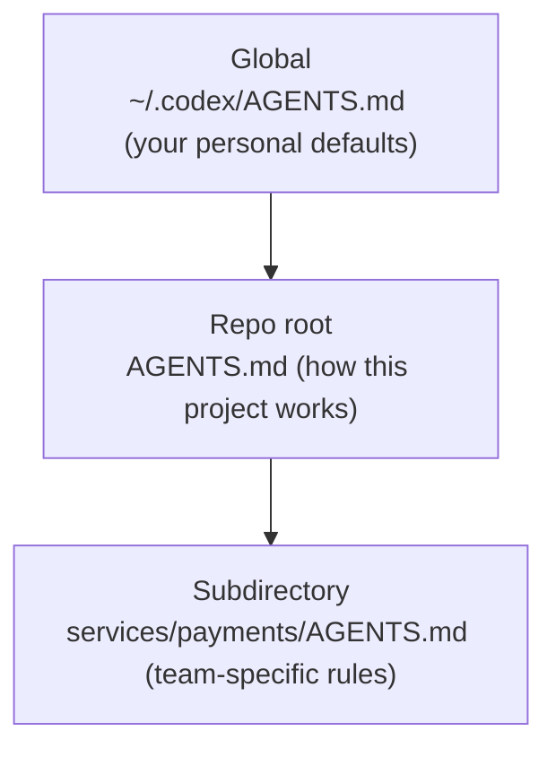

<LevelBadge level="intermediate" />

<VerifyNote lastVerified="2026-06-27" source="https://agents.md/">
AGENTS.md の採用ツール一覧と Claude Code のインポート/シンボリックリンクの挙動は急速に変化しています — 詳細は公式の AGENTS.md サイトと Claude Code のメモリドキュメントで確認してください。
</VerifyNote>

あなたはすでに [CLAUDE.md](/docs/claude-code/claude-md) を知っています — Claude Code のプロジェクト指示書です。しかし、あなたのリポジトリはおそらく *複数の* エージェントに触れられています。チームメイトが Codex を動かし、CI がコーディングボットを使い、誰かが Cursor でリポジトリを開く。`AGENTS.md` は、それらのツールが読むことに合意したオープン標準であり、ツールごとに別々のファイルを保守する代わりに、プロジェクトの指示を **一度だけ** 書けばよくなります。

<Callout type="objectives" items={["AGENTS.md とは何か、そして誰が管理しているのか", "なぜ Claude Code は AGENTS.md ではなく CLAUDE.md を読むのか", "ツール間で単一の信頼できる情報源を保つ3つの確実な方法", "ネストされたファイルとグローバルな AGENTS.md ファイルがどうマージされるか", "ファイルに書くべきこと — そして書かないでおくべきこと"]} />

## AGENTS.md とは何か

`AGENTS.md` はリポジトリのルートにあるプレーンな Markdown ファイルです — **人間ではなくエージェント向けに書かれた README** だと考えてください。コーディングエージェントに、プロジェクトをどうビルドし、テストし、貢献するかを伝えます。フォーマットに必須フィールドはありません。エージェントは単に散文を読むだけです。

これは **Linux Foundation 傘下の Agentic AI Foundation (AAIF)** が管理するオープン標準であり、2026年中頃の時点で6万以上のオープンソースプロジェクトで使われ、30以上のツールに読まれています — その中には OpenAI Codex、Google の Jules と Gemini CLI、Cursor、Windsurf、Devin、Zed、Warp、Aider、goose、Amp、そして GitHub Copilot のコーディングエージェントが含まれます。

<Callout type="info" items={["AGENTS.md はランタイムではなく慣習です。各ツールがどのように発見し、マージし、ファイルを注入するかを決めます。", "スキーマは強制されません — 厳格な構造よりも明快な散文が勝ります。", "これは README を補完するものであり、置き換えるものではありません。"]} />

## Claude Code の落とし穴

ここで人がつまずく部分です。**Claude Code は `AGENTS.md` ではなく `CLAUDE.md` を読みます。** リポジトリに `AGENTS.md` しかなければ、Claude Code はデフォルトでそれを無視します。これはバグではありません — この標準より前から存在しているからです — しかしそれは、マルチツールのリポジトリには意図的な同期戦略が必要であることを意味します。さもなければ、あなたの指示は静かに乖離していきます。

<Callout type="warning" items={["Claude Code が AGENTS.md にフォールバックすると思い込まないでください — 自動的には読みません。", "手作業で保守する2つのファイル(CLAUDE.md と AGENTS.md)は乖離します。単一の信頼できる情報源を選びましょう。", "フォールバックの主張に頼る前に、公式のメモリドキュメントで現在の挙動を確認してください。"]} />

## 単一の信頼できる情報源を保つ

3つのパターンで、内容を重複させることなく CLAUDE.md と AGENTS.md を同期させ続けられます。チームのプラットフォームに応じて選んでください。

<Steps items={[{title: "シンボリックリンク(最もシンプル)", body: "CLAUDE.md を AGENTS.md へのシンボリックリンクにします。Claude Code はシンボリックリンクをたどり、対象をバイト単位でそのまま読みます — 実体ファイルは1つ、マージロジックはゼロ。注意点: Windows ではシンボリックリンクの作成に開発者モードまたは管理者権限が必要なので、クロスプラットフォームのチームはインポート方式を好むかもしれません。"}, {title: "@import(クロスプラットフォーム)", body: "唯一の役目が @AGENTS.md インポートで標準ファイルを取り込むことだけの、ごく小さな CLAUDE.md を保ちます。Claude Code は起動時にインポートされたファイルをコンテキストに展開するので、AGENTS.md が単一の情報源のままになり、Windows で壊れるシンボリックリンクもありません。"}, {title: "/init(移行)", body: "すでに AGENTS.md(または .cursorrules / .windsurfrules)があるリポジトリで Claude Code を立ち上げますか? /init を実行してください — それらのファイルを読み、関連部分を生成された CLAUDE.md に取り込みます。"}]} />

<PromptCard title="CLAUDE.md を共有標準にシンボリックリンクする(macOS / Linux)">{`ln -s AGENTS.md CLAUDE.md`}</PromptCard>

<PromptCard title="あるいはそれをインポートする1行の CLAUDE.md を保つ">{`@AGENTS.md`}</PromptCard>

<Callout type="tip" items={["チーム全体が macOS/Linux の場合はシンボリックリンクを使いましょう — 最も保守が少なくて済みます。", "Windows の貢献者が混在する場合は @import を使いましょう。", "選んだ方をコミットして、チーム全体が同じ挙動になるようにしましょう。"]} />

## ネストされたファイルとグローバルファイルがどうマージされるか

より高機能なエージェントは AGENTS.md を階層的に扱います — [CLAUDE.md のメモリ階層](/docs/claude-code/claude-md) と同じメンタルモデルです。たとえば Codex は、ホームディレクトリのグローバルファイルから Git ルートを経て現在のフォルダまでたどり、進みながら連結していきます:

作業に近いファイルが勝ちます。なぜなら **最後に** 連結され、先の指示を上書きするからです。したがって `services/payments/AGENTS.md` はリポジトリルートの指示を継承し、そのサービス内だけに適用されるルールを追加します — 専門的な指示は、できるだけ専門的なコードの近くに置きましょう。

<Flashcards title="相互運用を一目で" cards={[{front: "誰が AGENTS.md を読むのか?", back: "30以上のツール — Codex、Cursor、Windsurf、Devin、Zed、Gemini CLI、Copilot のコーディングエージェントなど。デフォルトでは Claude Code は読みません。"}, {front: "誰が CLAUDE.md を読むのか?", back: "Claude Code — そして Claude Code だけです。AGENTS.md は自動的には読みません。"}, {front: "Mac/Linux チームに最適な同期", back: "CLAUDE.md → AGENTS.md のシンボリックリンク。実体ファイルは1つ、乖離なし。"}, {front: "Windows の貢献者がいる場合に最適な同期", back: "@AGENTS.md を含む1行の CLAUDE.md — シンボリックリンク不要。"}, {front: "ネストされたファイルのマージ順序", back: "グローバル → リポジトリルート → サブディレクトリ。最後に連結されるので、作業に近いファイルが上書きします。"}]} />

## ファイルに何を書くか

良い CLAUDE.md と同じ規律です — 標準はいくつかの一般的なセクションを提案しているだけです:

- **プロジェクト概要** — これが何なのかを2文で。
- **ビルド & テストコマンド** — 実行、テスト、リントの方法。
- **コードスタイル** — エージェントが推測できない規約。
- **テストの指示** — 「完了」が何を意味するか。
- **セキュリティ上の考慮事項** — 決して触れたりコミットしたりしないもの。
- **コミット / PR ガイドライン** — メッセージ形式、ブランチのルール。

<Callout type="warning" items={["エージェントはファイルを文字どおりに従います — 古くなった、あるいは願望的な指示は、CLAUDE.md とまったく同じく、積極的に害になります。", "短く真実に保ちましょう。プロジェクトが今日どう動くかを記述しましょう。", "決してシークレットをコミットしないこと。大きなドキュメントは貼り付けず参照しましょう。"]} />

## 確認しよう

<Quiz title="確認しよう" questions={[{q: "Claude Code は AGENTS.md を自動的に読みますか?", options: ["はい、AGENTS.md にフォールバックします", "いいえ — CLAUDE.md だけを読みます", "Windows でのみ"], answer: 1, explain: "Claude Code は CLAUDE.md を読み、単独の AGENTS.md はデフォルトで無視します。そのためマルチツールのリポジトリには意図的な同期戦略が必要です。"}, {q: "あなたのチームは完全に macOS と Linux です。Claude Code と Codex の間で1つの指示ファイルを共有する、最も保守の少ない方法は?", options: ["CLAUDE.md と AGENTS.md を手作業で保守する", "CLAUDE.md を AGENTS.md にシンボリックリンクする", "AGENTS.md をコメントに貼り付ける"], answer: 1, explain: "CLAUDE.md → AGENTS.md のシンボリックリンクで実体ファイルが1つになります。Claude Code はシンボリックリンクをたどり、対象をバイト単位でそのまま読みます。"}, {q: "エージェントがグローバル、リポジトリルート、サブディレクトリの AGENTS.md をマージするとき、衝突ではどれが勝ちますか?", options: ["グローバルファイル", "リポジトリルートのファイル", "作業に最も近いサブディレクトリのファイル"], answer: 2, explain: "ファイルはグローバル → ルート → サブディレクトリの順に連結されるので、作業に最も近いファイルが最後に現れ、先の指示を上書きします。"}]} />

<Callout type="takeaways" items={["AGENTS.md は、30以上のコーディングエージェントが読む、Linux Foundation が管理するオープン標準です — エージェント向けの README です。", "Claude Code は AGENTS.md ではなく CLAUDE.md を読むので、マルチツールのリポジトリはそれらを同期させ続けなければなりません。", "Mac/Linux では CLAUDE.md → AGENTS.md をシンボリックリンクするか、クロスプラットフォームのチームには1行の @AGENTS.md インポートを使いましょう。", "ネストされたファイルはグローバル → ルート → サブディレクトリの順にマージされ、最も近いファイルが勝ちます。", "優れた CLAUDE.md のように埋めましょう: 概要、ビルド/テストコマンド、規約、セキュリティ、ガードレール — 短く真実に。"]} />

## 次へ

- [CLAUDE.md & メモリファイル](/docs/claude-code/claude-md) — 同じ考え方の Claude Code 側
- [CLAUDE.md テンプレート](/docs/templates/claude-md) — AGENTS.md として再利用できる、すぐ使える出発点
- [スラッシュコマンド](/docs/claude-code/slash-commands) — 既存の指示ファイルを移行する /init を含む

## 出典 & 参考文献

- [AGENTS.md — 公式サイト & 仕様](https://agents.md/)
- [OpenAI Codex — AGENTS.md によるカスタム指示](https://developers.openai.com/codex/guides/agents-md)
- [Claude Code メモリドキュメント](https://code.claude.com/docs/en/memory)
