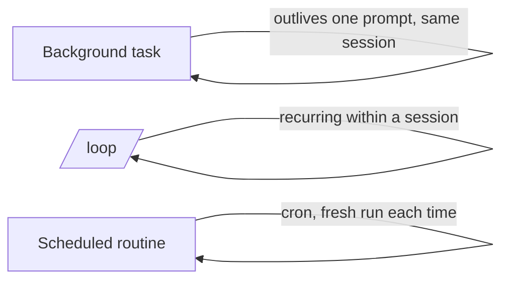

<LevelBadge level="advanced" />

<VerifyNote lastVerified="2026-06-20" source="https://docs.anthropic.com/en/docs/claude-code">
バックグラウンドタスク、/loop、スケジューリングの正確なコマンドと利用可否はリリースごとに変わります。公式ドキュメントで確認してください。
</VerifyNote>

すべてが手早い編集とは限りません。Claude Code は、**1 回のプロンプトを越えて生き延びる** 作業も実行できます — バックグラウンドでの長いコマンド、繰り返しのループ、そしてスケジュール実行です。

## バックグラウンドタスク

長時間実行されるコマンド（開発サーバー、テストウォッチャー、ビルド）を、セッションを **ブロックすることなく** 開始します。Claude は作業を続け、タスクが出力を生んだり終了したりすると通知を受けます。通常なら `&` でバックグラウンドに回すようなものすべてに使えます — ただし管理されているので、Claude は後でその出力を読めます。

:::tip ビジーウェイトしない
タスクをバックグラウンドで開始して続行しましょう。タイトなループでポーリングするのではなく、完了通知に呼び戻してもらいます。
:::

## 繰り返しループ（`/loop`）

`/loop` は、セッション内でプロンプトやコマンドを **繰り返しの間隔** で実行します — 例: 「5 分ごとにデプロイのステータスを確認して」。間隔を指定するか、Claude に自分でペースを決めさせます。CI 実行を見守ったり、ハーネスが他の方法では通知できない外部ジョブをポーリングしたりするのに最適です。

## スケジュールされたクラウドエージェント

**時計に合わせて継続的に** 起きるべき作業 — 「毎朝、新しい issue を要約して」「毎時、ニュースを確認してドキュメントを更新して」 — には、**スケジュールされたタスク / ルーティン**（cron 形式）を使います。各実行は新規に始まるので、その指示は **自己完結している** 必要があります。

## どれを選ぶか

| 必要なこと | 使うもの |
|---|---|
| 長いコマンドを実行しつつ作業を続ける | バックグラウンドタスク |
| このセッションで N 分ごとに何かをポーリングする | `/loop` |
| スケジュールに沿って、無期限に何かをする | スケジュールされたルーティン |

:::warning 自律性にはガードレールが必要
スケジュールに沿って無人で動くものはすべて、範囲を厳密に絞り、元に戻せるようにすべきです。厳格な [権限](/docs/claude-code/permissions) と組み合わせ、[自律実行のハードニング](/docs/security/hardening-autonomous-runs) を読んでください。
:::

## 次に

- [ヘッドレスモードと Agent SDK](/docs/claude-code/headless-and-agent-sdk)
- [権限とモード](/docs/claude-code/permissions)
- [自律実行のハードニング](/docs/security/hardening-autonomous-runs)
