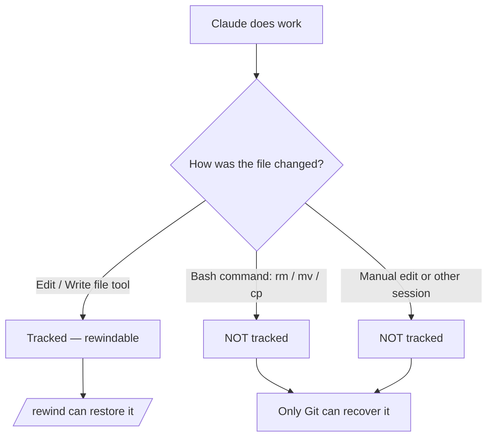

<LevelBadge level="intermediate" />

<Callout type="objectives" items={["チェックポイントが何を捉え、そして何を暗黙のうちに捉えないのかを理解する", "巻き戻しメニューを2通りの方法で開き、毎回適切な復元アクションを選ぶ", "「復元」（状態を元に戻す）と「要約」（コンテキストを圧縮する）を区別する", "チェックポイントが Git を補完しても決して置き換えない理由を正確に知る"]} />

<VerifyNote lastVerified="2026-07-09" source="https://code.claude.com/docs/en/checkpointing">
チェックポイントの挙動、巻き戻しメニューのアクション、保持期間、バージョン要件（例えば `/clear` を越えて再開するには Claude Code v2.1.191 以降が必要）はリリースごとに変わります — 公式ドキュメントで確認してください。
</VerifyNote>

## 核心となる考え方

野心的で大規模な変更を Claude に任せるとき、最も恐ろしい問いは「3回編集を進めたところで失敗したらどうしよう？」というものです。**チェックポイント**がその答えです。Claude Code は各編集の前にコードを自動でスナップショットするため、中途半端なリファクタリングを手作業でほどく代わりに、以前のどの状態にも巻き戻せます。

これを**セッション全体のローカルな取り消し**だと考えてください — 「よし、思い切ったアプローチを試そう」と恐れずに言えるセーフティネットです。

## チェックポイントの作られ方

チェックポイントは自分で作るものではありません — 自動的に発生します。

<Steps items={[{title: "すべてのプロンプト = 1つのチェックポイント", body: "各ユーザープロンプトは、Claude のファイル編集ツールが実行される前のコードの状態を捉えます。コマンドも、設定も、手続きも不要です。"}, {title: "セッションを越えて保持される", body: "チェックポイントは会話の終了と再開をまたいで残るため、ライブなセッションだけでなく、再開したセッションでも巻き戻せます。"}, {title: "自動でクリーンアップされる", body: "チェックポイントは、対応するセッションとともに30日後（設定可能）に削除されます。これはセッションレベルのリカバリであって、アーカイブではありません。"}]} />

## 巻き戻しメニューを開く

入る方法は2通りあります。

<Steps items={[{title: "/rewind を実行する", body: "プロンプトからスラッシュコマンドを入力します。常に機能します。"}, {title: "Esc を2回押す — ただし入力欄が空のときだけ", body: "ダブル Esc は、プロンプトボックスが空のときに巻き戻しメニューを開きます。テキストが入っている場合、ダブル Esc は代わりにそのテキストを消去します（消去されたテキストは入力履歴に保存されるので、後で上矢印を押せば取り戻せます）。"}]} />

<PromptCard title="Open the rewind menu">{`/rewind`}</PromptCard>

メニューには**今回のセッションで送信したすべてのプロンプト**が一覧表示されます。操作したいポイントを選び、1つのアクションを選択します。

## 復元 vs. 要約: 決定的な違い

ここで人は混乱します。メニューは2*種類*のアクションを提供します。

- **復元**アクションはディスク上および/または会話内の状態を変更します — 元に戻します。
- **要約**アクションはファイルには一切触れません — 会話を圧縮してコンテキストウィンドウの空きを作ります。

<Callout type="warning" items={["復元 = 取り消し（コード、会話、またはその両方を元に戻す）。要約 = コンテキストの圧縮（ディスク上のファイルは手つかず）。", "編集が何かを壊したときは復元を使う。セッションが肥大化しているがコードは問題ないときは要約を使う。"]} />

### 復元アクション

<Steps items={[{title: "コードと会話を復元", body: "ファイルとチャット履歴の両方を選択したポイントまで元に戻します — その瞬間へのきれいな「時間の巻き戻し」です。"}, {title: "会話を復元", body: "チャットをそのメッセージまで巻き戻しつつ、現在のコードは保持します。残しておきたい編集を失わずに質問をやり直すのに便利です。"}, {title: "コードを復元", body: "ファイルの変更を元に戻しつつ、会話は保持します。編集を取り消し、それについての議論は残します。"}]} />

会話を復元した後（または「ここから要約」を選んだ後）、選択したメッセージの元のプロンプトが入力欄に戻されるので、再送信したり編集したりできます。

### 要約アクション

どちらも会話の一部を AI 生成の要約に圧縮します — 選択したメッセージのどちら側を絞り込むかを選べる**ピンポイントな `/compact`** のようなものです。

<Steps items={[{title: "ここから要約", body: "選択したメッセージより前のメッセージはそのまま残ります。選択したメッセージとそれ以降のすべてが要約になります。初期のコンテキストを詳細なまま保ちつつ、脇道の議論を切り捨てるのに使います。"}, {title: "ここまでを要約", body: "選択したメッセージより前のメッセージが要約になり、選択したメッセージとそれ以降はそのまま残ります。あなたは会話の末尾に留まります。最近の作業をそのまま保ちつつ、初期のセットアップのやり取りを圧縮するのに使います。"}]} />

いずれの場合も元のメッセージはセッションのトランスクリプトに残るため、Claude は引き続き詳細を参照できます。要約が何に焦点を当てるかを誘導する任意の指示を入力することもできます。

フロー全体については [Context Management](/docs/claude-code/context-management) を参照してください — `/compact` が広い刷毛なら、`/rewind` の要約アクションはメスです。

## `/clear` を越えた巻き戻し

同じ Claude Code プロセス内で先に `/clear` を実行していた場合、巻き戻しメニューの先頭に追加のエントリ `/resume <session-id> (previous session)` が表示されます。これを選択すると、`/clear` の前にアクティブだった会話に戻ります。

<VerifyNote lastVerified="2026-07-09" source="https://code.claude.com/docs/en/checkpointing">
巻き戻しメニューから `/clear` を越えて再開するには、Claude Code v2.1.191 以降が必要です。それ以前のバージョンでは、代わりに `/resume` を実行して一覧から前のセッションを選んでください。
</VerifyNote>

## チェックポイントが及ばないところ — 痛手となる限界

チェックポイントは、そうでなくなるまでは魔法のように感じられます。3つのギャップが重要です。

<Steps items={[{title: "bash による変更は見えない", body: "Claude が実行するシェルコマンド — rm、mv、cp、コードジェネレーター、フォーマッター — で触れられたファイルは追跡されません。チェックポイント化されるのは Claude のファイル編集ツールを通じた直接の編集だけです。rm で削除されたファイルは、巻き戻しにとっては消えたも同然です。"}, {title: "外部および並行の変更は見えない", body: "Claude Code の外であなたが行う手作業の編集や、他の並行セッションからの編集は、通常は捉えられません — ただし、現在のセッションが編集したのと同じファイルにたまたま触れた場合を除きます。"}, {title: "セッションレベルであって履歴ではない", body: "チェックポイントは素早いローカルなリカバリです。コミットでもブランチでもなく、チームと共有できるものでもありません。"}]} />

## チェックポイント vs. Git: 両方使う

両者は異なる問題を解決するので、組み合わせて使いましょう。

| | チェックポイント (`/rewind`) | Git |
|---|---|---|
| 範囲 | 1つのセッション | プロジェクト履歴全体 |
| 粒度 | プロンプト単位、自動 | コミット単位、意図的 |
| bash による変更を追跡する? | いいえ | はい（ステージ/コミットすれば） |
| 存続期間 | 約30日、その後消える | 恒久的 |
| 共有可能 / 共同作業向き | いいえ | はい |
| メンタルモデル | 「ローカルな取り消し」 | 「恒久的な履歴」 |

<Callout type="tip" items={["リスクの高い大規模な実行の前に、Git で動作する状態をコミットしておく — それが耐久性のある土台になります。", "コミットの合間の素早いセッション内リカバリには /rewind を使い、Git の履歴を汚さないようにしましょう。", "Claude が破壊的な bash（rm/mv）やジェネレーターを実行するなら、Git に頼りましょう — 巻き戻しではそれらのファイルは救えません。"]} />

## いつ使うべきか

<Steps items={[{title: "代替案を探る", body: "思い切った実装を試し、気に入らなければコードと会話を分岐点まで復元して別の案を試します。"}, {title: "まずい編集からの回復", body: "3プロンプト前の編集がバグを混入させた？ 残骸をデバッグする代わりに、その直前までコードを復元しましょう。"}, {title: "機能を反復する", body: "既知の良好な状態が /rewind ひとつで戻せると分かった上で、バリエーションを試します。"}, {title: "コンテキストの空きを作る", body: "冗長なデバッグの寄り道がコンテキストウィンドウを食い潰した？ 中間点から先を要約し、元の指示を詳細なまま保ちましょう。"}]} />

<Quiz title="Check yourself" questions={[{q: "Claude が bash コマンドで `rm config.old.json` を実行し、それを取り戻したいとします。`/rewind` で復元できますか？", options: ["はい — Claude が行うすべての変更はチェックポイント化される", "いいえ — bash による変更は追跡されず、直接のファイルツール編集だけが追跡される", "/rewind を30秒以内に実行した場合のみ"], answer: 1, explain: "チェックポイントは Claude のファイル編集ツールを通じて行われた編集だけを捉えます。bash コマンド（rm、mv、cp）で変更されたファイルは追跡されません — それこそまさに Git の役目です。"}, {q: "コードは問題ないのに、長いデバッグの寄り道がコンテキストウィンドウを埋めてしまいました。どのアクションが適していますか？", options: ["寄り道の前までコードと会話を復元", "コードを復元", "寄り道の始まりで「ここから要約」"], answer: 2, explain: "要約アクションはファイルに触れずに会話を圧縮します。「ここから要約」は、以前のコンテキストを保ったまま寄り道を要約に変えます — コードを一切変えずにコンテキストの空きを作ります。"}, {q: "チェックポイントはどのように作られますか？", options: ["/checkpoint を手動で実行する", "自動的に、各編集の前に — すべてのプロンプトが1つ作る", "Git でコミットしたときだけ"], answer: 1, explain: "チェックポイントは自動です。すべてのユーザープロンプトが編集前のコードの状態を捉えます。手動の手順はありません。"}]} />

<Flashcards title="Checkpoints & rewind vocabulary" cards={[{front: "チェックポイント", back: "各編集の前、プロンプトごとに1回撮られるコードの自動スナップショット。セッションスコープで、約30日間保持されます。"}, {front: "/rewind", back: "今回のセッションのすべてのプロンプトを一覧する巻き戻しメニューを開き、任意のポイントから復元または要約できます。空の入力欄でのダブル Esc からも到達できます。"}, {front: "復元アクション", back: "状態 — コード、会話、またはその両方 — を選択したポイントまで元に戻します。これが「取り消し」です。"}, {front: "要約アクション", back: "会話の一部を AI 要約に圧縮してコンテキストを空けます。ディスク上のファイルには決して触れません。"}, {front: "bash の盲点", back: "シェルコマンド（rm/mv/cp）で変更されたファイルはチェックポイント化されません — 直接のファイルツール編集だけが対象です。それらには Git を使いましょう。"}]} />

<Callout type="takeaways" items={["チェックポイントは自動的な、プロンプトごとのコードのスナップショット — セッション全体のローカルな取り消しで、約30日間保持されます。", "巻き戻しメニューは /rewind または空の入力欄でのダブル Esc で開き、送信したすべてのプロンプトを一覧します。", "復元アクションは状態（コード、会話、またはその両方）を元に戻し、要約アクションはコンテキストを圧縮してファイルには決して触れません。", "bash による、外部の、そして並行の変更は追跡されません — 直接のファイルツール編集だけが追跡されます。", "チェックポイントは Git を補完するもので、置き換えるものではありません。「ローカルな取り消し」対「恒久的で共有可能な履歴」と考えましょう。"]} />

## 次へ

- [Context Management](/docs/claude-code/context-management) — `/compact`、`/clear`、そして要約がより大きな全体像にどう収まるか
- [Plan Mode](/docs/claude-code/plan-mode) — 編集が実行される前に計画を調べて承認し、巻き戻しの頻度を減らす
- [Permissions](/docs/claude-code/permissions) — 野心的なタスクを安全に実行するためのもう半分
