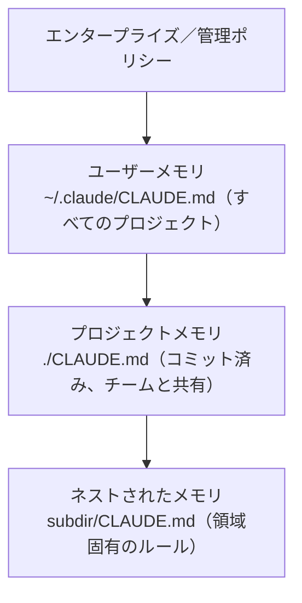

<LevelBadge level="beginner" />

<VerifyNote lastVerified="2026-06-20" source="https://code.claude.com/docs/en/memory">
メモリファイルの場所やインポート構文は変わることがあります。具体的な内容は公式の Claude Code メモリドキュメントで確認してください。
</VerifyNote>

[Claude Code](/docs/claude-code/what-is-claude-code) をより良くするために**一つだけ**やるなら、これをやってください。`CLAUDE.md` は Claude が毎回のセッション開始時に読むプレーンテキストファイル——あなたのプロジェクトの恒久的なブリーフィングです。

<Callout type="objectives" items={["なぜ CLAUDE.md が Claude Code で最も効果の高い設定なのか", "メモリの階層がグローバルからプロジェクト固有へどうマージされるか", "/init で初期ファイルを生成し、それを削ぎ落とす方法", "CLAUDE.md に何を入れるべきか——そして何を入れないべきか", "@imports でドキュメントを複製せずに参照する方法"]} />

## なぜ最も効果の高い設定なのか

これがないと、毎回のセッションでプロジェクトを説明し直すことになります（「pnpm を使っている、テストは `__tests__` にある、`/generated` は触らないで…」）。これがあれば、Claude はすでに知っています。ここに良い指示を書けば、*今後すべての*やり取りを一度に改善できます。

## メモリの階層

Claude Code はいくつかの場所からメモリを読み込み、おおむねグローバルなものから固有なものへとマージします：

- **ユーザーメモリ** — すべてのプロジェクトに渡るあなた個人の好み。
- **プロジェクトメモリ**（`./CLAUDE.md`、コミット済み） — *この*リポジトリがどう動くか。チームと共有されます。
- **ネスト** — そのフォルダ内だけに適用されるルールのために、サブフォルダに `CLAUDE.md` を置きます。

<Flashcards title="メモリの各レイヤーを知る" cards={[{front: "ユーザーメモリ", back: "~/.claude/CLAUDE.md — すべてのプロジェクトに適用されるあなた個人の好み。"}, {front: "プロジェクトメモリ", back: "./CLAUDE.md — コミットされチームと共有される。このリポジトリがどう動くかを記述する。"}, {front: "ネストされたメモリ", back: "subdir/CLAUDE.md — そのサブフォルダ内だけに適用される領域固有のルール。"}, {front: "エンタープライズ／管理ポリシー", back: "最もグローバルなレイヤー。あなたのユーザーメモリの上に位置する組織レベルのポリシー。"}]} />

## 出発点を生成する

<Steps items={[{title: "プロジェクトで /init を実行", body: "Claude がコードを調べ、自動で CLAUDE.md のドラフトを作成します。"}, {title: "削ぎ落とす", body: "ドラフトは出発点であって完成形ではありません。真実で有用な内容だけに削ります。"}, {title: "テンプレートを借りる", body: "CLAUDE.md テンプレートページから既成のスターターを取り、自分のリポジトリに合わせて調整します。"}]} />

<PromptCard title="CLAUDE.md のドラフトを生成する">{`/init`}</PromptCard>

[CLAUDE.md テンプレート](/docs/templates/claude-md) から既成のスターターを取得してください。

## 何を入れるか

- プロジェクトが何であるかを、2 文で。
- 技術スタックと、**実行 / テスト / リント**の方法。
- Claude が推測できない規約（命名、構造、コミットスタイル）。
- **ガードレール**：「完了を宣言する前にテストを実行する」「`/vendor` は絶対に編集しない」「シークレットを決してコミットしない」。

## 何を入れないか

<Callout type="warning" items={["Claude は CLAUDE.md を文字通り従います——古い、曖昧、または願望的な指示はむしろ害になります。", "プロジェクトが今日実際にどう動くかを記述してください。短くて真実な方が、長くて理想的なものより優れています。", "巨大な貼り付けドキュメント（代わりに @imports を使う）、シークレット、実際には守らないルールは避けてください。", "プロジェクトの進化に合わせて正確さを保つよう、定期的に見直してください。"]} />

## インポート

ドキュメントを複製する代わりに既存のものを取り込みます——たとえばスタイルガイドを `@path/to/file` インポートで参照すれば、信頼できる情報源が一つになります。正確な構文は[公式メモリドキュメント](https://code.claude.com/docs/en/memory)を参照してください。

<Callout type="tip" items={["信頼できる情報源を一つに：内容を CLAUDE.md に貼り付けるのではなく、@imports でファイルを参照しましょう。", "ドキュメントがすでに存在するなら、コピーせずリンクしましょう。コピーは古くなっていきます。"]} />

## 確認しよう

<Quiz title="確認しよう" questions={[{q: "Claude Code がプロジェクトの恒久的なブリーフィングとして毎回のセッション開始時に読むファイルはどれですか？", options: ["README.md", "CLAUDE.md", "package.json"], answer: 1, explain: "CLAUDE.md は Claude が毎回のセッション開始時に読むプレーンテキストのメモリファイルです。"}, {q: "プロジェクトで /init を実行すると何が起きますか？", options: ["CLAUDE.md をチームのリポジトリにコミットする", "コードを調べて CLAUDE.md のドラフトを作り、その後あなたが削ぎ落とす", "古いメモリファイルを削除する"], answer: 1, explain: "/init はコードから初期の CLAUDE.md を起草します——ドラフトは出発点なので、その後で削ぎ落とします。"}, {q: "スタイルガイドのような大きな既存ドキュメントを取り込む推奨方法は何ですか？", options: ["ドキュメント全体を CLAUDE.md に貼り付ける", "@path/to/file インポートで参照する", "シークレットとして保存する"], answer: 1, explain: "@imports でファイルを指し示すことで、複製されて古くなるコピーではなく、信頼できる情報源を一つに保ちます。"}]} />

<Callout type="takeaways" items={["CLAUDE.md は最も効果の高い設定：今後すべてのセッションを一度に改善します。", "メモリはグローバルから固有へとマージされる：エンタープライズポリシー、次にユーザー、プロジェクト、ネストされた CLAUDE.md ファイル。", "/init で始め、ドラフトを実際に真実な内容まで削り落とす。", "プロジェクトの概要、実行/テスト/リントのコマンド、規約、ガードレールを含める。", "短く真実に保つ——大きなドキュメントには @imports を使い、シークレットは決してコミットしない。"]} />

## 次へ

- [プランモード](/docs/claude-code/plan-mode) — 安全な最初の変更
- [権限とモード](/docs/claude-code/permissions) — Claude が無人で何をしてよいか
- [ウォークスルー：実際のリポジトリ向けに Claude Code をカスタマイズする](/docs/walkthroughs/customize-claude-code)
