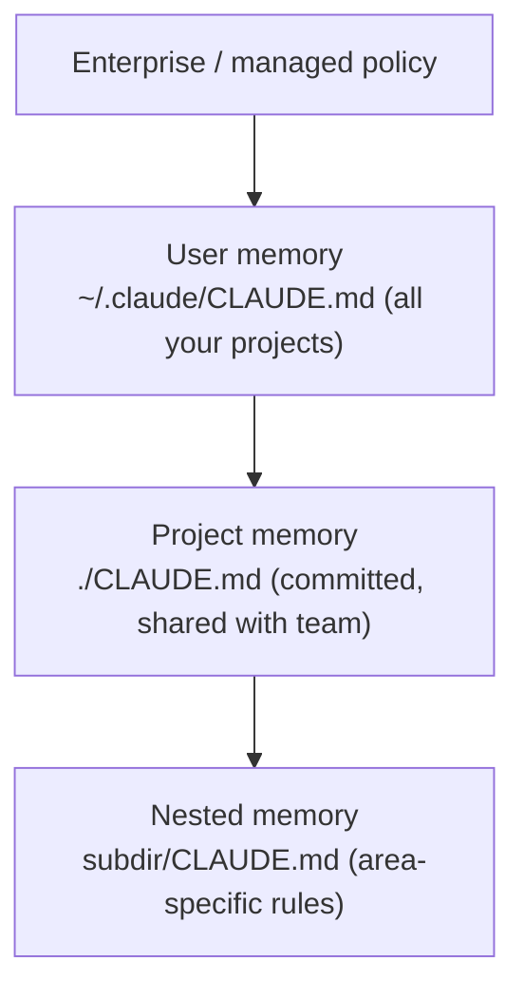

<LevelBadge level="beginner" />

<VerifyNote lastVerified="2026-06-20" source="https://code.claude.com/docs/en/memory">
メモリファイルの場所やインポート構文は変わる可能性があります。詳細は公式の Claude Code メモリドキュメントで確認してください。
</VerifyNote>

[Claude Code](/docs/claude-code/what-is-claude-code) をより良くするために **1 つだけ** やるとしたら、これをやってください。`CLAUDE.md` は、Claude が各セッションの開始時に読み込むプレーンテキストファイル — あなたのプロジェクトの恒久的なブリーフィングです。

## なぜ最も効果の大きい設定なのか

これがないと、毎回セッションごとにプロジェクトを説明し直すことになります（「うちは pnpm を使う、テストは `__tests__` にある、`/generated` には触らないで…」）。これがあれば、Claude はすでに知っています。ここに良い指示を書いておけば、*今後の* やり取りすべてが一度に改善されます。

## メモリの階層

Claude Code は複数の場所からメモリを読み込み、おおよそ最もグローバルなものから最も特定的なものへとマージします。

- **ユーザーメモリ** — すべてのプロジェクトにまたがる、あなた個人の好み。
- **プロジェクトメモリ**（`./CLAUDE.md`、コミット済み）— *この* リポジトリがどう動くか。チームと共有されます。
- **ネスト** — そこにだけ適用されるルールのために、サブフォルダに `CLAUDE.md` を置きます。

## 出発点を生成する

プロジェクト内で `/init` を実行すると、Claude がコードを調べて `CLAUDE.md` の草案を作成します。そのあと **削って整えましょう** — 草案は出発点であって、ゴールではありません。

## 何を書くか

- そのプロジェクトが何であるかを 2 文で。
- 技術スタックと、**実行 / テスト / lint** の方法。
- Claude が推測できない規約（命名、構造、コミットスタイル）。
- **ガードレール**: 「完了を宣言する前にテストを実行する」「`/vendor` は決して編集しない」「シークレットは決してコミットしない」。

すぐ使えるスターターは [CLAUDE.md テンプレート](/docs/templates/claude-md) から入手できます。

## 何を書かないか

:::warning 短くて正確 が 長くて願望的 に勝る
Claude は `CLAUDE.md` を *文字どおり* に従います。古い、曖昧、あるいは願望的な指示は、むしろ害になります。プロジェクトが今日 **実際に** どう動くかを記述し、簡潔に保ち、定期的に見直しましょう。
:::

避けるべきもの: 巨大なドキュメントの貼り付け（代わりに `@imports` でファイルを参照する）、シークレット、そして実際には守っていないルール。

## インポート

既存のドキュメントを複製するのではなく、取り込みましょう — 例えば、スタイルガイドを `@path/to/file` のインポートで参照すれば、信頼できる情報源が 1 つに保たれます。正確な構文は [公式メモリドキュメント](https://code.claude.com/docs/en/memory) を参照してください。

## 次に

- [プランモード](/docs/claude-code/plan-mode) — 安全な最初の変更
- [権限とモード](/docs/claude-code/permissions) — Claude が無人で行ってよいこと
- [ウォークスルー: 実際のリポジトリで Claude Code をカスタマイズする](/docs/walkthroughs/customize-claude-code)
