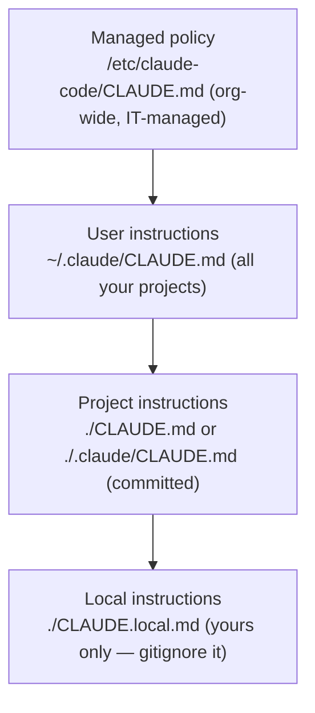

<LevelBadge level="beginner" />

<VerifyNote lastVerified="2026-10-06" source="https://code.claude.com/docs/en/memory">
場所、読み込み順序、インポート構文は公式のメモリドキュメント（「How Claude remembers your project」）に基づいています。そこでは現在**2つ**の仕組みが説明されています：あなたが書く CLAUDE.md ファイルと、Claude 自身が書く**自動メモリ**です。インポートは最大4ホップの深さまで解決されます。具体的な内容はそちらで確認してください——こうした詳細は変わります。
</VerifyNote>

[Claude Code](/docs/claude-code/what-is-claude-code) をより良くするために**一つだけ**やるなら、これをやってください。`CLAUDE.md` は Claude が毎回のセッション開始時に読むプレーンテキストファイル——あなたのプロジェクトの恒久的なブリーフィングです。

<Callout type="objectives" items={["なぜ CLAUDE.md が Claude Code で最も効果の高い設定なのか", "管理ポリシーから CLAUDE.local.md まで、メモリ階層がどう読み込まれるか", "自動メモリが、あなたが書く CLAUDE.md とどう違うのか", "/init で初期ファイルを生成し、それを削ぎ落とす方法", "CLAUDE.md に何を入れるべきか——そして何を入れないべきか", "@imports でドキュメントを複製せずに参照する方法"]} />

## なぜ最も効果の高い設定なのか

これがないと、毎回のセッションでプロジェクトを説明し直すことになります（「pnpm を使っている、テストは `__tests__` にある、`/generated` は触らないで…」）。これがあれば、Claude はすでに知っています。ここに良い指示を書けば、*今後すべての*やり取りを一度に改善できます。

## メモリの階層

Claude Code は複数の場所からメモリを読み込み、読み込み順——スコープの広いものから——にマージします。そのため、プロジェクトの指示はユーザーの指示の*後*にコンテキストへ入ります：

```mermaid
flowchart TD
  A["Managed policy<br/>/etc/claude-code/CLAUDE.md (org-wide, IT-managed)"] --> B["User instructions<br/>~/.claude/CLAUDE.md (all your projects)"]
  B --> C["Project instructions<br/>./CLAUDE.md or ./.claude/CLAUDE.md (committed)"]
  C --> D["Local instructions<br/>./CLAUDE.local.md (yours only — gitignore it)"]
```

- **管理ポリシー** — IT／DevOps チームが配布する組織全体の指示。パスは OS ごとに異なります：macOS では `/Library/Application Support/ClaudeCode/CLAUDE.md`、Linux と WSL では `/etc/claude-code/CLAUDE.md`、Windows では `C:\Program Files\ClaudeCode\CLAUDE.md`。
- **ユーザー指示**（`~/.claude/CLAUDE.md`）— すべてのプロジェクトに渡るあなた個人の好み。
- **プロジェクト指示**（`./CLAUDE.md` *または* `./.claude/CLAUDE.md`、コミット済み）— *この*リポジトリがどう動くか。チームと共有されます。リポジトリで [`AGENTS.md`](/docs/claude-code/agents-md) を使っている場合は、これらの代わりに、あるいはこれらと併せて読み込まれることがあります。
- **ローカル指示**（`./CLAUDE.local.md`）— サンドボックスの URL のような、あなただけのプロジェクト固有のメモ。`.gitignore` に追加してください。

作業ディレクトリより*上*のディレクトリ階層にあるファイルは起動時に読み込まれます。**サブディレクトリのファイルはオンデマンド**で、Claude がその領域の何かに触れたときに読み込まれます。

<Callout type="tip" items={["1つのファイルでは足りなくなった？指示を .claude/rules/*.md に分割しましょう——1トピックにつき1ファイルで、再帰的に発見されます。paths フロントマターのないルールは起動時に読み込まれ、優先度は .claude/CLAUDE.md と同じです。paths フロントマターを付けると、Claude が一致するファイルを扱うときだけそのルールが読み込まれ、コンテキストを節約できます。"]} />

<Flashcards title="メモリの各レイヤーを知る" cards={[{front: "管理ポリシー", back: "IT が管理する組織全体の CLAUDE.md——最も広いレイヤーで、ユーザー指示とプロジェクト指示より先に読み込まれる。"}, {front: "ユーザー指示", back: "~/.claude/CLAUDE.md — すべてのプロジェクトに適用されるあなた個人の好み。"}, {front: "プロジェクト指示", back: "./CLAUDE.md または ./.claude/CLAUDE.md — コミットされチームと共有される。このリポジトリがどう動くかを記述する。"}, {front: "ローカル指示", back: "./CLAUDE.local.md — プロジェクト固有の個人的な好み。gitignore しておくこと。"}, {front: ".claude/rules/*.md", back: "大きなプロジェクト向けに、1ファイル1トピックで書く指示。paths フロントマターを付けると、一致するファイルのときだけ読み込まれる。"}, {front: "サブディレクトリの CLAUDE.md", back: "起動時ではなくオンデマンドで——Claude がツリーのその部分で作業するときに読み込まれる。"}]} />

## もう半分：自動メモリ

CLAUDE.md はメモリのうち*あなたが*書く半分です。Claude Code は**自動メモリ**も保持します——あなたの修正や好みから Claude 自身が書くメモで、リポジトリごとに保存され、あなたの CLAUDE.md ファイルと並んで毎回のセッションに読み込まれます。

| | CLAUDE.md ファイル | 自動メモリ |
| --- | --- | --- |
| **誰が書くか** | あなた | Claude |
| **何を保持するか** | 指示とルール | 学習とパターン |
| **スコープ** | プロジェクト、ユーザー、または組織 | リポジトリごと、ワークツリー間で共有 |

どちらも強制ではなく*コンテキスト*です：Claude はこれらを、必ず従わなければならない設定ではなく、重み付けできるガイダンスとして扱います。Claude の判断にかかわらずある動作を完全にブロックしたい場合は、代わりに [PreToolUse フック](/docs/claude-code/hooks)を使ってください。

<Callout type="warning" items={["自動メモリは最初の200行または25 KB までしか読み込まれません——膨れ上がった MEMORY.md は黙って切り捨てられます。起動時コストの詳しい内訳はコンテキスト予算の監査を参照してください。"]} />

## 出発点を生成する

<Steps items={[{title: "プロジェクトで /init を実行", body: "Claude がコードを調べ、自動で CLAUDE.md のドラフトを作成します。"}, {title: "削ぎ落とす", body: "ドラフトは出発点であって完成形ではありません。真実で有用な内容だけに削ります。"}, {title: "テンプレートを借りる", body: "CLAUDE.md テンプレートページから既成のスターターを取り、自分のリポジトリに合わせて調整します。"}]} />

<PromptCard title="CLAUDE.md のドラフトを生成する">{`/init`}</PromptCard>

[CLAUDE.md テンプレート](/docs/templates/claude-md) から既成のスターターを取得してください。

## 何を入れるか

- プロジェクトが何であるかを、2 文で。
- 技術スタックと、**実行 / テスト / リント**の方法。
- Claude が推測できない規約（命名、構造、コミットスタイル）。
- **ガードレール**：「完了を宣言する前にテストを実行する」「`/vendor` は絶対に編集しない」「シークレットを決してコミットしない」。

## 何を入れないか

<Callout type="warning" items={["Claude は CLAUDE.md を文字通り従います——古い、曖昧、または願望的な指示はむしろ害になります。", "プロジェクトが今日実際にどう動くかを記述してください。短くて真実な方が、長くて理想的なものより優れています。", "巨大な貼り付けドキュメント（代わりに @imports を使う）、シークレット、実際には守らないルールは避けてください。", "プロジェクトの進化に合わせて正確さを保つよう、定期的に見直してください。"]} />

## インポート

ドキュメントを複製する代わりに既存のものを取り込みます——たとえばスタイルガイドを `@path/to/file` インポートで参照すれば、信頼できる情報源が一つになります。相対パスも絶対パスも使えます。相対パスは作業ディレクトリ**ではなく**、そのインポートを含むファイルを基準に解決されます。インポートされたファイルはさらに別のファイルをインポートできますが、深さは最大**4ホップ**までです。

痛い目に遭う前に知っておきたい構文の罠が2つあります：

- **スペースにはバックスラッシュが必要。** `@Design\ Docs/api-conventions.md` は動きます。バックスラッシュがないと、パスは最初のスペースで止まります。引用符で囲んでもファイルはまったくインポートされません。
- **バックティックで除外できる。** インポートの解析はコードスパンとフェンス付きブロックを飛ばすので、`` `@README` `` はそのままのテキストとして残り、単独の `@README` はファイルをインポートします。これが、読み込まずにパスを*言及する*方法です。

完全なリファレンスは[公式メモリドキュメント](https://code.claude.com/docs/en/memory)を参照してください。

<Callout type="tip" items={["信頼できる情報源を一つに：内容を CLAUDE.md に貼り付けるのではなく、@imports でファイルを参照しましょう。", "ドキュメントがすでに存在するなら、コピーせずリンクしましょう。コピーは古くなっていきます。"]} />

## 確認しよう

<Quiz title="確認しよう" questions={[{q: "Claude Code がプロジェクトの恒久的なブリーフィングとして毎回のセッション開始時に読むファイルはどれですか？", options: ["README.md", "CLAUDE.md", "package.json"], answer: 1, explain: "CLAUDE.md は Claude が毎回のセッション開始時に読むプレーンテキストのメモリファイルです。"}, {q: "プロジェクトで /init を実行すると何が起きますか？", options: ["CLAUDE.md をチームのリポジトリにコミットする", "コードを調べて CLAUDE.md のドラフトを作り、その後あなたが削ぎ落とす", "古いメモリファイルを削除する"], answer: 1, explain: "/init はコードから初期の CLAUDE.md を起草します——ドラフトは出発点なので、その後で削ぎ落とします。"}, {q: "スタイルガイドのような大きな既存ドキュメントを取り込む推奨方法は何ですか？", options: ["ドキュメント全体を CLAUDE.md に貼り付ける", "@path/to/file インポートで参照する", "シークレットとして保存する"], answer: 1, explain: "@imports でファイルを指し示すことで、複製されて古くなるコピーではなく、信頼できる情報源を一つに保ちます。"}, {q: "コミットしたくない、個人的でプロジェクト固有のメモはどこに置きますか？", options: ["~/.claude/CLAUDE.md", "./CLAUDE.local.md", "./.claude/CLAUDE.md"], answer: 1, explain: "./CLAUDE.local.md がローカルのレイヤーです：プロジェクト固有でありながら、あなただけのもの。gitignore してください。~/.claude/CLAUDE.md はすべてのプロジェクトに適用され、./.claude/CLAUDE.md はコミットされるチーム向けの指示です。"}, {q: "自動メモリは誰が書きますか？", options: ["あなたが手で書く", "Claude が、あなたの修正や好みから書く", "IT 管理者が書く"], answer: 1, explain: "自動メモリは Claude 自身が書く半分です——学習とパターンが、リポジトリごとに保存されます。CLAUDE.md はあなたが書く半分です。"}, {q: "サブディレクトリにある CLAUDE.md はいつ読み込まれますか？", options: ["起動時に、他のすべてのメモリファイルと一緒に", "オンデマンドで、Claude がツリーのその部分で作業するときに", "@import したときだけ"], answer: 1, explain: "作業ディレクトリより上のファイルは起動時に読み込まれます。サブディレクトリのファイルはオンデマンドで、Claude がその領域の何かに触れたときに読み込まれます。"}]} />

<Callout type="takeaways" items={["CLAUDE.md は最も効果の高い設定：今後すべてのセッションを一度に改善します。", "メモリは広いスコープから順に読み込まれる：管理ポリシー、次にユーザー（~/.claude/CLAUDE.md）、プロジェクト（./CLAUDE.md または ./.claude/CLAUDE.md）、そしてローカル（./CLAUDE.local.md）。サブディレクトリのファイルはオンデマンドで読み込まれます。", "自動メモリはもう半分——Claude 自身のメモで、リポジトリごとに保存され、毎回のセッションに読み込まれます。どちらも強制ではなくコンテキストです：何かを完全にブロックするにはフックを使いましょう。", "1つのファイルでは足りなくなった？ .claude/rules/*.md に分割し、paths フロントマターでルールのスコープを絞りましょう。", "/init で始め、ドラフトを実際に真実な内容まで削り落とす。", "短く真実に保つ——大きなドキュメントには @imports（最大4ホップ）を使い、シークレットは決してコミットしない。"]} />

## 次へ

- [AGENTS.md とツール間相互運用](/docs/claude-code/agents-md) — あらゆるコーディングエージェントで1つの指示ファイルを共有する
- [プランモード](/docs/claude-code/plan-mode) — 安全な最初の変更
- [権限とモード](/docs/claude-code/permissions) — Claude が無人で何をしてよいか
- [ウォークスルー：実際のリポジトリ向けに Claude Code をカスタマイズする](/docs/walkthroughs/customize-claude-code)
