<LevelBadge level="intermediate" />

Claude Code プロジェクトは、ノートパソコンにブラウザのタブが溜まっていくのと同じようにコンテキスト負債を溜め込みます。インストールしたスキルはどれも、Claude が毎ターン読み直す一覧に1行を追加します。サブエージェントはそれぞれ説明文を追加します。3月に書いた `CLAUDE.md` の段落は、タスクに必要かどうかにかかわらず9月にも読み込まれます。そして `npm test` を実行するたびに、最大30,000文字が会話に流し込まれます。セッションが指示を忘れ始めるか、請求額が作業量と釣り合わなくなるまで、どれも目には見えません。

[コンテキスト管理](/docs/claude-code/context-management)では、その場で使う2つのコマンド `/clear` と `/compact` を扱いました。このページは、プロジェクトごとに一度実行する監査です。あなたが何かを入力する前、あるいはターンとターンの間に Claude Code がコンテキストを消費する6つの場所、それぞれを制御する設定、そしてそのデフォルト値を示します。ここに書かれていることはすべて2026年9月時点の公式ドキュメントにあり、これらの設定項目の多くは、それにまつわる俗説よりも新しいものです。

<Callout type="objectives" items={[
  "削る前に測る: /context、/usage の帰属分析、/doctor の一覧コスト見積もりを読み、最大の項目から先に直す",
  "/skill-doctor(v2.1.252 以降)と skillOverrides の4つの状態でスキル一覧を刈り込み、一覧に課されるウィンドウの1%という予算を把握する",
  "シェルコマンドやバックグラウンドタスクがインラインで返す量(デフォルトで30,000文字と32,000文字)を bashOutputMaxChars と taskOutputMaxChars で制限する",
  "omitClaudeMd(v2.1.271 以降)で、すべてのサブエージェントで CLAUDE.md の代金を払うのをやめ、サブエージェントの説明文を15,000トークンの警告ライン未満に保つ",
  "自動コンパクトのウィンドウを意図的に設定し(/autocompact、autoCompactWindow)、どの呼び出し済みスキルがコンパクションを生き延びるかを決める25,000トークンの予算を理解する",
  "コンテキストではなく思考トークンが本当の請求額であるときは、maxEffortLevel でフリート全体の effort に上限を設ける"
]} />

<VerifyNote lastVerified="2026-09-15" source="https://code.claude.com/docs/en/settings-reference">
設定名、デフォルト値、範囲、最低バージョンは Claude Code の設定リファレンスより(`autoCompactWindow`、`bashOutputMaxChars`、`taskOutputMaxChars`、`maxEffortLevel`、`skillListingBudgetFraction`、`skillOverrides`、`disableBundledSkills`)。`/skill-doctor` の挙動、1%の一覧予算、1,536文字の説明文上限、25,000トークンの再アタッチ予算は[スキルのドキュメント](https://code.claude.com/docs/en/skills)より。Bash のインライン上限は[ツールリファレンス](https://code.claude.com/docs/en/tools-reference#output-limits)より。`omitClaudeMd`、15,000トークンの説明文警告、サブエージェントが読み込む内容は[サブエージェントのドキュメント](https://code.claude.com/docs/en/sub-agents)より。CLAUDE.md とコストのガイダンスは[コスト管理](https://code.claude.com/docs/en/costs)より。モデルのコンテキストサイズはここでは繰り返しません。[モデルと料金](/docs/whats-new/models-and-pricing)を参照してください。
</VerifyNote>

## 入力する前にウィンドウに何が入っているか

```mermaid
flowchart LR
  subgraph startup["Loaded at session start (every turn thereafter)"]
    SP[System prompt]
    CM[CLAUDE.md hierarchy]
    AM["Auto memory (first 200 lines / 25 KB)"]
    SL["Skill listing (capped at 1% of window)"]
    AD["Subagent descriptions (warning at 15k tokens)"]
    MT["MCP tool names (schemas deferred)"]
  end
  subgraph turns["Added as you work"]
    TR["Tool results (Bash ≤30k chars inline)"]
    TO["Background task output (≤32k chars inline)"]
    SK["Invoked skill bodies"]
    FR[File reads]
  end
  startup --> turns --> C{Auto-compact window}
  C -->|summary| R["Re-attached skills: 5k each, 25k total"]
```

この図を実用的にする事実が2つあります。左のボックスにあるものはすべて**リクエストごとに**支払われます。Claude Code は毎ターン会話全体を送信し、それを和らげるのはキャッシュ読み取りの割引だけだからです。そして右のボックスは、冗長なコマンド1つが一度に左のボックス全体を上回る量を追加しうる場所です。以下の監査は左から右へ進みます。

## 監査

<Steps items={[
  { title: "測定する: /context、/usage、/doctor", body: "/context を実行すると、カテゴリ別のライブ内訳と最適化の提案が表示され、どの CLAUDE.md と自動メモリのファイルが読み込まれたかもわかります。Pro、Max、Team、Enterprise プランでは、/usage が最近の使用量をスキル、サブエージェント、プラグイン、個々の MCP サーバーにパーセンテージで帰属させ、10%以上を占める挙動(長いコンテキスト、キャッシュミス)にフラグを立てます。/doctor はスキル一覧のコンテキストコストとその最大の寄与要因を見積もります。何かを変更する前に、上位3つの項目を書き留めてください。" },
  { title: "/skill-doctor でスキル一覧を刈り込む", body: "一覧にあるスキルはすべて、Claude が使うかどうかにかかわらず毎ターンコンテキストを消費します。/skill-doctor(v2.1.252 以降)は各スキルのコンテキストコストと呼び出し頻度を表示し、一度も呼び出されていないスキルにフラグを立て、どこで無効化できるかを教えてくれます。最近使っていないプラグインも一覧表示します。まずコストが最も高い未使用のものから始めましょう。対話型セッションではレポートが /plugin マネージャーの Stats タブに開き、-p ではテキストとして出力されます。バンドル済みスキルやエンタープライズスキルは対象外で、フィーチャーフラグの取得が必要であり、Remote Control 経由では拒否されます。" },
  { title: "削除ではなく skillOverrides で折りたたむ", body: "スキルごとに4つの状態があります。on(名前と説明文を一覧に表示)、name-only(説明文なしで一覧に表示、呼び出しは可能)、user-invocable-only(Claude からは隠されるが / メニューには残る)、off。/skills メニューがこれを代わりに書き込んでくれます。スキルをハイライトし、Space で状態を切り替え、Esc で .claude/settings.local.json に保存します。プラグインのスキルは代わりに /plugin で管理します。disableBundledSkills: true を設定すると、Claude Code 自身のバンドル済みスキルとワークフローを1行で取り除けます。" },
  { title: "一覧の予算と説明文の上限を知る", body: "一覧はモデルのコンテキストウィンドウの1%に制限されています(skillListingBudgetFraction、デフォルト 0.01)。あふれると、Claude Code はすべての名前を残しつつ、使用頻度の最も低いスキルから順に説明文を落とします。これは Claude が自動選択に必要とするキーワードを奪います。各スキルの説明文と when_to_use の合計も1,536文字で切り詰められます(skillListingMaxDescChars)。主要なユースケースは最初の一文に入れてください。" },
  { title: "起動時に読み込まれるものを縮める", body: "CLAUDE.md は200行未満に保ち、ワークフロー固有の指示(PR レビュー、マイグレーション)はスキルに移しましょう。スキルは呼び出されたときだけ読み込まれます。自動メモリは最初の200行または25 KB しか読み込まれないため、肥大化した MEMORY.md は黙って切り詰められます。サブエージェントの説明文は毎ターン読まれます。カスタムサブエージェントの説明文の合計が15,000トークンを超えると、Claude Code は起動時に警告します。詳細は各サブエージェントのシステムプロンプトに移してください。こちらは実行時にのみ読み込まれます。" },
  { title: "ツール出力のインライン上限を設ける", body: "成功した Bash や PowerShell のコマンドは、デフォルトでおよそ30,000文字までをインラインで返します。それを超えると Claude は短いプレビューとファイルパスを受け取り、必要に応じてファイルを読みます。失敗したコマンドは先頭と末尾の抜粋として最大10,000文字を返します。bashOutputMaxChars(v2.1.261 以降、4,000〜128,000 にクランプ)はインライン上限と読み戻しウィンドウを同時に設定し、Claude Code に BASH_MAX_OUTPUT_LENGTH を無視させます。taskOutputMaxChars は TaskOutput で読むバックグラウンドタスクに対して同じことをします(デフォルト 32,000、同じ範囲)。おしゃべりなビルドツールを使うプロジェクトでは下げ、Claude がどのみち保存ファイルを開き続ける場合にだけ上げてください。" },
  { title: "すべてのサブエージェントで CLAUDE.md の代金を払うのをやめる", body: "フォークでないサブエージェントは、自身のプロンプトに加えて、CLAUDE.md 階層のすべてのレベルと git status のスナップショットを読み込みます。組み込みの Explore と Plan エージェントはどちらも省略します。委任プロンプトからすべてを受け取るカスタムサブエージェントには、フロントマターに omitClaudeMd: true を設定してください(v2.1.271 以降)。ユーザー、プロジェクト、ローカルの CLAUDE.md ファイルはスキップされ、管理ポリシーファイルは引き続き読み込まれます。エージェントがメインセッションのエージェントとして動作するときは無視されます。ヘッドレス実行で大きな共有指示を渡すには、すべての説明文に詰め込む代わりに --append-subagent-system-prompt-file(v2.1.261 以降)を使ってください。" },
  { title: "自動コンパクトのウィンドウを意図的に設定する", body: "autoCompactWindow は 100,000 から 1,000,000 までのトークン数で、モデルのウィンドウを上限とします。未設定なら Claude Code がモデルに合わせて調整されたウィンドウを選びます。/autocompact 500k はユーザー設定に書き込み、--autocompact は1セッションだけ上書きし、CLAUDE_CODE_AUTO_COMPACT_WINDOW は両方を上書きします。CLAUDE_AUTOCOMPACT_PCT_OVERRIDE(1〜100)はトリガー点を下げることしかできません。コンパクション後、呼び出し済みスキルは新しいものから順に、1つあたり最大5,000トークン、合計25,000トークンの範囲で再アタッチされるため、古いスキルは丸ごと落とされることがあります。生き残らせる必要があるスキルは、/compact の後に再度呼び出してください。" },
  { title: "請求額がコンテキストではなく思考にあるときは effort に上限を設ける", body: "思考トークンは出力として課金されます。maxEffortLevel(v2.1.267 以降)は、どのセッションでも使える effort の上限を設けます。low、medium、high、xhigh、max のいずれかです(max = 上限なし)。すべてのプロバイダーで、すべてのリクエストの前に適用され、スコープをまたいだ最も低い上限が優先され、xhigh 未満の上限は ultracode を無効化します。モデル別の上限は modelSettings に置きます。組織に強制するには管理設定を通じて配布してください。" }
]} />

## そのまま貼れる設定ブロック

<PromptCard title="プロジェクトローカルのコンテキスト上限(.claude/settings.local.json)">
{`{
  "bashOutputMaxChars": 12000,
  "taskOutputMaxChars": 12000,
  "skillOverrides": {
    "legacy-migration-notes": "name-only",
    "deploy-prod": "user-invocable-only",
    "old-design-system": "off"
  },
  "autoCompactWindow": 500000,
  "maxEffortLevel": "high"
}`}
</PromptCard>

これはデフォルトではなく、意思決定として上から下へ読んでください。2つの出力上限は、おしゃべりなテストランナーを前提としています。Claude が実行のたびに保存された出力ファイルを開くようになったら、30,000 / 32,000 のデフォルトの方へ戻してください。3つのオーバーライドは、説明文の代金を払わずにスキルを到達可能なままにします。コンパクションのウィンドウは、モデルに合わせて調整された時点ではなく半分でコンパクトしたい 1M コンテキストモデル向けの明示的な選択です。effort の上限はここで唯一出力品質を変える行なので、最後に、`/usage` で思考トークンが支配的だとわかってからだけ設定してください。

<PromptCard title="CLAUDE.md を読み込まないサブエージェント(.claude/agents/repo-auditor.md)">
{`---
name: repo-auditor
description: Audits a repository for dead code and unused exports. Use for read-only sweeps.
tools: Read, Grep, Glob, Bash
model: sonnet
omitClaudeMd: true
---
You are a read-only auditor. Everything you need is in the delegation prompt.
Report findings as a table of path, symbol, and evidence. Do not edit files.`}
</PromptCard>

<PromptCard title="ヘッドレスセッションでスキルレポートを実行する">
{`claude -p "/skill-doctor"`}
</PromptCard>

## よくある間違い

<Callout type="warning" items={[
  "スキルを折りたたむ代わりに削除する。name-only は一覧コストをほぼゼロにしたままスキルを呼び出し可能に保ちますが、off は / メニューからも取り除きます。ほとんどの「未使用」スキルは消すのではなく name-only にすべきです。",
  "ビルドログが1回あふれただけで bashOutputMaxChars を上限の 128,000 に引き上げる。これは今後のすべてのコマンドをインラインで最大4倍高価にします。代わりに PreToolUse フックでログをフィルタしてください(FAIL を grep、head -100)。コストのドキュメントに正確なフックが載っています。",
  "autoCompactWindow をモデルのコンテキストより大きく設定する。Claude Code は黙ってウィンドウで上限を切るため、設定は適用されたように見えて何もしません。",
  "コンテキストが分離されているからサブエージェントは安いと思い込む。Explore、Plan、または omitClaudeMd を設定していない限り、その起動には依然としてすべての CLAUDE.md レベルと git スナップショットが含まれます。",
  "スマートフォンから Remote Control 経由で /skill-doctor を読む。「Skill usage reports are not available on this connection.」が返ります。セッションが存在するターミナルで実行してください。",
  "呼び出し済みスキルが /compact を生き延びると期待する。25,000トークンの再アタッチ予算に収まるのは、1つあたり5,000トークンで最新の呼び出しだけです。まだ必要なものは再度呼び出してください。"
]} />

## クイックチェック

<Quiz questions={[
  {
    q: "/skill-doctor は何を報告し、何を意図的に省いていますか?",
    options: [
      "すべてのスキルの本文全体。除外されるものはない",
      "セッション内の各スキルのコンテキストコストと呼び出し回数。一度も呼び出されていないものにフラグを立てる — バンドル済みスキルとエンタープライズスキルは除外",
      "プラグインのスキルのみ",
      "エラーになったスキルのみ"
    ],
    answer: 1,
    explain: "レポートはバンドル済みスキルとエンタープライズスキルを除くセッション内のスキルを対象とし、コストと頻度を表示し、一度も呼び出されていないスキルにどこで無効化できるかとともにフラグを立て、最近使っていないプラグインを一覧表示します。v2.1.252 以降とフィーチャーフラグの取得が必要です。"
  },
  {
    q: "スキル一覧が予算をあふれました。何が起こりますか?",
    options: [
      "Claude Code が起動を拒否する",
      "スキルがランダムに削除される",
      "すべての名前は残り、使用頻度の最も低いスキルから順に説明文が落とされるため、Claude がそれらを自動選択しにくくなる",
      "予算が自動的に拡大する"
    ],
    answer: 2,
    explain: "一覧はコンテキストウィンドウの1%に制限されています(skillListingBudgetFraction 0.01)。あふれると名前は保持され、使用頻度の最も低いスキルの説明文から先に落とされます。割合を引き上げるか、優先度の低いスキルを name-only に設定してください。"
  },
  {
    q: "成功した npm test が80,000文字を出力しました。デフォルト設定で Claude は何を受け取りますか?",
    options: [
      "80,000文字すべてをインラインで",
      "およそ先頭の30,000文字と、残りを保存したファイルへのパス。Claude はそのファイルを読んだり検索したりできる",
      "何も受け取らない — コマンドは強制終了される",
      "末尾の10,000文字のみ"
    ],
    answer: 1,
    explain: "有効な結果はデフォルトでおよそ30,000文字までインラインで返され、それを超えると Claude は短いプレビューと保存ファイルのパスを受け取ります。失敗時はファイルなしで10,000文字の先頭と末尾の抜粋になります。bashOutputMaxChars(4,000〜128,000)は有効な結果の上限を変更します。"
  },
  {
    q: "設定なしで CLAUDE.md ファイルをスキップするサブエージェントはどれですか?",
    options: [
      "なし — すべてのサブエージェントが読み込む",
      "組み込みの Explore と Plan エージェント",
      "すべてのカスタムサブエージェント",
      "フォークされたサブエージェント"
    ],
    answer: 1,
    explain: "Explore と Plan は CLAUDE.md と git status のスナップショットをスキップします。それ以外の組み込みおよびカスタムサブエージェントは、定義で omitClaudeMd: true(v2.1.271 以降)を設定しない限り両方を読み込みます。フォークは代わりに親の会話を継承します。"
  },
  {
    q: "長いセッションで6つのスキルを呼び出し、/compact が実行されたばかりです。どれが生き残りますか?",
    options: [
      "6つすべてが完全に",
      "最近呼び出されたものから、1つあたり最大5,000トークン、合計25,000トークンの範囲内。古いものは丸ごと落とされることがある",
      "なし — コンパクションはスキルを消去する",
      "最初に呼び出したものだけ"
    ],
    answer: 1,
    explain: "Claude Code は要約の後に各スキルの最新の呼び出しを再アタッチし、それぞれ最初の5,000トークンを、最も新しく呼び出されたスキルから埋めていく合計25,000トークンの予算内で保持します。まだ必要なものは再度呼び出してください。"
  },
  {
    q: "maxEffortLevel が管理設定で 'medium'、ユーザー設定で 'high' に設定されています。何が実行されますか?",
    options: [
      "high — ユーザー設定が勝つ",
      "medium — スコープをまたいだ最も低い上限が適用される",
      "max — 矛盾する上限は打ち消し合う",
      "/effort が最後に設定したもの"
    ],
    answer: 1,
    explain: "複数のスコープが上限を設定した場合は最も低いものが適用されるため、あるスコープで設定した上限を別のスコープから引き上げることはできません。/effort、--effort、CLAUDE_CODE_EFFORT_LEVEL、effort フロントマターも上書きします。v2.1.267 以降が必要です。"
  }
]} />

<Flashcards cards={[
  { front: "/skill-doctor", back: "v2.1.252 以降。スキルごとのコンテキストコスト + 呼び出し頻度。一度も呼び出されていないスキルとその無効化場所にフラグを立て、未使用プラグインを一覧表示。バンドル済み/エンタープライズスキルは除外。Remote Control 経由では不可。-p でテキスト出力。" },
  { front: "スキル一覧の予算", back: "モデルのコンテキストウィンドウの1%(skillListingBudgetFraction 0.01)。あふれると名前は保持し、使用頻度の最も低いスキルの説明文から落とす。各説明文 + when_to_use は1,536文字が上限(skillListingMaxDescChars)。" },
  { front: "skillOverrides の状態", back: "on(名前 + 説明文)· name-only(名前のみ、呼び出しは可能)· user-invocable-only(Claude からは隠され、/ メニューには残る)· off(どこにも表示されない)。/skills メニュー: Space で切り替え、Esc で .claude/settings.local.json に保存。プラグインのスキルは /plugin を使用。" },
  { front: "Bash の出力上限", back: "有効時: インラインで約30,000文字、その後はプレビュー + 保存ファイルのパス。失敗時: 先頭と末尾で10,000文字、ファイルなし。bashOutputMaxChars(v2.1.261 以降)は 4,000〜128,000 にクランプされ、BASH_MAX_OUTPUT_LENGTH を上書き。" },
  { front: "taskOutputMaxChars", back: "TaskOutput で読むバックグラウンドタスク出力のインライン上限。デフォルト 32,000 文字(最新の文字が保持される)。範囲 4,000〜128,000。TASK_MAX_OUTPUT_LENGTH を上書き。v2.1.261 以降。" },
  { front: "omitClaudeMd", back: "サブエージェントのフロントマター、v2.1.271 以降。ユーザー、プロジェクト、ローカルの CLAUDE.md をスキップ。管理ポリシーファイルは引き続き読み込まれる。メインセッションのエージェントでは無視される。Explore と Plan はもともと CLAUDE.md をスキップする。" },
  { front: "autoCompactWindow", back: "トークン数、100,000〜1,000,000、モデルのウィンドウが上限。未設定 = モデルに合わせたデフォルト。/autocompact 500k で書き込み。--autocompact はセッション単位で上書き。CLAUDE_CODE_AUTO_COMPACT_WINDOW は両方を上書き。CLAUDE_AUTOCOMPACT_PCT_OVERRIDE は下げるのみ。" },
  { front: "コンパクション後のスキル", back: "各スキルの最新の呼び出しが再アタッチされ、それぞれ最初の5,000トークン、合計25,000トークン、新しいものから順。古いスキルは丸ごと落とされることがある。スキル一覧自体は再読み込みされない。" },
  { front: "サブエージェントの説明文の上限", back: "カスタムサブエージェントの説明文の合計が15,000トークンを超えると起動時に警告。説明文を削り、詳細はサブエージェント実行時にのみ読み込まれるシステムプロンプトに移す。" },
  { front: "maxEffortLevel", back: "v2.1.267 以降。low / medium / high / xhigh / max(上限なし)。すべてのプロバイダーで、すべてのリクエストの前に適用。スコープをまたいだ最も低い上限が勝つ。xhigh 未満は ultracode を無効化。モデル別の上限は modelSettings に。" }
]} />

<Callout type="takeaways" items={[
  "まず測る: ライブ内訳は /context、スキル・サブエージェント・プラグイン・MCP サーバー別の帰属は /usage、一覧の見積もりは /doctor。",
  "スキル一覧はウィンドウの1%を上限とするターンごとの税金。/skill-doctor が何を折りたたむべきかを教えてくれ、name-only はほぼゼロコストでスキルを使える状態に保つ。",
  "ツール出力はウィンドウを吹き飛ばす最速の手段: 成功したコマンド1つあたり約30,000文字、バックグラウンドタスク1つあたり32,000文字がインラインに。bashOutputMaxChars / taskOutputMaxChars で上限を設けるか、フックでフィルタする。",
  "サブエージェントは起動時にタダではない: Explore、Plan、または omitClaudeMd でない限り、すべての CLAUDE.md レベルと git status が乗る。カスタムの説明文は合計15,000トークン未満に保つ。",
  "コンパクションは最近呼び出されたスキルだけを残す(1つ5,000、合計25,000)。autoCompactWindow は意図的に設定し、生き残らせるべきものは再度呼び出す。",
  "思考トークンが請求額を支配するときは、maxEffortLevel がフリート全体の effort に上限を設ける。最も低いスコープが勝ち、すべてのプロバイダーで有効。"
]} />

## 出典と参考文献

- [Claude Code ドキュメント — 設定リファレンス](https://code.claude.com/docs/en/settings-reference) — `autoCompactWindow`、`bashOutputMaxChars`、`taskOutputMaxChars`、`maxEffortLevel`、`skillListingBudgetFraction`、`skillOverrides`、`disableBundledSkills`
- [Claude Code ドキュメント — スキルで Claude を拡張する](https://code.claude.com/docs/en/skills) — `/skill-doctor`、一覧の予算、説明文の上限、コンパクション時の再アタッチ予算
- [Claude Code ドキュメント — ツールリファレンス: 出力上限](https://code.claude.com/docs/en/tools-reference#output-limits) — 有効なコマンドと失敗したコマンドのインライン上限
- [Claude Code ドキュメント — サブエージェント](https://code.claude.com/docs/en/sub-agents) — 起動時に読み込まれるもの、`omitClaudeMd`、15,000トークンの説明文警告
- [Claude Code ドキュメント — コスト管理](https://code.claude.com/docs/en/costs) — `/usage` の帰属分析、200行の CLAUDE.md ガイダンス、テスト出力のフィルタフック
- [Claude Code ドキュメント — コンテキストウィンドウを探る](https://code.claude.com/docs/en/context-window) — このページの図が要約している対話型シミュレーション
- AILmanac の関連ページ: [MCP のトークンコスト](/docs/claude-code/mcp-token-cost) — 同じ監査の MCP 側の半分
- AILmanac の関連ページ: [サブエージェントフリートの制限](/docs/claude-code/subagent-fleet-limits) — サブエージェントの並行性と予算の側面

## 次へ

- [コンテキスト管理](/docs/claude-code/context-management) — 監査が済んだあと、その場で使う `/clear` と `/compact` の使い分け
- [スキル](/docs/claude-code/skills) — 一覧の1行に値するスキルの書き方
- [サブエージェント](/docs/claude-code/subagents) — `omitClaudeMd` が安全になるよう委任プロンプトを設計する
