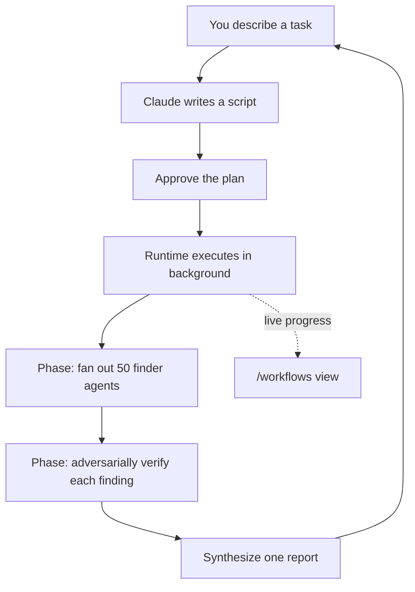

<LevelBadge level="advanced" />

<VerifyNote lastVerified="2026-06-28" source="https://code.claude.com/docs/en/workflows">
動的ワークフローは急速に進化している機能です。トリガーキーワード、承認オプション、エージェントの上限、利用可否は Claude Code のリリースごとに変わります。具体的な仕様は公式ドキュメントで確認してください。Claude Code v2.1.154+ と有料プランが必要です。
</VerifyNote>

<Callout type="objectives" items={["プランを誰が握っているかで、ワークフローをサブエージェント・スキル・エージェントチームと見分ける", "同梱の /deep-research コマンドで 30 秒で実物を見る", "自分で始める 3 つの方法を知る：ultracode キーワード、/effort ultracode、保存したコマンド", "「はい」を押す前に、承認プロンプトが何から守ってくれているのかを把握する", "スライスと許可リストでコストと無人実行を管理下に置く"]} />

**動的ワークフロー**とは、[サブエージェント](/docs/claude-code/subagents)を大規模にオーケストレーションする JavaScript スクリプトです。あなたはタスクを説明し、Claude が*スクリプトを書き*、ランタイムがそれをバックグラウンドで実行する一方で、あなたのセッションは応答可能なままです。通常のマルチステップタスクが Claude のコンテキストウィンドウ内でターンごとに進行するのに対し、ワークフローは**プランをコードに移します** — ループ、分岐、そしてすべての中間結果はスクリプト変数の中に存在するため、あなたのコンテキストには最終的な答えだけが残ります。

このたった一つの転換こそが、ワークフローを 1 回の実行で*数十〜数百*のエージェントにスケールさせるものです。通常の委任は数個で頭打ちになります。

## ワークフローを選ぶべきとき

Claude Code はマルチステップ作業を実行する 4 つの方法を提供します。本当の問いは**誰がプランを握っているか**です：

| | [サブエージェント](/docs/claude-code/subagents) | [スキル](/docs/claude-code/skills) | エージェントチーム | **ワークフロー** |
| :-- | :-- | :-- | :-- | :-- |
| 何であるか | Claude が起動するワーカー | Claude が従う指示 | 同格セッションを統括するリード | ランタイムが実行するスクリプト |
| 次に何を実行するか決める者 | Claude、ターンごとに | Claude、プロンプトに従って | リード、ターンごとに | **スクリプト** |
| 結果が存在する場所 | コンテキストウィンドウ | コンテキストウィンドウ | 共有タスクリスト | **スクリプト変数** |
| スケール | ターンごとに数個 | サブエージェントと同じ | 同格が一握り | **数十〜数百** |
| 中断時 | ターンを再開 | ターンを再開 | チームメイトは実行を継続 | **セッション内で再開可能** |

タスクが**1 つの会話で調整できる以上のエージェントを必要とする**とき、あるいはオーケストレーションを**読んで再実行できるスクリプトとしてコード化したい**ときにワークフローを使います。代表的なケース：

- **コードベース全体のバグ掃き出し** — ファインダーをすべてのモジュールに展開し、報告される前に独立したエージェントが各発見を敵対的に検証する。
- **500 ファイルの移行** — ファイルごとに 1 エージェント、それぞれ独自のワークツリーで、検証ステージ付き。
- **リサーチの問い** — ソースを単に要約するのではなく、**互いに相互チェック**しなければならない場合。
- **難しいプラン** — いくつかの独立した角度から下書きし、コミットする前に互いに比較検討する価値がある場合。

最後の点が過小評価されがちなものです：ワークフローは*再現可能な品質パターン*（敵対的レビュー、複数角度の下書き、多数決による検証）を適用できるため、単なるエージェント数の増加にとどまらず、1 回のパスよりも信頼性の高い結果が得られます。



## 実物を最速で見る方法：/deep-research

Claude Code には組み込みのワークフローが同梱されているので、このモデルを試すために自分で書く必要はありません。任意の問いで実行してみましょう：

<PromptCard title="1 つのコマンドでワークフローを試す">{`/deep-research What changed in the Node.js permission model between v20 and v22?`}</PromptCard>

これはウェブ検索を複数の角度に展開し、ソースを取得して**相互チェック**し、各主張に投票し、**相互チェックを生き残らなかった主張をフィルタリングした、引用付きのレポート**を返します。プロンプトが出たら承認し、`/workflows` で動作を見守りましょう。（WebSearch ツールが利用可能である必要があります。）

## 自分で始める 3 つの方法

**1. 1 つのプロンプトで頼む。** キーワード `ultracode` を含めるか、ただ平易な言葉で頼みます（「ワークフローを使って」「ワークフローを実行して」）。Claude はセッションの努力レベルを変えずに、その単一のタスクのためにスクリプトを書きます：

<PromptCard title="1 つのタスクをワークフローとして実行する">{`ultracode: audit every API endpoint under src/routes/ for missing auth checks`}</PromptCard>

キーワードは入力内でハイライトされます。そのつもりではなかった？ `Option+W`（macOS）または `Alt+W`（Windows/Linux）を押すと、そのプロンプトのハイライトを解除できます。

:::note キーワードの履歴
v2.1.160 より前では、リテラルのトリガーワードは `workflow` でした。一般的な単語「workflow」が実行を発火させないよう、`ultracode` に改名されました。自然言語のリクエスト（「run a workflow」）は**両方**のバージョンで機能します。
:::

**2. Claude に判断させる — ultracode 努力。** セッションを ultracode に設定すると、Claude は*すべての*実質的なタスクについてワークフローをプランし、ワークフローが妥当かどうかを自身で判断します：

<PromptCard title="セッションの自動オーケストレーションをオンにする">{`/effort ultracode`}</PromptCard>

Ultracode は `xhigh` の[推論努力](/docs/api/thinking-and-effort)と自動オーケストレーションを組み合わせます。1 つのリクエストが連続したいくつものワークフローになることがあります — コードを理解する 1 つ、変更を加える 1 つ、それを検証する 1 つ。そのため各タスクはより多くのトークンを使い、より長くかかるので、ルーチンの作業では `/effort high` に戻しましょう。これは現在のセッションの間だけ持続します。

**3. 保存済みまたは同梱のコマンドを実行する。** `/deep-research`、または保存した任意のワークフロー（下記）は、他のスラッシュコマンドと同様に `/` のオートコンプリートに表示されます。

## 実行前に承認する

ワークフローは多くのエージェントを起動しうるため、CLI はプランされたフェーズを表示し、先に尋ねます：

- **はい、実行する** — 実行を開始する
- **はい、`[path]` の `[name]` については今後尋ねない** — 開始し、このプロジェクトのこのワークフローについてはプロンプトをスキップする
- **生のスクリプトを表示**（`Ctrl+G` でエディタで開く）— 決める前に読む
- **いいえ** — キャンセル（`Tab` を押すと先にプロンプトを微調整できる）

プロンプトが出るかどうかは、あなたの[権限モード](/docs/claude-code/permissions)によります：**Default / accept-edits** は毎回の実行でプロンプトを出します（そのワークフローについてオプトアウトしていない限り）。**Auto** は初回起動時のみプロンプトを出します。**bypass / `claude -p` / Agent SDK** は決してプロンプトを出さず、実行はただちに始まります。

:::warning サブエージェントはあなたのセッションのモードを継承しない
あなたのセッションの権限モードが何であれ、ワークフローが起動するエージェントは常に **`acceptEdits`** で実行され、あなたの[ツール許可リスト](/docs/claude-code/permissions)を継承します — ファイル編集は自動承認されます。あなたの許可リストに*ない*シェルコマンド、ウェブフェッチ、MCP ツールは、依然として実行を一時停止してあなたにプロンプトを出すことがあります。長い無人実行では、停止してあなたを待つことがないよう、**開始前にエージェントが必要とするコマンドを許可リストに追加しておきましょう**。[自律実行のハードニング](/docs/security/hardening-autonomous-runs)を参照してください。
:::

## 実行がどう進むか

ランタイムはスクリプトを**隔離された環境**で、あなたの会話とは別に実行します — 中間結果はスクリプト変数の中にとどまり、Claude のコンテキストに触れることは決してありません。スクリプト自体は**ファイルシステムやシェルへの直接アクセスを持ちません**：*エージェント*が読み、書き、コマンドを実行し、スクリプトはそれらを調整するだけです。

すべての実行は、`~/.claude/projects/` のセッションディレクトリ配下のファイルにスクリプトを書き出し、Claude はそのパスを取得します。そのため、Claude にスクリプトを尋ねたり、書かれたオーケストレーションを読んだり、前回の実行と差分を取ったり、編集して Claude に編集版から再起動するよう頼んだりできます。

ランタイムは、不正なスクリプトが暴走できないよう、いくつかの上限を強制します：

| 制約 | 理由 |
| :-- | :-- |
| 実行中のユーザー入力なし（エージェントの権限プロンプトのみが一時停止させる） | ステージ間のサインオフには、各ステージを独自のワークフローとして実行する |
| スクリプトはファイルシステム/シェルへの直接アクセスを持たない | エージェントが作業を行い、スクリプトが調整する |
| 同時実行は最大 **16** エージェント（低コア数のマシンではより少ない） | ローカルのリソース使用を制限する |
| 1 回の実行あたり合計 **1,000 エージェント** | 暴走ループを防ぐ |

## 実行を見守り、管理する

`/workflows` を実行すると、実行中および完了した実行が一覧表示され、1 つを選択すると進捗ビューが開きます — 各フェーズにそのエージェント数、トークン合計、経過時間が表示されます。フェーズへ、次にエージェントへドリルインすると、そのプロンプト、最近のツール呼び出し、結果を読めます。主な操作：

| キー | アクション |
| :-- | :-- |
| `↑` / `↓` | フェーズまたはエージェントを選択 |
| `Enter` / `→` | ドリルイン；`Esc` で戻る |
| `f` | ステータスでエージェントをフィルタ（v2.1.186+） |
| `p` | 実行を一時停止または再開 |
| `x` | 選択中のエージェントを停止 — フォーカスが実行全体にあるときは実行全体を停止 |
| `r` | 選択中の実行中エージェントを再起動 |
| `s` | この実行のスクリプトをコマンドとして**保存** |

入力ボックスの下のタスクパネルにも 1 行の進捗サマリーが表示されます。下矢印でフォーカスし、Enter で展開します。

**再開：** 実行を停止し、後で再開できます（`p`）— すでに完了したエージェントはキャッシュされた結果を返し、残りはライブで実行されます。再開は**同じセッション内で**機能します。実行中に Claude Code を終了すると、次のセッションは最初から開始します。

## 再利用のためにワークフローを保存する

繰り返す何か — すべてのブランチで実行するレビュー — のために Claude が良いオーケストレーションを書いたら、`/workflows` で `s` を押してその実行のスクリプトを保存します。`Tab` で保存先を切り替えます：

- プロジェクト内の `.claude/workflows/` — リポジトリをクローンする全員と共有される
- ホーム内の `~/.claude/workflows/` — どこでも利用でき、あなただけが見られる

その後、今後のセッションでは `/[name]` として実行されます。保存されたワークフローは `args` グローバルを介して入力を受け取れるので、スクリプトを編集する代わりに呼び出し時にパラメータ化できます：

```text
> Run /triage-issues on issues 1024, 1025, and 1030
```

Claude はリストを構造化データとして渡すので、スクリプトは `args` に対して配列/オブジェクトのメソッドを直接呼び出します。

## コストに注意する

ワークフローは多くのエージェントを起動するため、1 回の実行は同じタスクを会話で行うよりも**かなり多くのトークン**を使うことがあり、プランの使用量とレート制限にカウントされます。2 つの習慣でこれを正気に保てます：

- **まずスライスする。** 支出を見積もるために、まず 1 つのディレクトリ（リポジトリ全体ではなく）や絞り込んだ問いで実行します。`/workflows` はエージェントごとのトークン使用量をライブで表示し、完了した作業を失うことなくいつでも停止できます。
- **モデルを適正サイズにする。** スクリプトがあるステージを別の場所にルーティングしない限り、すべてのエージェントはあなたのセッションのモデルを使います。大規模な実行の前に `/model` を確認し、タスクを説明するときに、**最も強力なものを必要としないステージにはより小さいモデルを使う**よう Claude に頼みましょう。[コストとレイテンシ](/docs/foundations/cost-and-latency)と[モデルの選択](/docs/api/choosing-a-model)を参照してください。

## よくある間違い

- **実行中の人間の介在を期待する。** 実行中の入力はありません。タスクがステージ間であなたのサインオフを必要とするなら、別々のワークフローに分割しましょう。
- **無人実行で許可リストを忘れる。** 長いワークフローは、エージェントが許可リストにないシェルコマンドにぶつかった瞬間に停止します。エージェントが必要とするものを事前に承認しておきましょう。
- **サブエージェントで十分なときにワークフローに手を伸ばす。** ターンごとに数個の委任タスクは[サブエージェント](/docs/claude-code/subagents)の役目です。ワークフローがそのオーバーヘッドに見合うのは*艦隊*規模のとき、またはオーケストレーションを再実行可能なスクリプトとして保存したいときです。
- **ルーチンの編集のためにセッション中ずっと ultracode 努力を実行する。** それはすべてに対してワークフローをプランします — 難しい作業には素晴らしいが、1 行の修正には無駄です。`/effort high` に下げましょう。

<Quiz title="理解度チェック" questions={[{q: "ワークフローと、サブエージェント・スキル・エージェントチームとを決定づける違いは何ですか？", options: ["ワークフローはエージェントを起動できるが、他はできない", "プランは Claude のコンテキスト内でターンごとに進むのではなく、ランタイムが実行するスクリプトの中に存在する", "ワークフローだけがバックグラウンドで実行される唯一のものである"], answer: 1, explain: "4 つすべてがマルチステップ作業を実行できます。ワークフローでは、ループ、分岐、中間結果がスクリプト変数の中に存在し — Claude のコンテキストには最終的な答えだけが残ります — これが数十〜数百のエージェントにスケールさせるものです。"}, {q: "長い無人ワークフローを実行していて、エージェントが許可リストにないシェルコマンドを必要とします。何が起きますか？", options: ["エージェントは acceptEdits で実行されるので自動承認する", "実行はあなたの承認を待って停止する", "実行はそのコマンドをスキップして続行する"], answer: 1, explain: "ワークフローのエージェントは acceptEdits で実行されるのでファイル編集は自動承認されますが、許可リストにないシェルコマンド、ウェブフェッチ、MCP ツールは依然として実行を一時停止してあなたにプロンプトを出します。無人実行の前にエージェントが必要とするものを事前承認しましょう。"}, {q: "大規模なワークフローにコミットする前に、そのコストを見積もる最も安価な方法はどれですか？", options: ["まず保存されたスクリプトを読む", "絞り込んだスライス — 1 つのディレクトリや 1 つの問い — で実行し、/workflows でエージェントごとのトークンを見守る", "セッション全体をより小さいモデルに切り替える"], answer: 1, explain: "まずスライスする：1 つのディレクトリや絞り込んだ問いで実行し、/workflows でエージェントごとのトークン使用量をライブで見守り、完了した作業を失うことなくいつでも停止できます。"}]} />

<Callout type="takeaways" items={["ワークフローはプランをコードに移す — スクリプトがループと中間結果を保持するので、実行は数十〜数百のエージェントにスケールする。", "/deep-research で即座に 1 つ試し、ultracode キーワード、/effort ultracode、または保存した /command で自分のものを始める。", "実行が多くのエージェントを起動しうるからこそ承認プロンプトが存在する — Default と accept-edits は毎回プロンプトを出し、Auto は 1 回、bypass とヘッドレスは決してプロンプトを出さない。", "起動されたエージェントはあなたの許可リストとともに acceptEdits で実行されるので、無人実行の前にそれらが必要とするコマンドを事前承認する。", "ワークフローはかなり多くのトークンを消費する — まずスライスし、ステージごとにモデルを適正サイズにし、ルーチンの編集では ultracode 努力を /effort high に戻す。"]} />

## ワークフローをオフにする

`/config` で**動的ワークフロー**をオフに切り替えるか、`~/.claude/settings.json` で `"disableWorkflows": true` を設定するか、`CLAUDE_CODE_DISABLE_WORKFLOWS=1` 環境変数を設定します。組織は[管理設定](/docs/claude-code/settings)で無効化できます。オフのとき、同梱のワークフローコマンドは消え、`ultracode` はもはや実行を発火させず、`/effort` メニューにも表示されなくなります。

## 次に

- [サブエージェントと並列エージェント](/docs/claude-code/subagents) — ワークフローがオーケストレーションするワーカーのプリミティブ
- [マルチサブエージェントワークフローを設計する（ウォークスルー）](/docs/walkthroughs/multi-subagent-workflow)
- [長時間実行エージェントハーネス](/docs/frontiers/long-running-agent-harnesses) — 耐久性のあるマルチエージェント実行の背後にある設計原則
- [自律実行のハードニング](/docs/security/hardening-autonomous-runs)
