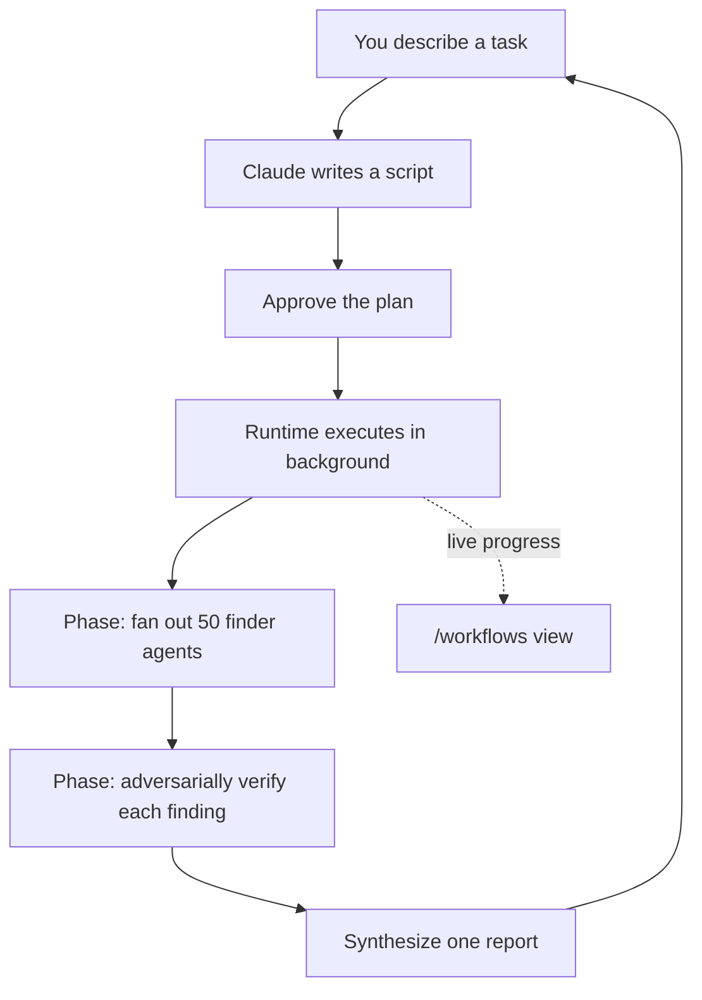

<LevelBadge level="advanced" />

<VerifyNote lastVerified="2026-06-28" source="https://code.claude.com/docs/en/workflows">
動的ワークフローは進化の速い機能です。トリガーとなるキーワード、承認オプション、エージェントの上限、利用可否は Claude Code のリリースごとに変わります。詳細は公式ドキュメントで確認してください。Claude Code v2.1.154 以降と有料プランが必要です。
</VerifyNote>

<Callout type="objectives" items={["プランを誰が持つかで、ワークフローをサブエージェント・スキル・エージェントチームと見分ける", "同梱の /deep-research コマンドで 30 秒のうちに実物を見る", "自分で始める 3 つの方法を知る：ultracode キーワード、/effort ultracode、保存したコマンド", "Yes を押す前に、承認プロンプトが何から守っているかを理解する", "スライスとアローリストでコストと無人実行を制御下に置く"]} />

**動的ワークフロー**とは、[サブエージェント](/docs/claude-code/subagents)を大規模にオーケストレーションする JavaScript スクリプトです。あなたがタスクを記述し、Claude が*スクリプトを書き*、ランタイムがそれをバックグラウンドで実行する間、セッションは応答可能なままです。通常の複数ステップのタスクは Claude のコンテキストウィンドウ内でターンごとに進行しますが、ワークフローは**プランをコードに移します** — ループ、分岐、そしてすべての中間結果がスクリプトの変数の中に存在するため、あなたのコンテキストには最終的な答えだけが残ります。

この一点の変化こそ、ワークフローが 1 回の実行で*数十から数百*のエージェントにスケールできる理由です。通常の委譲ではせいぜい数個が限界です。

## ワークフローを使うべきとき

Claude Code には複数ステップの作業を実行する方法が 4 つあります。本当の問いは**プランを誰が持つか**です。

| | [サブエージェント](/docs/claude-code/subagents) | [スキル](/docs/claude-code/skills) | エージェントチーム | **ワークフロー** |
| :-- | :-- | :-- | :-- | :-- |
| 何であるか | Claude が起動するワーカー | Claude が従う指示 | 対等なセッションを監督するリード | ランタイムが実行するスクリプト |
| 次に何を実行するか決めるのは | Claude、ターンごとに | Claude、プロンプトに従って | リード、ターンごとに | **スクリプト** |
| 結果が存在する場所 | コンテキストウィンドウ | コンテキストウィンドウ | 共有のタスクリスト | **スクリプトの変数** |
| スケール | 1 ターンに数個 | サブエージェントと同じ | 対等な数個 | **数十から数百** |
| 中断時 | ターンを再開 | ターンを再開 | チームメイトは実行を継続 | **セッション内で再開可能** |

タスクが**1 つの会話で調整できる以上のエージェント**を必要とするとき、あるいはオーケストレーションを**読んで再実行できるスクリプトとしてコード化したい**ときにワークフローを使います。代表的なケース：

- **コードベース全体のバグ掃討** — ファインダーをすべてのモジュールに展開し、各検出結果が報告される前に独立したエージェントが敵対的に検証する。
- **500 ファイルの移行** — 1 ファイルにつき 1 エージェント、それぞれが専用の worktree で動き、検証ステージを伴う。
- **リサーチの問い** — 情報源が単に要約されるのではなく、**互いに相互検証される**必要があるとき。
- **難しいプラン** — 複数の独立した角度から起草し、コミットする前に互いに比較する価値があるとき。

最後の点が過小評価されています：ワークフローは*繰り返し可能な品質パターン*（敵対的レビュー、複数角度からの起草、多数決による検証）を適用できるため、単一パスよりも信頼できる結果が得られます — 単にエージェントが増えるだけではありません。



## 一番速く実物を見る方法：/deep-research

Claude Code にはビルトインのワークフローが同梱されているので、モデルを試すために自分で書く必要はありません。どんな問いでも実行できます：

<PromptCard title="1 つのコマンドでワークフローを試す">{`/deep-research What changed in the Node.js permission model between v20 and v22?`}</PromptCard>

これは複数の角度にウェブ検索を展開し、情報源を取得して**相互検証**し、各主張に投票し、**相互検証を生き残れなかった主張を除外した、引用付きのレポート**を返します。プロンプトが出たら承認し、`/workflows` で動作を見守りましょう。（WebSearch ツールが利用可能である必要があります。）

## 自分で始める 3 つの方法

**1. 1 つのプロンプトで頼む。** キーワード `ultracode` を含めるか、平易な言葉で頼むだけです（"use a workflow"、"run a workflow"）。Claude はセッションの effort レベルを変えずに、その単一タスクのためのスクリプトを書きます：

<PromptCard title="1 つのタスクをワークフローとして実行する">{`ultracode: audit every API endpoint under src/routes/ for missing auth checks`}</PromptCard>

このキーワードは入力でハイライトされます。そのつもりではなかった場合は、`Option+W`（macOS）または `Alt+W`（Windows/Linux）を押すと、そのプロンプトのハイライトを解除できます。

:::note キーワードの履歴
v2.1.160 より前は、トリガーとなる文字どおりの単語は `workflow` でした。一般的な単語「workflow」が実行を発火させないよう、`ultracode` に改名されました。自然言語のリクエスト（"run a workflow"）は**両方の**バージョンで機能します。
:::

**2. Claude に判断させる — ultracode effort。** セッションを ultracode に設定すると、Claude は*すべての*実質的なタスクについてワークフローを計画し、いつ妥当かを自ら判断します：

<PromptCard title="セッションで自動オーケストレーションを有効にする">{`/effort ultracode`}</PromptCard>

ultracode は `xhigh` の[推論 effort](/docs/api/thinking-and-effort)と自動オーケストレーションを組み合わせたものです。1 つのリクエストが連続した複数のワークフローになることがあります — コードを理解するもの、変更を加えるもの、それを検証するもの。その分、すべてのタスクでより多くのトークンを使い、時間もかかるため、ルーチンの作業では `/effort high` に戻しましょう。これは現在のセッションでのみ有効です。

**3. 保存済みまたは同梱のコマンドを実行する。** `/deep-research`、または（後述のように）保存したワークフローは、ほかのスラッシュコマンドと同様に `/` のオートコンプリートに表示されます。

## 実行前に承認する

ワークフローは多数のエージェントを起動しうるため、CLI は計画されたフェーズを見せて先に確認します：

- **Yes, run it** — 実行を開始する
- **Yes, and don't ask again for `[name]` in `[path]`** — 開始し、このプロジェクトのこのワークフローについてはプロンプトをスキップする
- **View raw script**（`Ctrl+G` でエディタで開く） — 決める前に読む
- **No** — キャンセル（`Tab` で先にプロンプトを調整できる）

プロンプトが出るかどうかは[権限モード](/docs/claude-code/permissions)に依存します：**Default / accept-edits** は毎回プロンプトを出す（そのワークフローでオプトアウトしていない限り）；**Auto** は初回起動時のみ；**bypass / `claude -p` / Agent SDK** は決してプロンプトを出さず、実行は即座に開始します。

:::warning サブエージェントはセッションのモードを継承しない
セッションの権限モードが何であれ、ワークフローが起動するエージェントは常に **`acceptEdits`** で実行され、あなたの[ツールアローリスト](/docs/claude-code/permissions)を継承します — ファイル編集は自動承認されます。アローリストに*ない*シェルコマンド、ウェブ取得、MCP ツールは依然として実行を一時停止してプロンプトを出すことがあります。長い無人実行では、**エージェントが必要とするコマンドを開始前にアローリストへ追加して**、あなたを待って止まらないようにしましょう。[自律実行の堅牢化](/docs/security/hardening-autonomous-runs)を参照。
:::

## 実行のしくみ

ランタイムはスクリプトを**隔離された環境**で、あなたの会話とは別に実行します — 中間結果はスクリプトの変数の中に留まり、Claude のコンテキストに触れることはありません。スクリプト自体には**ファイルシステムやシェルへの直接アクセスはありません**：読み書きやコマンド実行を行うのは*エージェント*で、スクリプトはそれらを調整するだけです。

各実行は、そのスクリプトを `~/.claude/projects/` 内のセッションディレクトリにあるファイルへ書き出し、Claude にそのパスが渡されます。だから Claude にスクリプトを尋ねたり、Claude が書いたオーケストレーションを読んだり、前回の実行と差分を取ったり、編集して Claude に編集版から再起動するよう頼んだりできます。

ランタイムは、暴走するスクリプトを防ぐためにいくつかの上限を課しています：

| 制約 | 理由 |
| :-- | :-- |
| 実行中のユーザー入力なし（エージェントの権限プロンプトのみが一時停止させる） | ステージ間の承認には、各ステージを個別のワークフローとして実行する |
| スクリプトにファイルシステム/シェルへの直接アクセスなし | エージェントが作業し、スクリプトは調整する |
| 同時実行は最大 **16** エージェント（低コア機ではより少ない） | ローカルリソース使用を制限する |
| 1 回の実行あたり合計 **1,000** エージェント | 暴走ループを防ぐ |

## 実行を見守り、管理する

`/workflows` を実行すると、実行中および完了した実行が一覧表示され、1 つを選ぶとその進捗ビューが開きます — 各フェーズがエージェント数、トークン合計、経過時間とともに表示されます。フェーズへ、さらにエージェントへとドリルダウンすれば、そのプロンプト、最近のツール呼び出し、結果を読めます。主な操作：

| キー | アクション |
| :-- | :-- |
| `↑` / `↓` | フェーズまたはエージェントを選択 |
| `Enter` / `→` | ドリルイン；`Esc` で戻る |
| `f` | エージェントをステータスで絞り込む（v2.1.186 以降） |
| `p` | 実行を一時停止または再開 |
| `x` | 選択したエージェントを停止 — フォーカスが実行全体にあるときは実行全体を停止 |
| `r` | 選択した実行中のエージェントを再起動 |
| `s` | この実行のスクリプトをコマンドとして**保存** |

入力ボックスの下のタスクパネルにも 1 行の進捗サマリーが表示されます。下矢印でフォーカスし、Enter で展開します。

**再開：** 実行を停止して後で再開できます（`p`） — すでに完了したエージェントはキャッシュ済みの結果を返し、残りはライブで実行されます。再開は**同じセッション内**で機能します。実行の途中で Claude Code を終了すると、次のセッションでは最初から始まります。

## 再利用のためにワークフローを保存する

繰り返す作業のために Claude が良いオーケストレーションを書いたとき — すべてのブランチで実行するレビューなど — `/workflows` で `s` を押すと、その実行のスクリプトを保存できます。`Tab` で保存先を切り替えます：

- プロジェクト内の `.claude/workflows/` — リポジトリをクローンする全員と共有される
- ホーム内の `~/.claude/workflows/` — どこでも利用でき、自分だけが見える

それ以降は、将来のセッションで `/[name]` として実行されます。保存したワークフローは `args` グローバルを介して入力を受け取れるため、スクリプトを編集する代わりに呼び出し時にパラメータ化できます：

```text
> Run /triage-issues on issues 1024, 1025, and 1030
```

Claude はそのリストを構造化データとして渡すので、スクリプトは `args` に対して配列/オブジェクトのメソッドを直接呼び出せます。

## コストに気をつける

ワークフローは多数のエージェントを起動するため、1 回の実行は同じタスクを会話で行うよりも**意味のある分だけ多くのトークン**を使い、プランの使用量とレート制限に算入されます。次の 2 つの習慣でこれを健全に保てます：

- **まずスライスする。** 支出を測るために、まずは（リポジトリ全体ではなく）1 つのディレクトリ、あるいは狭い問いで実行します。`/workflows` はエージェントごとのトークン使用量をライブで表示し、完了済みの作業を失わずにいつでも停止できます。
- **モデルを適正サイズにする。** スクリプトがあるステージを別のモデルへ振り分けない限り、すべてのエージェントはセッションのモデルを使います。大きな実行の前に `/model` を確認し、タスクを記述するときは、**最も強力なモデルを必要としないステージには小さいモデルを使う**よう Claude に頼みましょう。[コストとレイテンシー](/docs/foundations/cost-and-latency)と[モデルの選択](/docs/api/choosing-a-model)を参照。

## よくある間違い

- **実行の途中に人間の介在を期待する。** 実行中の入力はありません。ステージ間であなたの承認が必要なタスクは、別々のワークフローに分割しましょう。
- **無人実行でアローリストを忘れる。** 長いワークフローは、エージェントがアローリストにないシェルコマンドに当たった瞬間に止まります。エージェントが必要とするものを事前に承認しておきましょう。
- **サブエージェントで足りるのにワークフローに手を伸ばす。** 1 ターンに数個の委譲タスクは[サブエージェント](/docs/claude-code/subagents)の役目です。ワークフローがそのオーバーヘッドに見合うのは*艦隊*規模のとき、あるいはオーケストレーションを再実行可能なスクリプトとして保存したいときです。
- **ルーチンの編集にセッション中ずっと ultracode effort を使う。** これはすべてについてワークフローを計画します — 難しい作業には最適ですが、1 行の修正には無駄です。`/effort high` に落としましょう。

## ワークフローをオフにする

`/config` で **Dynamic workflows** をオフにするか、`~/.claude/settings.json` で `"disableWorkflows": true` を設定するか、環境変数 `CLAUDE_CODE_DISABLE_WORKFLOWS=1` を設定します。組織は[管理設定](/docs/claude-code/settings)で無効にできます。オフのとき、同梱のワークフローコマンドは消え、`ultracode` はもはや実行を発火させず、`/effort` メニューにも現れません。

## 次へ

- [サブエージェントと並列エージェント](/docs/claude-code/subagents) — ワークフローがオーケストレーションするワーカーのプリミティブ
- [複数サブエージェントのワークフローを設計する（ウォークスルー）](/docs/walkthroughs/multi-subagent-workflow)
- [長時間実行のエージェントハーネス](/docs/frontiers/long-running-agent-harnesses) — 耐久性のあるマルチエージェント実行の背後にある設計原則
- [自律実行の堅牢化](/docs/security/hardening-autonomous-runs)
