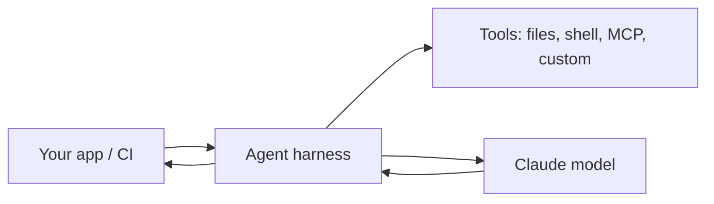

<LevelBadge level="advanced" />

<VerifyNote lastVerified="2026-06-20" source="https://code.claude.com/docs/en/sdk">
SDK 名、パッケージ名、ヘッドレスのフラグは進化します。公式の Claude Agent SDK / Claude Code ドキュメントで確認してください。
</VerifyNote>

Claude Code はインタラクティブなだけではありません。**ヘッドレス**（非インタラクティブで、スクリプト化可能）で実行でき、さらに **Agent SDK** を使って、同じ基盤ハーネスの上に **独自のエージェント** を構築できます。

## ヘッドレスモード

単一のプロンプトを非インタラクティブに実行し、その出力を取得します — スクリプト、pre-commit フック、CI に最適です。

```bash
claude -p "Review the staged diff and list any bugs as a Markdown checklist"
```

入力をパイプで渡し、結果を受け取ります。[権限](/docs/claude-code/permissions) を安全で非インタラクティブな姿勢に設定して組み合わせれば、承認待ちでハングすることがなくなります — そして、自動実行がシークレットに触れられないよう **ロックダウン** しましょう（[自律実行のハードニング](/docs/security/hardening-autonomous-runs) を参照）。

典型的な使い方: Claude にすべてのプルリクエストをレビューさせる CI ジョブ — [PR レビューのウォークスルー](/docs/walkthroughs/pr-review-action) を参照してください。

## Agent SDK

**Claude Agent SDK**（Python と TypeScript）を使うと、Claude Code を動かしているのと同じループ — ツール使用、ファイル/シェルアクセス、権限、コンテキスト管理 — の上に本番向けエージェントを構築できます。ただし、それが *あなたの* アプリケーションに組み込まれます。



単一の API 呼び出しや手作りのループでは手に負えなくなり、必要なものが揃ったエージェントランタイムが欲しくなったときに、これに手を伸ばしましょう。選択肢の幅 — 単一呼び出し → ワークフロー → カスタムエージェント → マネージド — については [API でエージェントを構築する](/docs/api/building-agents) を参照してください。

## ヘッドレス/SDK vs インタラクティブ

| モード | 対象 |
|---|---|
| インタラクティブな Claude Code | 人間が介在する日々の開発 |
| ヘッドレス（`claude -p`） | スクリプト、pre-commit、CI の単発処理 |
| Agent SDK | 自社ソフトウェアに組み込まれた本番向けエージェント |

## 次に

- [すべての PR をレビューする GitHub Action（ウォークスルー）](/docs/walkthroughs/pr-review-action)
- [API でエージェントを構築する](/docs/api/building-agents)
- [自律実行のハードニング](/docs/security/hardening-autonomous-runs)
