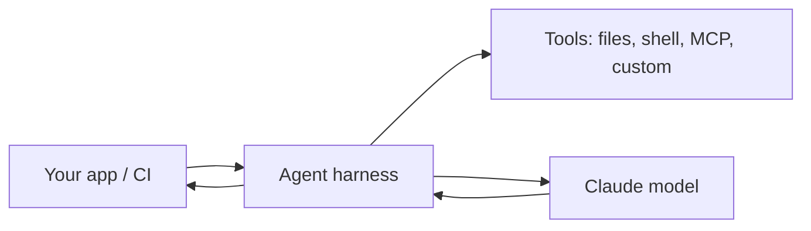

<LevelBadge level="advanced" />

<VerifyNote lastVerified="2026-07-17" source="https://code.claude.com/docs/en/agent-sdk/overview">
SDK の名称、パッケージ名、ヘッドレス用フラグは変化していきます。公式の Claude Agent SDK / Claude Code ドキュメントで確認してください。
</VerifyNote>

Claude Code はインタラクティブに使うだけのものではありません。**ヘッドレス**(非インタラクティブでスクリプト化可能)で実行することも、**Agent SDK** を使って同じ基盤ハーネス上に**独自のエージェント**を構築することもできます。

<Callout type="objectives" items={["単一のプロンプトを非インタラクティブに実行し、その出力を取得する方法","無人実行には、インタラクティブのデフォルトではなく、意図的な権限方針が必要な理由","1 回限りの呼び出しでは足りなくなり、代わりに Agent SDK を使うべきタイミング","3 つのモードを並べて比較し、習慣ではなく意図して選ぶ方法"]} />

## ヘッドレスモード

単一のプロンプトを非インタラクティブに実行して出力を取得します。スクリプト、pre-commit フック、CI に最適です。

<PromptCard title="スクリプトからステージ済みの diff をレビューする">
{`claude -p "Review the staged diff and list any bugs as a Markdown checklist"`}
</PromptCard>

入力をパイプで渡し、結果を受け取ります。承認待ちでハングしないよう、[権限](/docs/claude-code/permissions)を安全な非インタラクティブの方針に設定して組み合わせ、さらに自動実行がシークレットに触れないよう**厳重に絞り込んでください**([自律実行の堅牢化](/docs/security/hardening-autonomous-runs)を参照)。

<Steps items={[
  {title: "-p と絞り込んだプロンプトから始める", body: "1 つのプロンプトに 1 つの答えを返して終了します。尋ねてくれる UI がないため、ヘッドレス実行に必要なものはすべてフラグで指定します。"},
  {title: "権限の方針を最初に決める", body: "インタラクティブセッションはあなたに尋ねますが、CI ジョブには尋ねる相手がいません。タスクが本当に必要とするツールに対して明示的な許可ルールを設定し、答えられないプロンプトが実行を停滞させるのではなく終了させるようにしてください。"},
  {title: "実行に上限をつける", body: "ターン数と支出に上限を設け、うまくいかないループが、数時間と数ドルではなく、数分と数セントで済むようにします。"},
  {title: "構造化された出力を求める", body: "文章をパースするスクリプトは、壊れるスクリプトです。JSON(またはスキーマ)を要求し、結果が設計上、機械可読になるようにします。"},
  {title: "到達できる範囲を堅牢化する", body: "シークレット、ネットワーク、書き込みアクセスは、無人実行に最小限しか与えるべきでない 3 つです。「自律実行の堅牢化」を参照してください。"}
]} />

各ステップの正確なフラグと、そこにある落とし穴は、[claude CLI:結果を左右するフラグ](/docs/claude-code/cli-flags)にあります。これらすべてを組み合わせた典型的な使い方が、Claude にすべてのプルリクエストをレビューさせる CI ジョブです。[PR レビューのウォークスルー](/docs/walkthroughs/pr-review-action)を参照してください。

## Agent SDK

**Claude Agent SDK**(Python と TypeScript)を使うと、Claude Code を動かしているのと同じループ(ツール使用、ファイル/シェルアクセス、権限、コンテキスト管理)の上に本番向けのエージェントを構築し、*あなたの*アプリケーションに組み込めます。

```mermaid
flowchart LR
  A[Your app / CI] --> H[Agent harness]
  H --> T[Tools: files, shell, MCP, custom]
  H --> L[Claude model]
  L --> H --> A
```

単一の API 呼び出しや自作のループでは足りなくなり、すべてが揃ったエージェントのランタイムが欲しくなったときに使います。選択肢の全体像(単一の呼び出し → ワークフロー → カスタムエージェント → マネージド)については、[API でエージェントを構築する](/docs/api/building-agents)を参照してください。

## ヘッドレス/SDK とインタラクティブの比較

| モード | 用途 |
|---|---|
| インタラクティブな Claude Code | 人が介在する日々の開発 |
| ヘッドレス(`claude -p`) | スクリプト、pre-commit、CI の単発処理 |
| Agent SDK | ソフトウェアに組み込む本番向けエージェント |

## 理解度チェック

<Quiz questions={[
  {
    q: "ヘッドレス実行とインタラクティブセッションを分ける決定的な違いは何ですか?",
    options: [
      "ヘッドレスはより小さなモデルを使う",
      "ヘッドレスはツールを使えない",
      "プロンプトに答える人がいないため、権限の方針を事前に決めておかなければならない",
      "ヘッドレス実行は CLAUDE.md をスキップする"
    ],
    answer: 2,
    explain: "ハーネスは同じです。変わるのは、インタラクティブセッションならあなたに委ねられるはずのあらゆる判断を、実行開始前に設定で決着させておかなければならない点です。だからこそ、無人実行には明示的な権限、ターン数、支出の設定が必要なのです。"
  },
  {
    q: "CI に 1 回限りの `claude -p` 呼び出しがあり、同じロジックを、カスタムツールと独自の権限処理を備えた自社プロダクトに組み込みたくなりました。何を使いますか?",
    options: [
      "より長い -p プロンプト",
      "Agent SDK。ツール使用、ファイルとシェルへのアクセス、権限、コンテキスト管理という同じループを、アプリケーション内で利用できる",
      "最初の呼び出しにパイプでつなぐ 2 つ目の -p 呼び出し",
      "エージェントループのない Messages API"
    ],
    answer: 1,
    explain: "まさにそれが両者の境目です。1 回限りの -p 呼び出しは、スクリプトが CLI を呼ぶものです。Agent SDK は、同じハーネスを、組み込んで制御できるランタイムとして提供します。「API でエージェントを構築する」で選択肢の全体像を整理しています。"
  }
]} />

<Callout type="takeaways" items={["ヘッドレスとは、人を取り除いた同じハーネスのこと。人が決めるはずだったことは、すべて設定になります。","権限を絞り、ターン数と支出に上限をつけ、構造化された出力を求める。この 4 つはすべて、慣習ではなくフラグです。","スクリプトからの CLI 呼び出しではなく、ループを自社のアプリケーション内に置きたくなったら、Agent SDK に移行しましょう。","無人実行は、機能であると同時にセキュリティ上の姿勢でもあります。スケジュールする前に、到達できる範囲を堅牢化してください。"]} />

## 次に読む

- [claude CLI:結果を左右するフラグ](/docs/claude-code/cli-flags) — 無人実行のための 5 つのフラグの契約
- [すべての PR をレビューする GitHub Action(ウォークスルー)](/docs/walkthroughs/pr-review-action)
- [API でエージェントを構築する](/docs/api/building-agents)
- [自律実行の堅牢化](/docs/security/hardening-autonomous-runs)
