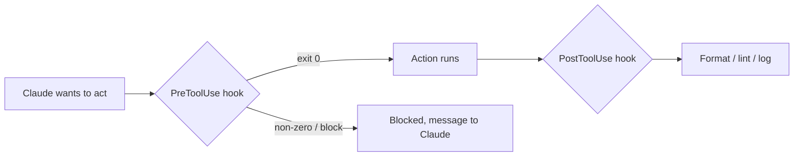

<LevelBadge level="advanced" />

<VerifyNote lastVerified="2026-06-20" source="https://code.claude.com/docs/en/hooks">
正確なフックのイベント名や設定スキーマは進化します。特定のイベントに依存する前に、公式のフックドキュメントと照らし合わせて確認してください。
</VerifyNote>

フックは、ライフサイクルの定められた地点で **Claude Code が自動的に実行するシェルコマンド** です。[権限](/docs/claude-code/permissions) があるアクションを許可するか *どうか* を決めるのに対し、フックはその周りで *あなた* が決定論的なロジック — フォーマット、検証、ロギング、ゲート — を実行できるようにします。「忘れずにやってね」ではなく、挙動を保証する方法です。

## フックに手を伸ばすべきとき

- すべてのファイル編集後に **自動フォーマット / lint**（`PostToolUse`）。
- ルールに違反するアクションを、実行前に **ブロック** する（`PreToolUse`）。
- セッション終了時やタスク完了時に **通知またはログ** を残す（`Stop`）。
- セッション開始時に **コンテキストを注入** する。

## 仕組み

[`settings.json`](/docs/claude-code/settings) でフックを登録し、**イベント**（そしてしばしばツールのマッチャー）に一致させます。イベントが発火すると、Claude はあなたのコマンドを実行し、その結果を読みます — 非ゼロの終了コードや特定の出力は、アクションを **ブロック** し、メッセージを Claude にフィードバックできます。

```json
{
  "hooks": {
    "PostToolUse": [
      {
        "matcher": "Edit|Write",
        "hooks": [
          { "type": "command", "command": "npx prettier --write \"$CLAUDE_FILE_PATH\"" }
        ]
      }
    ]
  }
}
```

フックは、コンテキスト（例: ファイルパス、ツール名）を環境変数/stdin 経由で受け取ります — 正確なペイロードはイベントによって異なるので、ドキュメントを参照してください。

## メンタルモデル



## 良いプラクティス

- **フックは高速かつ冪等に保つ** — 何度も実行されます。
- **本当の問題には大声で失敗** しつつ、見た目だけの問題ではブロックしないこと。
- **フックの出力を Claude へのフィードバックとして扱う** — 明確なメッセージは自己修正を助けます。
- フックはあなたのシェルの権限で実行されます — 自分が書いていないフックはレビューしましょう（[サードパーティコードのレビュー](/docs/security/reviewing-third-party-code)）。

コピペできる出発点は [フックと settings.json のレシピ](/docs/templates/hooks-settings) にあります。

## 次に

- [settings.json](/docs/claude-code/settings) · [権限](/docs/claude-code/permissions)
- [スキル](/docs/claude-code/skills) — 専門知識 vs 自動化
- [自律実行のハードニング](/docs/security/hardening-autonomous-runs)
