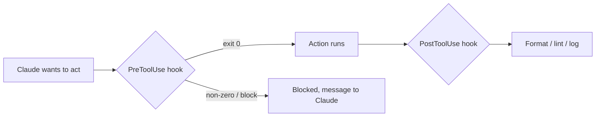

<LevelBadge level="advanced" />

<VerifyNote lastVerified="2026-06-23" source="https://code.claude.com/docs/en/hooks">
正確なフックのイベント名、stdin のペイロード、ブロッキングプロトコルは進化します。特定のイベントやフィールドに依存する前に、公式のフックドキュメントと照らし合わせて確認してください。
</VerifyNote>

フックは、ライフサイクルの定められた地点で **Claude Code が自動的に実行するシェルコマンド**です。[権限](/docs/claude-code/permissions) があるアクションを許可するか*どうか*を決めるのに対し、フックはその周りで*あなた*が決定論的なロジック — フォーマット、検証、ロギング、ゲート — を実行できるようにします。「忘れずにやってね」ではなく、挙動を保証する方法です。

## フックに手を伸ばすべきとき

- すべてのファイル編集後に **自動フォーマット / lint**（`PostToolUse`）。
- ルールに違反するアクションを、実行前に **ブロック** する（`PreToolUse`）。
- セッション終了時やタスク完了時に **通知またはログ** を残す（`Stop`）。
- セッション開始時に **コンテキストを注入** する。

## 仕組み

[`settings.json`](/docs/claude-code/settings) でフックを登録し、**イベント**（そしてしばしばツールのマッチャー）に一致させます。イベントが発火すると、Claude はあなたのコマンドを実行し、**stdin に JSON ペイロード**（ツール名、その入力、セッション）を渡します。コマンドの終了コードと出力が、次に何が起こるかを決めます。

```json
{
  "hooks": {
    "PostToolUse": [
      {
        "matcher": "Edit|Write",
        "hooks": [
          { "type": "command", "command": "jq -r '.tool_input.file_path' | xargs npx prettier --write" }
        ]
      }
    ]
  }
}
```

上記のフックは、stdin の JSON（`.tool_input.file_path`）から編集されたファイルのパスを読み取り、それをフォーマットします。環境変数にパスが入っていると仮定してはいけません — **stdin から読み取ってください。** スクリプトの場所を特定するための `${CLAUDE_PROJECT_DIR}` のような便利なパスプレースホルダーは利用できます。

## フックがブロックする仕組み

イベントに応じて 2 つの方法があります。

- **終了コード 2** — フックはアクションを失敗させ、**stderr** に書き込んだ内容が Claude に見えるメッセージになります。シンプルで、コマンドフックで機能します。
- **stdout への JSON（終了コード 0）** — 構造化された決定を返します。`PreToolUse` では `deny` の `permissionDecision`、`PostToolUse` / `Stop` などでは `{"decision": "block", "reason": "…"}` です。

```bash
#!/usr/bin/env bash
# PreToolUse hook on the Bash tool: refuse to delete things.
command=$(jq -r '.tool_input.command' < /dev/stdin)
if [[ "$command" == rm\ * || "$command" == *"rm -rf"* ]]; then
  echo "Blocked: destructive 'rm' is not allowed by policy." >&2
  exit 2
fi
exit 0
```

## メンタルモデル



## 良いプラクティス

- **フックは高速かつ冪等に保つ** — 何度も実行されます。
- **本当の問題には大声で失敗** しつつ、見た目だけの問題ではブロックしないこと。
- **フックの出力を Claude へのフィードバックとして扱う** — 明確なメッセージは自己修正を助けます。
- フックはあなたのシェルの権限で実行されます — 自分が書いていないフックはレビューしましょう（[サードパーティコードのレビュー](/docs/security/reviewing-third-party-code)）。

## よくある間違い

- **環境変数からファイルパスを読む。** パスは stdin の JSON（`.tool_input.file_path`）にあり、`$CLAUDE_FILE_PATH` にはありません。stdin を `jq` にパイプしてください。
- **サイレントなブロック。** `PreToolUse` フックが stderr に何も出さずに終了コード 2 で終わると、Claude はブロックされても*なぜ*かが分からず、適応できません。常に明確な理由を書いてください。
- **遅いフック。** `PostToolUse` フックはマッチする*すべての*編集の後に実行されます。3 秒かかる linter はセッション全体をもたつかせます — フックを高速に保ち、理想的には変更された部分だけに作用させてください。
- **広すぎるマッチャー。** `matcher: ".*"` はすべてのツールで発火します。正確な名前、`Edit|Write` のリスト、またはハンドラーごとの `if` フィールド（例: `"if": "Bash(git push *)"`）で絞り込んでください。
- **自分が書いていないフックを信頼する。** フックはあなたの権限で任意のシェルを実行します。プラグインやテンプレートのフックはまずレビューしてください — [サードパーティコードのレビュー](/docs/security/reviewing-third-party-code) を参照してください。

コピペできる出発点は [フックと settings.json のレシピ](/docs/templates/hooks-settings) にあります。

## 次に

- [settings.json](/docs/claude-code/settings) · [権限](/docs/claude-code/permissions)
- [スキル](/docs/claude-code/skills) — 専門知識 vs 自動化
- [自律実行のハードニング](/docs/security/hardening-autonomous-runs)
