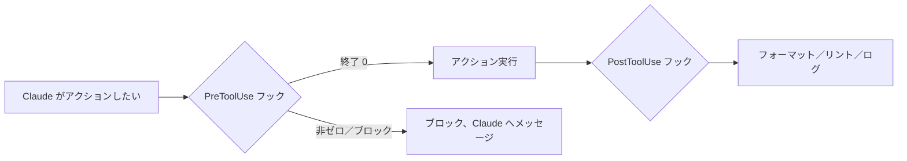

<LevelBadge level="advanced" />

<VerifyNote lastVerified="2026-06-23" source="https://code.claude.com/docs/en/hooks">
正確なフックイベント名、stdin のペイロード、ブロックのプロトコルは進化します。特定のイベントやフィールドに依存する前に公式のフックドキュメントで確認してください。
</VerifyNote>

フックは、ライフサイクルの定められたポイントで **Claude Code が自動的に実行するシェルコマンド**です。[権限](/docs/claude-code/permissions)がアクションを許可するか*どうか*を決めるのに対し、フックはその周りで*あなた*が決定論的なロジックを実行できるようにします——フォーマット、検証、ロギング、ゲート。これが「忘れずにやってください」ではなく、振る舞いを保証する方法です。

<Callout type="objectives" items={["指示や権限ではなくフックに手を伸ばすべきとき", "フックの配線方法：イベント、マッチャー、そして stdin の JSON ペイロード", "フックがアクションをブロックする 2 つの方法——終了コード 2 と stdout の JSON", "高速で安全なフックを、もたつく無口なフックから分ける良い習慣とよくある間違い"]} />

## いつフックに手を伸ばすか

振る舞いを単に要求するのではなく*保証*したいときにフックに手を伸ばします。よくある仕事はそれぞれライフサイクルイベントに対応します：

- ファイル編集のたびに**自動フォーマット／リント**（`PostToolUse`）。
- ルールに違反するアクションを実行前に**ブロック**（`PreToolUse`）。
- セッション終了やタスク完了時に**通知またはログ**（`Stop`）。
- セッション開始時に**コンテキストを注入**。

<Flashcards title="フックイベント一覧" cards={[{front: "PreToolUse", back: "アクションが実行される前に発火する。ブロックやゲートに使う——例：破壊的なコマンドを実行前に拒否する。"}, {front: "PostToolUse", back: "マッチしたアクションの後に発火する。変更された内容をフォーマット、リント、ログするのに使う。"}, {front: "Stop", back: "セッション終了やタスク完了時に発火する。通知やログに使う。"}, {front: "セッション開始", back: "セッションの開始時に発火する。コンテキストの注入に使う。"}]} />

## どう動くか

[`settings.json`](/docs/claude-code/settings) でフックを登録し、**イベント**（そしてしばしばツールマッチャー）にマッチさせます。イベントが発火すると、Claude はあなたのコマンドを実行し、**stdin に JSON ペイロード**（ツール名、その入力、セッション）を渡します。あなたのコマンドの終了コードと出力が、次に何が起きるかを決めます。

<Steps items={[{title: "イベントにマッチさせる", body: "気にするライフサイクルイベントの下に settings.json でフックを登録します——たとえば PostToolUse。"}, {title: "マッチャーで絞り込む", body: "ツールマッチャーを追加し、関連するツールだけでフックが発火するようにします。例：ファイル編集には matcher \"Edit|Write\"。"}, {title: "stdin からペイロードを読む", body: "イベントが発火すると、Claude はあなたのコマンドを実行し、stdin に JSON ペイロード——ツール名、その入力、セッション——をパイプします。"}, {title: "次に何が起きるか決める", body: "あなたのコマンドの終了コードと出力が結果を決めます：アクションを進めさせる、ロジックを実行する、またはブロックする。"}]} />

```json
{
  "hooks": {
    "PostToolUse": [
      {
        "matcher": "Edit|Write",
        "hooks": [
          { "type": "command", "command": "jq -r '.tool_input.file_path' | xargs npx prettier --write" }
        ]
      }
    ]
  }
}
```

上のフックは編集されたファイルのパスを stdin の JSON（`.tool_input.file_path`）から読み取り、フォーマットします。環境変数がパスを保持していると仮定してはいけません——**stdin から読んでください。** `${CLAUDE_PROJECT_DIR}` のような便利なパスのプレースホルダーはスクリプトの場所特定のために*利用できます*。

## フックはどうブロックするか

イベントに応じて 2 通りあります：

- **終了コード 2** — フックがアクションを失敗させ、**stderr** に書いたものが Claude が見るメッセージになります。シンプルで、コマンドフックで機能します。
- **stdout の JSON（終了 0）** — 構造化された決定を返します。`PreToolUse` では `permissionDecision` が `deny`、`PostToolUse`／`Stop` などでは `{"decision": "block", "reason": "…"}` です。

以下のスクリプトは Bash ツールに対する `PreToolUse` フックです。上から下に読んでください：stdin からコマンドを取り出し、破壊的に見えるなら理由を stderr に書いて終了コード 2 でブロックします。

```bash
#!/usr/bin/env bash
# PreToolUse hook on the Bash tool: refuse to delete things.
command=$(jq -r '.tool_input.command' < /dev/stdin)
if [[ "$command" == rm\ * || "$command" == *"rm -rf"* ]]; then
  echo "Blocked: destructive 'rm' is not allowed by policy." >&2
  exit 2
fi
exit 0
```

## メンタルモデル

`PreToolUse` フックはアクションの*前*に実行されブロックできます。`PostToolUse` フックはアクションが成功した*後*に実行され、結果に反応します。



## 良い習慣

- **フックを高速かつ冪等に保つ** — 頻繁に実行されます。
- **本当の問題には声高に失敗する**が、表面的な問題ではブロックしないこと。
- **フックの出力を Claude へのフィードバックとして扱う** — 明確なメッセージが自己修正を助けます。
- フックはあなたのシェルの権限で実行されます——自分で書いていないフックはレビューしてください（[サードパーティコードのレビュー](/docs/security/reviewing-third-party-code)）。

## よくある間違い

- **ファイルパスを環境変数から読む。** パスは stdin の JSON（`.tool_input.file_path`）にあり、`$CLAUDE_FILE_PATH` にはありません。stdin を `jq` に通してください。
- **無口なブロック。** `PreToolUse` フックが stderr に何も書かず終了コード 2 で終わると、Claude はブロックされるのに*理由*が分からず適応できません。常に明確な理由を書いてください。
- **遅いフック。** `PostToolUse` フックは*すべての*マッチする編集の後に実行されます。3 秒かかるリンターはセッション全体をもたつかせます——フックを高速に保ち、理想的には変更されたものだけに作用させましょう。
- **広すぎるマッチャー。** `matcher: ".*"` はすべてのツールで発火します。正確な名前、`Edit|Write` リスト、またはハンドラーごとの `if` フィールド（例：`"if": "Bash(git push *)"`）で絞り込んでください。
- **自分で書いていないフックを信頼する。** フックはあなたの権限で任意のシェルを実行します。プラグインやテンプレートのフックはまず読んでください——[サードパーティコードのレビュー](/docs/security/reviewing-third-party-code)を参照。

<Callout type="warning" items={["フックはあなたの権限で任意のシェルを実行します——プラグインやテンプレートのフックを、まず読まずに配線しないでください。"]} />

コピー＆ペーストできるスターターは[フックと settings.json のレシピ](/docs/templates/hooks-settings)にあります。

<PromptCard title="編集したファイルを自動フォーマット（Edit|Write の PostToolUse）">{`{
  "hooks": {
    "PostToolUse": [
      {
        "matcher": "Edit|Write",
        "hooks": [
          { "type": "command", "command": "jq -r '.tool_input.file_path' | xargs npx prettier --write" }
        ]
      }
    ]
  }
}`}</PromptCard>

<Quiz title="確認しよう" questions={[{q: "フックは、たった今編集されたファイルのパスをどこで見つけますか？", options: ["$CLAUDE_FILE_PATH 環境変数の中", "stdin の JSON ペイロード、.tool_input.file_path の位置", "Claude が渡すコマンドライン引数の中"], answer: 1, explain: "パスは stdin の JSON（.tool_input.file_path）にあり、環境変数にはありません。stdin を jq に通して読みます。"}, {q: "PreToolUse フックが終了コード 2 で終了します。何が起きますか？", options: ["アクションは許可され stdout がログされる", "アクションはブロックされ、フックが stderr に書いたものが Claude が見るメッセージになる", "終了 2 は予約済みなので Claude は結果を無視する"], answer: 1, explain: "終了コード 2 はアクションを失敗させ、stderr が Claude が見るメッセージになります。Claude が適応できるよう常に明確な理由を書きましょう。"}, {q: "なぜ matcher \".*\" はよくある間違いとされるのですか？", options: ["無効な JSON で settings.json を壊すから", "すべてのツールで発火し、フックが意図よりはるかに多く実行されるから——正確な名前、Edit|Write リスト、または if フィールドで絞り込む", "Bash ツールにしかマッチしないから"], answer: 1, explain: "広すぎるマッチャーはすべてのツールで発火します。フックを高速かつ狙いを絞って保つために絞り込みましょう。"}]} />

<Callout type="takeaways" items={["フックは振る舞いを要求ではなく保証する——権限が許可／拒否するだけのアクションの周りで決定論的なロジックを実行する。", "settings.json でイベントとマッチャーに対してフックを登録する。Claude が stdin に JSON ペイロードをパイプし、あなたの終了コードと出力を読む。", "ファイルパスは stdin（.tool_input.file_path）から読む——環境変数からではない。", "終了コード 2（stderr がメッセージになる）または stdout の構造化 JSON（終了 0）でブロックする。常に明確な理由を含める。", "フックを高速、冪等、狭くマッチさせて保つ——そして自分で書いていないフックはレビューする。あなたのシェルの権限で実行されるため。"]} />

## 次へ

- [settings.json](/docs/claude-code/settings) · [権限](/docs/claude-code/permissions)
- [スキル](/docs/claude-code/skills) — 専門知識 vs 自動化
- [自律実行のハードニング](/docs/security/hardening-autonomous-runs)
