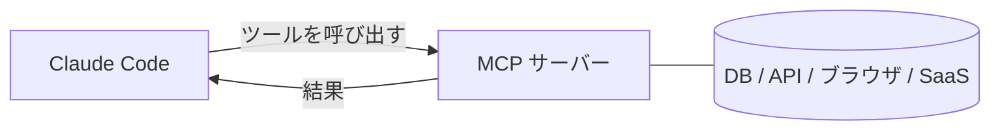

<LevelBadge level="advanced" />

<VerifyNote lastVerified="2026-06-23" source="https://code.claude.com/docs/en/mcp">
`claude mcp` コマンド、設定スコープ、トランスポートは進化し続けています。公式の Claude Code MCP ドキュメントと modelcontextprotocol.io で確認してください。
</VerifyNote>

**Model Context Protocol (MCP)** は、AI を外部ツールやデータに接続するためのオープンな標準です。**MCP サーバー** は機能（データベースへのクエリ、GitHub PR のオープン、ブラウザの操作）を公開します。Claude Code はそれに接続し、セッション中に **それらのツールを呼び出せ** ます。これが、Claude をファイルシステムやシェルの先へと拡張する方法です。

## その姿



Claude が使ってよいサーバーを宣言します。各サーバーはスキーマ付きのツールのセットを公開します。Claude は他のツールと同じように、それらを選んで呼び出します。

## トランスポート

- **stdio** — Claude が起動するローカルプロセス（ローカルのツール/CLI に最適）。
- **リモート（HTTP/SSE）** — ホストされたサーバー。多くの場合 OAuth を伴います。

## サーバーの設定

最も手早い方法は `claude mcp add` コマンドです。設定をあなたの代わりに書き込んでくれます:

```bash
# ローカルの stdio サーバー（-- 以降はすべて起動コマンド）
claude mcp add github -- npx -y @modelcontextprotocol/server-github

# リモートの HTTP サーバー、プロジェクトの全員と共有
claude mcp add --transport http --scope project linear https://mcp.linear.app/mcp
```

その実体は単なる JSON です。**project** スコープのサーバーはリポジトリのルートにある `.mcp.json` に書き込まれます。これをコミットすれば、チーム全員が同じツールを得られます:

```json
{
  "mcpServers": {
    "github": { "command": "npx", "args": ["-y", "@modelcontextprotocol/server-github"] }
  }
}
```

**スコープが、誰がそのサーバーを利用できるかを決めます:**

| スコープ | 保存場所 | 用途 |
|---|---|---|
| `local`（デフォルト） | あなたのユーザー設定、このプロジェクトのみ | 個人的な実験、シークレット |
| `project` | リポジトリ内の `.mcp.json`（コミット済み） | チーム全員で共有すべきツール |
| `user` | あなたのユーザー設定、すべてのプロジェクト | どこでも使いたいサーバー |

`claude mcp list` を実行すると接続中のものを確認でき、セッション内で `/mcp` を使うとツールを調べたりリモートサーバーの認証を行ったりできます。コピペできる出発点は [MCP 設定とサーバーの雛形](/docs/templates/mcp-config) を参照してください。

## 実践例: Claude にデータベースを渡す

クエリ結果を貼り付ける代わりに、ローカルの Postgres に対して Claude に質問に答えさせたいとしましょう。サーバーを追加します（project スコープにして、チームメイトが引き継げるように）:

```bash
claude mcp add --scope project db -- npx -y @modelcontextprotocol/server-postgres "postgresql://localhost/app"
```

これで、セッション内でこう尋ねられます: *「先週サインアップしたユーザーは何人？ DB を確認して。」* Claude はサーバーの `query` ツールを呼び出し、行を取得して答えます。コピペのループは不要です。project スコープなので、リポジトリを pull したチームメイトは Claude Code を開いた瞬間に同じ機能を手に入れます。読み取りだけにしたい場合は、接続文字列を読み取り専用にしておきましょう。

## 信頼とセキュリティ

:::warning MCP サーバーはソフトウェアのインストールと同じように扱う
MCP サーバーはコードを実行し、データを読み、アクションを取れます。信頼するサーバーだけを接続し、必要な **最小権限** を与え、そして、サーバーが返す外部コンテンツはすべて [プロンプトインジェクション](/docs/security/prompt-injection) を運びうることを忘れないでください。サードパーティのサーバーは先にレビューしましょう — [サードパーティコードのレビュー](/docs/security/reviewing-third-party-code) を参照してください。
:::

## アプリにおける MCP

MCP は、Claude アプリの **コネクタ** も動かしています — 同じ標準、異なるインターフェースです。[アプリにおけるコネクタ（MCP）](/docs/claude-app/connectors) を、API については [MCP とツールへの接続](/docs/api/mcp) を参照してください。

## よくある間違い

- **スコープの誤り。** `local` スコープで追加したサーバーはチームメイトには表示されません。自分だけが使いたいものを `project` スコープでコミットすべきではありません。意図的に選びましょう。
- **サーバーが多すぎる、ツールが多すぎる。** 接続された各サーバーはそのツールスキーマをコンテキストに追加します。カタログ全体ではなく、タスクに必要なものだけを接続しましょう。
- **過剰な権限を持つ接続。** Claude が本当に書き込みを必要とするのでない限り、データベースサーバーには読み取り専用のロールを与えましょう。MCP は機能を現実のものにします。スコープを絞り込みましょう。
- **インジェクションのリスクを忘れる。** サーバーが返すもの（Web ページ、issue の本文、1 行のデータ）はすべて、[プロンプトインジェクション](/docs/security/prompt-injection) を運びうる信頼できないテキストです。よく考えずに、強力な書き込み可能なサーバーを、信頼できない読み取り可能なサーバーのそばに配線しないでください。

## 次に

- [はじめての MCP サーバーを構築して接続する（ウォークスルー）](/docs/walkthroughs/first-mcp-server)
- [MCP 設定とサーバーの雛形](/docs/templates/mcp-config)
- [エージェントとツールのセキュリティ](/docs/security/securing-agents)
