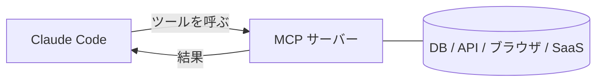

<LevelBadge level="advanced" />

<VerifyNote lastVerified="2026-06-23" source="https://code.claude.com/docs/en/mcp">
`claude mcp` コマンド、構成スコープ、トランスポートは進化します。公式の Claude Code MCP ドキュメントと modelcontextprotocol.io で確認してください。
</VerifyNote>

**Model Context Protocol（MCP）** は、AI を外部のツールやデータに接続するためのオープン標準です。**MCP サーバー**は機能（データベースへのクエリ、GitHub PR のオープン、ブラウザの操作）を公開します。Claude Code はそれに接続し、セッション中に**それらのツールを呼び出せます**。これがファイルシステムとシェルを超えて Claude を拡張する方法です。

<Callout type="objectives" items={["MCP サーバーとは何か、Claude Code がそのツールをどう呼び出すかを説明する", "2 つのトランスポートを見分ける：ローカルの stdio と リモートの HTTP/SSE", "claude mcp add でサーバーを追加し、書き込まれた JSON を読む", "誰がサーバーを見るかに応じて正しいスコープ（local、project、user）を選ぶ", "実際のデータベースを Claude にエンドツーエンドで接続する", "ほとんどの人がはまるセキュリティと構成の罠を避ける"]} />

## その形



Claude が使ってよいサーバーを宣言します。各サーバーはスキーマ付きのツール群を公開します。Claude は他のツールと同じようにそれらを選んで呼び出します。

<Flashcards title="MCP の語彙" cards={[{front: "Model Context Protocol（MCP）", back: "AI を外部のツールやデータに接続するためのオープン標準。"}, {front: "MCP サーバー", back: "機能——データベースへのクエリ、GitHub PR のオープン、ブラウザの操作——を呼び出し可能なツールとして公開するプログラム。"}, {front: "ツール", back: "MCP サーバーがスキーマ付きで公開する機能。Claude が他のツールと同じように選んで呼び出す。"}, {front: "トランスポート", back: "Claude がサーバーに到達する方法：stdio（ローカルプロセス）または リモート HTTP/SSE（ホスト型、しばしば OAuth 付き）。"}, {front: "スコープ", back: "誰がサーバーを見るか：local（あなた、このプロジェクト）、project（コミットされチームで共有）、user（あなた、どこでも）。"}]} />

## トランスポート

Claude がサーバーに到達する方法は 2 つあります。サーバーがどこで動くかで選びます。

- **stdio** — Claude が起動するローカルプロセス（ローカルのツール／CLI に最適）。
- **リモート（HTTP/SSE）** — ホスト型のサーバー、しばしば OAuth 付き。

## サーバーの構成

最も速い道は `claude mcp add` コマンドです——構成を書き込んでくれます。ゼロから接続済みのサーバーまで、この手順に従ってください。

<Steps items={[{title: "ローカルの stdio サーバーを追加", body: "claude mcp add を実行します—— -- の後にあるものすべてが、Claude があなたのために実行する起動コマンドです。"}, {title: "またはリモートの HTTP サーバーを追加", body: "--transport http とスコープ、続けてサーバー URL を渡します。リモートサーバーはしばしばホスト型で OAuth を使います。"}, {title: "何が接続されているか見る", body: "claude mcp list を実行して、構成済みのサーバーとその接続状態を表示します。"}, {title: "検査して認証する", body: "セッション内で /mcp を使い、サーバーのツールを検査し、リモートサーバーを認証します。"}]} />

<PromptCard title="ローカルの stdio サーバーを追加する">{`# A local stdio server (everything after -- is the launch command)
claude mcp add github -- npx -y @modelcontextprotocol/server-github`}</PromptCard>

<PromptCard title="リモートの HTTP サーバーを追加する（プロジェクトと共有）">{`# A remote HTTP server, shared with everyone on the project
claude mcp add --transport http --scope project linear https://mcp.linear.app/mcp`}</PromptCard>

その裏側はただの JSON です。**project** スコープのサーバーはリポジトリのルートの `.mcp.json` に配置されます——チェックインすれば、チーム全員が同じツールを得ます：

```json
{
  "mcpServers": {
    "github": { "command": "npx", "args": ["-y", "@modelcontextprotocol/server-github"] }
  }
}
```

### スコープが誰がサーバーを見るかを決める

| スコープ | 配置場所 | 用途 |
|---|---|---|
| `local`（デフォルト） | あなたのユーザー設定、このプロジェクトのみ | 個人的な実験、シークレット |
| `project` | リポジトリの `.mcp.json`（コミット済み） | チーム全体で共有すべきツール |
| `user` | あなたのユーザー設定、すべてのプロジェクト | どこでも使いたいサーバー |

`claude mcp list` を実行して何が接続されているか確認し、セッション内で `/mcp` を使ってツールを検査しリモートサーバーを認証します。コピー＆ペーストできるスターターは [MCP 構成とサーバーの足場](/docs/templates/mcp-config) を参照してください。

## 実例：Claude にデータベースを与える

クエリ結果を貼り付ける代わりに、Claude にローカルの Postgres に対して質問に答えてほしいとします。サーバーを追加します（project スコープなので、チームメイトが継承します）：

<PromptCard title="Postgres サーバーを project スコープで追加">{`claude mcp add --scope project db -- npx -y @modelcontextprotocol/server-postgres "postgresql://localhost/app"`}</PromptCard>

これでセッション内では、平易な言葉で質問し、クエリのループを Claude に任せられます：

<PromptCard title="データベースに対して質問する">{`How many users signed up last week? Check the DB.`}</PromptCard>

Claude はサーバーの `query` ツールを呼び、行を受け取り、答えます——コピー＆ペーストのループはありません。project スコープなので、リポジトリをプルしたチームメイトは Claude Code を開いた瞬間に同じ機能を得ます。読み取りだけが欲しいなら、接続文字列を読み取り専用にしておきましょう。

## 信頼とセキュリティ

<Callout type="warning" items={["MCP サーバーはコードを実行し、データを読み、アクションを取ることができます——信頼するサーバーだけを接続してください。", "各サーバーに必要最小限の権限を与えてください。", "サーバーが返す外部コンテンツはプロンプトインジェクションを運ぶ可能性があります。", "サードパーティのサーバーは接続前にレビューしてください。"]} />

:::warning MCP サーバーはソフトウェアのインストールと同じように扱う
MCP サーバーはコードを実行し、データを読み、アクションを取ることができます。信頼するサーバーだけを接続し、必要な**最小限の権限**を与え、返す外部コンテンツが[プロンプトインジェクション](/docs/security/prompt-injection)を運びうることを忘れないでください。サードパーティのサーバーはまずレビューを——[サードパーティコードのレビュー](/docs/security/reviewing-third-party-code)を参照。
:::

## アプリでも MCP

MCP は Claude アプリの**コネクタ**も動かしています——同じ標準、別の表面です。[アプリのコネクタ（MCP）](/docs/claude-app/connectors)、API については [MCP とツールへの接続](/docs/api/mcp)を参照してください。

## よくある間違い

- **誤ったスコープ。** `local` スコープで追加したサーバーはチームメイトに表示されません。自分だけに欲しいものを `project` スコープでコミットすべきではありません。意図的に選びましょう。
- **サーバーが多すぎる、ツールが多すぎる。** 接続された各サーバーはそのツールのスキーマをコンテキストに追加します。カタログ全体ではなく、タスクが必要とするものを接続しましょう。
- **過剰な権限の接続。** Claude が本当に書き込む必要がない限り、データベースサーバーには読み取り専用のロールを与えましょう。MCP は機能を現実にします——スコープを絞りましょう。
- **インジェクションのリスクを忘れる。** サーバーが返すもの（ウェブページ、issue の本文、行）は[プロンプトインジェクション](/docs/security/prompt-injection)を運びうる信頼できないテキストです。強力な書き込み可能サーバーを、信頼できない読み取り可能サーバーの隣に、よく考えずに配線しないこと。

<Quiz title="確認しよう" questions={[{q: "Claude 自身が起動するローカルプロセスのトランスポートはどれですか？", options: ["リモート HTTP/SSE", "stdio", "OAuth"], answer: 1, explain: "stdio は Claude が起動するローカルプロセスです——ローカルのツールや CLI に最適。リモート HTTP/SSE はホスト型のサーバーで、しばしば OAuth 付きです。"}, {q: "project スコープのサーバーはどこに書き込まれ、その利点は何ですか？", options: ["あなたのユーザー設定。あなただけが見る", "リポジトリのルートの .mcp.json。チェックインすればチーム全体が同じツールを得る", "隠れたグローバルキャッシュ。誰も編集できない"], answer: 1, explain: "project スコープはリポジトリのルートのコミットされた .mcp.json に配置され、リポジトリをプルしたチームメイトが同じツールを継承します。"}, {q: "Claude が読み取りしか必要としないとき、なぜデータベース接続を読み取り専用に保つのですか？", options: ["クエリが速く実行されるから", "最小権限——MCP は機能を現実にするので、本当に必要でない限り書き込み権限を与えない", "読み取り専用はプロトコルで必須だから"], answer: 1, explain: "サーバーに必要最小限の権限を与えましょう。MCP は機能を現実にするので、読み取り専用のロールが意図しない書き込みを避けます。"}]} />

<Callout type="takeaways" items={["MCP はオープン標準。MCP サーバーは Claude Code が他のツールと同じように呼び出すツールを公開する。", "2 つのトランスポート：ローカルの stdio（Claude が起動するプロセス）と リモート HTTP/SSE（ホスト型、しばしば OAuth）。", "claude mcp add が構成を書き込む。裏側は JSON で、project スコープはコミットされた .mcp.json に置かれる。", "スコープが可視性を制御する：local（あなた、このプロジェクト）、project（チーム向けにコミット）、user（あなた、どこでも）。", "サーバーはソフトウェアのインストールと同じように扱う：信頼、最小権限、そして返すものの中のプロンプトインジェクションに注意。"]} />

## 次へ

- [最初の MCP サーバーを構築して配線する（ウォークスルー）](/docs/walkthroughs/first-mcp-server)
- [MCP 構成とサーバーの足場](/docs/templates/mcp-config)
- [エージェントとツールの安全化](/docs/security/securing-agents)
