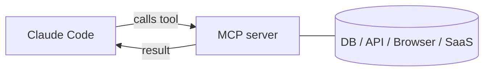

<LevelBadge level="advanced" />

<VerifyNote lastVerified="2026-06-20" source="https://docs.anthropic.com/en/docs/claude-code/mcp">
MCP の設定構文、スコープ、トランスポートは進化します。公式の Claude Code MCP ドキュメントと modelcontextprotocol.io で確認してください。
</VerifyNote>

**Model Context Protocol (MCP)** は、AI を外部ツールやデータに接続するためのオープンな標準です。**MCP サーバー** は機能（データベースへのクエリ、GitHub PR のオープン、ブラウザの操作）を公開します。Claude Code はそれに接続し、セッション中に **それらのツールを呼び出せ** ます。これが、Claude をファイルシステムやシェルの先へと拡張する方法です。

## その姿



Claude が使ってよいサーバーを宣言します。各サーバーはスキーマ付きのツールのセットを公開します。Claude は他のツールと同じように、それらを選んで呼び出します。

## トランスポート

- **stdio** — Claude が起動するローカルプロセス（ローカルのツール/CLI に最適）。
- **リモート（HTTP/SSE）** — ホストされたサーバー。多くの場合 OAuth を伴います。

## サーバーの設定

サーバーは、コマンド/URL と任意の認証とともに（一般的には `.mcp.json` および/または設定で）構成されます。スコープは、サーバーがどこで利用可能か（自分だけか、プロジェクトと共有か）を制御します。コピペできる出発点は [MCP 設定とサーバーの雛形](/docs/templates/mcp-config) を参照してください。

```json
{
  "mcpServers": {
    "github": { "command": "npx", "args": ["-y", "@modelcontextprotocol/server-github"] }
  }
}
```

## 信頼とセキュリティ

:::warning MCP サーバーはソフトウェアのインストールと同じように扱う
MCP サーバーはコードを実行し、データを読み、アクションを取れます。信頼するサーバーだけを接続し、必要な **最小権限** を与え、そして、サーバーが返す外部コンテンツはすべて [プロンプトインジェクション](/docs/security/prompt-injection) を運びうることを忘れないでください。サードパーティのサーバーは先にレビューしましょう — [サードパーティコードのレビュー](/docs/security/reviewing-third-party-code) を参照してください。
:::

## アプリにおける MCP

MCP は、Claude アプリの **コネクタ** も動かしています — 同じ標準、異なるインターフェースです。[アプリにおけるコネクタ（MCP）](/docs/claude-app/connectors) を、API については [MCP とツールへの接続](/docs/api/mcp) を参照してください。

## 次に

- [はじめての MCP サーバーを構築して接続する（ウォークスルー）](/docs/walkthroughs/first-mcp-server)
- [MCP 設定とサーバーの雛形](/docs/templates/mcp-config)
- [エージェントとツールのセキュリティ](/docs/security/securing-agents)
