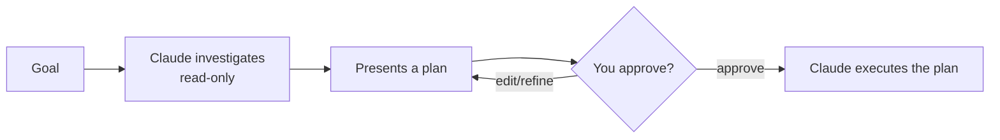

<LevelBadge level="beginner" />

<VerifyNote lastVerified="2026-06-20" source="https://docs.anthropic.com/en/docs/claude-code">
プランモードへの入り方（ショートカット/フラグ）はリリースごとに変わる可能性があります。公式の Claude Code ドキュメントを確認してください。
</VerifyNote>

**プランモード** は Claude Code を **読み取り専用** にします。コードベースの探索、検索の実行、推論はできますが、**ファイルの編集や状態を変えるコマンドの実行は行いません**。代わりに計画を作成し、あなたの承認を待ちます。

## なぜ始めるのに最も安全な方法なのか

大きい、リスクが高い、あるいは不慣れなものについては、Claude がリポジトリに触れる前に *何を* しようとしているかを見たいはずです。プランモードは **考えること** と **行うこと** を分離します。

誤った前提を、それが誤ったコードになる *前に* 捕まえられます。

## いつ使うか

- 大規模または複数ファイルにわたる変更、マイグレーション、リファクタリングには **常に**。
- まだ完全には把握していないコードベースで作業するとき。
- チームメイトと共有できる、レビュー可能な計画が欲しいとき。

小さく明白な編集ならスキップしてもかまいません — ただ、迷ったらまず計画を。

## 実際の流れ

1. プランモードに入り、目標を述べる。
2. Claude が関連ファイルを読み、明確化のための質問をする。
3. ステップごとの計画を返す: 変更するファイル、アプローチ、そして検証の方法。
4. あなたが承認する（または改善する）。そのときに初めて、変更を加えるモードに切り替わる。

:::tip CLAUDE.md と組み合わせよう
良い [CLAUDE.md](/docs/claude-code/claude-md) は計画をより鋭くします — Claude はあなたの規約とガードレールをすでに念頭に置いて計画します。
:::

## プランモード vs 権限

両者は異なる問題を解決し、協調して機能します。

- **プランモード** = 「調査して提案する。まだ実行しない。」（このページ。）
- **[権限](/docs/claude-code/permissions)** = いざ実行するとき、*どの* アクションが確認なしに許可されるか。

## 次に

- [権限と権限モード](/docs/claude-code/permissions)
- [コンテキスト管理](/docs/claude-code/context-management) — 長いセッションを効果的に保つ
- [ウォークスルー: 実際のリポジトリで Claude Code をカスタマイズする](/docs/walkthroughs/customize-claude-code)
