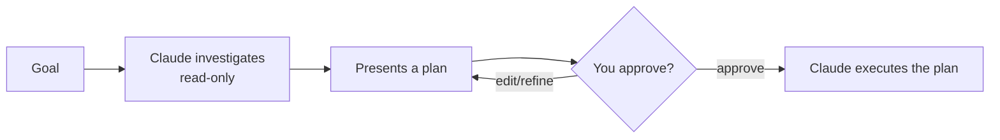

<LevelBadge level="beginner" />

<Callout type="objectives" items={["プランモードが何をするか、なぜ読み取り専用なのかを説明する", "まず計画すべき場合と、スキップしてよい場合を判断する", "調査・提案・承認・実行のループを一通りたどる", "プランモードと権限（Permissions）を区別し、両者を併用する"]} />

<VerifyNote lastVerified="2026-06-20" source="https://code.claude.com/docs/en">
プランモードへの入り方（ショートカット/フラグ）はリリースによって変わることがあります。公式の Claude Code ドキュメントで確認してください。
</VerifyNote>

## 大きな考え方

工事業者に家の鍵を渡すのと、まず家の中を歩いて回って*何を*変えるかを書き出してもらうのとを想像してみてください。プランモードはその「歩いて回る」段階です。

**プランモード**は Claude Code を**読み取り専用**にします。コードベースを探索し、検索を実行し、推論できますが、**ファイルを編集したり状態を変えるコマンドを実行したりはしません**。代わりに計画を作成し、あなたの承認を待ちます。

<Callout type="tip" items={["読み取り専用とは、Claude が考える（THINK）が行動しない（ACT）という意味です。あなたが GO と言うまで、ファイル編集も状態を変えるコマンドもありません。"]} />

## なぜ最も安全な始め方なのか

大きい、リスクがある、あるいは不慣れな作業では、Claude がリポジトリに触れる*前に*何をしようとしているかを見たいものです。プランモードは**考えること**と**行動すること**を分離します。

見返り：間違ったコードになる*前に*、間違った前提に気づけます。

## いつ使うか

<Callout type="tip" items={["大きい変更や複数ファイルにまたがる変更、マイグレーション、リファクタリングでは常に", "まだ完全には把握していないコードベースで作業するとき", "チームメイトと共有できる、レビュー可能な計画が欲しいとき"]} />

ごく小さく明白な編集ならスキップしてかまいません。ただし迷ったら、まず計画を立てましょう。

## 実際の動き方

ループに従います。各ステップが次のステップを引き出します。Claude が編集に切り替わるのは、あなたが承認した*後*だけです。

<Steps items={[{title: "プランモードに入り、ゴールを述べる", body: "読み取り専用モードに切り替え、達成したいことを説明します。"}, {title: "Claude が調査する", body: "関連ファイルを読み、明確化のための質問をします。"}, {title: "Claude がステップごとの計画を返す", body: "変更するファイル、アプローチ、結果の検証方法。"}, {title: "あなたが承認または修正する", body: "承認した後でのみ、Claude は変更を加えるモードに切り替わります。"}]} />

### 自分で試す

これを実際のプランニングセッションに貼り付けて、ループが展開する様子を見てみましょう。

<PromptCard title="プランニングセッションを始める">{`I want to migrate our auth from sessions to JWT. Stay in Plan Mode: investigate the current setup, ask anything you need, then propose a step-by-step plan with files to change and how to verify — don't edit anything yet.`}</PromptCard>

:::tip CLAUDE.md と組み合わせる
良い [CLAUDE.md](/docs/claude-code/claude-md) は計画をより的確にします。Claude はあなたの規約とガードレールを最初から踏まえて計画を立てます。
:::

## プランモード vs 権限

よくある取り違えです。両者は異なる問題を解決し、併用できます。

- **プランモード** =「調査して提案する、まだ行動しない」（このページ）。
- **[権限（Permissions）](/docs/claude-code/permissions)** = 行動し始めたら、確認なしで*どの*アクションが許されるか。

**いま行動するかどうか**（プランモード）と、**行動し始めたらどのアクションが許されるか**（権限）と考えてください。

<Flashcards cards={[{front: "プランモードは Claude Code をどんな状態にしますか？", back: "読み取り専用 — 探索・検索・推論はできますが、あなたが承認するまでファイルを編集したり状態を変えるコマンドを実行したりはしません。"}, {front: "プランモードのループとは？", back: "調査（読み取り専用）→ 計画を提示 → あなたが承認または修正 → Claude が実行。"}, {front: "いつプランモードに手を伸ばすべき？", back: "大きい、リスクがある、不慣れな作業（複数ファイルの変更、マイグレーション、リファクタリング、未知のコードベース）ではデフォルトで。スキップは小さく明白な編集だけ。"}, {front: "プランモード vs 権限？", back: "プランモードは「いま行動するかどうか」を、権限は「行動し始めたらどのアクションが許されるか」を司ります。"}]} />

<Callout type="takeaways" items={["プランモードは読み取り専用：Claude は探索し提案するが、あなたが承認するまで編集も状態を変えるコマンドも行わない", "大きい、リスクがある、不慣れな作業ではデフォルトで使い、スキップは小さく明白な編集だけ", "ループは「調査 → 提案 → 承認/修正 → 実行」", "プランモードは「いま行動するかどうか」を、権限は「行動し始めたらどのアクションが許されるか」を司る"]} />

<Quiz title="理解度チェック" questions={[{q: "プランモード中、Claude Code は何ができますか？", options: ["ファイルを編集し、あらゆるコマンドを実行する", "探索・検索・推論はできるが、ファイル編集や状態を変えるコマンドの実行はしない", "質問に答えるだけで、ファイルアクセスは一切ない"], answer: 1, explain: "プランモードは読み取り専用です。Claude はコードベースを探索し、検索を実行し、推論できますが、ファイルを編集したり状態を変えるコマンドを実行したりはしません。"}, {q: "いつプランモードに手を伸ばすべきですか？", options: ["1 行のタイポ修正のときだけ", "大きい変更や複数ファイルの変更、マイグレーション、リファクタリング、不慣れなコードベースのとき", "決して使わない — 遅くなるだけ"], answer: 1, explain: "大きい変更や複数ファイルの変更、マイグレーション、リファクタリング、そしてまだ完全には把握していないコードベースで作業するときは常に使います。小さく明白な編集はスキップできます。"}, {q: "プランモードのループの正しい順序はどれですか？", options: ["実行 → 調査 → 承認", "調査（読み取り専用）→ 計画を提示 → あなたが承認または修正 → Claude が実行", "まず承認 → その後 Claude が調査して編集"], answer: 1, explain: "Claude は読み取り専用で調査し、計画を提示し、あなたが承認または修正し、その後でのみ計画の実行に切り替わります。"}, {q: "プランモードと権限はどう違いますか？", options: ["同じ機能の 2 つの呼び名", "プランモード = 調査して提案する、まだ行動しない。権限 = 行動し始めたら、確認なしでどのアクションが許されるか", "権限が計画するかどうかを決め、プランモードがどのファイルを編集するかを決める"], answer: 1, explain: "プランモードは考えることと行動することを分離します。権限は Claude が行動し始めたときに確認なしで許されるアクションを制御します。両者は併用できます。"}]} />

## 次へ

- [権限と権限モード](/docs/claude-code/permissions)
- [コンテキスト管理](/docs/claude-code/context-management) — 長いセッションを効果的に保つ
- [ウォークスルー：実際のリポジトリ向けに Claude Code をカスタマイズする](/docs/walkthroughs/customize-claude-code)
