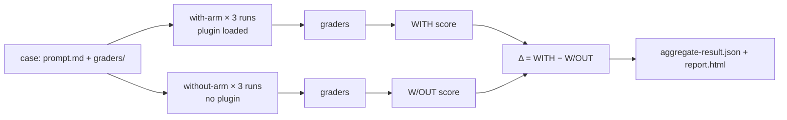

<LevelBadge level="advanced" />

<VerifyNote lastVerified="2026-09-14" source="https://code.claude.com/docs/en/plugin-evals">
`claude plugin eval` は Claude Code **v2.1.269(2026 年 9 月 11 日)** で出荷され、まだ新しい機能として文書化されています。ケースのスキーマは `1.1`、JSON 結果は `schemaVersion: 1` で、Anthropic はサーバー側でこのコマンドを無効化できます(「plugin eval is currently unavailable」)。以下のデフォルト値、フラグ、グレーダーのセマンティクスは、記載日時点の公式ページに基づいています。厳格な CI ゲートを組み込む前に再確認してください。
</VerifyNote>

<Callout type="objectives" items={[
  "`claude plugin validate` や手動テストでは測れない、プラグイン評価が測定するものを理解する: スキルは*トリガー*されるか、そして素のモデルに勝てるか",
  "すべての結果にある 3 つの数値 — WITH、W/OUT、Δ — を読み、一部のグレーダーが意図的にスコアから除外される理由を知る",
  "6 種類のグレーダー(無料 4 種、ジャッジベース 2 種)から選び、安定したシグナルを与えるルーブリックを書く",
  "プラグインの MCP サーバーをモックして、スイートを再現可能にし、実サービスに一切触れないようにする",
  "固定モデル、コスト上限、終了コードの契約を備えた CI ゲートを組み込む"
]} />

これまでプラグイン作者には 2 つのツールしかありませんでした。マニフェストとフロントマターがパースできるかを確認する `claude plugin validate` と、自分の目です。どちらも、プラグインをインストールする価値があるかを決める問いには答えてくれません。**ユーザーが自然な依頼を入力したとき、Claude はそのスキルを選ぶのか、そしてその結果は Claude がどのみちやったであろうことより良いのか?** `claude plugin eval` はまさにそれに答えます。各ケースを、あなたのプラグインだけを読み込んだ使い捨てセッションで実行し、プラグインなしでもう一度実行し、両方を採点して、その差を報告します。

このページは、すでに動作する[プラグイン](/docs/claude-code/plugins-marketplaces)や[スキル](/docs/claude-code/skills)を持っている人向けです。概念だけ知りたい場合は、最初の 2 セクションとクイズを読んでください。

## メンタルモデル: 2 つのアームと差分

各ケースは **プロンプト** と 1 つ以上の **グレーダー** から成ります。グレーダーは Claude が生成したものに対する合否チェックです。各ケースについて Claude Code は次を実行します。

- **with アーム**: あなたのプラグインだけを読み込んだ新しいヘッドレスセッションで、プロンプトを送り、Claude が完了するかターン/時間の上限に達するまで作業させ、その後グレーダーを適用する。
- **without アーム**: 同じプロンプト、同じ実行回数、プラグインなし。

各アームはケースを **デフォルトで 3 回** 実行します。非決定的なエージェントの 1 回の実行からは、ほとんど何も分からないからです。1 回の実行のスコアは、合格したグレーダーの割合(重みを設定した場合は重み付き)です。ケースのスコアは実行間の平均です。得られるのは次のとおりです。

| 列 | 意味 |
|---|---|
| `WITH` | プラグインを読み込んだ状態での平均スコア |
| `W/OUT` | プラグインなしでの平均スコア |
| `Δ` | `WITH − W/OUT` — プラグインが実際に貢献した分 |

自明でない部分はこれです。**高い `WITH` スコアだけでは何も証明しません。** あるケースが両アームで 1.0 を取ったなら、Claude はあなたなしでそれを解いたのであり、そのプロンプトに対してあなたのプラグインは無駄な重荷です。Δ こそがプラグインの存在を正当化する数値です。Anthropic 自身のドキュメントは、最もよくある最初の発見を挙げています。スキル発火グレーダーが失敗している*のに* Δ がゼロ付近、つまり自然な言い回しでは Claude があなたのスキルを一度も選ばなかった、というものです。それは `SKILL.md` の `description` の問題であってコードの問題ではなく、スキルを名前で呼び出す手動テストをいくらやっても見つからなかったでしょう。



### 一部のグレーダーがスコアから除外される理由

「`Skill` ツールが呼び出された」のようなチェックは、without アームでは決して合格できません。もしカウントされれば `W/OUT` をゼロに引きずり下ろし、Δ をタダで水増しすることになります。そのため 2 アーム実行では、Claude Code は `tool` が `Skill` であるすべての `tool_used` グレーダーと、`arm: with-only` と指定したものを **両アームでスコアから除外** します。それらはレポートには合否インジケーターとして表示され(レポートは「plugin-fired indicator」のバッジを付けます)、JSON では `scored: false` とマークされます。ここから 2 つのエッジルールが導かれます。

- ケース内の*すべての*グレーダーが除外対象になる場合は、代わりに通常どおり採点されます。そうしないと採点対象が何も残らないからです。
- `arm: both` はグレーダーを両アームで強制的にカウントさせます。デコイプロンプトに対する「スキルを**呼び出してはならない**」チェックを、`min: 0` と `max: 0` の `tool_used` として書く場合に使いたいのはこれです。

覚えておく価値のある帰結: 同じスイートでも、`--ablation none`(単一アーム、除外なし)ではデフォルトの 2 アームモードとは **異なる絶対スコア** を報告することがあります。トレンドをグラフ化するときは同じ条件同士を比較してください。

## ケースの構造

スイートはプラグイン内の `evals/`(または指定した別のディレクトリ)に置きます。各ケースは、`prompt.md`、`case.yaml`、あるいはその両方と、グレーダーごとに 1 つの Markdown ファイルを持つ `graders/` フォルダを含むフォルダです。

```text
my-plugin/
├── .claude-plugin/plugin.json
├── skills/...
└── evals/
    ├── drafts-commit-message/
    │   ├── prompt.md            # frontmatter: run limits; body: the user's request
    │   └── graders/
    │       ├── criteria.md      # type: llm — rubric in the body
    │       └── skill-fired.md   # type: tool_used, tool: Skill
    ├── ignores-unrelated-request/
    │   └── ...
    ├── mocks/                   # optional suite-wide MCP mocks
    └── results/                 # written by each run — add to .gitignore
```

プロンプト本文は **書かれたとおりそのまま** Claude に送られます。初めて書く人がつまずく点が 2 つあります。

- 各実行は **空の作業ディレクトリ** で始まり、使い捨てのホーム、ユーザー設定なし、`CLAUDE.md` なし、個人の MCP サーバーなし、他のプラグインなし、環境変数は許可リストのみ(`PATH` などの基本、プロバイダー認証、ほとんどの `ANTHROPIC_*`/`CLAUDE_CODE_*`、および `EVAL_*` という名前のもの)です。タスクにファイルが必要なら、プロンプトに含めるか、スキャフォールドするか、プラグインに同梱してください。
- プロンプト内の `@path` メンションは添付ファイルに **展開されません**。Claude がファイルを開く必要があるなら、`allowed_tools` で `Read` を許可してください。

最も重要な `prompt.md` のフロントマターフィールド:

| フィールド | デフォルト | 備考 |
|---|---|---|
| `runs` | 3 | アームごとに 1 から 50。`--runs` で上書き |
| `max_turns` | 10 | 最大 200。上限に達すると実行エラーとして記録され、通常スコアが下がるので余裕を持たせる |
| `timeout_seconds` | 300 | 実行ごとに最大 3600 |
| `allowed_tools` | `[]` | 読み取り専用ツールは列挙するだけで許可される。それ以外は CLI での許可が必要 |
| `model` | セッションのデフォルト | `--model` で上書き。CI では固定する |
| `env` | `{}` | キーは `EVAL_[A-Z0-9_]*` に一致しなければならず、さもないと実行が失敗する |
| `plugins` | 最も近い外側のプラグイン | 自動検出があなたのプラグインを見逃す場合は `["../.."]` を設定 |

`case.yaml` は同じフィールド(実行系は `execution:` の下)に加えて、他のファイルを参照する 3 つを持ちます。`context.scaffold_script`(ワークスペースをシードする Bash スクリプト、`--scaffold` 指定時のみ実行)、`context.history_file`(再開する `.jsonl` トランスクリプト、あなたのプロンプトが次のターンになる)、`context.add_dirs`(Claude が読める fixture ディレクトリ)です。

## 6 種類のグレーダー

4 つはトランスクリプトとファイルから計算され、費用はかかりません。2 つはジャッジモデルを呼び出し、請求に加算されます。

| 種類 | 無料? | 合格条件 |
|---|---|---|
| `regex` | はい | JavaScript の正規表現がターゲット(デフォルトは `last_message`、または `trace`、`files`、特定ファイル、`mock_calls`)内で見つかる。不在には `match: not_contains`、正確な回数には `match: "count:N"`。大文字小文字の無視は `flags: i` に書く。インライン `(?i)` は非対応 |
| `tool_used` | はい | JSON エンコードされた入力が `input_match` に一致する `tool` の呼び出し回数が `min`(デフォルト 1)と `max`(無制限)の間にある。`min: 0, max: 0` はツールが一度も呼ばれなかったことを表明する |
| `tool_order` | はい | 両方のツールが呼ばれ、最初の `before` の一致が最初の `after` の一致より先にある |
| `file_exists` | はい | **Claude が作成した** ファイルが `path` グロブに一致する(`exists: false` なら一致するものがない)。スキャフォールドが作成したファイルや Claude が編集しただけのファイルはカウントされない |
| `llm` | いいえ | ジャッジモデルがあなたのルーブリックに対して **3 票中少なくとも 2 票** で PASS に投票する |
| `baseline` | いいえ | ジャッジが、`baseline_file` として保存した参照トランスクリプトと少なくとも同程度に実行が基準を満たしていると判断する |

**カスタムコードのグレーダーはありません。** ビルドやテストが通ったことを確認する必要があるなら、プロンプトで Claude にそれを実行して結果をファイルに書かせ、そのファイルを `regex` で採点し、`input_match` にコマンド名を含む `tool_used` グレーダーでコマンドが実行されたことを表明してください。

ほぼすべてのケースが欲しがるスキル発火グレーダーは次のようになります(スキル名を置き換えてください。このパターンは名前空間付きの `plugin:skill` 形式にも一致します)。

<PromptCard title="graders/skill-fired.md — 自分のスキルは本当に実行されたか?">{`---
type: tool_used
tool: Skill
input_match: '"skill"\\s*:\\s*"(?:[\\w-]+:)?your-skill-name"'
---`}</PromptCard>

そしてその隣に置くジャッジのルーブリック。形容詞ではなく、具体的な PASS/FAIL 条件として書きます。

<PromptCard title="graders/criteria.md — 安定した判定を与えるルーブリック">{`---
type: llm
weight: 2
---

PASS if the reply is a single conventional-commit subject line under 72 characters,
starts with "refactor:", and mentions both the rename (getUser -> fetchUser) and the
number of call sites updated.
FAIL if the reply contains more than one candidate message, asks a clarifying
question, or omits the rename.`}</PromptCard>

### スコアを安定させる習慣

これらは公式ドキュメントが推奨するプラクティスで、LLM-as-judge パイプラインを運用した人なら誰もが痛い目を見て学ぶことと一致します。

- **長い出力は `llm` ジャッジではなく、ファイルに対する `regex` で採点する。** ジャッジのばらつきは読む量の長さとともに増えます。`llm` グレーダーは短い最終メッセージ用に取っておきましょう。
- **結果に 1 つ、経路に 1 つ。** `regex`/`llm`/`file_exists` グレーダーは答えが正しかったことを教え、`tool_used`/`tool_order` グレーダーは*あなたのプラグイン*がそれを生み出したことを教えます。Δ を解釈するには両方が必要です。
- **Δ が負なのにスキルが発火しているなら、プラグインより先にジャッジを疑う。** デフォルトのジャッジは小さく高速なモデルで、ルーブリックと書式が違うという理由で正しい答えを不合格にすることがあります。`--judge-model sonnet` で再実行し、書式が判定を左右しないようルーブリックを締めてください。
- **1 ケース・1 アームで反復し**、その後 3 回実行で確認する: `--case <name> --runs 1 --ablation none`。1 アームではテーブルに `WITH`/`W/OUT`/`Δ` の代わりに `SCORE` と `PASS%` が表示されます。

## MCP サーバーをモックする

プラグインのスキルが MCP ツールを呼ぶ場合、実行は **あなたが求めない限り実サーバーを決して起動しません**。代わりに Claude Code は各サーバー名の下にスタンドインを登録し、Markdown ファイルからツール呼び出しに応答します。スイート全体なら `evals/mocks/<server>/<tool>.md`、ケースごとに上書きするならケース自身の `mocks/` フォルダです。ファイル本文がツールの結果で、`{{input.<field>}}` の置換と `{{file:fixtures/...}}` の挿入が使えます。モックファイルのないツールは、単に Claude から利用できません。

<PromptCard title="evals/mocks/tracker/create_issue.md — 入力も検証するモック">{`---
expect:
  title: string
  priority: [low, medium, high]
---

Created issue #4821: {{input.title}}`}</PromptCard>

`expect:` ブロックはモックをアサーションに変えます。これに違反する呼び出しは **スコア 0 で実行を中断** し、サーバー、ツール、理由を記録します。プラグインがサーバーに何を依頼したかを採点するには、グレーダーを `target: mock_calls` に向けてください。応答が会話に依存するサーバーには、`type: agent` で小さなモデルにサーバー役をさせられます。クリーンな実行はその応答を `results/<timestamp>/mock-recordings/` に保存し、録音を `mocks/.replay/<server>/` にコピーすれば、以降の実行はモデル呼び出しなしでそれを再生します。CI を決定的にするために `.replay/` をコミットしてください。`_tools.json`(保存した `tools/list` の応答)は、モックされたツールに寛容なプレースホルダーではなく本物の説明とスキーマを与えます。

代わりに実サーバーを叩くには、`--allow-real-servers` がモックのないものを起動し、`--mocks off` はモックを完全に無視します。いずれの場合もそれらのプロセスは **あなたとして、サンドボックスの外で** 動き、そのツールには依然として `--allow-tools "mcp__plugin_my-plugin_github__*"` のような明示的な許可が必要です。

## 実行する

<Steps items={[
  {title: "スイートを生成する", body: "プラグインのルートから `claude plugin eval init` を実行します。対話セッションが開き、Claude がプラグインを読み、良い結果とは何かを尋ね、トリガーすべき・すべきでないプロンプトを提案し、グレーダーを設計し、一度パイロット実行して、プロンプトごとに 1 つのケースディレクトリを書きます。`claude plugin eval init --bare <name>` は代わりに空のテンプレートを書きます(ターミナルなし、たとえば CI で動作する唯一の形式)。"},
  {title: "スイート全体を実行する", body: "`claude plugin eval .` はすべてのケースを、両アーム、各 3 回実行します。初回は `Trust this plugin directory?` と尋ねられ、git リポジトリ内で yes と答えるとリポジトリ全体が、対話セッションでも信頼されます。実行ごとに各グレーダーの判定を含む進捗行が出力され、サマリーテーブルと `Report:` のパスが続きます。"},
  {title: "ケースが必要とするものだけ許可する", body: "実行は許可を求めて止まることはありません。与えていない許可を必要とする組み込みツール(`Bash`、`Write`、`Edit`、`WebFetch`、`WebSearch`)はセッションから完全に取り除かれます。実行全体に対して許可するには `--allow-tools Write Edit \"Bash(npm test *)\"` とします。Bash の許可はすべて Claude Code の OS レベルのサンドボックス下で動きます。サンドボックスのバックエンドがないマシン(ネイティブ Windows)では、制限なしで動かすのではなく実行が拒否されます。"},
  {title: "レポートを読む", body: "`report.html` は外部リクエストのない自己完結した 1 ファイルです。上部: 判定行(ベースライン比のプラグイン効果をポイントで、改善/横ばい/退行したケース数)と 5 つのタイル(スイートスコア、アブレーション Δ、ベースラインスコア、合格ケース数、パーフェクト実行数)。各ケースカードは Δ と、しきい値の目盛り付きスコアバーを示し、負の Δ には赤い左端が付きます。失敗したグレーダーは、ジャッジの投票とそれが見た抜粋とともに展開済みで表示されます。"},
  {title: "レポートの行き先を決める", body: "claude.ai サブスクリプションでサインインしアーティファクトが有効なら、レポートは非公開アーティファクトとしても公開され、`Published:` の URL が出力されます。`--no-publish` でローカルに留めます。API キー認証では決して公開されません。Claude Code セッション内から開始した実行は、`--publish-report` を追加しない限りローカルに留まります。"}
]} />

実際に手を伸ばすことになるフラグを付けたフルスイートのコマンド:

<PromptCard title="より強いジャッジとコスト上限でスイートを実行する">{`claude plugin eval . \\
  --judge-model sonnet \\
  --max-cost-usd 10 \\
  --allow-tools Read Write "Bash(npm test *)" \\
  -j 4`}</PromptCard>

フラグについての注記: `-j`/`--concurrency` は 1 から 8 まで指定でき、すべての実行があなたのアカウントのレート制限を共有するため、短縮されるのは壁時計時間だけです。`--max-cost-usd` は **定価ベースの見積もり** に対する上限で、各実行の開始前にチェックされます。進行中の実行は完了するので、支出はその分だけ超過することがあり、開始されなかったものが残るとコマンドは `partial: true` で終了コード 2 を返します。ターゲット(`.`)は `--tag`、`--allow-tools`、`--json` の **前に** 置いてください。これらはそれぞれリストや省略可能な値を取るため、後続のターゲットを飲み込んでしまいます(エラー「`--json` output path must end in `.json`」はこのミスです)。

## 費用

すべての実行とすべてのジャッジ投票は、あなたのアカウントでの実際のモデル呼び出しであり、プランの使用量または API 請求にカウントされます。ざっくりした計算: with アームに `cases × runs` 回のエージェント実行、without アームに同じだけ、さらに **`llm` または `baseline` グレーダーごと、実行ごとに 3 回の短いジャッジ呼び出し**。公式ウォークスルーの、グレーダー 2 つ(`llm` 1 つ、`tool_used` 1 つ)の単一ケースは、6 回のエージェント実行を 74 秒で行い、定価見積もりは約 $0.41 でした。スイートを手頃に保つレバーは 3 つあります。

- `--ablation none` は、グレーダーを反復していて Δ が不要なときにエージェント実行を半減させます。
- コミットごとのスイートには無料グレーダーのみ(`regex`、`tool_used`、`tool_order`、`file_exists`)、ナイトリーにはジャッジグレーダーを。
- スイート途中の使用量制限やレート制限エラーは、それ以降の各実行を **そのエラーで終了させ通常スコア 0 にし、しかもスイートは `partial` とマークされない** ため、スロットルされた実行は退行とまったく同じに見えることがあります。急激な低下を信じる前に `NOTES` 列か `cases[].arms.with[].error` を確認してください。

## CI をゲートする

<PromptCard title="CI ジョブ — 固定モデル、ローカルレポート、終了コードがビルドを決める">{`claude plugin eval . \\
  --trust-plugin \\
  --json results.json \\
  --threshold 0.8 \\
  --model claude-sonnet-5 \\
  --judge-model claude-haiku-4-5 \\
  --no-publish \\
  --max-cost-usd 20`}</PromptCard>

各フラグがある理由:

- `--trust-plugin` は初回実行時の信頼の決定を表明します。これがないと非対話ジョブは終了コード 1 で拒否されます(ランナーが TTY を割り当てるならプロンプトでハングします)。自分のマシンで動かしてもよいコードとスイートを持つプラグインにだけ渡してください。
- `--model` と `--judge-model` は、モデルのロールアウトがプラグインの退行と誤認されないように **固定** します。これは思った以上に重要です。テスト対象のエージェントはデフォルトで `ANTHROPIC_MODEL` か Claude Code の現在のデフォルトを使い、それはリリースごとに変わります。
- `--threshold 0.8` にするのは、デフォルトが **1.0** で、いずれかのケースが完璧でないとコマンドが終了コード 1 になるからです。非決定的エージェントの 3 回平均に 1.0 の基準を置くのは不安定なゲートです。
- `--json results.json` はバージョン付きの結果ドキュメント(`schemaVersion: 1`、camelCase、新しいフィールドはリネームなしで追加)を書き、進捗出力を抑制します。

終了コードの契約:

| 終了コード | 意味 |
|---|---|
| 0 | すべてのケースがしきい値以上で、すべてのケースファイルが読み込まれた |
| 1 | しきい値未満のケース、読み込みに失敗したケースファイル、ケースが見つからない、実行を開始できない、`--trust-plugin` なしの未信頼ディレクトリ、または無効なオプション |
| 2 | 部分実行: コスト上限に達した、または最初の実行以前に資格情報が拒否された。`results.json` は `partial: true` で書かれる |
| 130 / 143 | 中断 / 終了(例: CI のタイムアウト)。部分結果が書かれる |

レポート作成や公開の問題は終了コードを **決して** 変えません。トレンドをグラフ化するときは、`partial: true` のドキュメントと `skippedPaidGraders` のフラグが付いた実行を除外してください。それらのスコアは比較可能ではありません。

ゲート用スクリプトが JSON から読むフィールド: `aggregates.overallScore`、`aggregates.casesPassed` / `casesTotal`、`aggregates.meanDelta`、ケースごとに `cases[].aggregates.score` と `.delta`(アームが比較可能でないときは省略)。`cases[].arms.with[].error` が非 null の実行(例: `timed out after 300s`)も生成物に対して採点されるため、エラーはスコア 0 を意味しません。`aborted` の実行(モックの `expect:` が発火)は `error` が `null` のままスコア 0 になります。

## 実行が到達できるもの・できないもの

自分が書いていないプラグインを評価する前に読んでください。`claude plugin eval` をディレクトリに向けることは、`claude --plugin-dir` と同じ信頼の決定です。プラグインのスキル **とフック** は、あなたのマシンであなたとして読み込まれ実行されます。分離は*テスト対象のエージェント*にできることを制限するものであり、プラグイン自身のコードに対する境界ではなく、スイートが合格してもプラグインが安全かどうかは何も言えません。

- **分離されたエージェント。** 各実行は使い捨てのホーム、作業ディレクトリ、Claude Code 設定を得て、`claude -p` の子プロセスとして動き、評価ディレクトリを読めず(そのためケースやその兄弟のプロンプトやグレーダーを決して見ない)、Artifact ツールは無効化されます。
- **管理設定は依然として適用される。** 管理者がマシンに展開した制限は実行内でも適用されるため、管理対象ラップトップでの結果は非管理の CI ランナーとは異なることがあります。
- **オプトインの抜け道。** ケースの `scaffold_script` はあなたとして、サンドボックスの外で、`--scaffold` 指定時のみ動きます。実 MCP サーバーは `--allow-real-servers` または `--mocks off` のときのみ。ケースの `allowed_tools` やスキル自身の `allowed-tools` フロントマターがこれらを広げることは決してできません。
- **ネットワーク。** あなたが許可したシェルコマンドはサンドボックスのネットワークルールに従います。`WebFetch(domain:…)` の許可はそのドメインに直接到達します。プラグインのフックと、あなたが起動した実 MCP サーバーは任意のホストに到達できます。

フックを同梱する、または実サーバーを必要とするサードパーティプラグインについては、コンテナや CI ランナーでスイートを実行したのでない限り、スコアは参考値として扱ってください。より広いチェックリストは[サードパーティコードのレビュー](/docs/security/reviewing-third-party-code)を参照してください。

## クイックリファレンス: 落とし穴

- `regex` のデフォルト `target` は `last_message`。`trace` をターゲットにすると 1 行ごとの JSON なので、引用符は `\"` として現れ、改行はエスケープされる。
- `files` は Claude が作成した **パスのリスト** であり、その内容ではない。内容を採点するには `target`/`focus` に `{ source: file, path: <path> }` を使う。`llm` ジャッジは PNG/JPEG/GIF/WebP を画像として見て、他のバイナリ(`.pptx`、PDF)は拒否する。
- `trace` を読む `llm` ジャッジは **最初の 12 と最後の 12 メッセージ** しか見ない。
- `file_exists` は実行中に作成されたファイルしか見ない。スキャフォールドされたファイルや編集されただけのファイルは見えない。内容を採点するか、`Edit` に対する `tool_used` を使う。
- `prompt.md` フロントマターの未知のキーはエラーで、`env` のキーは `EVAL_*` でなければならない。
- インストール済みプラグインを名前(`name@marketplace`)で評価すると、結果はカレントディレクトリの `./evals/results/` に書かれ、信頼プロンプトはスキップされる。
- プラグイン評価のケース形式は、skill-creator プラグインがスキル評価に使う `evals/evals.json` ファイルとは **別物**。

<Flashcards cards={[
  {front: "with アーム / without アーム", back: "ケースに対する 2 組の実行: あなたのプラグインだけを読み込んだもの、プラグインなしのもの。Δ は with アームのスコアから without アームのスコアを引いたもの。"},
  {front: "なぜ `tool_used: Skill` は採点されないのか?", back: "プラグインなしでは決して合格できないため、カウントすると W/OUT をゼロに引きずり Δ を水増ししてしまう。両アームで除外され、plugin-fired インジケーターとして表示される。"},
  {front: "デフォルトのしきい値", back: "1.0 — 完璧未満のケースがあればコマンドは終了コード 1 になる。CI では `--threshold` を実際の基準に設定する。"},
  {front: "ジャッジの投票ルール", back: "`llm` グレーダーはジャッジが 3 票中少なくとも 2 票で PASS に投票すると合格。`baseline` グレーダーは保存した参照トランスクリプトと比較する。"},
  {front: "終了コード 2", back: "部分実行: --max-cost-usd の上限に達したか、資格情報が拒否された。results.json は partial: true で書かれる。"},
  {front: "モックの `expect:` ブロック", back: "モックされた MCP ツールへの入力ガード。違反する呼び出しはスコア 0 で実行を中断し、サーバー、ツール、理由を記録する。"},
  {front: "EVAL_* 変数", back: "実行に届く唯一のカスタム環境変数。シェルの他のものは小さな許可リストを除いて渡されない。"}
]} />

<Quiz title="理解度チェック" questions={[
  {q: "あるケースが WITH 1.00、W/OUT 1.00 を取りました。これは何を意味しますか?", options: ["プラグインは完璧に動作している", "Claude はプラグインなしでこのプロンプトを解けるので、ここではプラグインは何も加えていない", "グレーダーが壊れている", "ジャッジモデルが弱すぎる"], answer: 1, explain: "Δ はゼロです。高い with アームのスコアだけではプラグインが役立ったことを決して証明しません。アーム間の差だけが証明します。"},
  {q: "CI ジョブが他のフラグなしで `claude plugin eval . --json results.json` を実行し、すべてのケースが 0.9 だったのに終了コード 1 になりました。なぜ?", options: ["JSON モードは常に終了コード 1 になる", "デフォルトの --threshold は 1.0 なので 0.9 は失敗", "プラグインディレクトリが信頼された", "--json は採点を無効化する"], answer: 1, explain: "デフォルトのしきい値は完璧(1.0)です。--threshold 0.8 など、あなたの基準を渡してください。CI では --trust-plugin も渡さないと、未信頼ディレクトリのチェックでも終了コード 1 になります。"},
  {q: "追加費用なしで実行できるグレーダーの種類はどれ?", options: ["llm と baseline", "regex、tool_used、tool_order、file_exists", "regex のみ", "6 種類すべて無料"], answer: 1, explain: "4 つのグレーダーはトランスクリプトとファイルから計算されます。llm と baseline はそれぞれ実行ごとに 3 回の短いジャッジ呼び出しを加えます。"},
  {q: "Δ が負ですが、スキル発火グレーダーはすべての with アーム実行で合格しています。公式ガイダンスは最初に何を確認せよと言っていますか?", options: ["プラグインを削除する", "max_turns を上げる", "ジャッジ: --judge-model sonnet で再実行し、書式が判定を左右しないようルーブリックを締める", "ケースを増やす"], answer: 2, explain: "小さなジャッジは、ルーブリックと書式が違うという理由で正しい答えを不合格にすることがあります。プラグインより先にジャッジを疑ってください。"},
  {q: "実行中のモック MCP ツールが、モックの `expect:` ブロックに違反する入力の呼び出しを受け取りました。何が起きますか?", options: ["呼び出しはエラー文字列を返し、実行は続く", "実行はスコア 0 で中断し、理由が記録される", "グレーダーはスキップされる", "フォールバックとして実サーバーが起動される"], answer: 1, explain: "expect: はアサーションです。違反する呼び出しは実行を中断し、スコア 0 になり、JSON にサーバー、ツール、理由とともに `aborted` として現れます。"},
  {q: "実行中、テスト対象のエージェントがアクセスできるのは次のうちどれ?", options: ["あなたの ~/.claude 設定と CLAUDE.md", "あなたの個人 MCP サーバー", "ケースのプロンプトとグレーダー", "ケースの allowed_tools に列挙された読み取り専用ツールと、--allow-tools で許可したもの"], answer: 3, explain: "実行は分離されています: 使い捨てのホームと設定、個人設定なし、他のプラグインなし、評価ディレクトリはエージェントから隠されています。"}
]} />

## 出典と参考資料

- [Test plugins with evals](https://code.claude.com/docs/en/plugin-evals) — このページの基礎となった公式リファレンス: ケース形式、グレーダー表、オプション、終了コード、分離
- [Plugins reference: `plugin eval` と `experimental.evals`](https://code.claude.com/docs/en/plugins-reference#plugin-eval)
- [Claude Code changelog, v2.1.269(2026 年 9 月 11 日)](https://code.claude.com/docs/en/changelog) — リリースエントリ
- [Skills: フロントマターと `description` がトリガーを決める仕組み](https://code.claude.com/docs/en/skills)
- [Sandboxing](https://code.claude.com/docs/en/sandboxing) — 実行に Bash を許可したときに適用される OS レベルのサンドボックス
- [Headless mode](https://code.claude.com/docs/en/headless) — 各実行の基盤となる `claude -p` の子プロセス

## 次へ

- [プラグインとマーケットプレイス](/docs/claude-code/plugins-marketplaces) — テストしたものをパッケージ化し、スイートがグリーンになったら公開する
- [スキル](/docs/claude-code/skills) — 失敗するスキル発火グレーダーが直せと言っているのは `description` フィールド
- [サードパーティコードのレビュー](/docs/security/reviewing-third-party-code) — 他人のプラグイン(とそのフック)を自分のマシンで評価にかける前に
