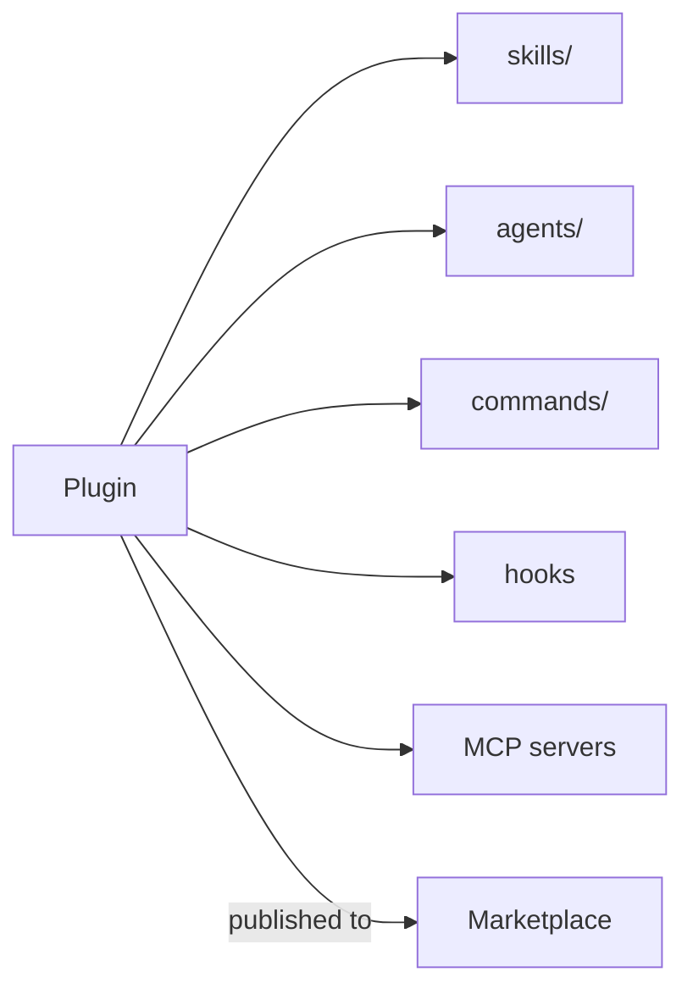

<LevelBadge level="advanced" />

<VerifyNote lastVerified="2026-06-20" source="https://code.claude.com/docs/en">
プラグインの構造やマーケットプレイスの仕組みは急速に進化しています。詳細は公式の Claude Code ドキュメントで確認してください。
</VerifyNote>

**プラグイン** は、いくつかのカスタマイズ — [スキル](/docs/claude-code/skills)、[サブエージェント](/docs/claude-code/subagents)、[スラッシュコマンド](/docs/claude-code/slash-commands)、[フック](/docs/claude-code/hooks)、[MCP サーバー](/docs/claude-code/mcp) — を、1 つのバージョン管理された、インストール可能なユニットにまとめたものです。**マーケットプレイス** は、人々が発見してインストールできるプラグインのカタログです。

## なぜプラグインが重要なのか

- **チームのツールキットを 1 ステップで配布できる。** 全員に 5 つのファイルをコピーしてもらう代わりに、プラグインを公開します。チームメイトはそれをインストールするだけで、同じコマンド、フック、エージェント、MCP 接続を手に入れます。
- **バージョン管理。** プラグインを更新すれば、全員が新しいバージョンを取り込みます。
- **配布。** マーケットプレイスは、あなた（や他人）のツールキットを発見可能にします。

## 通常は何が含まれるか

プラグインは構造化されたフォルダ（マニフェストに加えて、同梱する各要素）です。最小ではスキルだけを持たせることもでき、最大では上記のフルセットを持たせられます。各プラグインは **一貫性のあるもの** に保ちましょう — 「チーム規約」プラグイン、「Python ツールキット」プラグインといった具合に。寄せ集めにしないこと。

## インストールする前に信頼を

:::warning プラグインは実行可能なコードを同梱しうる
プラグイン内のフックや MCP サーバーは、あなたの権限で実行されます。信頼できるソースからインストールし、プラグインが何をするかを先にレビューしましょう — [サードパーティコードのレビュー](/docs/security/reviewing-third-party-code) を参照してください。
:::

## セットアップをスケールさせる道筋

自然な進め方はこうです。`CLAUDE.md` → いくつかの [スキル](/docs/claude-code/skills) と [コマンド](/docs/claude-code/slash-commands) → それらをプラグインにまとめる → チームやコミュニティ向けにマーケットプレイスへ公開する。その最後のステップは、AILmanac がエコシステムの成長を後押ししたいと考えている方法の一部です。

## 次に

- [スキル](/docs/claude-code/skills) · [サブエージェント](/docs/claude-code/subagents) · [MCP](/docs/claude-code/mcp)
- [サードパーティコードのレビュー](/docs/security/reviewing-third-party-code)
- AILmanac の [スキルパック](/docs/templates/skills)
