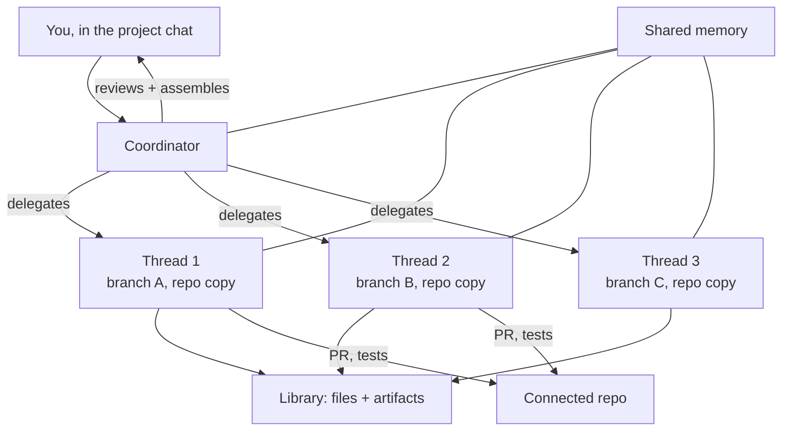

<LevelBadge level="advanced" />

<VerifyNote lastVerified="2026-09-23" source="https://claude.com/blog/projects-redesigned">
再設計された Projects は**ベータ**であり、段階的に展開されています。対象条件、プラン範囲、コーディネーター／スレッドのコントロールはまだ動いており、Claude Code のドキュメントにはリファレンスページがまだありません — 発表投稿が権威ある情報源です。これを前提に設計する前に、自分のアカウントで実際に何が使えるかを確認してください。
</VerifyNote>

**2026 年 9 月 17 日**、Anthropic は Projects を作り直しました。旧来の Project は*フォルダ*でした。ファイル、指示、そしてそれらを共有する大量のチャット。新しい Project は*組織図*です — 「作業を行うスレッドと、それらを指揮するコーディネーター」。

これは聞こえるより大きな変化です。Project はもはやコンテキストを置く場所ではありません。**あなたの代わりに作業を実行する**ものです。メインのプロジェクトチャットで成果を記述すると、Claude がそれを範囲づけし、分割し、並列のスレッドへ委譲し、戻ってきたものをレビューし、結果を組み立てます。

<Callout type="objectives" items={[
  "スレッドとは実際に何なのか — そして「自分専用のブランチ上で動く Claude Code のクラウドセッション」という一文が鍵である理由",
  "コーディネーターがサブエージェントのオーケストレーターとどう違うのか、そしてそれぞれがふさわしい場面",
  "現在の Claude Code で作業を並列に走らせる 4 つの方法と、その選び分け",
  "Projects が利用上限をより速く消費する理由と、それを制御する 2 つのモデル／エフォートのダイヤル",
  "あなたのアカウントにまだ再設計版が見えないかもしれない理由を説明する対象条件"
]} />

## 1 枚の図で見るアーキテクチャ

重要な要素は 3 つあり、混同しやすいものです:

- **コーディネーター**はメインのプロジェクトチャットです。Anthropic の言い方は、チーフ・オブ・スタッフにブリーフィングするようなもの。必要なことを伝えると、新規または既存のスレッドへ作業をルーティングします。
- **スレッド**は軽量なワーカーではありません。「内部的には、各スレッドは自分専用のブランチとリポジトリのコピー上で動く Claude Code のクラウドセッションです」。独自のコンテキストウィンドウ、独自のツール、そして担当分が十分大きければ**サブエージェント、ループ、ワークフロー**を起動する能力を備えた完全なセッションです。
- **共有メモリとライブラリ**は、ファンアウトが断片化しないよう保つものです。すべてのスレッドが同じメモリプールから引き出し、ライブラリは「あなたが追加したファイルと Claude が生成した成果物を集める」ので、出力が閉じたセッションの中で死ぬのではなく見つけられる状態に保たれます。

リポジトリを接続しておけば、スレッドは自分でプルリクエストを開き、テストを実行します。スマートフォンを含め、どこからでも監視と舵取りができます。

## それ以外のすべてを決める一文

> 各スレッドは、自分専用のブランチとリポジトリのコピー上で動く Claude Code のクラウドセッションです。

これは 3 つの別々のコミットメントとして読んでください:

1. **専用のセッション** → 専用のコンテキストウィンドウ。スレッドは、1 つのセッション内のサブエージェントのようにコンテキスト予算を共有しません。ファンアウトが親のウィンドウを食い潰すことはもうありません。
2. **専用のブランチ** → スレッドは互いのファイルを上書きできません。分離はプロンプトの規律ではなく git によって強制されます。その代償として、統合はマージ時へ移ります。
3. **専用のリポジトリのコピー** → スレッドはテストを実行し、依存関係をインストールし、物を壊すことができます。あなたのマシンにも、他のスレッドにも触れずに。

その 3 点目は現在の天井でもあります。スレッドはクラウドでのみ動きます。Anthropic は「あなたのマシン上で、ローカルのツールやコードと並んで、ネットワークの内側で動くのは間もなく」と述べていますが、それが到着するまでは、ローカルのサービス、VPN 経由でしか届かないホスト、未公開の依存関係を必要とするものは Projects の外に留まります。

## 4 種類の並列性から選ぶ

Claude Code は今や、一度に複数のことをする方法を 4 つ提供しています。それらは互換ではなく、間違ったものを選ぶことがここでの最もよくある失敗です。

| 仕組み | 誰がオーケストレートするか | 分離 | コンテキスト | 最適な用途 |
|---|---|---|---|---|
| [サブエージェント](/docs/claude-code/subagents) | 1 つのセッション内の、あなたのメインエージェント | 同じ作業ツリー | セッションの上限を共有。[同時 20、深さ 3 が上限](/docs/claude-code/subagent-fleet-limits) | 単一タスク内での読み取りと調査のファンアウト |
| [ワークツリー](/docs/claude-code/worktrees) | あなたが手動で | 別のブランチ + ディレクトリ、ローカル | 自分で開始する別々のセッション | 見守り制御したいローカルの並列作業 |
| [セッション間メッセージング](/docs/claude-code/inter-session-messaging) | あなたが、セッションを名前で指定して | 各セッションがすでに持っているもの | 独立 | すでに動いているセッション同士の調整 |
| **プロジェクトスレッド** | **Claude が、コーディネーターから** | **別のブランチ + リポジトリのコピー、クラウド上** | **スレッドごとに独立** | **範囲づけ、分割、組み立てを任せたい大きな担当作業** |

誠実な経験則:

- 作業が 1 セッションに収まり、主に読み取りであれば**サブエージェント**を使う — セットアップ不要で最も安い。
- 自分のマシン上で一歩ずつ監督したいなら**ワークツリー**を使う。
- 分割の仕方が自分には明らかで、自分で決めたいなら、ワークツリーかメッセージングを使う。Projects が価値を持つのは、まさに**分解そのものが難所であるとき**。
- 担当作業が大きく、分割が自明でなく、ターミナルにつきっきりになるよりスマートフォンから様子を見たいなら、**Projects** を使う。

## セットアップする

<Steps items={[
  {title: "ゴールとリポジトリを選ぶ", body: "成果と、関連するリポジトリまたはコンテキストを最初に選びます。コーディネーターは両方を使って最初の作業スライスを提案するので、曖昧なゴールは曖昧な委譲を生みます。"},
  {title: "環境を設定する", body: "クラウド環境、コネクター、プラグイン、指示を設定します。これらはコーディネーターが生成するすべてのスレッドに継承されます — ここが、ミスがファンアウト全体に掛け算される唯一の場所です。"},
  {title: "モデルとエフォートを選ぶ — 2 回", body: "コーディネーターのチャットとワーカースレッドは、別々のモデルとエフォートの設定を取ります。これが主要なコストレバーです。以下を参照してください。"},
  {title: "手順ではなく成果を記述する", body: "コーディネーターにはチーフ・オブ・スタッフのようにブリーフィングします。成果物と制約を挙げれば範囲づけと分割ができます。手順を挙げると、すでに自分で書いたチェックリストを実行するだけの高価な仕組みになります。"},
  {title: "チェックインの頻度を調整する", body: "Claude がどのくらいの頻度であなたに確認を取るか、どのくらい積極的に新しいスレッドを開始するかを調整できます。作業の分解のされ方をまだ見極めている間は、チェックインを増やしておきましょう。"},
  {title: "キーストロークではなくマージでレビューする", body: "スレッドはプルリクエストを開き、テストを実行します。あなたのレビュー面はコーディネーターが組み立てる PR のセットであり、そこが分離されたブランチが 1 つの変更になる場所です。"}
]} />

## コストモデル、率直に

Anthropic はこれについて率直です。「Projects は利用上限により速く達し得ます」。理由はアーキテクチャから導かれます。すべてのスレッドが完全な Claude Code のクラウドセッションなので、5 スレッドは 1 セッションを 5 分割したものではなく、おおよそ 5 セッション分の消費が同時に走っている状態です。

ダイヤルは 2 つあり、それがコストの物語のすべてです:

<Callout type="tip" items={[
  "コーディネーターのモデル／エフォート — 範囲づけ、レビュー、組み立てを行います。多く読んで少なく書くので、能力の高い推論が効きます。",
  "スレッドのモデル／エフォート — これはスレッド数で掛け算されます。ここを一段下げることが、できる中で最もレバレッジの高いコスト変更です。",
  "プロジェクトごとの使用量が個別に見えるので、グローバルな上限から推測しなくてもプロジェクトのコストが分かります。"
]} />

そこから導かれるパターン: **コーディネーターは鋭く保ち、ワーカーは釣り合いを取る。** テストの作成、マイグレーション、ドキュメントの一括修正といった機械的な作業を低いエフォートのスレッドに委譲し、コーディネーターは高いエフォートでレビューする。これで、掛け算された支出のごく一部で品質のほとんどが得られます。これは[サブエージェントを安いモデルにルーティングする](/docs/claude-code/subagent-fleet-limits)のと同じ経済であり、それを 1 階層上に適用したものです。

## まだ使えないかもしれない理由

このベータのゲートは異様に具体的で、単純なパーセンテージ展開だと思い込む人を引っかけます。ローンチ時、アクセスが与えられたのは:

> Claude Code でクラウドセッションを使っていて、かつウェブまたはデスクトップに既存のプロジェクトを持っていない、選ばれた Claude Pro と Max の購読者

3 つの条件があり、すべて必須です:

| 条件 | なぜ効いてくるのか |
|---|---|
| Pro または Max プラン | Team と Enterprise は、コンシューマー向け展開のあとに続く |
| Claude Code ですでにクラウドセッションを使っている | ローカル専用のユーザーは、どれだけヘビーに使っていても第一波には入らない |
| **ウェブまたはデスクトップに既存のプロジェクトがない** | 意外な条件 — 旧 Projects の*早期でヘビーな*ユーザーであることが、ローンチ時にはむしろ資格を失わせた |

3 つ目のルールが罠です。長年の Projects ユーザーこそ、再設計版を目にする可能性が最も低いのです。既存プロジェクトの移行パスがまだ出荷されていなかったからです。既存のプロジェクトは展開期間中も動き続けます。アクセスのない Pro と Max のユーザーはウェイトリストに参加できます。Anthropic は、アクセスは「今後 1 週間かけて」それらのプランのより多くの Claude Code ユーザーへ、次いで Claude の残りへ、さらに Team と Enterprise へ広がると述べました。

## よくある間違い

- **コーディネーターをプロンプト入力欄として扱うこと。** これは委譲者です。成果と制約を与えてください。順序立てた手順のリストを渡すなら、単一セッションのほうが上手くやることに対してオーケストレーションのオーバーヘッドを払うことになります。
- **スレッドがあなたのローカル状態を共有すると思い込むこと。** スレッドが持つのはリポジトリのクラウドコピーです。コミットしていないローカルの変更、ローカルの env ファイル、`localhost` 上のサービスはそこにありません。
- **分離が競合を取り除くのではなく先送りするだけだと忘れること。** スレッドごとのブランチが保証するのは、*実行中に*スレッド同士が互いを潰さないことです。同じモジュールに触れる 3 つの PR がきれいにマージされることは保証しません。可能な限りモジュール境界に沿ってスレッドを切ってください。
- **スレッドのエフォートをコーディネーターと同じ水準のままにすること。** その設定はスレッド数で掛け算されます。担当作業の途中で上限に達する最速の方法です。
- **自分のマシンを必要とする作業に使うこと。** ローカルネットワークやローカルツールへの依存があるものは、ローカルスレッドが出荷されるまで[ワークツリー](/docs/claude-code/worktrees)に属します。

## これが示すもの

Projects は、Anthropic が*分解そのもの*を製品にした最初の場所です。サブエージェントは、あなたが定義したタスクの中でモデルにファンアウトさせるものでした。Project はモデルにタスクの定義を求めます。Anthropic が公開することを選んだコントロール — チェックインの頻度、新しいスレッドをどれだけ積極的に開くか、コーディネーターとワーカーで別々のエフォート — はすべて**どれだけの自律性を委譲するか**のつまみであり、エージェント製品全般がどこへ向かっているかについての有用なシグナルです。この設計がぶつかる制約が生成ではなくレビューである理由は、[検証のボトルネック](/docs/frontiers/the-verification-bottleneck)を参照してください。

<Quiz questions={[
  {
    q: "プロジェクトのスレッドとは、技術的には何ですか?",
    options: [
      "コーディネーターのセッション内で動くサブエージェント",
      "自分専用のブランチとリポジトリのコピー上で動く、完全な Claude Code クラウドセッション",
      "コーディネーターのコンテキストウィンドウを共有するバックグラウンドタスク",
      "キューに入れられた Message Batches のリクエスト"
    ],
    answer: 1,
    explain: "Anthropic の表現は正確です。各スレッドは、自分専用のブランチとリポジトリのコピー上で動く Claude Code のクラウドセッションです。だからこそスレッドは独立したコンテキストを持ち、自分でプルリクエストを開くことができ — そして別々のセッションのように使用量を消費するのです。"
  },
  {
    q: "なぜ Projects は単一セッションより速く利用上限に達するのですか?",
    options: [
      "コーディネーターが常に最大エフォートで動くから",
      "クラウドセッションは割増レートで課金されるから",
      "各スレッドが完全なセッションなので、1 つの予算を分け合うのではなく複数が同時に走るから",
      "共有メモリがリクエストごとに再送されるから"
    ],
    answer: 2,
    explain: "スレッドは並列に走る完全なセッションなので、消費はスレッド数で掛け算されます。レバーは掛け算されるスレッドのモデル／エフォートであり、コーディネーターの能力を保ったままそこを一段下げるのが最もレバレッジの高いコスト変更です。"
  },
  {
    q: "ローンチ時、アカウントをベータの対象外にした条件はどれですか?",
    options: [
      "Pro ではなく Max プランであること",
      "ウェブまたはデスクトップに既存のプロジェクトがあること",
      "サブエージェントを一度も使ったことがないこと",
      "Claude Code を IDE 拡張経由でのみ使っていること"
    ],
    answer: 1,
    explain: "ベータは、Claude Code でクラウドセッションを使っていて、ウェブまたはデスクトップに既存のプロジェクトがない、選ばれた Pro と Max の購読者に与えられました。したがって旧 Projects のヘビーユーザーこそ、再設計版を最初に目にする可能性が最も低かったのです。移行パスがまだ出荷されていなかったためです。"
  }
]} />

<Callout type="takeaways" items={[
  "Project は今やフォルダではなくオーケストレーション層である: コーディネーターが範囲づけして委譲し、スレッドが実行する。",
  "スレッドは自分専用のブランチとリポジトリのコピーを持つ完全なクラウドセッション — 独立したコンテキスト、自分の PR、自分の消費。",
  "分解そのものが難所のときは Projects に手を伸ばし、分割がすでに分かっているときはサブエージェントかワークツリーに手を伸ばす。",
  "スレッドのエフォートはスレッド数で掛け算され、コーディネーターのエフォートは掛け算されない。別々に調整すること。",
  "スレッドは現時点でクラウド専用なので、ローカルツールやプライベートネットワークを必要とするものは当面ワークツリーに留まる。"
]} />

## 次へ

- [サブエージェント](/docs/claude-code/subagents) — スレッドがその 1 階層上に位置する、セッション内のファンアウトの原始的な仕組み
- [サブエージェントのフリート上限](/docs/claude-code/subagent-fleet-limits) — 各スレッドの内側に適用される同時実行数の上限とコストのルーティング
- [ワークツリー](/docs/claude-code/worktrees) — クラウド専用が制約である間の、ローカルで自分がオーケストレートする代替手段

## 出典と参考文献

- [Projects redesigned: from folder to conversation — Anthropic](https://claude.com/blog/projects-redesigned) — 発表であり、現時点でコーディネーター、スレッド、共有メモリ、ライブラリ、ベータの対象条件、クラウド専用という制限についての権威ある説明
- [Claude Code のドキュメント](https://code.claude.com/docs/en/overview) — 周辺の Claude Code 機能のリファレンス。執筆時点で Projects のリファレンスページは出荷されていなかった
