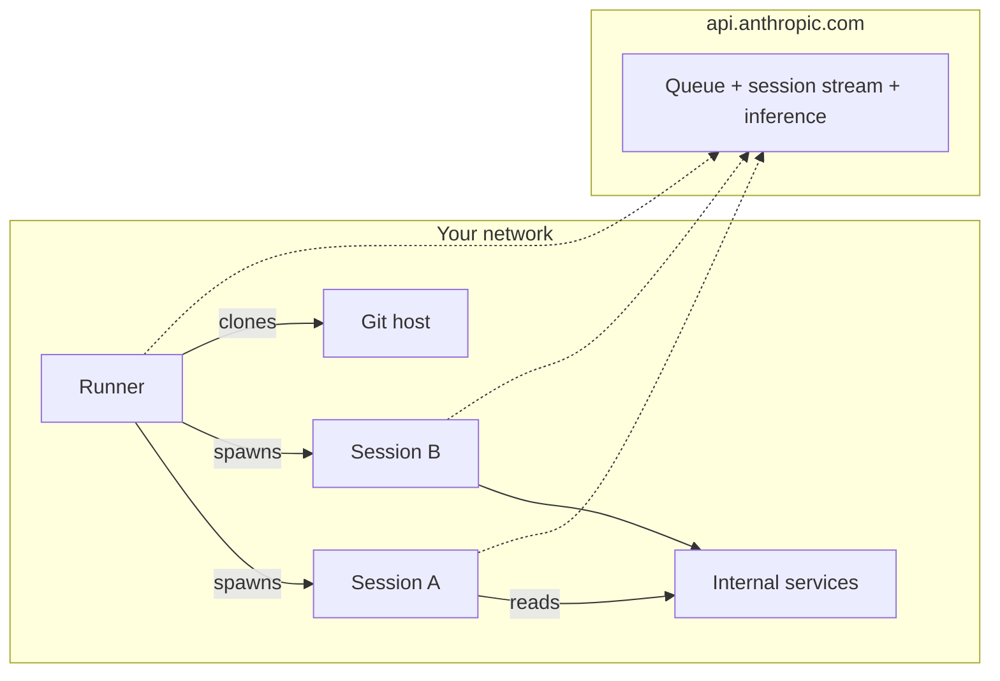

<LevelBadge level="advanced" />

<Callout type="objectives" items={[
  "セルフホスト環境が実際に何なのかを理解する — 3つの可動部分(環境・ランナー・セッション)で、セルフホストCIランナーとほぼ同じ形をしている",
  "ネットワーク形状を把握する:100%アウトバウンドのHTTPS、Anthropicからのインバウンドはゼロ、Anthropicのコントロールプレーンはホストされたまま、実行だけが自分のマシンに移る",
  "いつこれに手を伸ばすべきか(社内ネットワークへのアクセス、カスタムツール、コンプライアンス) vs ほとんどのチームが先に試すべき2つの簡単な答え",
  "claude self-hosted-runner を使って、環境シークレットをシェル履歴に漏らさずに、4つのコマンドで最初のランナーを立ち上げる",
  "ランナーの「1度に1ユーザー」ロックを理解する — なぜ存在するのか、--drain-grace-sec と --retire-at が何をするのか、そしてそれが最小フリートサイズをどう決めるか",
  "本番フリートの初挑戦を必ず捕まえる6つの落とし穴(シークレットローテーション、ZDRブロッカー、モデルルーティングのブロッカー、--base-dir のデフォルト、時刻ずれ、スポットインスタンスの eviction)を先取りする",
]} />

<VerifyNote lastVerified="2026-08-07" source="https://code.claude.com/docs/en/self-hosted-environments">
公開ベータは **2026年8月7日** に [Claude Code v2.1.224](https://code.claude.com/docs/en/changelog) で Team と Enterprise プラン向けに公開されました。`claude self-hosted-runner` サブコマンドは以前のバージョンには存在せず — 単にその文字列をプロンプトとして通常の Claude セッションを黙って開始します。名前、フラグ、有効化のパスは GA 前に変わる可能性があります。ビルドする前に公式の [セルフホスト環境ページ](https://code.claude.com/docs/en/self-hosted-environments) と [クイックスタート](https://code.claude.com/docs/en/self-hosted-environments-quickstart) を必ずクロスチェックしてください。
</VerifyNote>

2026年8月7日、Anthropic は Claude Code と規制業界の組織が実際にインフラを運用する方法との間に残っていた最後の本当のギャップを埋める機能を出荷しました:**セルフホスト環境**です。すべてのクラウドセッション — claude.ai、モバイル・デスクトップアプリ、[スケジュール済み Cowork ルーチン](/docs/claude-app/cowork-scheduled-tasks)、または `claude --cloud` から始めるセッション — が、あなたが自分でプロビジョニングしイメージ化したマシン上、自分のネットワーク内で実行できるようになりました(Team と Enterprise プラン)。オーケストレーションとモデル呼び出しは Anthropic 側に残り、チェックアウトされたコード、ツール実行、社内サービスへのネットワークアクセスはすべて自分のマシン上に存在します。

GitHub Actions のセルフホストランナーフリートを運用したことがあれば、形はまさに見覚えのあるものです。そのメンタルモデルを持ち込めば、より早く生産的になれます。

## 1段落まとめ

claude.ai の管理設定で **環境** を定義します — 名前付きの宛先です。その **環境シークレット**(365日の有効期間、UI は "environment key" と呼びます)を一度だけコピーします。Linux または macOS ホストに Claude Code v2.1.224+ をインストールし、シークレットをファイルに入れ、`claude self-hosted-runner --environment-secret-file /etc/claude/environment-secret --base-dir /workspace` を実行します。そのプロセスは `api.anthropic.com` にアウトバウンドで作業をポーリングし、環境のキューからセッションを受け取り、開発者が選んだリポジトリをクローンし、各セッションを実行する子 `claude` プロセスを起動します。セッションの状態、git のチェックアウト、ツールが触るすべてはホスト上に留まり、推論のためのトランスクリプトだけがアウトバウンド HTTPS で出ていきます。Anthropic からのインバウンドはありません。シンプルなメンタルモデル、運用上の驚きは1つ:ランナーは最初にたどり着いたユーザーにロックされ、ドレインするまでそのユーザーだけにサービスを提供します。

## 2つの簡単な答えとの位置づけ

フリートを構築する前に、本当に必要かどうか正直になりましょう。「Claude をノートパソコン以外の場所で動かしたい」ケースのほとんどは、隣接する2つの製品で運用するインフラなしにカバーできます。

| 選択肢 | 実行される場所 | 自分が持つセットアップ | こちらを選ぶとき |
| :--- | :--- | :--- | :--- |
| Anthropic ホストのクラウド(デフォルト) | Anthropic のインフラ | なし | 実行を移すコンプライアンスやネットワークの理由がない。ほとんどのチームにとってはこれが正解。 |
| [Remote Control](https://code.claude.com/docs/en/remote-control) | 自分の常時稼働マシン1台 | その1台のマシン | 電話や別のノートパソコンから1台のワークステーションを操作したい。Pro、Max、Team、Enterprise で利用可能。 |
| **セルフホスト環境** | 自分のランナーフリート | ランナーイメージ、オーケストレーション、egress、gitクレデンシャル | セッション実行がネットワーク内で必要 — 社内レジストリ、プライベートエンドポイント、エアギャップされたコード、またはコンプライアンスが「チェックアウトは我々のインフラに留まる」と言う場合。Team と Enterprise のみ。 |

ターミナルまたは IDE から開始したセッションが開発者のノートパソコンから離れないなら、そのセッションにはこれのどれも当てはまりません — 環境ピッカーはクラウドセッションでのみ表示されます。

## アーキテクチャ:環境、ランナー、セッション

3つの名詞、それぞれが GitHub Actions の対応物にきれいにマップされます。

<Steps items={[
  {title: "環境(~ ランナーグループ)", body: "claude.ai の Cloud environments 管理ページで作成される、ランナーの名前付きグループ。セッションは特定のランナーではなく環境にルーティングされます。API のフィールドやメトリクスでは pool と表示され、ID は ccpool_... のような文字列です。"},
  {title: "ランナー(~ セルフホストランナー)", body: "claude self-hosted-runner で開始する、ホスト上の長期実行プロセス。環境シークレットを使って環境に登録し、ランナートークンを受け取り、キューを作業のためにポーリングします。1つのバイナリでインストールするデーモンサービスはなし — ランナーは標準の claude CLI を別モードで動かしているだけです。"},
  {title: "セッション(~ ワークフロー実行)", body: "開発者が claude.ai、モバイル・デスクトップアプリ、スケジュール済み Cowork ルーチン、または claude --cloud から開始した1つの Claude Code タスク。各セッションは、ランナーが起動する子 claude プロセスとして実行され、Anthropic への独自のイベントストリームを持ちます。"},
]} />

すべての接続はネットワークからのアウトバウンドです。Anthropic は決してインバウンドで接続しません。ランナーと各セッションは、キューポーリング、セッションストリーミング、モデル推論のために `api.anthropic.com` へ独自のアウトバウンド HTTPS を開きます。ランナーまたはセッションは、git ホストへの git 接続を開きます(HTTPS/SSH で公開、またはそのネットワーク内にいるので社内へ直接)。

## 利用可能性と、ほとんどの組織がぶつかるブロッカー

ロールアウトを計画する前に読むべき6行。各項目は回避策ではなく厳しい「No」です。

- **プラン**:Team と Enterprise、公開ベータ。**Allow self-hosted environments** はオーナーまたは管理者が [Cloud environments 管理ページ](https://claude.ai/admin-settings/cloud-environments) でオンにする必要があります。それまで **New** ボタンは表示されません。組織で [Claude Code on the web](https://code.claude.com/docs/en/claude-code-on-the-web) が有効になっている必要があります。
- **Zero Data Retention**:ZDR が有効な組織では利用できません。組織が ZDR を必要としているなら、セルフホスト環境はあなた向けではありません。
- **モデルルーティング**:推論は `api.anthropic.com` の Anthropic API へ行きます。セルフホスト環境の中では、それを Amazon Bedrock、Google Cloud、Microsoft Foundry、または [LLM ゲートウェイ](https://code.claude.com/docs/en/llm-gateway) 経由でルーティングすることは **できません** — セッションは Anthropic 発行のセッションスコープ OAuth トークンで認証します。実行を移し、推論はそのまま。
- **リポジトリ**:セッションのチェックアウトは現時点で GitHub です。真実の情報源が GitLab、Bitbucket、または GitHub 連携認証のないセルフホスト製品なら、待ってください。
- **まだルーティングできないサーフェス**:[Claude Tag](https://claude.com/docs/claude-tag/overview)、Claude Security、Code Review セッションはまだセルフホスト環境にルーティングされません。通常のチャット、Claude Code on the web、モバイル・デスクトップアプリ、スケジュール済みルーチン、`claude --cloud` はルーティングされます。
- **ランナーOS**:Linux または macOS ホストまたはコンテナ。Windows はランナーホストとしてサポートされていません — 代わりに Linux コンテナで動かしてください。開発者ワークステーションは影響を受けません(ランナーをホストすることはありません)。

## クイックスタート:4つのコマンドで最初のランナー

ガイド付きセットアップ(`claude self-hosted-runner setup`)は、オーナー/管理者アカウントで `claude auth login` してログインしたマシンをフロー全体で対話的に案内し、最後に `./runner-setup/CHEAT-SHEET.md` を配置します。対話的セットアップが不可能なヘッドレスホストでは、次の4つのコマンドで手動で行います。

<Steps items={[
  {title: "claude.ai で環境を作成しシークレットをコピー", body: "Cloud environments 管理ページ → セルフホスト環境の下の New → 名前を付ける → 環境キーをコピー。シークレットは1度だけ表示されます。作成から365日後に期限切れ。ccpool_... ID は後で取得できますが、シークレットはできません。"},
  {title: "シェル履歴の外にシークレットをファイルに配置", body: "サブシェル + umask のトリックは stdin から読むため、シークレットは ~/.bash_history や ~/.zsh_history に残りません。貼り付け後 Enter、次に Ctrl-D。"},
  {title: "ランナーユーザーが書き込めるベースディレクトリを作成", body: "ランナーは --base-dir を /workspace にデフォルト設定します。そのディレクトリが存在しない(あるいはランナーが root でない)場合、最初のクレイム時にエラーが出ます。明示的に所有します。"},
  {title: "ランナーを起動し登録を確認", body: "プロセスは前景でキューをポーリングします。終了時の再起動は自分の仕事 — 下のフリートレシピを参照。"},
]} />

<PromptCard title="1. Claude Code が十分新しいか確認">{`claude self-hosted-runner --help`}</PromptCard>

v2.1.224+ では、`--environment-secret-file` のようなフラグを持つランナーの使用法テキストが表示されます。古いバージョンでは一般的な `claude --help` が表示されます — 先に `claude update` でアップグレードするか、[`latest` チャネル](https://code.claude.com/docs/en/setup) から再インストールしてください。

<PromptCard title="2. 環境シークレットを漏らさずに配置">{`sudo mkdir -p /etc/claude
sudo bash -c '(umask 077 && cat > /etc/claude/environment-secret)'
# paste secret, press Enter, then Ctrl-D`}</PromptCard>

<PromptCard title="3. 書き込み可能なベースディレクトリを作成">{`sudo mkdir -p /workspace && sudo chown $USER /workspace`}</PromptCard>

<PromptCard title="4. ランナーを起動">{`claude self-hosted-runner \\
  --environment-secret-file /etc/claude/environment-secret \\
  --base-dir /workspace`}</PromptCard>

数秒以内に、管理ページの環境のステータスが **No runners deployed** から **Healthy** に切り替わります。`claude.ai/code` からセッションを開始し、ピッカーから環境を選び、ランナーが `Picked up session <session-id>` をアクティブ/キャパシティのカウントとともにログ出力するのを見てください。

ログインしている他のマシンからフォローアップを送る:

<PromptCard title="実行中のクラウドセッションにフォローアップを送る">{`claude -p "add a test for the empty-list case" --cloud <session-id>`}</PromptCard>

`<session-id>` は素の `session_...` または `cse_...` ID、あるいはセッションの `claude.ai/code` URL です。`Sent to cloud session.` とビューリンクで確認されます。

## ランナーのライフサイクル:1ユーザーロック

これはほとんどの運用者が最初にぶつかる驚きです。意図的な分離の選択であり、フリートサイジングのすべてを駆動します。

- ランナーが受け取る最初のセッションが、**ランナーをそのユーザーのアカウントにロック** します。それ以降、ランナーはそのユーザーのキューされた作業だけを、`--capacity` の同時セッションまで受け取ります。
- それらのセッションが終わった後の挙動は `--drain-grace-sec` に依存します:
  - **デフォルト `0`**:アクティブなセッションが終わるとすぐにランナーが終了し、オーケストレータ(Kubernetes、Compose、`Restart=always` の systemd)が *任意の* ユーザーにサービスできるクリーンなディスクの新しいランナーを起動します。
  - **正の値**:ランナーは終了する前に、ロックされたアカウントのキューをその秒数だけポーリングし続けます。1人のパワーユーザーの連続セッションが支配的な場合にのみ使用します。
- したがって **最小フリートサイズ** は、同時にアクティブに作業していると期待するユーザーの数です — ランナー上の1つの長時間セッションは、ドレインするまで他のすべてのユーザーをそのランナーからブロックします。
- セッションリースは ~サイクルごとにポーリングされます。ポーリングなしで **60秒** 経つと、コントロールプレーンはセッションを別のランナーにリキューします。ランナーのハートビートとリースのリフレッシュは同じ呼び出しです。
- シグナルなしで壁時計時刻に破棄されるホスト(スポットインスタンス、サンドボックスの寿命上限)では、キルの数分前に `--retire-at <epoch-seconds>` を渡します。ランナーは新しい作業を取るのをやめ、各アクティブセッションを解放し(ユーザーの次のメッセージは新しいランナーで受け取られる)、exit 0 します。`--retire-at` なしでは、シグナルなしのキルはクラッシュのように見え、セッションは lost-worker 状態からリキューされます。
- SIGTERM は箱から出してすぐに graceful drain をトリガーします(フラグなし)。キルの猶予を超えるターンは失われます。それに合わせてサイジングしてください。

<Flashcards title="ランナーライフサイクルの語彙" cards={[
  {front: "1ユーザーロック", back: "ランナーが受け取る最初のセッションが、ドレインするまでランナーをそのユーザーのアカウントにロックする。最小フリートサイズ = 同時アクティブユーザーの数。"},
  {front: "--drain-grace-sec", back: "アクティブなセッションが終わった後、ランナーがロックされたユーザーのキューをポーリングし続ける秒数。デフォルト 0(即時終了)。"},
  {front: "--capacity", back: "ランナーあたりの同時セッション数、すべてロックされたユーザー向けにサービス。"},
  {front: "--retire-at <epoch>", back: "シグナルなしのキル(スポットインスタンス、サンドボックスタイムアウト)の前に、ランナーに作業を取るのをやめてアクティブなセッションを解放するよう依頼する。lost-worker 状態を防ぐ。"},
  {front: "--base-dir", back: "ランナーがリポジトリをチェックアウトする場所。デフォルト /workspace。存在し書き込み可能である必要がある、またはランナーを root として実行する。"},
  {front: "--environment-secret-file", back: "ccpool シークレットを保持するファイルへのパス。env シークレットは作成から365日で期限切れ。それまでにローテートすること。"},
  {front: "ccpool_ ID", back: "公開の環境識別子(API とメトリクスでは pool_id とも呼ばれる)。シークレットではない。セッショントークンを検証するときの aud チェックで使用する。"},
]} />

## ネットワークと実際に境界を越えるもの

セルフホスティングのポイントは、何が出ていくかを制御することです。だから何が出ていくかを正確に把握する価値があります。

**自分のインフラに留まる** — リポジトリのチェックアウト、ビルド成果物、ツールが読むシークレット、セッションが作成または変更するあらゆるファイル。セッションから社内サービスへの呼び出し(データベース、レジストリ、プライベート HTTP エンドポイント)はネットワークから決して出ません。

**自分のインフラから出る** — 会話そのもの(プロンプト、モデルの応答、ツールの結果)は推論のために `api.anthropic.com` へ行き、Anthropic はセッショントランスクリプトを保存するので、セッションを別のサーフェスから引き継げます。ランナーのハートビートとキューポーリングは同じホストへのアウトバウンド HTTPS です。オプション:社内 git ホストがランナーから直接到達不能な場合、git クローンは Anthropic の [git プロキシ](https://code.claude.com/docs/en/self-hosted-environments-deploy#use-the-anthropic-git-proxy) 経由でトンネリングできます。

**決して起こらない** — Anthropic はあなたのネットワークへインバウンド接続を開きません。公開するポートも、ファイアウォールする ingress もありません。

プロキシサポート:ランナーとオプションのオートスケーリングオーケストレータは `HTTPS_PROXY` / `NO_PROXY` と [Network configuration](https://code.claude.com/docs/en/network-config) の mTLS 変数を尊重します。セッションはそれらを継承します。パス上のプロキシは server-sent-event レスポンスを **バッファリングしてはいけません** — バッファリングするとセッションストリーミングは壊れます。

## 本番チェックリスト:ランナーイメージに焼き込むもの

ランナーは1つのバイナリです。セッションを生産的にする他のすべては、イメージまたはラッパースクリプトに存在します。

- **Claude Code のバージョンをピン留め。** `latest` チャネルはリリース当日にリリースを受け取ります。`stable` チャネル、Homebrew cask、apt/dnf/apk stable リポジトリは ~1週間遅れます。[Install a specific version](https://code.claude.com/docs/en/setup#install-a-specific-version) に従ってピン留めしてください。
- **PATH に Git ≥ 2.24。** 一部の [Configure git](https://code.claude.com/docs/en/self-hosted-environments-deploy#configure-git) オプションには新しい git が必要 — 各記載の下限はそのページにあります。
- **ビルドツールを事前インストール** — コンパイラ、言語ランタイム、パッケージマネージャ、社内 CLI。これが「なぜセルフホストするか」の価値の 80% です:すべてのセッションがビルドできる状態で始まり、ターン途中の `apt install` はなし。
- **ランナーイメージまたはラッパー経由で git クレデンシャルをプロビジョニング。** セッションごとに発行されるクレデンシャルなどのオプション — [Configure git](https://code.claude.com/docs/en/self-hosted-environments-deploy#configure-git) を参照。
- **終了時再起動オーケストレーション**(Kubernetes Deployment、`Restart=always` の systemd、`restart: always` の Compose)。ランナーはアクティブなセッションが終わったら設計上終了します。再起動器なしでは、環境はコールドになります。
- **時刻同期(NTP または同等)。** 時計が5分以上ずれると認証は失敗します — `poll auth failed` ループの隠れた原因。
- **オートスケーリング**:バーストのある需要には、[オートスケーリングオーケストレータ](https://code.claude.com/docs/en/self-hosted-environments-configuration#on-demand-runners) をデプロイしてください。セッションがキューされるにつれて on-demand ランナーを起動する、自分でホストする2つ目のプロセスです。

## テストとアイデンティティ

シングルホストのスモークテストを超える日に知っておくべき2つの隣接サーフェス:

- **CI スモークテスト** — [Test end to end](https://code.claude.com/docs/en/self-hosted-environments-testing) は CI からあなたの環境へセッションをディスパッチし(`--environment ccpool_...`)、Claude の返信を読み、イメージ昇格のゲートを与えます。
- **セッションアイデンティティを検証** — [Session identity verification](https://code.claude.com/docs/en/self-hosted-environments-identity) は、`ccpool_...` ID を `aud` チェックとして使い、アクセスを許可する前に社内サービスがセッショントークンを検証できるようにします。これが、社内 API に「このリクエストは我々の環境のセッションから来た、ランダムな従業員のノートパソコンからではない」と知らせる部分です。

## 最初のフリートを必ず捕まえる6つの落とし穴

作り話ではありません — それぞれがドキュメントの細字か、設計の自然な帰結です。1週間の節約になります。

1. **ガイド付きセットアップのバージョントラップ。** Claude Code &lt; v2.1.224 では、`claude self-hosted-runner setup` はエラーにならず — その文字列を文字通りプロンプトとして通常の Claude セッションを開始します。まず `--help` チェックを実行してください。一般的な `claude --help` が見えたらアップグレードしてください。
2. **環境シークレットは1度だけ表示。** 作成時にコピーする値は回復不能です。ウィザードを閉じる前に、コピーした瞬間にシークレットマネージャに保存してください。失った場合、環境の **Configuration** タブから新しいシークレットを作成し、ランナーに展開し、それから古いものを取り消してください — 取り消されたシークレットに当たる古いランナーは、次のポーリングで `poll auth failed` で失敗します。
3. **`--base-dir` デフォルトのトラップ。** `--base-dir` を渡さず、ランナーを root として実行しない場合、`/workspace` は存在せず書き込みもできません — ランナーは正常に登録されますが、最初のクレイムでエラーになります。非 root 実行では常に明示的な `--base-dir` を渡し、`chown` してください。
4. **1ユーザーロック、再び。** 20人のアクティブなエンジニアのチームには、最低20ランナーが必要で、20 × session-capacity ではありません。ここで過小プロビジョニングすると、他のすべてのユーザーは、最初にランナーに当たった人の後ろで待ちます。フリートは *同時セッション* ではなく *同時アクティブユーザー* でサイジングしてください。
5. **時刻ずれは認証を失敗させる。** 壁時計時刻より5分以上ずれたホストのランナーは、`poll auth failed` で黙って回り続けます。NTP はオプションではありません。
6. **シグナルなしのキルは現在のターンを失う。** スポットインスタンス、コンテナランタイムのデッドライン、一部の Kubernetes eviction は SIGTERM なしでホストをキルします。既知のキル時刻の数分前に `--retire-at` を設定して、ランナーがきれいにドレインするようにしてください。そうでないと途中のターンは失われ、セッションは lost-worker 状態からリキューされます。

<Quiz title="理解を確認" questions={[
  {q: "あなたの ZDR 有効な Enterprise 組織が Claude Code の実行をオンプレに移したい。セルフホスト環境を使えますか?", options: ["はい、ZDR は実行場所とは直交します", "いいえ — セルフホスト環境は Zero Data Retention が有効な組織では利用できません", "はい、ただしスケジュール済みルーチンのみ"], answer: 1, explain: "セルフホスト環境は ZDR 有効な組織では利用できません。セッショントランスクリプトは依然として推論のために api.anthropic.com へ行き、セッションがサーフェス間で移動できるよう保存されます — その保存は ZDR と互換性がありません。"},
  {q: "20人のエンジニアがいて、それぞれが同時に Claude Code のクラウドセッションを開いている可能性があります。最小ランナー数は?", options: ["1、--capacity が同時セッションを処理するので", "20、各ランナーはドレインするまで1ユーザーにロックされるので", "ceil(20 / --capacity) で計算できる"], answer: 1, explain: "ランナーはその寿命の間、最初のユーザーのアカウントにロックされます。最小フリートサイズは同時アクティブユーザーの数と等しいです。--capacity はロックされた ONE ユーザーの同時実行数を増やすだけです。"},
  {q: "ランナーが2分の警告で終了するスポットインスタンス上にあり、SIGTERM はありません。ターン途中のセッションを失わないようにするには何を設定しますか?", options: ["--drain-grace-sec 120", "既知の終了時刻の数分前に設定した --retire-at", "--capacity 1"], answer: 1, explain: "--retire-at はシグナルなしのキルを処理します:ランナーは新しい作業を受け付けなくなり、ユーザーの次のメッセージが新しいランナーで受け取られるようアクティブなセッションを解放します。--drain-grace-sec はドレイン後のポーリングにのみ影響します。"},
  {q: "Claude Code のクラウドセッションをあなたの Bedrock 推論にルーティングしたい。セルフホスト環境はそれを可能にしますか?", options: ["はい — それはよくあるユースケースです", "いいえ — セルフホスト環境のセッションは Anthropic 発行のセッションスコープ OAuth トークンで認証し、推論は api.anthropic.com のみに行きます", "はい、LLM ゲートウェイを使うなら"], answer: 1, explain: "セルフホスティングは実行を移すだけで、推論は移しません。セルフホスト環境の推論は Bedrock、Google Cloud、Foundry、または LLM ゲートウェイ経由でルーティングできません。"},
  {q: "時計が実時刻より12分進んでいるマシンでランナーを起動します。何が見えますか?", options: ["問題なく動作する — Anthropic は時刻ずれを許容する", "登録するがセッションを受け取ることは決してない", "poll auth failed で失敗し Healthy として登録されることはない — 5分を超えるずれでは認証が失敗する"], answer: 2, explain: "認証トークンは時刻に束縛されています。壁時計時刻より5分以上ずれると、ランナーのポーリングは認証に失敗します。NTP または同様の時刻同期は厳しい要件です。"},
]} />

<Callout type="takeaways" items={[
  "セルフホスト環境は Claude Code のクラウドセッションの実行をあなたのネットワーク内に移します。オーケストレーションと推論は api.anthropic.com に留まります。Anthropic からのインバウンドはありません。",
  "3つの部分:環境(名前付きのルーティング先)、ランナー(claude self-hosted-runner プロセス)、セッション(1つの子 Claude Code タスク)。GitHub Actions のセルフホストランナーと同じ形。",
  "現在の利用可能性:Team と Enterprise、公開ベータ、デフォルトオフ。ZDR でブロック。推論は Anthropic から外にルーティングできない。GitHub のみのチェックアウト。Linux/macOS ランナーホスト。",
  "1つのランナーはその寿命の間、最初のユーザーのアカウントにロックされます。最小フリートサイズ = 同時アクティブユーザー数。--capacity はそのロックされたユーザーの同時実行数だけをスケールします。",
  "4つのコマンドがクイックスタート全体:バージョン確認、umask で保護されたファイルにシークレットを配置、書き込み可能な --base-dir を mkdir、ランナーを前景で実行。終了時再起動はオーケストレータの仕事。",
  "フリート未満のものには、Anthropic ホストのクラウドが正解。1台の常時稼働マシンをリモートで操作するには、代わりに Remote Control を使う。",
]} />

## 次

- ルーティングするクラウドセッション → [Claude Code on the web](https://code.claude.com/docs/en/claude-code-on-the-web)
- デバイスなしで実行するスケジュール済みセッション → [Cowork Scheduled Tasks](/docs/claude-app/cowork-scheduled-tasks)
- 実際のデプロイメントのためのハードニングとフリートレシピ → [Deploy to production(公式ドキュメント)](https://code.claude.com/docs/en/self-hosted-environments-deploy)
- 「ノートパソコン以外の場所で Claude Code を動かす」もう1つのプリミティブ → [Remote Control(公式ドキュメント)](https://code.claude.com/docs/en/remote-control)
