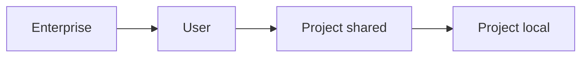

<LevelBadge level="intermediate" />

<VerifyNote lastVerified="2026-06-20" source="https://code.claude.com/docs/en/settings">
正確なキーやファイルの場所は、公式の Claude Code 設定ドキュメントで確認するのが最善です。
</VerifyNote>

`settings.json` は、Claude Code の設定が存在する場所です — [権限](/docs/claude-code/permissions)、[フック](/docs/claude-code/hooks)、環境変数、モデルのデフォルト、その他いろいろ。鍵となるのは **階層** を理解することです。

## 階層（最もグローバル → 最も特定的）

後（より特定的）の階層が、前の階層を上書きします。

1. **Enterprise / managed** — 組織の管理者が設定するポリシー。すべてに勝ります。
2. **User** — `~/.claude/settings.json`。すべてのプロジェクトにまたがるあなたのデフォルト。
3. **Project (shared)** — `.claude/settings.json`。リポジトリにコミットされ、チーム全体で共有。
4. **Project (personal)** — `.claude/settings.local.json`。git-ignore され、このリポジトリ向けのあなたの上書き。

:::tip 共有ファイルはコミット、ローカルファイルは無視
チーム規約は `.claude/settings.json`（コミット）に置きます。個人的な微調整やマシン固有のパスは `.claude/settings.local.json`（git-ignore）に置きます。これにより、自分の好みを他人に押し付けることなく、チームの一貫性が保たれます。
:::

## よく設定するもの

- **`permissions`** — allow/ask/deny ルール。[権限](/docs/claude-code/permissions) を参照。
- **`hooks`** — ライフサイクルイベントで実行されるコマンド。[フック](/docs/claude-code/hooks) を参照。
- **`env`** — セッション用の環境変数。
- **モデル / 挙動のデフォルト** — 例えば、優先するモデル。

## 安全に編集する

- 有効な JSON を保つ（末尾カンマがあると壊れます）。
- 広いルールより **狭い** 権限ルールを優先する。
- コミットされるファイルにはシークレットを決して入れない — `env` 参照やシークレットマネージャーを使う。

すぐコピーできる出発点となるファイルは [フックと settings.json のレシピ](/docs/templates/hooks-settings) にあります。

## 次に

- [権限と権限モード](/docs/claude-code/permissions)
- [フック: 決定論的な自動化](/docs/claude-code/hooks)
- [カスタムスラッシュコマンド](/docs/claude-code/slash-commands)
