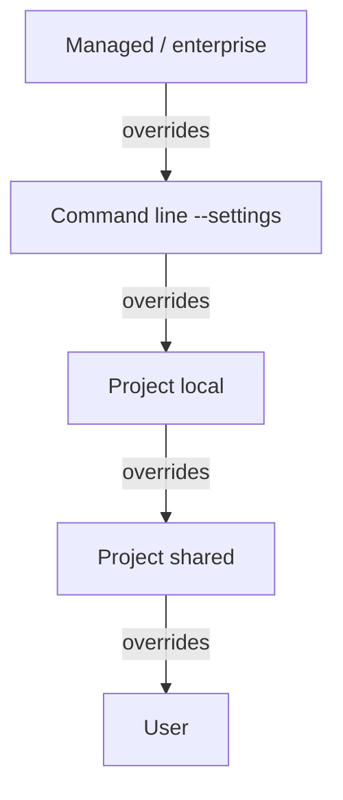

<LevelBadge level="intermediate" />

<VerifyNote lastVerified="2026-09-23" source="https://code.claude.com/docs/en/settings">
5 段階の優先順位スタック（管理対象 → コマンドライン → プロジェクトローカル → プロジェクト共有 → ユーザー）と「環境変数は階層ではない」というルールは、公式ページ [Settings files and precedence](https://code.claude.com/docs/en/settings) に基づきます。キーごとのオーバーライドは [設定リファレンス](https://code.claude.com/docs/en/settings-reference) に一覧があります。
</VerifyNote>

`settings.json` は、Claude Code の設定が存在する場所です — [権限](/docs/claude-code/permissions)、[フック](/docs/claude-code/hooks)、環境変数、モデルのデフォルト、その他いろいろ。鍵となるのは **階層** を理解することです。

## 階層（優先順位の高い順）

同じキーが複数の場所で設定されている場合、Claude Code はそれを設定している最も優先順位の高い階層の値を使います:

1. **管理対象 / エンタープライズ** — `managed-settings.json`、MDM ポリシー、または claude.ai コンソールからのサーバー管理設定。いくつかのセキュリティ上重要な例外を除き、自分で設定したものが上書きすることはありません。
2. **コマンドライン** — `claude --settings '<json-or-path>'`、1 セッションのみ有効。管理対象を除くすべてのファイルより上に位置し、ファイルには書き込みません。
3. **プロジェクト（個人）** — `.claude/settings.local.json`、git 管理外。このリポジトリ用の自分のオーバーライド。
4. **プロジェクト（共有）** — `.claude/settings.json`、リポジトリにコミット。チーム全体に適用。
5. **ユーザー** — `~/.claude/settings.json`。すべてのプロジェクトでの自分の既定値。

```mermaid
flowchart TB
  M[Managed / enterprise] -->|overrides| C[Command line --settings]
  C -->|overrides| L[Project local]
  L -->|overrides| P[Project shared]
  P -->|overrides| U[User]
```

:::note 環境変数は階層ではありません
環境変数はこのスタックの外側にあり、キーごとに解決されます。たとえば `ANTHROPIC_MODEL` はどのファイルの `model` キーよりも優先されますが、`ANTHROPIC_DEFAULT_MODEL` はどのファイルも `model` を設定していない場合にのみ適用されます。
:::

:::tip 共有ファイルはコミット、ローカルファイルは無視
チーム規約は `.claude/settings.json`（コミット）に置きます。個人的な微調整やマシン固有のパスは `.claude/settings.local.json`（git-ignore）に置きます。これにより、自分の好みを他人に押し付けることなく、チームの一貫性が保たれます。
:::

## よく設定するもの

- **`permissions`** — allow/ask/deny ルール。[権限](/docs/claude-code/permissions) を参照。
- **`hooks`** — ライフサイクルイベントで実行されるコマンド。[フック](/docs/claude-code/hooks) を参照。
- **`env`** — セッション用の環境変数。
- **モデル / 挙動のデフォルト** — 例えば、優先するモデル。

## 安全に編集する

- 有効な JSON を保つ（末尾カンマがあると壊れます）。
- 広いルールより **狭い** 権限ルールを優先する。
- コミットされるファイルにはシークレットを決して入れない — `env` 参照やシークレットマネージャーを使う。

すぐコピーできる出発点となるファイルは [フックと settings.json のレシピ](/docs/templates/hooks-settings) にあります。

## 次に

- [権限と権限モード](/docs/claude-code/permissions)
- [フック: 決定論的な自動化](/docs/claude-code/hooks)
- [カスタムスラッシュコマンド](/docs/claude-code/slash-commands)
