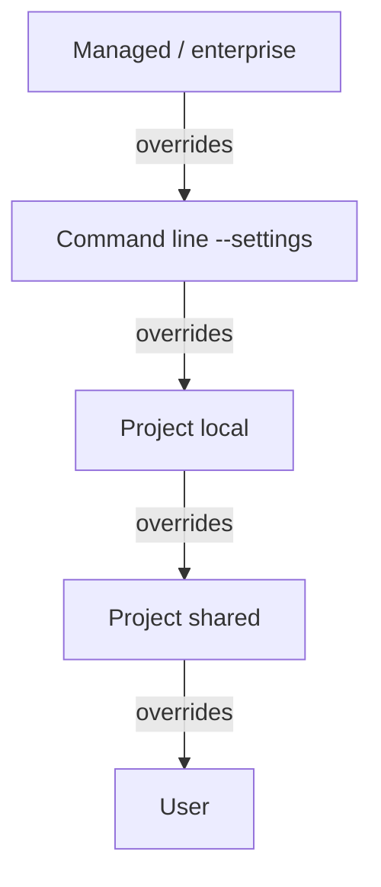

<LevelBadge level="intermediate" />

<VerifyNote lastVerified="2026-09-23" source="https://code.claude.com/docs/en/settings">
5段階の優先順位(管理 → コマンドライン → プロジェクトローカル → 共有プロジェクト → ユーザー)と、「環境変数は階層ではない」というルールは、公式の[設定ファイルと優先順位](https://code.claude.com/docs/en/settings)のページに基づきます。キーごとの上書きは[設定リファレンス](https://code.claude.com/docs/en/settings-reference)に記載されています。
</VerifyNote>

`settings.json` は Claude Code の設定が置かれる場所です。[権限](/docs/claude-code/permissions)、[フック](/docs/claude-code/hooks)、環境変数、モデルのデフォルトなどが含まれます。**階層**を理解することが鍵です。

<Callout type="objectives" items={["5段階の優先順位と、2つのファイルが同じキーを設定したときにどちらが勝つか","環境変数が階層ではない理由と、それが ANTHROPIC_MODEL に意味すること","設定をどのファイルに置くべきか:コミットするチームの規約、個人の上書き、1セッションだけの実験","実際に編集する4つのセクションと、それぞれが詳しく解説されている場所","ファイルを壊さずに編集する方法と、コミットされる設定ファイルに決して入れてはいけないもの"]} />

## 階層(優先順位の高い順)

同じキーが複数の場所で設定されている場合、Claude Code はそれを設定している最も高いレベルの値を使います。

<Steps items={[
  {title: "管理 / エンタープライズ", body: "managed-settings.json、MDM ポリシー、または claude.ai コンソールからのサーバー管理設定です。(いくつかのセキュリティ上敏感な例外を除き)あなたが設定するものは、これを上書きできません。"},
  {title: "コマンドライン", body: "claude --settings '<json-or-path>' で、1セッションだけに適用されます。管理を除くすべてのファイルより上にあり、どのファイルにも書き込まないため、覚えておきたくない実験に最適なツールです。"},
  {title: "プロジェクト(個人)", body: ".claude/settings.local.json で、git の管理対象外です。このリポジトリに対するあなたの上書き用です。マシン固有のパス、ここで使いたいモデル、自分だけが使いたいフックなど。"},
  {title: "プロジェクト(共有)", body: ".claude/settings.json で、リポジトリにコミットされます。チーム全体の規約で、新しいメンバーがクローンするだけで引き継ぐファイルです。"},
  {title: "ユーザー", body: "~/.claude/settings.json です。すべてのプロジェクトにまたがるあなたのデフォルト。優先順位は最も低いので、リポジトリは常にあなたの設定を上書きできます。"}
]} />

```mermaid
flowchart TB
  M[Managed / enterprise] -->|overrides| C[Command line --settings]
  C -->|overrides| L[Project local]
  L -->|overrides| P[Project shared]
  P -->|overrides| U[User]
```

:::note 環境変数は階層ではない
環境変数はこのスタックの外にあり、キーごとに解決されます。たとえば `ANTHROPIC_MODEL` はどのファイルの `model` キーよりも優先して適用され、`ANTHROPIC_DEFAULT_MODEL` はどのファイルも `model` を設定していないときにのみ適用されます。
:::

:::tip 共有ファイルはコミットし、ローカルファイルは無視する
チームの規約は `.claude/settings.json`(コミットする)に置きます。個人的な調整やマシン固有のパスは `.claude/settings.local.json`(git の管理対象外)に置きます。こうすれば、自分の好みを他の人に強制せずに、チームの一貫性を保てます。
:::

## よく設定するもの

- **`permissions`** — 許可/確認/拒否のルール。[権限](/docs/claude-code/permissions)を参照。
- **`hooks`** — ライフサイクルイベントで実行されるコマンド。[フック](/docs/claude-code/hooks)を参照。
- **`env`** — セッション用の環境変数。
- **モデル / 挙動のデフォルト** — たとえば好みのモデル。

## 安全に編集する

- 有効な JSON を保つこと(末尾のカンマがあると壊れます)。
- 広いルールよりも**狭い**権限ルールを選ぶこと。
- 秘密情報をコミットされるファイルに入れないこと。`env` の参照かシークレットマネージャーを使ってください。

<PromptCard title="どのファイルにも書き込まずに、1セッションだけ設定を試す">
{`claude --settings '{"permissions":{"allow":["Bash(git log *)"]}}'`}
</PromptCard>

そのままコピーして使える出発点となるファイルは、[フックと settings.json のレシピ](/docs/templates/hooks-settings)にあります。ファイルが不正な形式だったり、キーが期待どおりに働いていなかったりする場合は、`claude doctor` がセッションを開始せずに設定ファイルの検証エラーを出力します。それと `--safe-mode` については、[CLI のページ](/docs/claude-code/cli-flags)を参照してください。

## 理解度チェック

<Quiz questions={[
  {
    q: "リポジトリのコミット済み .claude/settings.json が model を設定していて、~/.claude/settings.json は別のモデルを設定しています。どちらが適用されますか?",
    options: [
      "ユーザーのファイル。個人設定が常に勝つ",
      "リポジトリのコミット済みファイル。共有プロジェクトはユーザーより上にある",
      "どちらでもない。競合はエラーになる",
      "最後に更新されたほうのファイル"
    ],
    answer: 1,
    explain: "ユーザー設定は最も低い階層なので、リポジトリは常にあなたの個人的なデフォルトを上書きできます。順序は、管理 → コマンドライン → プロジェクトローカル → 共有プロジェクト → ユーザーです。"
  },
  {
    q: "マシン固有の絶対パスはどこに置くべきですか?",
    options: [
      ".claude/settings.json。チームが持てるように",
      ".claude/settings.local.json。git の管理対象外",
      "~/.claude/settings.json。すべてのプロジェクトに適用されるように",
      "managed-settings.json"
    ],
    answer: 1,
    explain: "settings.local.json はプロジェクトスコープで git の管理対象外の階層です。自分のマシンでのみ意味を持つパスや好みを、チームメイトに押し付けずに置くのに適しています。"
  },
  {
    q: "環境変数について正しい記述はどれですか?",
    options: [
      "管理設定のすぐ下にある、6番目の階層を形成する",
      "キーごとに解決され、スタックの外にある。ANTHROPIC_MODEL はどのファイルの model キーも上書きし、ANTHROPIC_DEFAULT_MODEL はどのファイルも設定していないときにのみ適用される",
      "設定ファイルが1つでも存在すると無視される",
      "settings.json の env セクションに設定した場合にのみ機能する"
    ],
    answer: 1,
    explain: "ドキュメントは、環境変数が優先順位のレベルではないことを明言しています。それぞれに固有のルールがあるため、同じ概念に対する2つの変数が異なる挙動を示すことがあります。"
  }
]} />

<Callout type="takeaways" items={["5つの階層と、1つのルール:キーを設定している最も高いレベルが勝つ。管理は絶対で、ユーザー設定は最も弱い。","チームの規約にはコミットするファイル、個人的な値やマシン固有の値にはローカルファイル、使い捨ての実験には --settings。","環境変数は階層ではない。スタック内の位置を決めつけず、変数ごとのルールを確認すること。","秘密情報は、コミットされる設定ファイルには決して入れない。","設定が無視されているように見えるときは、他のものを変更する前に claude doctor で検証エラーを確認する。"]} />

## 次へ

- [claude CLI:結果を変えるフラグ](/docs/claude-code/cli-flags) — ここにあるすべてのキーに対する、セッション単位の対応物
- [権限と権限モード](/docs/claude-code/permissions)
- [フック:決定論的な自動化](/docs/claude-code/hooks)
- [カスタムスラッシュコマンド](/docs/claude-code/slash-commands)
