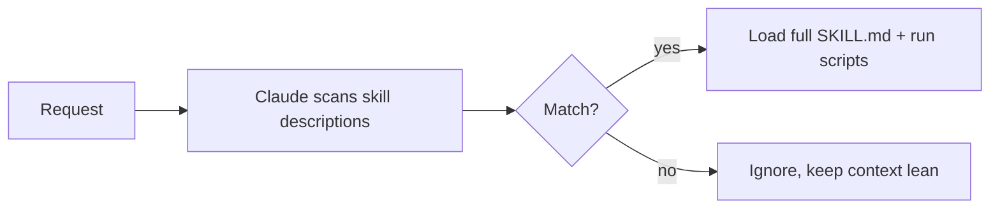

<LevelBadge level="advanced" />

<VerifyNote lastVerified="2026-06-20" source="https://docs.anthropic.com/en/docs/claude-code/skills">
スキルファイルのレイアウトや、スキルがどこで動くか（Claude Code、Claude.ai、Cowork）は進化しています。公式のスキルドキュメントで確認してください。
</VerifyNote>

**スキル** は、Claude が **関連するときだけ** 読み込む専門知識 — 指示に加えて、任意のスクリプトとリソース — をパッケージ化したものです。すべてを [CLAUDE.md](/docs/claude-code/claude-md) に詰め込む代わりに、Claude にオンデマンドで取り込める能力のライブラリを与えます。

## 構造

スキルは `SKILL.md` を含むフォルダです: YAML フロントマター + 指示。

```markdown
---
name: pdf-forms
description: Use when the user needs to fill, read, or generate PDF forms.
---

# PDF Forms
Steps and rules for working with PDF forms…
(optionally reference scripts/ or resources/ in this folder)
```

**`description` がトリガー** です — Claude はそれを読んで、いつスキルを起動するかを判断します。「Use when…」の形で、適切なタイミングで読み込まれ、それ以外では読み込まれない程度に具体的に書きましょう。

## 漸進的開示（なぜスキルがスケールするか）

Claude はすべてのスキルの本文を最初から読み込むわけではありません — 軽量な `name` + `description` を見て、リクエストが一致したときだけ完全な指示を取り込み（スクリプトを実行し）ます。これにより、多くのスキルをインストールしていてもコンテキストを軽く保てます。



## どこに置くか

- 個人: `~/.claude/skills/<name>/SKILL.md`
- プロジェクト（共有可能）: `.claude/skills/<name>/SKILL.md`
- チーム配布のために [プラグイン](/docs/claude-code/plugins-marketplaces) に同梱。

AILmanac は [すぐ使える 7 つのスキルパック](/docs/templates/skills) を提供しています — 1 つコピーして試してみてください。

## スキル vs コマンド vs サブエージェント vs MCP

| ツール | 何であるか | あなた vs Claude のどちらがトリガーするか |
|---|---|---|
| [スラッシュコマンド](/docs/claude-code/slash-commands) | 保存されたプロンプト | **あなた** が呼び出す |
| **スキル** | オンデマンドの専門知識 + スクリプト | **Claude** が関連するときに読み込む |
| [サブエージェント](/docs/claude-code/subagents) | 独自のコンテキストを持つ委譲されたエージェント | Claude が委譲する |
| [MCP](/docs/claude-code/mcp) | 外部ツール/データへの接続 | 呼び出すツールを提供する |

## 次に

- [はじめてのスキルを書く（ウォークスルー）](/docs/walkthroughs/first-skill)
- [SKILL.md テンプレート](/docs/templates/skills)
- [プラグインとマーケットプレイス](/docs/claude-code/plugins-marketplaces)
